

    

<h1 align="center">
    Universidad Peruana de Ciencias Aplicadas
</h1>

<h3 align="center">
    Carrera: Ingeniería de Software
       
    Curso: SI730 - Aplicaciones Web
       
    Sección: 4378
       
    Profesor: Angel Augusto Velasquez Nuñez
       
    Ciclo: 2025-10 
       
    Informe de Trabajo Final
       
    Startup: HampCoders
       
    Producto: ElectroLink  
</h3>

| 
Alumno
 | 
Código
 |
|:-------------------------------------------:|:-------------------------------------------:|
|       Italo Ludwing Sanchez Manrique        |              U202316967                     |
|         Ethan Matias Aliaga Aguirre         |              U202318323                     |
|       Eric Marlon Olivera Barzola           |              U202315032                     |
|       Ivo Marcelo Machado Bracamonte        |              U20231C368                     |
|       Ricardo Del Aguila Ayala              |              U202318323                     |

 Abril 2025 

## Registro de Versiones del Informe

# Registro de Versiones del Informe

| Versión | Fecha       | Autor                                | Descripción de modificación                                                                                                                                                                                                                                                                                                                                                                                                                                                                                                          |
|:--------|:------------|:-------------------------------------|:-------------------------------------------------------------------------------------------------------------------------------------------------------------------------------------------------------------------------------------------------------------------------------------------------------------------------------------------------------------------------------------------------------------------------------------------------------------------------------------------------------------------------------------|
| TB1     | 22/04/2025  | Del Aguila Ayala, Ricardo Alejandro | Redacción del Capítulo I a V. Diseño de arquitectura usando Domain-Driven Design. Implementación inicial de la landing page. Documentación técnica de componentes. Diseño de historias de usuario. Coordinación general del enfoque técnico del proyecto. |
| TB1     | 22/04/2025  | Sanchez Manrique, Italo Ludwing     | Diseño de User Personas, flujos de usuario y prototipos web. Desarrollo de guía de estilos visuales. Apoyo en estructura narrativa del documento.                                                                                                                                                                                                                                                                                                                                               |
| TB1     | 22/04/2025  | Machado Bracamonte, Ivo Marcelo     | Desarrollo de sistema de etiquetas, wireframes y mock-ups. Propuesta visual de la landing page. Diagramación inicial del diseño gráfico.                                                                                                                                                                                                                                                                                                                                                        |
| TB1     | 22/04/2025  | Aliaga Aguirre, Ethan Matias        | Desarrollo técnico de la landing page. Implementación estructural orientada a objetos. Apoyo en integración inicial de componentes.                                                                                                                                                                                                                                                                                                                                                              |
| TB1     | 22/04/2025  | Olivera Barzola, Eric Marlon        | Configuración del entorno de desarrollo. Gestión inicial del Product Backlog. Aportes en estructura general del documento y SEO.                                                                                                                                                                                                                                                                                                                                                                 |
| TP      | 13/05/2025  | Del Aguila Ayala, Ricardo Alejandro | Coordinación general de documentación de Sprint 2. Redacción técnica clara. Alineación con criterios de calidad. Ajustes en backlog y evidencias.                                                                                                                                                                                                                                                                                                                                               |
| TP      | 13/05/2025  | Sanchez Manrique, Italo Ludwing     | Liderazgo en implementación del módulo frontend. Documentación de endpoints y coherencia funcional.                                                                                                                                                                                                                                                                                                                                                                                             |
| TP      | 13/05/2025  | Machado Bracamonte, Ivo Marcelo     | Implementación de vistas frontend. Preparación de evidencias visuales para el Sprint Review.                                                                                                                                                                                                                                                                                                                                                                                                    |
| TP      | 13/05/2025  | Aliaga Aguirre, Ethan Matias        | Desarrollo técnico del bounded context asignado. Aporte en integración frontend. Evidencias de implementación.                                                                                                                                                                                                                                                                                                                                                                                 |
| TP      | 13/05/2025  | Olivera Barzola, Eric Marlon        | Reestructuración del entorno del módulo. Organización de evidencias de validación e implementación.                                                                                                                                                                                                                                                                                                                                                                                            |
| TB2     | 22/06/2025  | Del Aguila Ayala, Ricardo Alejandro | Revisión de consistencia entre evidencias y criterios. Redacción de parte de las conclusiones. Organización de entrevistas de validación.                                                                                                                                                                                                                                                                                                                                                       |
| TB2     | 22/06/2025  | Sanchez Manrique, Italo Ludwing     | Apoyo en diseño del protocolo de entrevistas. Análisis de resultados. Aportes funcionales derivados de la validación.                                                                                                                                                                                                                                                                                                                                                                           |
| TB2     | 22/06/2025  | Machado Bracamonte, Ivo Marcelo     | Coordinación de evidencias visuales. Diseño de recursos gráficos para entrevistas y presentación final.                                                                                                                                                                                                                                                                                                                                                                                        |
| TB2     | 22/06/2025  | Aliaga Aguirre, Ethan Matias        | Revisión cruzada del código. Validación de ajustes técnicos tras entrevistas. Documentación de mejoras aplicadas.                                                                                                                                                                                                                                                                                                                                                                               |
| TB2     | 22/06/2025  | Olivera Barzola, Eric Marlon        | Integración de evidencias de entrevistas. Evaluación heurística. Verificación de formato y entregables.                                                                                                                                                                                                                                                                                                                                                                                         |
| TF      | 06/07/2025  | Del Aguila Ayala, Ricardo Alejandro | Coordinación del cierre del proyecto. Revisión técnica y consolidación final del informe. Validación global.                                                                                                                                                                                                                                                                                                                                                                                    |
| TF      | 06/07/2025  | Sanchez Manrique, Italo Ludwing     | Sistematización de observaciones del usuario. Refactorización visual del frontend. Redacción de anexos.                                                                                                                                                                                                                                                                                                                                                                                         |
| TF      | 06/07/2025  | Machado Bracamonte, Ivo Marcelo     | Reestructuración de mock-ups finales. Elaboración de recursos visuales definitivos. Ajustes finales de layout.                                                                                                                                                                                                                                                                                                                                                                                  |
| TF      | 06/07/2025  | Aliaga Aguirre, Ethan Matias        | Estabilización del sistema. Validación cruzada de código. Pruebas técnicas finales.                                                                                                                                                                                                                                                                                                                                                                                                              |
| TF      | 06/07/2025  | Olivera Barzola, Eric Marlon        | Integración completa del informe. Estructura final del repositorio. Cumplimiento de formato académico.            

# Project Report Collaboration Insights

El informe del proyecto se ha gestionado de forma colaborativa mediante el siguiente repositorio en la organización de GitHub del equipo:

[Repositorio del Informe - GitHub](https://github.com/HampCoders)

Este repositorio ha servido como espacio central para la redacción estructurada del informe final, el control de versiones, y la coordinación de contribuciones técnicas por parte de todos los integrantes del equipo.

A continuación, se presentan las evidencias de colaboración durante las distintas entregas, destacando el aporte activo de todos los miembros, en coherencia con el Registro de Versiones del Informe.

---

### TB1 – Inicio de Redacción y Estructura General del Informe

Durante la primera entrega se definió la estructura base del informe, incluyendo introducción, objetivos, justificación y marco metodológico. Se asignaron secciones de forma equitativa y se establecieron ramas para cada sección.

- Se registraron contribuciones constantes por parte de **Rexest01**, **MatFragg**, **ItaloSanche**, **ivommb11** y **lvonmb11**.
- La colaboración fue paralela y coordinada, sin conflictos de fusión.
- Se gestionaron ramas específicas por integrante para mantener un flujo limpio.

Captura de commits semanales por integrante:

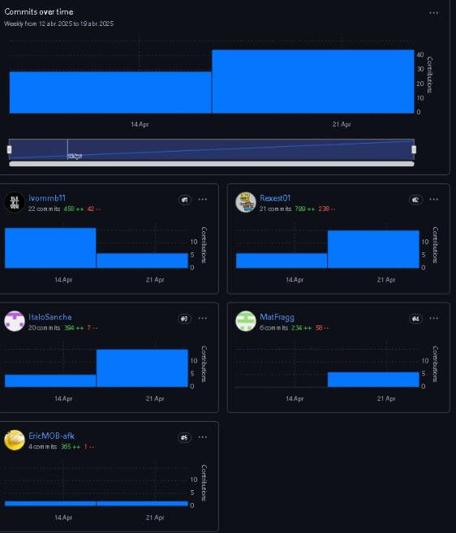

---

### TP – Profundización Técnica y Análisis de Arquitectura

Durante la entrega de prototipo, el equipo se enfocó en documentar las decisiones arquitectónicas, la estructura de carpetas, herramientas utilizadas y descripción de cada módulo.

- Se evidenció un aumento en la frecuencia de commits.
- Se añadieron nuevas secciones técnicas, validaciones y gráficos de arquitectura.
- La colaboración se mantuvo balanceada entre frontend y backend.

---

### TB2 – Resultados, Validación y Ajustes Técnicos

En esta entrega se documentaron los resultados del testing, feedback de usuarios y se ajustaron las secciones según hallazgos técnicos.

- Todos los integrantes realizaron commits de edición, gráficos e interpretación de resultados.
- Se organizaron sesiones de revisión cruzada entre secciones.

---

### TF – Integración Final y Revisión General

En la última entrega se consolidó el documento completo, ajustando redacción, estilos, numeración y coherencia entre partes.

- Se hicieron commits de limpieza de estilo, referencias finales y anexos.
- Se mantuvo el control de calidad con revisiones finales grupales.
- Se realizaron pull requests finales sin conflictos.

---

### GitHub Insights: Clones, vistas y pull requests

- **63 clones** y **38 usuarios únicos** accedieron al repositorio.
- Se generaron **494 visualizaciones**, indicando un interés constante por parte del equipo y revisión por docentes o asistentes.
- Se gestionaron más de **58 pull requests**, utilizando ramas separadas por integrante.
  
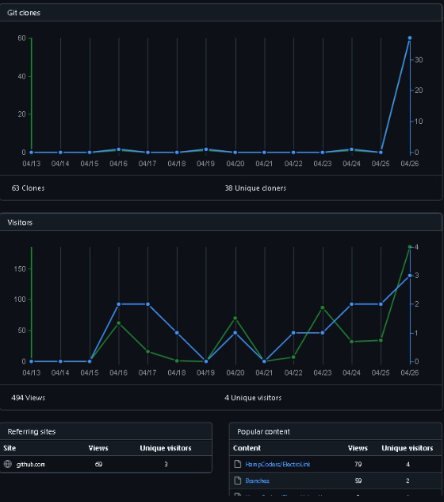
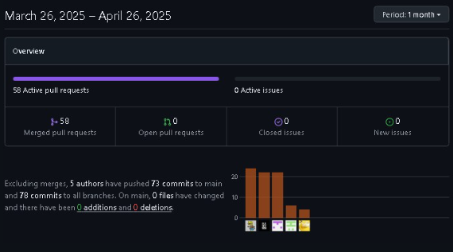

---

**Conclusión:**  
La gestión del informe ha sido completamente colaborativa. Cada entrega mostró participación activa y equitativa entre los miembros, manteniendo consistencia con las prácticas de control de versiones y principios de desarrollo ágil. La evidencia muestra un equipo comprometido con el trabajo grupal, técnico y estructurado.

## Tabla de Contenidos

- [Capítulo I: Introducción](#capítulo-i-introducción)
  - [1.1. Startup Profile](#11-startup-profile)
    - [1.1.1. Descripción de la Startup](#111-descripción-de-la-startup)
    - [1.1.2. Perfiles de Integrantes del Equipo](#112-perfiles-de-integrantes-del-equipo)
  - [1.2. Solution Profile](#12-solution-profile)
    - [1.2.1. Antecedentes y Problemática](#121-antecedentes-y-problemática)
    - [1.2.2. Lean UX Process](#122-lean-ux-process)
      - [1.2.2.1. Lean UX Problem Statements](#1221-lean-ux-problem-statements)
      - [1.2.2.2. Lean UX Assumptions](#1222-lean-ux-assumptions)
      - [1.2.2.3. Lean UX Hypothesis Statements](#1223-lean-ux-hypothesis-statements)
      - [1.2.2.4. Lean UX Canvas](#1224-lean-ux-canvas)
  - [1.3. Segmentos Objetivos](#13-segmentos-objetivos)

- [Capítulo II: Requirements Elicitation & Analysis](#capítulo-ii-requirements-elicitation--analysis)
  - [2.1. Competidores](#21-competidores)
    - [2.1.1. Análisis competitivo](#211-análisis-competitivo)
    - [2.1.2. Estrategias y tácticas frente a competidores](#212-estrategias-y-tácticas-frente-a-competidores)
  - [2.2. Entrevistas](#22-entrevistas)
    - [2.2.1. Diseño de entrevistas](#221-diseño-de-entrevistas)
    - [2.2.2. Registro de entrevistas](#222-registro-de-entrevistas)
    - [2.2.3. Análisis de entrevistas](#223-análisis-de-entrevistas)
  - [2.3. Needfinding](#23-needfinding)
    - [2.3.1. User Personas](#231-user-personas)
    - [2.3.2. User Task Matrix](#232-user-task-matrix)
    - [2.3.3. User Journey Mapping](#233-user-journey-mapping)
    - [2.3.4. Empathy Mapping](#234-empathy-mapping)
    - [2.3.5. As-is Scenario Mapping](#235-as-is-scenario-mapping)
  - [2.4. Ubiquitous Language](#24-ubiquitous-language)

- [Capítulo III: Requirements Specification](#capítulo-iii-requirements-specification)
  - [3.1. To-Be Scenario Mapping](#31-to-be-scenario-mapping)
  - [3.2. User Stories](#32-user-stories)
  - [3.3. Impact Mapping](#33-impact-mapping)
  - [3.4. Product Backlog](#34-product-backlog)

- [Capítulo IV: Product Design](#capítulo-iv-product-design)
  - [4.1. Style Guidelines](#41-style-guidelines)
    - [4.1.1. General Style Guidelines](#411-general-style-guidelines)
    - [4.1.2. Web Style Guidelines](#412-web-style-guidelines)
  - [4.2. Information Architecture](#42-information-architecture)
    - [4.2.1. Organization Systems](#421-organization-systems)
    - [4.2.2. Labeling Systems](#422-labeling-systems)
    - [4.2.3. SEO Tags and Meta Tags](#423-seo-tags-and-meta-tags)
    - [4.2.4. Searching Systems](#424-searching-systems)
    - [4.2.5. Navigation Systems](#425-navigation-systems)
  - [4.3. Landing Page UI Design](#43-landing-page-ui-design)
    - [4.3.1. Landing Page Wireframe](#431-landing-page-wireframe)
    - [4.3.2. Landing Page Mock-up](#432-landing-page-mock-up)
  - [4.4. Web Applications UX/UI Design](#44-web-applications-uxui-design)
    - [4.4.1. Web Applications Wireframes](#441-web-applications-wireframes)
    - [4.4.2. Web Applications Wireflow Diagrams](#442-web-applications-wireflow-diagrams)
    - [4.4.3. Web Applications Mock-ups](#443-web-applications-mock-ups)
    - [4.4.4. Web Applications User Flow Diagrams](#444-web-applications-user-flow-diagrams)
  - [4.5. Web Applications Prototyping](#45-web-applications-prototyping)
  - [4.6. Domain-Driven Software Architecture](#46-domain-driven-software-architecture)
    - [4.6.1. Software Architecture Context Diagrams](#461-software-architecture-context-diagrams)
    - [4.6.2. Software Architecture Container Diagrams](#462-software-architecture-container-diagrams)
    - [4.6.3. Software Architecture Components Diagrams](#463-software-architecture-components-diagrams)
  - [4.7. Software Object-Oriented Design](#47-software-object-oriented-design)
    - [4.7.1. Class Diagrams](#471-class-diagrams)
    - [4.7.2. Class Dictionary](#472-class-dictionary)
  - [4.8. Database Design](#48-database-design)
    - [4.8.1. Database Diagram](#481-database-diagram)

- [Capítulo V: Product Implementation, Validation & Deployment](#capítulo-v-product-implementation-validation--deployment)
  - [5.1. Software Configuration Management](#51-software-configuration-management)
    - [5.1.1. Software Development Environment Configuration](#511-software-development-environment-configuration)
    - [5.1.2. Source Code Management](#512-source-code-management)
    - [5.1.3. Source Code Style Guide & Conventions](#513-source-code-style-guide--conventions)
    - [5.1.4. Software Deployment Configuration](#514-software-deployment-configuration)
  - [5.2. Landing Page, Services & Applications Implementation](#52-landing-page-services--applications-implementation)
    - [5.2.1. Sprint 1](#521-sprint-1)
      - [5.2.1.1. Sprint Planning 1](#5211-sprint-planning-1)
      - [5.2.1.2. Aspect Leaders and Collaborators](#5212-aspect-leaders-and-collaborators)
      - [5.2.1.3. Sprint Backlog 1](#5213-sprint-backlog-1)
      - [5.2.1.4. Development Evidence for Sprint Review](#5214-development-evidence-for-sprint-review)
      - [5.2.1.5. Execution Evidence for Sprint Review](#5215-execution-evidence-for-sprint-review)
      - [5.2.1.6. Services Documentation Evidence for Sprint Review](#5216-services-documentation-evidence-for-sprint-review)
      - [5.2.1.7. Software Deployment Evidence for Sprint Review](#5217-software-deployment-evidence-for-sprint-review)
      - [5.2.1.8. Team Collaboration Insights during Sprint](#5218-team-collaboration-insights-during-sprint)

## Student Outcome 5 – Trabajo en equipo

Cada miembro del equipo ha contribuido activamente al desarrollo de competencias relacionadas con el trabajo colaborativo en un entorno técnico, cumpliendo con los criterios del Outcome 5 de ABET – EAC. A lo largo del proyecto, se ha evidenciado la capacidad del equipo para establecer objetivos conjuntos, planificar tareas, distribuir responsabilidades y ejecutar soluciones de manera coordinada, promoviendo siempre un ambiente inclusivo y de apoyo mutuo. En el siguiente cuadro se detallan las acciones específicas de cada integrante que demuestran cómo se ha alcanzado este resultado de aprendizaje.

> *Funciona efectivamente en un equipo que proporciona liderazgo, fomenta colaboración e inclusión, establece objetivos, planifica tareas y cumple metas.*

| **Criterio específico** | **Acciones realizadas** | **Conclusiones** |
|-------------------------|--------------------------|------------------|
| **Participa activamente en equipos multidisciplinarios.** | **Del Aguila Ayala, Ricardo Alejandro** **TB1:** Coordiné la planificación inicial y dividí responsabilidades según habilidades técnicas del equipo. **TP:** Facilitador del Sprint Planning, articulando tareas backend con UX y frontend. **TB2:** Promoví reuniones de integración entre módulos. **TF:** Lideré la verificación cruzada entre componentes técnicos.  **Machado Bracamonte, Ivo Marcelo** **TB1:** Coordiné diseño UI con programación, colaborando con backend desde el inicio. **TP:** Ajusté prototipos tras revisión con equipo técnico. **TB2:** Gestioné versiones de frontend según prioridades del grupo. **TF:** Validé junto al grupo la experiencia de usuario final.  **Sanchez Manrique, Italo Ludwing** **TB1:** Redacté el User Persona base y propuse estructura visual funcional. **TP:** Me encargué de alinear visualmente el diseño con lo programado. **TB2:** Coordiné pruebas con usuarios y comuniqué resultados al equipo. **TF:** Documenté entregables conjuntos en base a consensos técnicos.  **Aliaga Aguirre, Ethan Matías** **TB1:** Estructuré el backend inicial y propuse guías comunes de codificación. **TP:** Asistí en integración de módulos y solución de bugs en conjunto. **TB2:** Coordiné sesiones técnicas para resolver dependencias. **TF:** Verifiqué cumplimiento técnico grupal antes de la entrega.  **Olivera Barzola, Eric Marlon** **TB1:** Apoyé la planificación inicial y propuse la estructura base para los entregables. **TP:** Acompañé la coordinación entre frontend y backend. **TB2:** Establecí puntos de control grupal para avances técnicos. **TF:** Integré y supervisé que las funcionalidades grupales se alineen con la visión común. | **TB1:** Se construyó un equipo que desde el inicio se orientó a metas compartidas, respetando el rol y la voz de cada integrante. **TP:** La integración efectiva entre módulos reflejó una sinergia real entre miembros con perfiles diversos. **TB2:** Se fortaleció el sentido de equipo mediante retroalimentación activa y ajustes conjuntos sobre el producto. **TF:** El trabajo en equipo culminó con una entrega cohesionada, donde cada integrante fue clave para lograr un producto completo y funcional. |
| **Ejecuta planificación de tareas y cumplimiento de objetivos colectivos.** | **Del Aguila Ayala, Ricardo Alejandro** **TB1:** Estructuré cronogramas internos de entregas. **TP:** Organicé backlog técnico con entregas prioritarias. **TB2:** Monitoreé tiempos y cumplimiento de metas. **TF:** Consolidé reporte final agrupando resultados individuales.  **Machado Bracamonte, Ivo Marcelo** **TB1:** Elaboré ruta gráfica de desarrollo. **TP:** Organicé flujos visuales según prioridades del equipo. **TB2:** Coordiné cambios visuales con el backend. **TF:** Documenté la planificación final del flujo de navegación.  **Sanchez Manrique, Italo Ludwing** **TB1:** Establecí metas visuales por iteración. **TP:** Reorganicé la interfaz según feedback conjunto. **TB2:** Lideré la secuenciación de entregables visuales. **TF:** Verifiqué que cada entregable cumpla con los objetivos funcionales.  **Aliaga Aguirre, Ethan Matías** **TB1:** Documenté tareas del backend priorizadas. **TP:** Coordiné cronograma técnico con tareas del equipo. **TB2:** Verifiqué dependencias funcionales entre microservicios. **TF:** Validé implementación técnica conforme al backlog grupal.  **Olivera Barzola, Eric Marlon** **TB1:** Propuse estructuras de planificación interna. **TP:** Colaboré en la calendarización de entregas parciales. **TB2:** Coordiné dependencias técnicas y verifiqué cumplimiento grupal. **TF:** Documenté y supervisé los avances integrados antes del cierre. | **TB1:** La planificación estructurada permitió avanzar de manera ordenada y con objetivos claros en cada hito. **TP:** Se evidenció mayor autonomía y coordinación horizontal al distribuir responsabilidades. **TB2:** Se fortaleció la visión colectiva, con un enfoque en cumplir objetivos comunes por encima de logros individuales. **TF:** El cumplimiento de metas grupales fue el resultado de una gestión conjunta del tiempo, recursos y prioridades. |

## Capítulo I: Introducción 

### 1.1. Startup Profile

#### 1.1.1. Descripción de la Startup
HampCoders es una startup innovadora que se enfoca en el desarrollo de soluciones empleando una arquitectura orientada a servicios, haciendo uso de tecnologías open-source. Mediante esta startup, buscamos lograr conectar a los proveedores de componentes eléctricos con posibles clientes. Es por ello que presentamos el proyecto ElectroLink.

**Misión:**
Nuestra misión es desarrollar una solución tecnológica innovadora que permita a las personas contactar con empresas proveedoras especializadas en electrónica, para prevenir o solucionar problemas en instalaciones eléctricas de manera efectiva, segura y legalmente correctas.

**Visión:**
Nuestra visión es convertirnos en líderes globales en el desarrollo de tecnologías y plataformas eficientes y escalables, proporcionando herramientas que permitan conectar a los usuarios y empresas con proveedores especializados, para prevenir o solucionar instalaciones eléctricas ineficientes, transformando el entorno brindando calidad y seguridad.

#### 1.1.2. Perfiles de Integrantes del Equipo

| Miembros del equipo                             | Codigo Estudiante | Descripcion            |
| ----------------------------------------------- | ----------------- | ---------------------- |
| Italo Ludwing Sanchez Manrique	   | U202316967            | Mi nombre es Italo Ludwing Sanchez Manrique, soy estudiante de Ingeniería de Software en la UPC, tengo 19 años y actualmente curso el tercer ciclo académico. Destaco por mi perseverancia, tolerancia y compromiso con mis metas. En este proyecto, mi objetivo es buscar soluciones que beneficien al grupo, ya que tengo experiencia en trabajar de forma proactiva y colaborativa. Además, poseo sólidos conocimientos en lenguajes de programación como Java y C++. | 
| Ethan Matias Aliaga Aguirre	   | U202318323            | Soy Ethan Matias Aliaga Aguirre, estudiante de 5to ciclo de Ingeniería de Software en la UPC, sede San Miguel. Me caracterizo por mi compromiso, responsabilidad, habilidad para trabajar en equipo y comunicación. Mis conocimientos Incluyen arquitectura de Software , desarrollo de APIs y Experiencias Web Full Stack. Además, tengo experiencia en el uso de herramientas como Photoshop, Filmadora y Vegas Studio, lo que me permite aportar con soluciones creativas y técnicas en mis proyectos. Estoy comprometido con mi crecimiento personal y profesional, siempre buscando aprender y mejorar en cada oportunidad que se presente. | 
| Eric Marlon Olivera Barzola	   | U202315032            | Soy Eric Marlon Olivera Barzola, actualmente estoy cursando el quinto ciclo académico correspondiente. Mi experiencia me ha dotado de la capacidad para abordar tareas relacionadas con el diseño, programación y resolución de problemáticas en el ámbito del lenguaje de programación C++. Asimismo, estoy en proceso de adquirir conocimientos en C# y JavaScript. | 
| Ivo Marcelo Machado Bracamonte	   | U20231C368            | Mi nombre es Ivo Machado, tengo 19 años, soy estudiante y actualmente estudio en el quinto ciclo de ingeniería de software en la UPC. Mis fuertes son la mentalidad, no me rindo con facilidad y no le tengo miedo al error, tengo empatía con los demás, me gusta resolver problemas y siempre intento mejorar en lo que hago y seguir aprendiendo. Tengo conocimientos del lenguaje de programación C++, Java y un poco de Python, HTML, CSS y JavaScript, también domino el Inglés y sé Portugués. | 
| Ricardo Alejandro del Agula Ayala	   | U202318323            | Mi nombre es Ricardo Alejandro Del Aguila Ayala, tengo 19 años y, actualmente, estoy cursando el cuarto ciclo de la carrera de Ingeniería de Software en la UPC. Al culminar, me gustaría especializarme en la ciberseguridad. Me considero una persona proactiva en todos los ámbitos. Asimismo, alguien que siempre está dispuesta a entregar lo mejor de sí para lograr un buen trabajo en equipo. Tengo experiencia en el lenguaje de programación C + +, Python, así como en Excel. Asisto a la iglesia, en donde formó parte de varias comunidades. Por ello, tengo una vasta experiencia en el trabajo en equipo, que puede permitir que asuma el liderazgo de este proyecto. | 

### 1.2. Perfil de la Solución

**ElectroLink** es una solución que busca conectar proveedores de componentes o servicios electrónicos con potenciales clientes que necesiten asesoramiento para realizar mantenimientos preventivos en sus hogares u oficinas.

Nuestra plataforma busca exhibir a los proveedores con el fin de resolver la desconexión entre proveedores de componentes eléctricos y el mercado real, y garantizar servicios seguros y eficientes dentro de los parámetros legales para los clientes dueños de hogares y PYMES.

#### 1.2.1. Antecedentes y Problemática (usando The 5W'S y 2 'H's)
Con el propósito de obtener una comprensión más profunda de las necesidades de nuestros usuarios, hemos investigado sus antecedentes históricos y los desafíos que enfrentan mediante la metodología de las 5W`S y 2H`S. Este enfoque nos asegura que la información recopilada sea pertinente y nos permita desarrollar soluciones precisas y eficaces que satisfagan sus necesidades.

**What (Qué)**
- ¿Cuál es el problema?
  El problema radica en la dificultad que afrontan los usuarios al momento de encontrar proveedores técnicos eléctricos eficientes, seguros y certificados en base a las especificaciones que requieren según su situación. Esta situación puede agravarse por la falta de formación formal y de plataformas que garanticen la calidad del servicio, dentro de los parámetros establecidos por el gobierno.

- ¿Cuál es la relación con la persona en cuestión?
  Este proyecto está directamente relacionado con los usuarios objetivo, puesto que actúa como intermediario entre estos y el proveedor del servicio de una manera rápida y efectiva. De la misma manera, se optimiza el tiempo de respuesta, garantizando que los problemas se resuelvan de forma eficiente, sin comprometer la calidad del servicio.

**When (Cuando)**
- ¿Cuándo sucede el problema?
  Los problemas relacionados con la dificultad de contactar con proveedores de garantía se manifiestan en situaciones como cortes de electricidad, costos de luz, instalaciones defectuosas o fuera de los parámetros legales, problemas con tomacorrientes, o incluso antes de una remodelación donde se necesita prevenir sobrecargas.

- ¿Cuándo utiliza el cliente el producto?
  Lo usa en momentos críticos, cuando el fallo ya ocurrió, o de forma preventiva antes de hacer una instalación eléctrica o compra de componentes, de forma específica según  la situación a la que se enfrentan.

**Where (Dónde)**
- ¿Dónde está el cliente cuando usa el producto?
  La solución puede ser usada por los usuarios en cualquier momento y lugares con alta demanda eléctrica, incluyendo así a usuarios independientes o empresas.

- ¿A dónde se dirige?
  La solución está dirigida a aquellos usuarios que deseen prevenir problemas eléctricos asegurándose de obtener una instalación correcta y dentro de los parámetros permitidos, así como los que buscan solucionar algún problema eléctrico que se presente.

- ¿Dónde surge el problema?
  Este problema ocurre en lugares con alta demanda eléctrica, como por ejemplo: hogares, centros educativos, oficinas, centros comerciales, entre otros, donde la sobrecarga o fallos eléctricos pueden generar inconvenientes significativos.

**Who (Quién)**
- ¿Quiénes están involucrados?
  Equipo: Aquellos encargados del desarrollo y soporte técnico de la solución, responsables de mantener y mejorar el sistema, asegurando un funcionamiento óptimo y la calidad del servicio.
  Usuarios: Aquellos que buscan soluciones ante problemas eléctricos o realizar instalaciones de manera segura.
  Proveedores: Aquellos que ofrecen servicios eléctricos, como componentes y/o instalaciones.

- ¿A quiénes le sucede el problema?
  Propietarios de viviendas: Aquellos que enfrentan fallos inesperados por problemas eléctricos o necesitan instalaciones de forma segura y eficiente en sus hogares.
  Propietarios de negocios y empresas: Los encargados de gestionar y renovar lugares con alta demanda eléctrica, que requieren soluciones fiables para sus instalaciones y/o operaciones diarias.
  Centros educativos: Instituciones que requieren mantener sus instalaciones eléctricas en óptimas condiciones, para garantizar la seguridad del alumnado y personal.

- ¿Quién lo utilizará?
  El producto se dirige a una amplia gama de personas, entre las cuales destacan el cliente final y el proveedor del servicio.El cliente final busca una solución rápida y confiable para sus problemas eléctricos, mientras que el proveedor del servicio se beneficia al obtener nuevos clientes y mejorar su visibilidad.

**Why (Por qué)**
- ¿Cuál es la causa del problema?
  La falta de plataformas que conecten de manera eficiente a proveedores eléctricos con usuarios, sumado a la poca formalización del rubro. Los usuarios a menudo no saben cómo identificar técnicos confiables, lo que incrementa el riesgo de contratar profesionales no calificados. Además, el mal manejo de instalaciones eléctricas es una preocupación constante, generando riesgos frecuentes para la seguridad.

**How (Cómo)**
- ¿En qué condiciones los clientes usan nuestro producto?
  Se usa en situaciones donde requieren una solución eficiente y confiable para problemas eléctricos, ya sea durante una emergencia o de manera preventiva antes de una instalación. La solución se emplea en entornos domésticos o laborales.

- ¿Cómo nos conocieron los compradores?
  Nos conocieron a través de campañas de marketing digital, recomendaciones de amigos, búsquedas en internet sobre soluciones rápidas para problemas eléctricos y publicidad en redes sociales.

- ¿Cómo prefieren los lectores acceder a nuestro contenido?
  Los usuarios prefieren acceder a nuestra solución a través de una plataforma web o aplicación móvil, de fácil navegación y diseño intuitivo, que les permita conectarse con proveedores de servicio eléctrico en cualquier momento y lugar.

- ¿Qué llevó a la persona a llegar a esta situación?
  Cuando enfrenta un problema eléctrico, ya sea por una falla inesperada o por la necesidad de realizar una instalación, se encuentra en la búsqueda de soluciones rápidas, confiables y certificadas para evitar riesgos y asegurar el correcto funcionamiento de las instalaciones eléctricas.

**How much (Cuánto)**
- En 2021, el 45,3% de los hogares con acceso a la red pública de energía eléctrica experimentaron cortes o interrupciones.
- En 2021, el 45,3% de los hogares con acceso a la red pública de energía eléctrica experimentaron cortes o interrupciones.
- Estudios indican que departamentos como Áncash, Arequipa, Cusco, Huánuco, Madre de Dios, Pasco y Puno presentan altos porcentajes de hogares con experiencias negativas en la calidad del servicio eléctrico.
- En 2022, la frecuencia promedio de interrupciones fue de 9,8 veces, con mayor incidencia en el segmento de distribución eléctrica.

#### 1.2.2. Lean UX Process
Según Pragma (2021), el proceso Lean UX es la mezcla de metodologías ágiles y temas de usabilidad, donde se prioriza la experiencia de usuario por la creación de un producto. Teniendo en cuenta ello, hemos elaborado nuestro Lean UX process basándonos en sus cuatro pilares principales: problem statements, assumptions, hypothesis y canvas.

#### 1.2.2.1. Lean UX Problem Statements
**Problem Statement#1**  
Nuestra plataforma busca conectar a dueños de hogares urbanos con proveedores técnicos eléctricos certificados, garantizando servicios seguros y eficientes dentro de los parámetros legales.

Hemos identificado que los dueños de hogares urbanos enfrentan dificultades para encontrar proveedores confiables, lo que genera riesgos en sus instalaciones y retrasos en la solución de problemas críticos.Esta situación no solo pone en riesgo la seguridad de hogares y negocios, sino que también genera costos adicionales por reparaciones mal ejecutadas y pérdidas económicas por interrupciones prolongadas.

Ante este desafío, surge la pregunta: ¿Cómo podemos garantizar que los usuarios encuentren proveedores eléctricos certificados de manera rápida y confiable, reduciendo riesgos y mejorando la eficiencia en la solución de problemas?

**Problem Statement #2**  
Nuestra plataforma busca resolver la desconexión entre proveedores de componentes eléctricos y el mercado real, eliminando la dependencia de canales informales y recomendaciones causales que limitan su crecimiento.

Hemos identificado que los proveedores de componentes eléctricos enfrentan dificultades para encontrar clientes de forma constante, lo que genera un aumento considerable de informalidad en el sector eléctrico.Esta situación los obliga a operar con márgenes reducidos debido a la competencia desleal de productos pirata o de baja calidad. Muchos dependen exclusivamente de ventas por recomendación o redes sociales, sin acceso a herramientas profesionales de gestión comercial.

Ante este desafío, surge la pregunta clave: ¿Cómo podemos crear un puente digital que permita a los proveedores de componentes eléctricos ampliar su mercado, garantizar ventas recurrentes y competir en igualdad de condiciones, rompiendo así el ciclo de informalidad en el sector?

#### 1.2.2.2. Lean UX Assumptions
**Business Outcomes:**  
1. Mis clientes necesitan una solución efectiva y accesible para conectar con proveedores de calidad que les den los productos tecnológicos y eléctricos que requieren en la instalación eléctrica que quieren colocar o corregir.

2. Estas necesidades se pueden resolver con una solución tecnológica que aproveche los avances de software en avances de análisis de datos, plataformas digitales como una web distribuida bajo una arquitectura orientada a servicios realizada con tecnologías open-source, para facilitar la conexión entre clientes y proveedores.

3. Mis clientes iniciales serán propietarios de viviendas, propietarios de negocios y empresas y centros educativos que requieren soluciones rápidas y seguras para sus problemas eléctricos.

4. El valor número 1 que un cliente quiere de mi servicio es la garantía de contar con proveedores eléctricos certificados y seguros, que puedan brindar confianza, cumplimiento normativo y atención oportuna, a través de una plataforma confiable y de alta calidad técnica.

5. El cliente también puede obtener estos beneficios adicionales: reducción de riesgos eléctricos, ahorro de tiempo al evitar búsquedas extensas, seguridad de contratar personal con respaldo, posibilidad de programar servicios preventivos y seguimiento del servicio en tiempo real.

6. Vamos a adquirir la mayoría de los clientes a través de estrategias de marketing digital, incluyendo redes sociales, publicidad segmentada, campañas de correo electrónico, e invitaciones a posibles usuarios a conferencias, charlas informativas y eventos de lanzamiento.
7. Haré dinero a través de suscripciones mensuales pagadas por los proveedores, quienes tendrán acceso exclusivo a nuestra red de usuarios, lo que les permitirá ofrecer sus servicios de manera directa y personalizada dentro de la plataforma, maximizando su visibilidad y generando oportunidades de negocio.

8. Mi competencia principal en el mercado serán empresas establecidas como Thumbtack, Handy y TaskRabbit, los cuales ofrecen un medio que conecta a clientes con profesionales en diversas áreas, incluyendo la eléctrica.

9. Los venceremos debido a nuestro enfoque único en la verificación rigurosa de técnicos certificados, asegurando la seguridad y confiabilidad de cada servicio. Además, ofrecemos una experiencia personalizada que se adapta a las necesidades específicas de cada usuario, brindando soporte en tiempo real para resolver dudas y ofrecer soluciones inmediatas en momentos críticos. Todo esto, complementado con una plataforma fácil de usar.

10. Mi mayor riesgo es que los usuarios desconfíen del servicio o que los proveedores no cumplan con los estándares prometidos, afectando la reputación de la plataforma.

11. Resolveremos esto a través de un riguroso proceso de validación de proveedores, con revisión de certificaciones, calificaciones públicas, sistema de penalización a técnicos mal evaluados y atención al cliente activa, teniendo en cuenta las restricciones legales en instalaciones eléctricas.

12. ¿Qué otras suposiciones tenemos? 
Otras suposiciones que debemos considerar incluyen la disponibilidad de proveedores dispuestos a suscribirse a nuestra plataforma, la capacidad de escalar el servicio a nivel regional o nacional, y la aceptación de los usuarios de la plataforma como una alternativa confiable y preferida frente a métodos tradicionales de búsqueda de proveedores eléctricos.    
¿Eso, si se prueba que es falso, causará que nuestro negocio / proyecto no funcione?  
Si estas suposiciones resultan ser falsas, podríamos enfrentar obstáculos importantes. Si no logramos atraer suficientes proveedores, la plataforma no sería atractiva ni útil para los usuarios, lo que pondría en riesgo nuestra capacidad de ofrecer un servicio integral. Si la aceptación de la plataforma no es lo suficientemente alta, perderíamos relevancia frente a métodos tradicionales, lo que podría limitar nuestro crecimiento.

**Users:**  
Nuestros usuarios principales son:
- Propietarios de hogares urbanos
- Dueños PYMES u oficinas
- Proveedores de componentes o servicios eléctricos certificados

**User Outcomes:**  
**¿Quién es el usuario?**
-   Nuestros usuarios principales son propietarios de hogares urbanos, dueños PYMES u oficinas y proveedores de componentes o servicios eléctricos certificados.

**¿Qué problemas tiene nuestro producto y cómo se pueden resolver?**
-   Hemos detectado 2 posibles problemas , el primero es la dificultad por parte de los propietarios y dueños de PYMES u oficinas para encontrar proveedores confiables dado que no ofrecen las garantías necesarias.Por otro lado, el segundo problema identificado va por parte de los proveedores de componentes o servicios electricos ya que  enfrentan dificultades para encontrar clientes de forma constante.El primer problema se resolvería por medio de nuestra plataforma que mostrará y recomendará a proveedores certificados que se adecuen a las necesidades del usuario.El segundo problema se resolvería por medio de la exposición que le brindaremos a los proveedores en nuestra plataforma permitiéndole conectarse con potenciales clientes.

**¿Qué características son importantes?**

-   **Para propietarios y dueños de PYMES u oficinas:** 
    - Búsqueda y filtrado de técnicos certificados. 
    - Sistema de reseñas y calificaciones transparente.
    - Opción de programación de servicios preventivos.
    - Seguimiento en tiempo real del servicio.
    - Información sobre consumo eficiente.

-   **Para proveedores:**
    - Perfil verificable con certificaciones.
    - Acceso a una red de clientes potenciales.
    - Herramientas de gestión (agenda, historial de servicios, pagos integrados).
    - Notificaciones de oportunidades de trabajo.
    - Protección contra la competencia desleal.
    

**¿Dónde encaja nuestro producto en su trabajo o vida?**

**Nuestro producto es utilizado:**

- Cuando los propietarios de hogares enfrentan problemas eléctricos urgentes, necesitan mantenimiento preventivo o requieren asesoría para optimizar el consumo de energía. La plataforma evita el estrés de buscar técnicos de manera informal y les da seguridad al garantizar que los proveedores están validados.

- En el caso de proveedores de componentes o servicios eléctricos, la plataforma se integra como su principal canal de clientes, reemplazando métodos tradicionales como el boca a boca o las redes sociales. Les permite gestionar su negocio de manera más profesional, aumentar su visibilidad y acceder a oportunidades de negocio recurrentes sin depender de la informalidad.

**¿Cuándo y cómo es usado nuestro producto?**

**Propietarios y dueños de PYMES u oficinas:**  
- **Cuándo:** En emergencias eléctricas, mantenimiento preventivo o al necesitar asesoría técnica.  
- **Cómo:** Acceden a la plataforma, buscan técnicos cercanos, comparan perfiles, contratan y califican el servicio.  

**Proveedores:**  
- **Cuándo:** Cuando buscan nuevos clientes o gestionan sus servicios.  
- **Cómo:** Crean su perfil verificable, reciben solicitudes, gestionan citas y pagan suscripciones por acceso premium.  

**¿Cómo debe verse nuestro producto y cómo comportarse?**
-Se utiliza en momentos críticos (fallas, cortes de electricidad, sobrecargas) y también de forma preventiva (remodelaciones, instalación de nuevos equipos, revisiones anuales).Asimismo , se puede acceder desde dispositivos móviles o web, en el hogar, oficina o incluso en movimiento.También podría ser usado rápidamente cuando se requiere soporte urgente, o planificadamente para programar servicios.

#### 1.2.2.3. Lean UX Hypothesis Statements
**Creemos que** al ofrecer una plataforma digital que verifique rigurosamente a técnicos eléctricos, los propietarios de hogares urbanos y dueños de PYMES u oficinas confiarán en nuestro servicio para resolver sus problemas eléctricos de manera rápida y segura.

**Sabremos que** hemos tenido éxito cuando el 70% de los usuarios que contratan un servicio a través de la plataforma lo califican con 4 o 5 estrellas, demostrando satisfacción con la calidad y confiabilidad de los proveedores.

**Creemos que** los proveedores de servicios eléctricos se suscribirán a nuestra plataforma si les garantizamos acceso a clientes recurrentes y herramientas profesionales de gestión (agenda, pagos, historial).

**Sabremos que** hemos tenido éxito cuando el 60% de los proveedores en prueba gratuita se conviertan en suscriptores pagos y mantengan una tasa de renovación superior al 80% después de 3 meses.

**Creemos que** al conectar usuarios con técnicos certificados, disminuirán los problemas eléctricos recurrentes en sus hogares o negocios.

**Sabremos que** hemos tenido éxito cuando los usuarios reportan una "mejoría notable" en sus instalaciones y prevenciones eléctricas después de usar servicios de la plataforma.Los casos de "reparaciones mal hechas" mencionados por usuarios disminuyen significativamente en los comentarios.

**Creemos que** los usuarios encontrarán más conveniente usar nuestra plataforma que buscar recomendaciones personales o técnicos por redes sociales.

**Sabremos que** hemos tenido éxito cuando los usuarios expresan que la plataforma les "ahorra tiempo" en comparación con buscar técnicos por su cuenta.Más de la mitad de los usuarios activos prefieren la plataforma para futuras necesidades eléctricas.

**Creemos que** la plataforma puede expandirse a regiones con altos índices de informalidad en servicios eléctricos, replicando el éxito del mercado inicial.

**Sabremos que** hemos tenido éxito cuando nuevas ciudades alcancen el 60% del volumen de transacciones de la región pionera en un plazo de 6 meses, con un crecimiento orgánico del 20% mensual.

#### 1.2.2.4. Lean UX Canvas
En esta sección, el equipo presenta el Lean UX Canvas

### Segmentos Objetivo:
Nuestros usuarios principales son propietarios de hogares urbanos, dueños PYMES u oficinas y proveedores de componentes o servicios eléctricos certificados

**Segmento objetivo #1: Propietarios de hogares urbanos**

Aspectos demográficos:

- Sexo: Masculino y femenino
- Edades: Entre 25 y 60 años
- Nivel socioeconómico: Medio a Medio-alto
  
Aspectos geográficos:

- Zona geográfica en la que viven: Urbana, en ciudades de tamaño medio a grande
- Residen principalmente en: Zonas residenciales o condominios dentro de áreas urbanizadas
  
Aspectos psicográficos:

- Valoran el confort, la eficiencia y la seguridad en el hogar.
- Buscan soluciones tecnológicas que optimicen el uso de recursos eléctricos.
- Tienen interés en el mantenimiento preventivo y la mejora continua de sus viviendas.

**Segmento objetivo #2: Proveedores de componentes o servicios eléctricos certificados**

Aspectos demográficos:

- Sexo: Masculino y femenino
- Edades: Entre 25 y 55 años
- Nivel socioeconómico: Medio a medio-alto
  
Aspectos geográficos:

- Zona geográfica en la que trabajan: Urbana, semi urbana e industrial
- Residen principalmente en: Regiones con alta demanda de servicios eléctricos (ciudades en expansión, polos industriales, etc.)
  
Aspectos psicográficos:

- Buscan aumentar su visibilidad y captar más clientes de forma digital.
- Están interesados en plataformas que les faciliten la gestión de pedidos o contactos comerciales.
- Valoran pertenecer a una red confiable de profesionales del rubro eléctrico.
- Están enfocados en el crecimiento profesional y la fidelización de clientes.
  
## Capítulo II: Requirements Elicitation & Analysis
En este capítlo, el equipo de Hampcoders realiza la Elicitación y el Analisis de los Requisitos

### 2.1. Competidores
El equipo tras realizar una investigación sobre el mercado actual de servicios digitales, decide 

### Análisis del Mercado Digital de Servicios

Hoy en día, en el competitivo mercado digital para la contratación de servicios, existen diversas empresas importantes que ofrecen soluciones en áreas como reparaciones, mantenimiento y tareas domésticas. Entre los competidores más destacados se encuentran **Thumbtack**, **Handy** y **TaskRabbit**.

---

## Thumbtack

Plataforma en línea que conecta a personas que necesitan servicios locales con profesionales que los ofrecen. Funciona como un **marketplace** donde puedes buscar desde plomeros, electricistas, entre muchos otros.

### ¿Cómo funciona?

1. El cliente publica un proyecto explicando qué necesita.
2. Los profesionales registrados en esa categoría y área geográfica reciben una notificación.
3. Los interesados envían cotizaciones o propuestas al cliente.
4. El cliente elige al profesional que mejor se adapte a su presupuesto y necesidades.

**Popularidad:** Muy usada en Estados Unidos.  
**Usuarios frecuentes:** Freelancers y pequeñas empresas.

---

## Handy

A diferencia de Thumbtack, **Handy no muestra varios profesionales**, sino que asigna uno automáticamente basado en disponibilidad y ubicación.

### Especialidad
Servicios para el hogar:
- Limpieza
- Montaje de muebles
- Plomería
- Electricidad
- Mudanzas, etc.

### ¿Cómo funciona?

1. El cliente reserva directamente desde la app o sitio web.
2. Elige fecha, hora y tipo de servicio.
3. Handy asigna automáticamente a un profesional disponible.
 **Ubicación:** EE. UU., Canadá y Reino Unido.

---

## TaskRabbit

Plataforma donde puedes contratar **taskers** (personas que realizan tareas). Opera como un mercado en línea conectado con la demanda local.

### Servicios populares:
- Montaje de muebles (especialmente de IKEA, gracias a una alianza).
- Mudanzas y cargado de objetos pesados.
- Limpieza.
- Reparaciones menores en el hogar.
- Hacer compras o entregas.
- Colgar cuadros, instalar estanterías, etc.

### ¿Cómo funciona TaskRabbit?

1. Buscas el tipo de tarea que necesitas.
2. Eliges a un tasker según su perfil, tarifas por hora y reseñas.
3. Agendas el servicio directamente con esa persona (fecha y hora).
4. Pagas a través de la plataforma una vez que el trabajo esté completo.

---

#### 2.1.1. Análisis competitivo
En esta sección, el equipo realiza el Analisi competitivo de aquellas Startups o Empresas ya consolidades que brindan servicios similares al que buscamos ofrecer.

# Competitive Analysis Landscape

## ¿Por qué llevar a cabo este análisis?

Porque necesitamos identificar fortalezas, debilidades y diferenciadores clave frente a plataformas similares para definir la estrategia competitiva de **ElectroLink**.

**Necesitamos adaptarnos a las tendencias del mercado**

| Categoría                        | ElectroLink                                                                                                                                     | Thumbtack                                                                                   | Handy                                                                                  | TaskRabbit                                                                                      |
|----------------------------------|-------------------------------------------------------------------------------------------------------------------------------------------------|---------------------------------------------------------------------------------------------|----------------------------------------------------------------------------------------|--------------------------------------------------------------------------------------------------|
| **Perfil**                       |                                                                                                                                                 |                                                                                             |                                                                                        |                                                                                                  |
| Overview                         | Plataforma especializada en instalaciones y mantenimiento eléctrico legal y seguro. Conecta a clientes con proveedores certificados, ofreciendo asesoría técnica, prevención de riesgos y seguimiento en tiempo real. | Marketplace general de servicios donde los usuarios pueden encontrar profesionales para tareas como reparaciones | Plataforma centrada en tareas del hogar como limpieza, montaje de muebles y algunas reparaciones menores | Conecta personas con taskers para tareas del hogar como mudanzas, reparaciones menores, compras y más. |
| Ventaja competitiva ¿Qué valor ofrece a los clientes? | Instalaciones y mantenimiento eléctrico general con proveedores certificados. Servicio legal, seguro y con asesoría técnica. | Ofrece una amplia variedad de servicios, pero sin enfoque especializado.                     | Servicios de hogar bajo demanda. Asignación automática.                              | Contratación rápida para tareas específicas, con perfiles seleccionables.                         |
| **Perfil de Marketing**          |                                                                                                                                                 |                                                                                             |                                                                                        |                                                                                                  |
| Mercado objetivo                 | Hogares, oficinas, escuelas y PYMES urbanas que requieren instalaciones o mantenimiento eléctrico confiable.                                   | Clientes generales que necesitan servicios variados (hogar, eventos, clases, etc.).         | Personas que requieren limpieza, montaje o reparaciones domésticas.                  | Hogares que requieren tareas prácticas como mudanza, limpieza, montaje, etc.                     |
| Estrategias de marketing         | Alianzas con proveedores certificados, educación sobre mantenimiento eléctrico.                                                                 | Publicidad digital, visibilidad en buscadores, reviews de usuarios.                         | Integración con IKEA, marketing por conveniencia y rapidez.                          | Visibilidad en buscadores con una app amigable y con integración con IKEA                        |
| **Perfil de productos**          |                                                                                                                                                 |                                                                                             |                                                                                        |                                                                                                  |
| Productos & Servicios            | Instalación de componentes, mantenimiento general, diagnósticos técnicos y asesoría normativa.                                                  | Servicios generales (fotografía, plomería, eventos, clases, etc.).                          | Limpieza, fontanería, montaje, electricidad básica, mudanza.                        | Montaje de muebles, limpieza, ayuda con tareas, mudanza.                                        |
| Precios y Costos                 | Costos por servicio y suscripción mensual para monitoreo/prevención.                                                                            | Los profesionales establecen precios. Thumbtack cobra parte de la comisión.                | Precio fijo por servicio. Handy toma parte de la comisión.                          | Costo por hora según la tarea deseada. TaskRabbit cobra una comisión al profesional.             |
| Canales de distribución (Web y/o Móvil) | Plataforma web + app móvil (foco en experiencia técnica y educativa)                                                                           | Web + app móvil.                                                                            | Web + app móvil.                                                                     | Web + app móvil.                                                                                 |
| **Análisis SWOT**                |                                                                                                                                                 |                                                                                             |                                                                                        |                                                                                                  |
| Fortalezas                       | Especialización en electricidad, asesoría legal, prevención de riesgos y red de técnicos certificados.                                         | Variedad de servicios, alta visibilidad, gran base de usuarios.                            | Rapidez de reserva por sus procesos automatizados.                                  | Facilidad para elegir trabajadores, buena reputación por las tareas simples.                     |
| Debilidades                      | Somos nuevos en el mercado y tenemos una dependencia de proveedores certificados.                                                              | No tiene enfoque especializado, experiencia muy generalista.                                | Puede ser complicado encontrar personal especializado.                              | Algunos trabajadores no están certificados. Esto puede variar la calidad de los servicios.       |
| Oportunidades                    | Alianzas con aseguradoras, certificaciones oficiales, posible expansión a smart energy, estos servicios están poco atendidos.                  | Ampliar a servicios técnicos más especializados.                                            | Mejorar procesos de selección de profesionales a través de una expansión hacia servicios técnicos especializados. | TaskRabbit podría asociarse con marcas de smart home (como Google Nest, Philips Hue, etc.) para ofrecer instalación y soporte técnico |
| Amenazas                         | Falta de confianza inicial. Si no se mantiene un buen control o evaluación a los proveedores eléctricos puede afectar la experiencia del cliente. | Tiene una gran saturación del mercado y competencia entre profesionales.                    | Problemas con calidad inconsistente del servicio dado que los usuarios no eligen al profesional | Cada vez más personas contratan técnicos y ayudantes directamente por redes como Facebook Marketplace. Lo que hace más difícil estar en el mercado. |

#### 2.1.2. Estrategias y tácticas frente a competidores
Para lograr enfrentar a nuestros competidores como Thumbtack, Handy y TaskRabbit. Nuestro proyecto ElectroLink tendrá una serie de estrategias y tácticas sobre la calidad del servicio, confianza, y especialización en el sector de servicios electrónicos y de mantenimiento.
1. Estrategia de diferenciación especializandonos en sistemas eléctricos
Plataformas como Thumbtack y TaskRabbit, que abarcan una amplia gama de servicios, ElectroLink se enfocará en servicios de mantenimiento preventivo y reparación de sistemas eléctricos para hogares y empresas. Esta especialización nos permitirá destacar como una solución confiable en el mercado..

2. Garantía de seguridad y legalidad en todos los servicios
ElectroLink implementará un sistema de certificación en el cual los proveedores que estén en la plataforma sean realizados por profesionales certificados y con licencias. Además, se garantizará que todos los servicios cumplan con los estándares legales y normativos del sector eléctrico.

3. Precios transparentes y competitivos
A diferencia de Thumbtack, el cual utiliza un modelo de pago basado en leads, ElectroLink ofrecerá un modelo de precios transparente y competitivo donde los usuarios y proveedores tengan conocimiento sobre los costos. También se implementará un sistema de suscripción o tarifas planas para trabajos de mantenimiento preventivo, lo que brinda seguridad a los clientes.

### 2.2. Entrevistas

De acuerdo con Easwaramoorthy y Zarinpoush (2006), las entrevistas son un método de investigación, en el que se lleva a cabo “una conversación para recolectar información”. En esta, se realizan una serie de preguntas sobre el agente que queremos llegar a conocer mejor y profundizar en su sentir y punto de vista. Para HampCoders, la información recogida a través de las entrevistas es esencial para identificar cómo ElectroLink aportaría a solucionar el problema relacionado a la instalación y mantenimiento preventivo sobre el consumo de energía, en qué medida y en qué aspectos específicos. Por ello, realizamos un total de 3 entrevistas por segmento. Todas las entrevistas se realizaron a larga distancia (Google Meet, Zoom y Discord), y de manera presencial, en un espacio cómodo y silencioso y dentro del ámbito informal. 

#### 2.2.1. Diseño de entrevistas
En esta sección, el equipo de Hampcoders realiza el diseño de las entrevistas a realizar por segmento objetivo

**Segmento #1: Propietarios de hogares urbanos:**

**Preguntas principales:**
-   ¿Cómo te sientes normalmente cuando surge un problema eléctrico en tu casa, como un corte de luz o un tomacorriente que no funciona?
-   ¿Qué haces normalmente cuando necesitas encontrar a alguien que repare o revise una instalación eléctrica en tu hogar?
-   ¿Qué tan fácil o difícil te resulta encontrar técnicos eléctricos en quienes puedas confiar?
-   ¿Cuando has contratado un servicio eléctrico antes, ¿qué fue lo que más te preocupó?
-   ¿Qué cosas valoras más cuando contratas a alguien para que trabaje en tu casa (puntualidad, certificación, costo, rapidez)?
-   ¿Con qué frecuencia tomas medidas preventivas para evitar problemas eléctricos en tu hogar?
-   ¿Te ha pasado que una instalación mal hecha haya causado problemas luego? ¿Cómo lo resolviste?
-   ¿Qué importancia le das a que un servicio eléctrico esté dentro de los parámetros legales o normativos?
-   ¿Te interesaría usar una plataforma que conecte con proveedores verificados para servicios eléctricos en tu zona? ¿Por qué?
-   ¿Qué funcionalidades crees que harían esa plataforma útil para ti en el día a día?

**Preguntas complementarias:**
-   ¿Qué sueles buscar en internet cuando tienes dudas sobre una falla eléctrica?
-   ¿Cuánto confías en las recomendaciones de redes sociales o conocidos para encontrar técnicos?
-   ¿En qué momentos específicos crees que te sería más útil tener acceso rápido a un proveedor certificado?
-   ¿Te sentirías cómodo usando una plataforma para agendar mantenimientos eléctricos preventivos?

**Segmento #2: Proveedores de servicios eléctricos certificados:**

**Preguntas principales:**
-   ¿Cómo te sientes actualmente con la forma en que consigues clientes para tus servicios eléctricos?
-   ¿Qué estrategias usas para dar a conocer tu trabajo y atraer nuevos clientes?
-   ¿Qué dificultades enfrentas al competir con proveedores no certificados o informales?
-   ¿Qué tan fácil es para ti comunicar la calidad y legalidad de tu trabajo a los potenciales clientes?
-   ¿Cómo manejas la gestión de pedidos o solicitudes de trabajo actualmente?
-   ¿Qué importancia tiene para ti pertenecer a una red de profesionales avalados o certificados?
-   ¿Qué tanto te ayudaría una plataforma que te permita mostrar tu experiencia, certificaciones y opiniones de clientes?
-   ¿Estarías dispuesto a pagar una suscripción mensual si eso te garantiza mayor visibilidad y más clientes? ¿Por qué?
-   ¿Qué funcionalidades crees que te facilitarán la gestión comercial desde una app o plataforma?
-   ¿Cómo crees que cambiaría tu negocio si pudieras digitalizar la forma en que conectas con clientes?

**Preguntas complementarias:**
-   ¿Dónde públicas actualmente tus servicios (Facebook, grupos, WhatsApp, boca a boca)?
-   ¿Has probado plataformas para ofrecer tus servicios? ¿Cómo fue la experiencia?
-   ¿Qué herramientas digitales usas (si usas alguna) para organizar tus trabajos y pedidos?
-   ¿Qué tan dispuesto estarías a formar parte de una comunidad de proveedores certificados con estándares comunes?

#### 2.2.2. Registro de entrevistas
En esta sección, el equipo realiza el registro de las entrevistas realizadas

### Segmento #1: Propietarios de hogares urbanos

**Entrevista: Mari Vallejos**  
- **Sexo:** Femenino  
- **Edad:** 30  
- **Link:** [Ver entrevista](https://www.youtube.com/watch?v=nTeFYzyawYk)  
- **Inicia en:** 0:06  
- **Duración:** 6:35
  

### Resumen de entrevista: 

**Datos objetivos y perfil general:**  
Mari Vallejos es una mujer adulta que reside en una zona urbana. Su ocupación actual es ama de casa a tiempo completo, lo que implica que permanece en su hogar durante todo el día y se encarga de todas las tareas domésticas. No cuenta con formación técnica en electricidad ni experiencia previa en tareas de mantenimiento eléctrico. Se considera usuaria activa de redes sociales y herramientas tecnológicas básicas.

**Características subjetivas – Personalidad y comportamiento:**  
Mari demuestra una personalidad organizada, práctica y orientada a la resolución eficiente de problemas cotidianos. Presenta una actitud de alta dependencia hacia servicios externos cuando se trata de fallas técnicas, especialmente en lo eléctrico, lo cual le genera ansiedad por desconocimiento y falta de control sobre la situación. Su nivel de confianza en servicios informales varía según la fuente de recomendación, siendo más alta cuando proviene de conocidos directos.

**Relación con los problemas eléctricos:**  
Al enfrentar fallas eléctricas como cortes de luz o tomacorrientes que no funcionan, su primera reacción es buscar ayuda externa. No intenta resolverlo por sí misma, y suele sentir frustración e incertidumbre. No realiza mantenimientos preventivos eléctricos debido a la falta de conocimientos técnicos y a la ausencia de recordatorios o planificación específica en su rutina.

**Canales de búsqueda y decisión:**  
Mari recurre principalmente a **redes sociales** (especialmente **Instagram** y **grupos comunitarios de Facebook**) para buscar recomendaciones. Evalúa a los técnicos en función de los **comentarios de otros usuarios**, aunque reconoce que no siempre son confiables. También menciona confiar más en **recomendaciones de personas cercanas** que en comentarios abiertos en redes. Valora mucho la posibilidad de segmentar los resultados por filtros confiables (calificaciones, experiencia, precio, etc.).

**Dispositivos y tecnología utilizada:**  
Utiliza **teléfono móvil** como dispositivo principal para navegar, buscar servicios y comunicarse. En algunos casos, acude a herramientas de **inteligencia artificial (como ChatGPT o asistentes virtuales)** para describir fallas antes de buscar un proveedor humano. Esto demuestra una actitud receptiva hacia nuevas tecnologías si estas le ofrecen respuestas rápidas y precisas. Su navegador habitual no fue especificado, pero se deduce que usa aplicaciones móviles más que navegación en desktop.

**Criterios de elección de técnicos/proveedores:**  
Los aspectos más valorados por Mari al momento de contratar un técnico son:  
- **Puntualidad**  
- **Compromiso**  
- **Rapidez en la ejecución del trabajo**  
- **Relación costo-beneficio del servicio**  

No otorga importancia inmediata a la certificación legal del proveedor, aunque reconoce que sería deseable para mayor seguridad. Su principal preocupación es que el servicio funcione bien y que no genere problemas adicionales luego de la intervención.

**Actitud frente a plataformas de intermediación:**  
Mari expresó interés y disposición en utilizar una plataforma que conecte con proveedores verificados, destacando que esto facilitaría su búsqueda y le otorgaría mayor confianza en los servicios contratados. También manifestó que una función para **agendar mantenimientos preventivos** de forma automatizada sería muy útil, ya que permitiría integrar esos servicios dentro de su rutina y evitar olvidos. Esta funcionalidad le permitiría optimizar tiempos y reducir costos ante futuros problemas.

**Influencias y preferencias tecnológicas:**  
Mari se deja influenciar por **referencias de su comunidad digital** y de su entorno cercano. Si bien consulta redes sociales, prioriza la **recomendación directa de conocidos** que ya han probado el servicio. La confianza es un factor determinante en su decisión. Está abierta a nuevas soluciones digitales, siempre que sean simples, prácticas y confiables.

---

**Entrevista Nª2: Eric Jusfral**
- **Sexo:** Másculino
- **Edad:** 21
- **Link:** [Ver entrevista](https://youtu.be/d6RtwsTqsgQ)
- **Inicia en:** 0:02
- **Duración:** 6:43

**Resumen:**
Eric Jusfral es un propietario de hogar urbano que experimenta frustración y preocupación cuando surge un problema eléctrico en casa, especialmente por no tener a quién acudir de forma segura y rápida. Suele buscar soluciones en internet o pedir recomendaciones, aunque desconfía de técnicos sin certificación. Ha tenido malas experiencias con instalaciones mal hechas, lo que lo hace más cuidadoso y exigente. No realiza mantenimientos preventivos con frecuencia, pero reconoce que debería hacerlo para evitar fallos futuros.
Está interesado en usar una plataforma como ElectroLink, siempre que garantice técnicos certificados, calificaciones visibles y procesos transparentes. Le gustaría acceder fácilmente a soporte, comparar proveedores y registrar su consumo mensual para detectar excesos o posibles fallos. Para él, la seguridad, legalidad y facilidad de uso son claves al momento de contratar servicios eléctricos.

**Entrevista : Piero Tenorio**  
- **Sexo:** Masculino  
- **Edad:** 26  
- **Link:** [Ver entrevista](https://www.youtube.com/watch?v=_z8UNTi_cmA)  
- **Inicia en:** 0:01  
- **Duración:** 9:54
  

### Resumen de entrevista: 

**Perfil general y características subjetivas:**  
Piero es un empresario dedicado a la venta de autopartes, con múltiples sucursales en el distrito de Independencia. Se mostró seguro, práctico y directo durante la entrevista. Tiene una personalidad resolutiva y orientada a la eficiencia operativa de su negocio. Aunque inicialmente realizaba algunas tareas técnicas él mismo, ha aprendido a delegar conforme ha crecido su empresa. Muestra un alto grado de apertura hacia soluciones tecnológicas si estas le aportan funcionalidad y control sobre sus procesos. Tiene conocimientos básicos sobre mantenimiento eléctrico y reconoce su importancia, aunque aún no implementa un sistema formal o automatizado para ello.

**Respuesta emocional ante fallas eléctricas:**
Las fallas eléctricas no son frecuentes en sus locales, pero cuando ocurren le generan frustración, ya que afectan directamente la atención al cliente, especialmente porque el sistema de inventario y los escáneres QR dependen completamente de la energía eléctrica. Percibe que estas interrupciones no solo ralentizan el trabajo, sino que pueden generar pérdida de ventas y dañar la imagen del negocio ante los clientes.

**Acciones ante problemas eléctricos:**
Suele apoyarse en su equipo para resolver incidencias menores. Cuando se trata de problemas más complejos, busca soluciones en internet, tutoriales en video e incluso ha usado herramientas de inteligencia artificial para obtener diagnósticos preliminares. En casos más serios, recurre a técnicos conocidos o recomendados, aunque no siempre verifica certificaciones formales.

**Criterios de elección de un proveedor:**
Valora la calidad del servicio, la garantía ofrecida y la formalidad del proveedor. Aunque no ha tenido malas experiencias personales, ha escuchado de casos en los que proveedores informales han generado mayores problemas. Prefiere trabajar con personas que ofrezcan respaldo técnico y legal. La confianza, reputación y cumplimiento son esenciales en su decisión.

**Mantenimiento preventivo:**
Actualmente, no cuenta con un plan preventivo estructurado. Las acciones de mantenimiento son esporádicas y se ejecutan solo cuando surge un inconveniente. Considera que sería útil contar con alertas o recordatorios periódicos sobre el estado de las instalaciones, lo que le permitiría prevenir interrupciones en la operación diaria.

**Experiencias previas y resolución de problemas:**
Ha experimentado algunas fallas menores que afectaron temporalmente el servicio, como fallos en el sistema de cámaras o escáneres. Estos problemas los ha resuelto recurriendo a soluciones momentáneas, como el trabajo manual o el uso de inventarios en papel, aunque reconoce que estas no son soluciones sostenibles.

**Uso de tecnología y hábitos digitales:**
Piero tiene un perfil digital activo. Usa navegadores web, buscadores, redes sociales y contenido en video como YouTube para resolver dudas técnicas. También ha interactuado con inteligencia artificial como herramienta de diagnóstico. Está dispuesto a incorporar tecnología en su negocio siempre que le proporcione eficiencia y facilidad de uso.

**Preferencia de dispositivos y canales de interacción:**
Utiliza principalmente computadoras en el trabajo para gestionar operaciones, pero también el teléfono móvil para búsquedas rápidas, comunicación con proveedores y consumo de contenido educativo. Le gustaría contar con una plataforma que centralice información técnica, proveedores confiables y herramientas de gestión energética.

**Opinión sobre una plataforma como ElectroLink:**
Considera valiosa una plataforma que conecte a empresas como la suya con técnicos certificados, especialmente si incluye funciones como monitoreo de consumo eléctrico, historial de mantenimientos, alertas de fallos y acceso a reseñas de proveedores. Aprecia la posibilidad de tomar decisiones informadas basadas en datos y opiniones verificadas. Aunque no ve una ventaja competitiva directa, sí reconoce que reducir el tiempo de inactividad le daría una ventaja operativa frente a negocios que se ven forzados a cerrar por problemas eléctricos.

**Entrevista : Brian Cerna**  
- **Sexo:** Masculino  
- **Edad:** 25  
- **Link:** [Ver entrevista](https://www.youtube.com/watch?v=m8Q_n7i_xEk)  
- **Inicia en:** 0:01  
- **Duración:** 6:16
  

### Resumen de entrevista: 

**Perfil general y características subjetivas:**
Brian Cerna es dueño de una pequeña empresa que opera con equipos industriales, lo que requiere una infraestructura eléctrica robusta. Se mostró profesional, preciso y consciente de los riesgos y necesidades técnicas de su negocio. Destaca por una mentalidad preventiva y orientada a soluciones eficientes, aunque reconoce dificultades en la disponibilidad de técnicos confiables.

**Respuesta emocional ante fallas eléctricas:**
Aunque las fallas eléctricas no son frecuentes, Brian muestra una preocupación importante frente a estos eventos, ya que afectan directamente la continuidad de su operación. Incluso la posibilidad de una falla representa un riesgo operativo que podría impactar negativamente en la experiencia del cliente.

**Acciones ante problemas eléctricos:**
Delegan el mantenimiento eléctrico a técnicos externos. Tienen un proveedor de confianza, pero enfrentan desafíos con la disponibilidad inmediata y la atención oportuna. Cuando necesitan componentes eléctricos, recurren a contactos conocidos, Google o ferreterías especializadas, lo que puede implicar una pérdida significativa de tiempo.

**Criterios de elección de un proveedor:**
Brian prioriza experiencia comprobada, certificaciones legales, disponibilidad 24/7, cumplimiento de normativas, historial confiable y precios competitivos (sin comprometer la calidad). Valora mucho las garantías y la legalidad por los riesgos asociados a recibir público y cumplir con estándares de seguridad.

**Mantenimiento preventivo:**
Se realiza mediante técnicos externos, aunque no está completamente sistematizado. La empresa usa Excel y WhatsApp para coordinar trabajos y registrar mantenimientos, lo cual reconoce como poco eficiente.

**Experiencias previas y resolución de problemas:**
Tuvo una mala experiencia al contratar un técnico no certificado, lo que derivó en un trabajo deficiente. Aprendió a no escatimar en calidad y a elegir siempre profesionales con respaldo académico y legal, incluso si son más caros.

**Uso de tecnología y hábitos digitales:**
Utiliza herramientas básicas como Excel y WhatsApp para coordinar mantenimiento. Busca componentes y soluciones en Google y foros especializados. Está dispuesto a adoptar soluciones digitales si le permiten ahorrar tiempo y mejorar su operación.

**Preferencia de dispositivos y canales de interacción:**
Prefiere canales digitales rápidos como WhatsApp y búsquedas en línea. Está abierto a plataformas digitales si estas le permiten filtrar por tipo de servicio, urgencia y ubicación.

**Opinión sobre una plataforma como ElectroLink:**
Brian ve como una gran ventaja contar con una plataforma que conecte con proveedores certificados. Espera que incluya filtros por tipo de servicio, nivel de urgencia y localización, y que permita ver calificaciones, certificaciones y opiniones. Considera que esto aumentaría su competitividad, reduciría riesgos, mejoraría la eficiencia operativa y optimizaría la atención al cliente.

---

### Segmento #2: Proveedores de componentes o servicios eléctricos certificados

**Entrevista: Jorge Espinoza**  
- **Sexo:** Masculino  
- **Edad:** 24  
- **Link:** [Ver entrevista](https://www.youtube.com/watch?v=I_ISRdC6mHI&t=3s)  
- **Inicia en:** 0:01  
- **Duración:** 4:51
  

**Resumen:**

El entrevistado es un técnico electricista certificado que presta servicios eléctricos principalmente a clientes particulares y, en menor medida, empresas. Muestra una actitud profesional, consciente de la importancia de su certificación y la calidad de su trabajo, aunque siente frustración por la dificultad de ser valorado en el mercado frente a competidores informales que cobran menos y no cumplen con normativas.

**Características objetivas:**
Perfil profesional: Técnico electricista certificado, con conocimiento de normativas y estándares formales en su área.

Medios tecnológicos actuales: Usa principalmente Facebook (incluyendo grupos de venta como Marketplace), WhatsApp y el boca a boca para promocionar y recibir solicitudes de trabajo.

Gestión de pedidos: Es completamente manual y sin automatización; utiliza notas físicas (libreta) o notas en el celular para registrar pedidos y coordinar citas.

Dispositivos y canales: Usa principalmente un smartphone para comunicación (WhatsApp) y para mostrar fotos de trabajos realizados en Facebook. No utiliza aplicaciones especializadas ni software para administración.

Herramientas digitales: Únicamente emplea aplicaciones básicas (notas, calendario y WhatsApp). No tiene experiencia ni uso de plataformas digitales profesionales para su actividad.

Uso de navegador y tecnologías: No especificado, pero presumiblemente usa el navegador de su smartphone para Facebook y WhatsApp Web para comunicación.

**Características subjetivas y actitudes:**
Frustración: Siente que su certificación no es suficientemente valorada por los clientes promedio, quienes prefieren el bajo costo ofrecido por proveedores no certificados.

Confianza en su trabajo: Está convencido del valor de la calidad y legalidad de su servicio, aunque le cuesta transmitirlo a los clientes que no están conscientes del riesgo que implican los servicios no profesionales.

Apertura a nuevas soluciones: Está abierto a digitalizar la gestión comercial de su trabajo y formar parte de una comunidad de profesionales certificados.

Interés en comunidad: Valora la idea de pertenecer a una red que le brinde respaldo, credibilidad y visibilidad frente a clientes potenciales.

Disposición a pagar: Considera que estaría dispuesto a pagar una suscripción mensual por una plataforma que le garantice mayor visibilidad y generación de clientes, siempre y cuando el costo sea razonable y el beneficio tangible.

Motivaciones: Prefiere invertir en herramientas que le permitan obtener ingresos constantes y menos dependencia del boca a boca o recomendaciones lentas.

Expectativas funcionales: Desea funcionalidades que le permitan:

Crear un perfil profesional con fotos y descripción de trabajos.

Gestionar citas y responder solicitudes desde la misma plataforma.

Recibir opiniones y valoraciones de clientes para construir reputación.

Cobrar por sus servicios desde la aplicación.

Recibir notificaciones sobre servicios solicitados en su área geográfica.

**Influencias y hábitos digitales:**
Usa Facebook como canal principal para promoción y contacto con clientes.

Prefiere WhatsApp para la comunicación directa y rápida.

No utiliza herramientas profesionales digitales, por lo que su gestión es mayormente manual.

Tiene experiencia limitada con plataformas digitales para ofrecer servicios y considera complicadas o poco efectivas las que ha probado.

No usa dispositivos especializados ni soluciones de automatización.

  

**Entrevista : Marcos Contreras**  
- **Sexo:** Masculino  
- **Edad:** 24 
- **Link:** [Ver entrevista](https://www.youtube.com/watch?v=K8hkUh16Gew)  
- **Inicia en:** 0:02  
- **Duración:** 7:59
  

**Resumen:**  

Marco Contreras es un ingeniero eléctrico egresado que combina la venta de componentes eléctricos con la prestación de servicios eléctricos a hogares y oficinas. Se muestra como una persona apasionada por su profesión, con un enfoque en la calidad, certificación y profesionalismo, aunque enfrenta dificultades relacionadas con la competencia informal y la inestabilidad en la demanda de sus servicios.

**Características objetivas:**
Perfil profesional: Ingeniero eléctrico egresado, con conocimiento técnico y certificaciones formales en el área.

Ámbito de trabajo: Venta de componentes eléctricos y servicios eléctricos para clientes residenciales y de oficina.

Canales de promoción y comunicación: Utiliza principalmente Facebook y grupos de WhatsApp para promocionar sus servicios y recibir pedidos. Además, emplea el boca a boca y entrega tarjetas personales.

Herramientas digitales: Usa el calendario del celular y aplicaciones como Google Keep o notas de WhatsApp para organizar su trabajo y pedidos. No utiliza software especializado ni plataformas profesionales para la gestión integral de su actividad.

Dispositivos: Trabaja principalmente desde un smartphone para comunicación y gestión básica.

Gestión de clientes: Es manual, con poca automatización, dependiente de recomendaciones y publicaciones en redes sociales.

**Características subjetivas y actitudes:**
Percepción de la competencia: Siente que la competencia informal le afecta significativamente, especialmente porque los clientes priorizan precio sobre seguridad y certificación.

Frustración y retos: Manifiesta frustración por la dificultad para competir con proveedores informales y por la baja valoración de sus certificaciones y calidad.

Interés en la profesionalización: Manifiesta un fuerte interés en pertenecer a una red de profesionales certificados para obtener respaldo, confianza y acceso a trabajos más grandes o institucionales.

Disposición al pago: Está dispuesto a pagar una suscripción mensual razonable para una plataforma que le proporcione visibilidad, generación de clientes y mejor organización.

Expectativas sobre funcionalidades: Valora funcionalidades como agenda de trabajo, cotizaciones automáticas, sistema de calificaciones, espacio para subir fotos de trabajos realizados, validación de certificados, contacto directo con clientes y recordatorios.

Visión de crecimiento: Cree que digitalizar la conexión con clientes le permitiría crecer más rápido, profesionalizar su imagen y contratar ayudantes con mayor frecuencia.

Apertura a comunidad: Está totalmente dispuesto a formar parte de una comunidad de proveedores certificados con estándares comunes para fortalecer el sector y elevar la calidad del servicio.

**Influencias y hábitos digitales:**
Utiliza Facebook y grupos de WhatsApp como principales canales para la promoción y comunicación con clientes.

La experiencia con estas plataformas es limitada y poco efectiva para la generación constante de solicitudes.

Prefiere herramientas simples y accesibles, sin usar software especializado.

Utiliza dispositivos móviles (smartphone) para la mayoría de sus actividades relacionadas con el negocio.

#### 2.2.3. Análisis de entrevistas
En esta sección, el equipo realiza el analisis respectivo de las entrevistas, consolidandolo en un resumen de acuerdo a los segmentos entrevistados.

### Segmento 1: Propietarios de hogares urbanos

**Total entrevistados:** 3  
**Edad promedio:** 25.5 años  
**Sexo:** 50% femenino, 50% masculino

#### Características objetivas:
- **100%** utiliza redes sociales como principal canal para buscar soluciones (Instagram, Facebook).
- **100%** no realiza mantenimientos preventivos eléctricos de forma planificada.
- **100%** usa el smartphone como dispositivo principal para búsquedas y contacto con proveedores.
- **50%** utiliza herramientas como asistentes virtuales para obtener diagnósticos preliminares.
- **100%** prioriza criterios como puntualidad, rapidez, compromiso y precio justo al contratar.

#### Características subjetivas:
- Alta dependencia emocional hacia servicios externos por falta de conocimientos técnicos.
- Predomina la ansiedad o frustración ante fallas eléctricas.
- Valoran mucho las recomendaciones de conocidos antes que los comentarios genéricos en línea.
- Hay una percepción positiva hacia el uso de una plataforma si esta brinda **confianza, practicidad y visibilidad de reseñas verificadas**.

> **Insight clave:** Este grupo busca seguridad, simplicidad y respaldo comunitario. ElectroLink debe ser percibida como una solución confiable, simple y centrada en la prevención.

---

### Segmento 2: Proveedores eléctricos certificados

**Total entrevistados:** 3  
**Edad promedio:** 24 años  
**Estado laboral:** 100% independiente

#### Características objetivas:
- **100%** cuenta con certificación técnica formal (técnico o ingeniero).
- **100%** no usa plataformas digitales profesionales para su trabajo actual.
- **100%** gestiona pedidos y agendas de forma manual (WhatsApp, libreta, calendario).
- **100%** promociona servicios por redes sociales (especialmente Facebook y grupos).
- **100%** expresó disposición a pagar por visibilidad si la plataforma les genera ingresos estables.

#### Características subjetivas:
- Sienten frustración por la **competencia informal** y la baja valoración del profesionalismo.
- Expresan necesidad de herramientas digitales que respalden su credibilidad.
- Buscan construir reputación digital (reseñas, portafolios, validación de certificados).
- Desean pertenecer a una comunidad de técnicos certificados para diferenciarse.

> **Insight clave:** ElectroLink puede convertirse en la plataforma que empodere a técnicos formales, permitiéndoles visibilizar sus habilidades y construir reputación sustentable.

---

## Síntesis de Hallazgos y Validación Cuantitativa

A partir de los gráficos obtenidos del formulario post-entrevista, se destacan las siguientes tendencias cuantitativas que validan los hallazgos cualitativos anteriores:

### Confianza y certificación

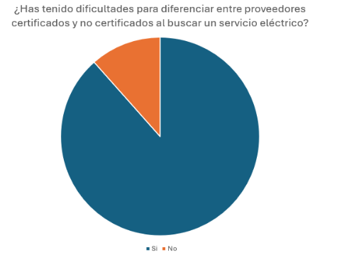  
La mayoría de usuarios indica **desconfianza ante técnicos no certificados**. La presencia de técnicos informales es una barrera importante, validando que ElectroLink debe priorizar la **verificación de credenciales**.

---

### Historial técnico y trazabilidad

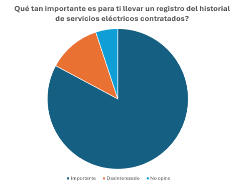  
Un alto porcentaje de usuarios considera útil llevar **un historial digital** de los servicios realizados, actualmente ausente en su rutina. Esto sustenta la necesidad de un **módulo de registro digital**.

---

### Prevención y alertas

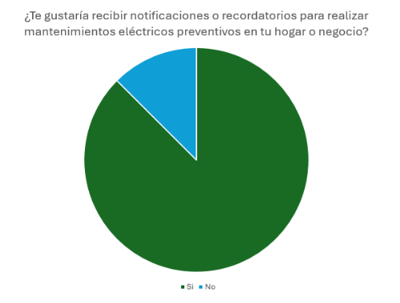  
Los entrevistados no suelen tener una **cultura de mantenimiento preventivo**, pero valoran la idea de recibir **recordatorios o alertas automatizadas** para evitar fallas.

---

### Opiniones verificadas

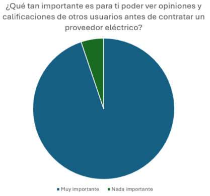  
La **transparencia y reseñas verificadas** son clave en la decisión de compra. Se valida la necesidad de incluir **calificaciones visibles** como criterio de confianza.

---

### Monetización por suscripción

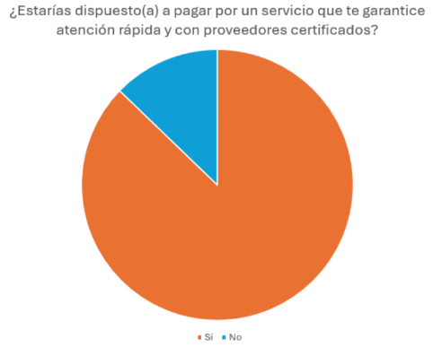  
Tanto clientes como proveedores muestran apertura a pagar por servicios premium o visibilidad, siempre que los beneficios sean tangibles y justificados.

---

### Conclusión general

Las entrevistas permitieron identificar comportamientos comunes y expectativas claras en cada segmento. Las características objetivas (uso de redes, gestión manual, falta de mantenimiento) y las subjetivas (ansiedad, frustración, búsqueda de respaldo) se alinean directamente con las funcionalidades propuestas en ElectroLink. Esto fortalece la construcción de arquetipos sólidos y validados empíricamente.

### 2.3. Needfinding
En esta sección, el equipo presenta los elementos del needfinding

#### 2.3.1. User Personas
En esta sección, el equipo presenta los User Personas realizados

**Olivia Pérez :Propietarios de hogares urbanos**

**Alejandro Lopez :Proveedores de componentes o servicios eléctricos certificados**

#### 2.3.2. User Task Matrix

En esta sección vamos a detallar las tareas que realizan los diferentes segmentos de usuarios representados por los **User Personas** de **ElectroLink**, con el objetivo de cumplir sus metas relacionadas con el mantenimiento preventivo de sistemas eléctricos en hogares, oficinas o como parte de su actividad profesional. 

| Persona                             | Actividad                                                      | Frecuencia     | Importancia |
|-------------------------------------|----------------------------------------------------------------|----------------|-------------|
| **Olivia Pérez - Propietaria de hogar** | Buscar electricistas certificados                             | Frecuentemente | Alta        |
|                                     | Agendar mantenimientos preventivos para el hogar              | Ocasionalmente | Alta        |
|                                     | Comparar calificaciones de proveedores                        | Frecuentemente | Media       |
|                                     | Buscar soluciones que ahorren energía en el hogar             | Ocasionalmente | Media       |
|                                     | Pedir recomendaciones a vecinos o conocidos                   | Rara vez       | Media       |
| **Eduardo Gonzales - Dueño de oficina/PYME** | Buscar formas de reducir costos energéticos                  | Frecuentemente | Alta        |
|                                     | Contratar servicios de mantenimiento eléctrico                | Ocasionalmente | Alta        |
|                                     | Llevar registro del historial de mantenimiento                | Ocasionalmente | Media       |
|                                     | Buscar proveedores o técnicos de confianza                    | Ocasionalmente | Alta        |
|                                     | Usar herramientas digitales para gestionar instalaciones      | A veces        | Media       |
| **Alejandro López - Proveedor de servicios eléctricos** | Buscar nuevos clientes o trabajos                          | Frecuentemente | Alta        |
|                                     | Actualizar su disponibilidad de servicios en plataformas      | Ocasionalmente | Media       |
|                                     | Gestionar pedidos y comunicación con clientes                | Frecuentemente | Alta        |
|                                     | Pedir reseñas o testimonios a sus clientes                   | Rara vez       | Media       |
|                                     | Mantenerse al día con normativas eléctricas                  | Ocasionalmente | Alta        |

#### 2.3.3. User Journey Mapping
En esta sección , el equipo presenta los User Journey Map desarrollado

**User Persona: Alejandro Lopez**

Alejandro vive un recorrido con muchos puntos de fricción, sobre todo relacionados con:

- Promoción ineficiente.
- Carga operativa excesiva (consultas, cotizaciones).
- Falta de herramientas digitales.
- Inseguridad en cumplimiento normativo.

**User Persona: Olivia Perez**

Olivia tiene una mentalidad muy preventiva, estructurada y enfocada en la calidad. Sin embargo, la informalidad del mercado eléctrico y la falta de herramientas digitales la hacen vivir una experiencia:
- Lenta y sobrecargada
- Emocionalmente estresante
- Con baja confianza en cada etapa
A pesar de eso, está muy abierta a soluciones digitales si estas le ofrecen:
- Proveedores verificados
- Validaciones técnicas y de seguridad claras

#### 2.3.4. Empathy Mapping
En esta sección , el equipo presenta los mapas de empatia o Empathy Maps realizados por User Persona

**Alejandro Lopez**

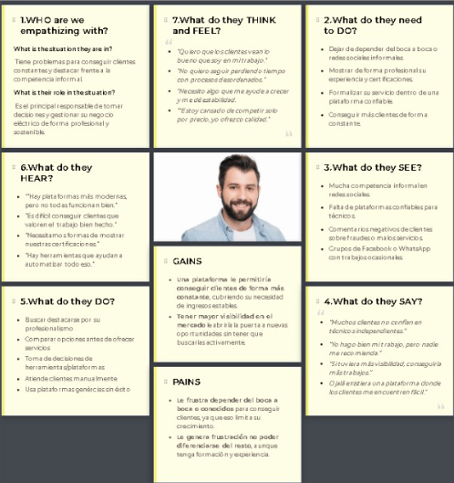

**Olivia Rodriguez**

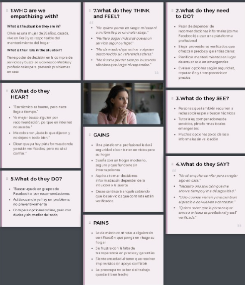

## 2.3.5. As-is Scenario Mapping
En esta sección, el equipo presenta los escnerarios as is para sus respectivos users personas

**Alejandro Lopez**

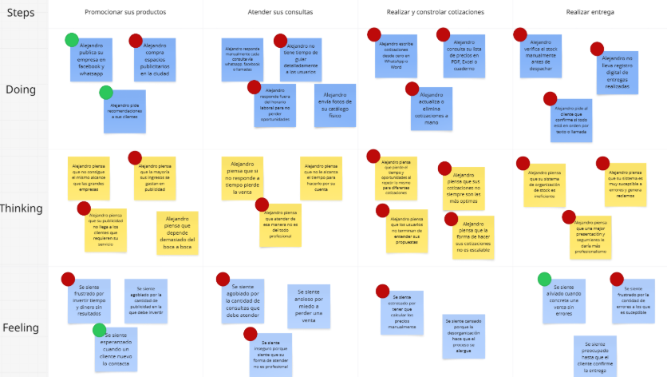

**Áreas Negativas** 

Promoción de productos:
- Frustración por la baja efectividad de la publicidad.
- Sentimiento de que no alcanza a los clientes correctos.
- Alto gasto en publicidad sin retorno claro.
  
Atención de consultas:
- Agobio y ansiedad por la sobrecarga.
- Dudas sobre su profesionalismo.
- Falta de tiempo para responder con calidad.
  
Cotizaciones:
- Estrés por cálculos manuales.
- Ineficiencia y desorganización.
- Percepción de poca escalabilidad y falta de optimización.
  
Entrega de productos:
- Preocupación por los errores.
- Falta de digitalización.
- Sensación de sistema poco confiable y propenso a reclamos.

**Áreas Positivas**

Promoción de productos:
- Esperanza cuando recibe contacto de un nuevo cliente.
  
Atención de consultas:
- No se identifican ups, lo que revela una necesidad urgente de mejora.

Cotizaciones:
- Alivio al concretar una venta sin errores, aunque depende de factores externos.
  
Entrega de productos:
- Satisfacción al cerrar una venta sin errores.
- Tranquilidad una vez que el cliente confirma.
  
**Conclusión**

Alejandro enfrenta varios puntos críticos en su proceso: publicidad poco efectiva, consultas y cotizaciones manuales que lo agobian, y entregas propensas a errores. Aunque hay momentos de esperanza, su experiencia general es frustrante. Esto evidencia la necesidad urgente de herramientas digitales que lo ayuden a automatizar, organizar y profesionalizar su servicio.

**Olivia Rodriguez**

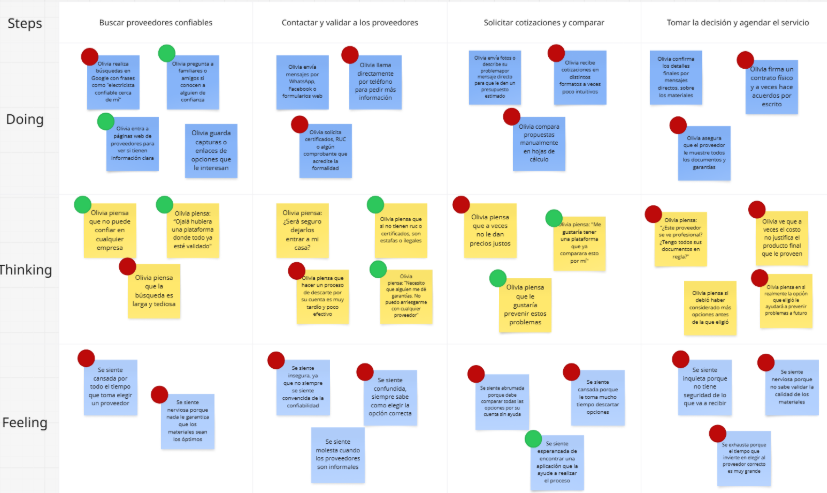

**Áreas negativas**

Buscar proveedores confiables:
- Olivia se enfrenta a una búsqueda larga, tediosa y desconfiada, lo que le genera cansancio y frustración.
- No puede confiar en cualquier empresa, y siente que el proceso es muy desgastante, además de que nada le garantiza la calidad de los materiales.
  
Contactar y validar a los proveedores:
- Se siente insegura sobre permitir el ingreso a su casa y teme contactar a proveedores sin garantías, lo que le genera nerviosismo y desconfianza.
- Olivia percibe que hacer un proceso de descarte por su cuenta es ineficiente, lo que la hace sentir molesta cuando los proveedores son informales o poco claros.

Solicitar cotizaciones y comparar:
- Se ve obligada a comparar manualmente propuestas en hojas de cálculo, recibiendo cotizaciones en formatos poco intuitivos, lo que la abruma.
- Siente que los precios no siempre son justos y se cansa de descartar opciones sin apoyo externo.

Tomar la decisión y agendar el servicio:
- Aun en la fase final, Olivia no siempre confía en la calidad de lo que va a recibir, ni en la relación entre el costo y el producto final.
- Se siente inquieta, nerviosa y exhausta, especialmente si no tiene claridad sobre las garantías o si invirtió mucho tiempo en el proceso sin estar completamente segura.

**Áreas positivas**

Buscar proveedores confiables:
- Olivia es proactiva, utiliza Google, páginas web y preguntas a familiares o amigos de confianza.
- Guarda enlaces y captura información útil, y valora la idea de una plataforma donde todo ya esté validado, lo que indica apertura a soluciones digitales confiables.

Contactar y validar a los proveedores:
- Pide certificados, RUC o documentos de formalidad, mostrando una actitud responsable y detallista en su proceso de selección.
- Aunque frustrada, busca garantías y seguridad, lo que refuerza su interés por soluciones formales y transparentes.

Solicitar cotizaciones y comparar:
- A pesar del cansancio, Olivia desea prevenir problemas a futuro, lo que muestra un enfoque de largo plazo.
- Expresa que le gustaría tener una plataforma que la ayude a comparar todo más fácilmente, lo que es una oportunidad clara para digitalizar y simplificar su experiencia.

Tomar la decisión y agendar el servicio:
- Olivia valida documentos y garantías antes de cerrar un acuerdo, lo que muestra que se preocupa por protegerse.
- Quiere asegurarse de que su elección evite problemas futuros, lo que revela una clara orientación hacia la prevención.

**Conclusión**

Olivia es una usuaria cautelosa, exigente y preocupada por la seguridad y la calidad, pero actualmente enfrenta un proceso cargado de incertidumbre, informalidad y desorganización. Su experiencia se ve afectada por la falta de herramientas que la acompañen en todo el recorrido. Una plataforma que le brinde proveedores verificados, cotizaciones estandarizadas, comparaciones automáticas y validaciones de calidad y seguridad tendría un impacto muy positivo, reduciendo su ansiedad, optimizando su tiempo y fortaleciendo su confianza al momento de tomar decisiones.

## 2.4. Ubiquitous Language
En esta sección, el equipo presenta el lenguaje Ubicuo

Glosario del Dominio del Negocio - ElectroLink
Este glosario contiene términos clave relacionados al dominio del proyecto ElectroLink. Cada término está en inglés, seguido de su equivalente en español entre paréntesis. Las definiciones están redactadas en español de forma clara y sin ambigüedades, para facilitar la comunicación entre todos los miembros del equipo y stakeholders.

1.  Stakeholders & Roles
- Homeowner (Propietario de vivienda)
   Persona que reside en un hogar y busca soluciones eléctricas confiables y certificadas para prevenir o resolver fallos.

- Service Provider (Proveedor de servicios)
   Técnico profesional con certificación que ofrece servicios de instalación, reparación o mantenimiento eléctrico.

2. Servicios y Mantenimiento
- Preventive Maintenance (Mantenimiento preventivo)
  Servicio programado que permite identificar y corregir posibles fallas eléctricas antes de que ocurran.

- Emergency Service (Servicio de emergencia)
   Atención inmediata para resolver fallos eléctricos inesperados que comprometen la seguridad o funcionalidad.

- Electric Assessment (Evaluación eléctrica)
   Diagnóstico que realiza un proveedor para determinar el estado de una instalación eléctrica.

- Installation Service (Servicio de instalación)
   Proceso de conexión o implementación de componentes eléctricos en viviendas o negocios, cumpliendo estándares técnicos.

- Electrical Upgrade (Actualización eléctrica)
   Mejora o sustitución de partes de una instalación para adaptarla a nuevas necesidades o normas de seguridad.

3. Funcionalidades de la Plataforma
- Service Request (Solicitud de servicio)
   Acción del usuario para iniciar una contratación de servicios desde la plataforma.

- Verified Profile (Perfil verificado)
   Estado de un proveedor que ha sido validado por la plataforma mediante documentación y procesos de control.

- Rating and Review (Calificación y reseña)
   Sistema de puntuación y comentarios que permite evaluar la experiencia del usuario con un proveedor.

- Subscription Plan (Plan de suscripción)
   Modalidad de pago por parte del proveedor para acceder a beneficios dentro de la plataforma (visibilidad, herramientas, clientes).

- Booking History (Historial de contrataciones)
   Registro de todos los servicios contratados, realizados y evaluados por un usuario o proveedor.

4. Seguridad y Cumplimiento
- Certified Technician (Técnico certificado)
   Profesional acreditado por una entidad oficial para realizar trabajos eléctricos conforme a la ley.

- Legal Compliance (Cumplimiento legal)
   Condición de operar dentro de los estándares establecidos por entidades regulatorias del sector eléctrico.

- Risk Prevention (Prevención de riesgos)
   Estrategia para evitar accidentes, daños o fallos eléctricos mediante prácticas seguras y mantenimiento adecuado.

- Safety Assurance (Garantía de seguridad)
   Compromiso de que los servicios ofrecidos cumplen con medidas de protección para personas, instalaciones y equipos.

5. Otros conceptos del dominio
- Electric Incident (Incidente eléctrico)
   Evento disruptivo como sobrecarga, cortocircuito o fallo en la instalación que requiere intervención técnica.

- Energy Optimization (Optimización energética)
   Prácticas que buscan mejorar el uso de energía eléctrica, reduciendo costos y desperdicios.

- Informal Market (Mercado informal)
   Entorno de prestación de servicios sin regulación, licencias ni garantías de seguridad.

- Digital Presence (Presencia digital)
   Visibilidad que tiene un proveedor dentro de la plataforma, influyendo en su reputación y oportunidades de negocio.

## Capítulo III: Requirements Specification

En este capitulo, el equipo de Hampcoders plantea todos los artecfactos de Requisitos atraves de la Especificación 

### 3.1. To-Be Scenario Mapping

En esta sección , el equipo muestra los artecfactos To--Be Scenario Maps
Olivia Perez | To-Be Scenario Mapping

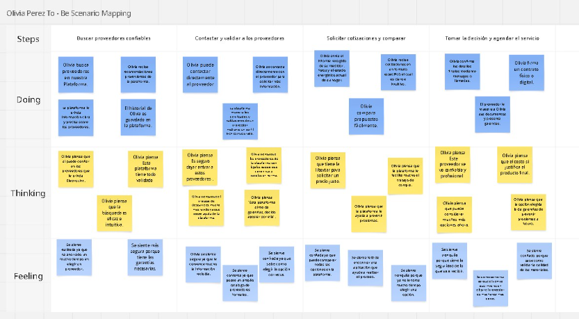

Alejandro Lopez | To-Be Scenario Mapping

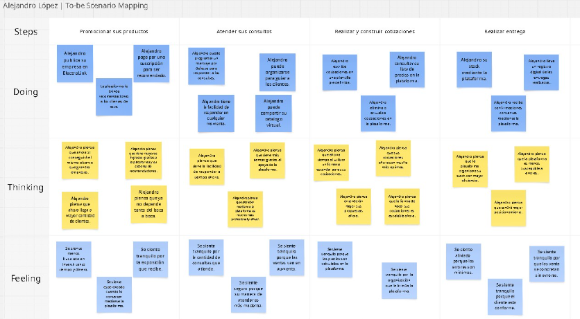

### 3.2. User Stories

En esta sección, el equipo establecio el product backlog de acuerdo al peso en story points de cada historia sea tecnica o de usuario.

# Epics

| EpicId | Titulo | Descripcion |
|---|------------|-------------|
| EP-01 | Gestión de Acceso de Usuarios |Como usuario, quiero un sistema completo de acceso para registrarme, autenticarme y gestionar mis credenciales de manera segura según mi perfil específico. |
| EP-02 | Experiencia de Usuario en Procesos de Autenticación | Como usuario, quiero tener una experiencia clara y asistida durante los procesos de registro y autenticación para completarlos con éxito y sin frustraciones. |
| EP-03 | Personalización y Seguridad de la Cuenta | Como usuario, quiero tener control sobre la seguridad y la configuración de mi cuenta para proteger mi información y adaptarla a mis necesidades específicas.|
| EP-04 | Contratación y Seguimiento de Servicios Eléctricos | Como propietario o PYME, quiero contratar servicios paso a paso y darles seguimiento, para resolver mis problemas eléctricos de manera estructurada y segura. |
| EP-05 | Programación y Gestión de Servicios Preventivos | Como propietario o PYME, quiero programar mantenimientos preventivos y revisar mi historial de servicios, para garantizar un sistema eléctrico seguro y funcional. |
| EP-06 | Gestión Operativa de los Proveedores | Como proveedor, quiero administrar mi agenda, servicios y pagos, para tener control sobre mis operaciones y oportunidades de negocio. |
| EP-07 | Funcionalidades de Confianza y Transparencia en el Ecosistema | Como usuario, quiero interactuar con un entorno confiable, transparente y claro, para sentirme seguro al contratar servicios, comparar opciones y tomar decisiones informadas. |
| EP-08 | Navegación en la Landing Page | Como visitante, quiero navegar en una Landing page que me brinde información necesaria para tomar una decisión informada. |
| EP-09 | Gestión de Suscripciones y Pagos (Proveedores) | Como proveedor, quiero gestionar mis planes de suscripción, procesar pagos de forma segura y acceder a mi historial de facturación, para mantener mi cuenta activa y funcional. |
| EP-10 | Gestión de Activos y Recursos | Como usuario (propietario o proveedor), quiero registrar y gestionar mis activos relevantes (propiedades, inventario de componentes) para facilitar la operativa del sistema. |
| EP-11 | Gestión de Servicios Ofrecidos | Como técnico, quiero gestionar mi catálogo de servicios ofrecidos, para mantenerlo actualizado y mostrar claramente a los clientes mi oferta y especialidades. |
| EP-12 | Gestión de Propiedades | Como desarrollador, quiero implementar endpoints para registrar, consultar y administrar propiedades de los propietarios, para permitir la selección de ubicación durante la solicitud. |
| EP-13 | Gestión de Componentes Técnicos | Como desarrollador, quiero crear endpoints CRUD para administrar el inventario de componentes eléctricos de los técnicos, para garantizar el stock durante la asignación de servicios. |
| EP-14 | Asistente de Solicitud de Servicio | Como desarrollador, quiero implementar la lógica escalonada del flujo de solicitud del propietario, para validar planes, verificar límites y facilitar la selección guiada. |
| EP-15 | Evaluación de Servicios Completados | Como desarrollador, quiero permitir que los usuarios dejen evaluaciones tras completar un servicio, para alimentar las métricas del sistema y mejorar la calidad del servicio. |

| Epic/StoryID | Título | Descripción | Criterios de aceptación | Relacionado con epica |
|--------------|--------|-------------|-------------------------|----------------------|
| US-01 | Visualización de Características y Beneficios | Como visitante de la landing page, Quiero ver claramente las características y beneficios de la plataforma, Para entender cómo puede ayudarme y decidir si registrarme. | Escenario #1: Visualización de beneficios para usuarios Dado que que un visitante se encuentra explorando la plataforma informativa Cuando revisa la sección de propuestas de valor Entonces debe  identificar claramente los beneficios específicos para Propietarios y Técnicos Y cada beneficio debe tener una descripción breve y clara.  Escenario #2: Visualización de características principales Dado que que un visitante se encuentra en la plataforma informativa Cuando explora la sección de características Entonces debe ver las funcionalidades destacadas de la plataforma Y cada característica debe tener un título descriptivo y una explicación concisa de su funcionamiento. | EP-08 |
| US-02 | Visualización de Testimonios | Como visitante indeciso sobre la plataforma, Quiero ver testimonios de usuarios reales, Para aumentar mi confianza en el servicio antes de registrarse. | Escenario #1: Visualización de testimonios diversos Dado que que el visitante explora la plataforma informativa Cuando accede a la sección de testimonios Entonces debe ver al menos 3 testimonios diferentes Y cada testimonio debe mostrar: Nombre de usuario, tipo de usuario (Propietario/Técnico), calificación y comentario Y las calificaciones deben ser visualmente claras. | EP-08 |
| US-03 | Adaptabilidad a Diferentes Dispositivos | Como visitante que accede desde diferentes dispositivos, Quiero que la landing page se adapte correctamente a mi pantalla, Para tener una experiencia óptima independientemente del dispositivo que use. | Escenario #1: Experiencia en dispositivo móvil Dado que que un visitante accede a la plataforma informativa desde un dispositivo móvil Cuando la información es presentada Entonces todos los elementos se reorganizan para adaptarse a una pantalla vertical Y no requiere desplazamiento horizontal Y todos los textos son legibles sin necesidad de ampliar la vista.  Escenario #2: Experiencia en tableta o escritorio Dado que que un visitante accede a la plataforma informativa desde una tableta o un ordenador Cuando la información es presentada Entonces el diseño aprovecha el espacio horizontal adicional Y mantiene una experiencia de navegación fluida y atractiva. | EP-08 |
| US-04 | Visualización de una Sección Principal | Como visitante de la página, quiero ver una sección principal atractiva que me presente un breve resumen de la idea del producto, para entender rápidamente de qué se trata el servicio. | Escenario #1: Presentación del propósito de la plataforma Dado que que un visitante accede a la plataforma informativa Cuando la carga inicial se completa Entonces se muestra una sección principal con un título que explica el propósito del sistema Y se incluye un subtítulo que resume el valor principal del servicio Y se presenta una llamada a la acción principal para invitar al registro. | EP-08 |
| US-05 | Navegación sin errores | Como visitante, quiero navegar por la página web sin encontrar errores, para tener una experiencia fluida que me anime a registrarme. | Escenario #1: Carga completa de la plataforma Dado que que un visitante accede a la plataforma informativa Cuando la carga de la página se completa Entonces todos los elementos visuales e informativos se muestran correctamente Y no existen enlaces que dirijan a destinos incorrectos o inexistentes. | EP-08 |
| US-06 | Navegación mediante Encabezado | Como usuario, quiero un menú de navegación claro en el encabezado, para acceder fácilmente a las diferentes secciones de la página. | Escenario #1: Acceso a secciones desde el encabezado Dado que que un visitante explora la plataforma informativa Cuando utiliza las opciones de navegación en el encabezado Entonces puede desplazarse a las diferentes secciones informativas Y el encabezado permanece accesible durante el desplazamiento.  Escenario #2: Navegación en dispositivos de pantalla pequeña Dado que que un visitante accede desde un dispositivo móvil Cuando interactúa con la opción de menú principal Entonces se despliegan las opciones de navegación a las distintas secciones. | EP-08 |
| US-07 | Visualización del Pie de página | Como visitante, quiero ver un pie de página organizado con accesos directos e información de contacto, para encontrar información adicional rápidamente. | Escenario #1: Contenido completo del pie de página Dado que que un visitante se desplaza hasta el final de la plataforma informativa Cuando llega al pie de página Entonces debe ver una sección con enlaces a Términos y Condiciones y Política de Privacidad Y debe encontrar información de contacto Y enlaces a las redes sociales de la empresa. | EP-08 |
| US-08 | Ver Información del Startup | Como potencial cliente, quiero conocer información sobre la empresa desarrolladora, para evaluar su credibilidad y confiabilidad. | Escenario #1: Acceso a información corporativa Dado que que un visitante navega por la plataforma informativa Cuando se desplaza a la sección sobre la empresa Entonces debe encontrar información clara sobre la startup y el equipo fundador Y la información debe transmitir profesionalidad y confianza. | EP-08 |
| US-09 | Conocer la Misión de la Startup | Como visitante interesado, quiero conocer la misión de la empresa, para entender sus valores y propósito. | Escenario #1: Visibilidad de la declaración de misión Dado que que un visitante navega por la sección sobre la empresa Cuando busca información sobre los propósitos de la empresa Entonces debe encontrar claramente destacada la declaración de misión Y esta debe estar redactada de forma concisa y comprensible. | EP-08 |
| US-10 | Conocer la Visión de la Startup | Como visitante interesado, quiero conocer la visión de la empresa, para entender sus objetivos a largo plazo y su proyección de futuro. | Escenario #1: Visibilidad de la declaración de visión Dado que que un visitante navega por la sección sobre la empresa Cuando busca información sobre las metas futuras de la empresa Entonces debe encontrar claramente destacada la declaración de visión Y esta debe estar redactada de forma inspiradora y orientada al futuro. | EP-08 |
| US-11 | Conocer más a fondo los servicios que ofrecen | Como visitante interesado, quiero conocer de manera más específica los servicios que ofrecen por medio de capturas de pantallas, para comprender su solución y decidir si optar por ella | Escenario #1: Visualización de la solución en acción Dado que que un visitante se encuentra en la sección de características o servicios Cuando explora cómo funciona la plataforma Entonces visualiza representaciones gráficas o capturas de pantalla de la aplicación Y estas imágenes ilustran las funcionalidades clave del sistema. | EP-08 |
| US-12 | Ver planes de suscripción disponibles | Como visitante interesado, quiero ver una sección clara que me presente los planes de suscripción disponibles, separados por "Planes para Técnicos" y "Planes para Propietarios", para comparar fácilmente sus características y precios. | Escenario #1: Comparación de planes para Propietarios Dado que que un visitante está interesado en los planes para Propietarios Cuando accede a la sección de planes Entonces visualiza una comparativa entre el plan Básico y el plan Premium Y puede identificar claramente los límites y beneficios de cada uno.  Escenario #2: Visualización de planes para Técnicos Dado que que un visitante está interesado en los planes para Técnicos Cuando accede a la sección de planes Entonces visualiza la oferta de planes de suscripción para su rol Y comprende los beneficios asociados a cada nivel. | EP-08 |
| US-13 | Registro de cuentas como Dueño de Hogar | Como dueño de hogar, quiero registrarme para tener una cuenta en la aplicación, para gestionar los componentes eléctricos de mi vivienda | Escenario #1: Selección de rol de usuario Dado que que una persona no registrada accede a la funcionalidad de registro Cuando selecciona el rol "Dueño de Hogar" Entonces el sistema le presenta los campos requeridos para ese rol.  Escenario #2: Registro exitoso con datos válidos Dado que que un futuro dueño de hogar ha completado todos los campos obligatorios con información válida Cuando solicita el registro de su cuenta Entonces el sistema crea una cuenta de usuario con el rol "Propietario" Y le informa que se ha enviado una comunicación para verificar su cuenta. | EP-01 |
| US-14 | Registro de cuentas como Dueño de Empresa | Como dueño o representante de empresa, quiero registrarme para tener una cuenta en la aplicación, para gestionar los componentes eléctricos de mis instalaciones comerciales | Escenario #1: Selección de rol de usuario Dado que que una persona no registrada accede a la funcionalidad de registro Cuando selecciona el rol "Dueño de Empresa" Entonces el sistema le presenta los campos requeridos para ese rol, incluyendo el nombre de la empresa.  Escenario #2: Registro exitoso con datos válidos Dado que que un futuro dueño de empresa ha completado todos los campos obligatorios con información válida Cuando solicita el registro de su cuenta Entonces el sistema crea una cuenta de usuario con el rol "Propietario" de tipo PYME Y le informa que se ha enviado una comunicación para verificar su cuenta. | EP-01 |
| US-15 | Registro de cuentas para Técnicos | Como Técnico de componentes eléctricos y/o servicios, quiero registrarme para tener una cuenta en la aplicación, para ofrecer mis productos y servicios a los usuarios | Escenario #1: Selección de rol de usuario Dado que que una persona no registrada accede a la funcionalidad de registro Cuando selecciona el rol "Técnico" Entonces el sistema le presenta los campos requeridos para el perfil profesional.  Escenario #2: Registro exitoso con datos válidos Dado que que un futuro técnico ha completado todos los campos obligatorios con información válida Cuando solicita el registro de su cuenta Entonces el sistema crea una cuenta de usuario con el rol "Técnico" Y le informa que se ha enviado una comunicación para verificar su cuenta. | EP-01 |
| US-16 | Verificación de cuenta por correo electrónico | Como usuario, quiero verificar mi cuenta a través de un enlace enviado por correo electrónico para confirmar mi identidad. | Escenario #1: Envío de comunicación de verificación Dado que que un usuario se ha registrado exitosamente Cuando el proceso de registro finaliza Entonces el sistema envía una comunicación electrónica a la dirección proporcionada Y la comunicación contiene una instrucción y un medio único para verificar la cuenta.  Escenario #2: Verificación exitosa de cuenta Dado que que un usuario ha recibido la comunicación de verificación Cuando utiliza el medio de verificación proporcionado Entonces su cuenta es marcada como verificada en el sistema Y se le notifica que la verificación fue exitosa. | EP-01 |
| US-17 | Inicio de sesión de usuarios | Como usuario registrado, quiero iniciar sesión en la aplicación con mis credenciales para acceder a mi cuenta y utilizar las funcionalidades de la plataforma. | Escenario #1: Inicio de sesión exitoso con credenciales válidas Dado que que un usuario registrado y verificado se encuentra en la funcionalidad de acceso Cuando ingresa sus credenciales correctas y solicita el acceso Entonces el sistema valida las credenciales Y le concede acceso a su panel personalizado según su rol.  Escenario #2: Intento de inicio de sesión con credenciales inválidas Dado que que un usuario se encuentra en la funcionalidad de acceso Cuando ingresa un correo electrónico y/o contraseña incorrectos Entonces el sistema le niega el acceso Y le informa que las credenciales son inválidas. | EP-01 |
| US-18 | Validación de datos de registro | Como usuario, quiero recibir retroalimentación inmediata sobre la validez de los datos que ingresó durante el registro para corregir errores rápidamente. | Escenario #1: Validación de formato de correo electrónico Dado que que un usuario está completando el formulario de registro Cuando ingresa un texto en el campo de correo electrónico que no tiene un formato válido Entonces el sistema le informa que el formato del correo no es válido.  Escenario #2: Validación de correo electrónico ya registrado Dado que que un usuario está en el formulario de registro Cuando ingresa un correo electrónico que ya está registrado en el sistema Entonces el sistema le informa que la dirección de correo ya está en uso. | EP-02 |
| US-19 | Mensajes de éxito retroalimentación de registro | Como usuario, quiero recibir mensajes claros y accesibles al completar el registro sobre éxito para entender fácilmente el resultado de mis acciones. | Escenario #1: Mensaje de éxito al completar el registro Dado que que el usuario ha completado correctamente el proceso de registro Cuando el sistema procesa la solicitud con éxito Entonces el sistema muestra un mensaje de confirmación Y informa sobre el siguiente paso (verificación de correo). | EP-02 |
| US-20 | Mensajes de error retroalimentación de registro | Como usuario, quiero recibir mensajes claros y accesibles al completar el registro sobre cualquier error a la hora de completar el formulario, para entender fácilmente el resultado de mis acciones y saber cómo proceder. | Escenario #1: Mensaje de error por problemas del sistema Dado que que el usuario ha solicitado completar su registro Cuando ocurre un error del sistema durante el procesamiento Entonces el sistema muestra un mensaje de error genérico Y informa que puede intentarlo de nuevo Y los datos ingresados se conservan para facilitar un nuevo intento. | EP-02 |
| US-21 | Recuperación de Contraseña | Como usuario registrado, quiero recuperar mi contraseña en caso de olvidarla, para volver a acceder a mi cuenta de manera segura. | Escenario #1: Solicitud de recuperación con correo válido Dado que que un usuario se encuentra en la página de recuperación de contraseña Cuando ingresa el correo electrónico asociado a su cuenta Entonces el sistema envía un correo con instrucciones y un enlace único de restablecimiento Y muestra un mensaje de confirmación indicando que revise su correo.  Escenario #2: Finalización exitosa del restablecimiento Dado que que un usuario ha seguido el enlace de restablecimiento Cuando ingresa y confirma una nueva contraseña que cumple los requisitos de seguridad Entonces la contraseña es actualizada en el sistema Y recibe un mensaje de confirmación del cambio exitoso. | EP-03 |
| US-22 | Cierre de Sesión | Como usuario autenticado, quiero cerrar mi sesión de forma segura para proteger mi cuenta cuando termine de usar la aplicación. | Escenario #1: Cierre de sesión voluntario Dado que que un usuario está autenticado en la aplicación Cuando selecciona la opción de cierre de sesión Entonces su sesión es terminada de forma segura Y es redirigido a una pantalla pública (inicio de sesión o landing page). | EP-03 |
| US-23 | Visualización de Perfil de Propietario | Como propietario registrado, quiero visualizar mi perfil, para revisar mi información personal y preferencias almacenadas en el sistema | Escenario #1: Acceso al perfil personal Dado que que un Propietario está autenticado en el sistema Cuando solicita visualizar su perfil Entonces se le presenta su información personal registrada, como nombre, correo y teléfono Y visualiza sus preferencias de notificación configuradas. | EP-03 |
| US-24 | Edición de Perfil de Propietario | Como propietario registrado, quiero editar mi información personal y preferencias, para mantener mi perfil actualizado y tener más control sobre este. | Escenario #1: Edición exitosa de información personal Dado que que un Propietario está en la funcionalidad de edición de perfil Cuando modifica su información personal (ej. teléfono) y guarda los cambios Entonces sus cambios se almacenan en el sistema Y observa un mensaje de confirmación. | EP-03 |
| US-25 | Visualización de Perfil de Técnico | Como Técnico registrado Quiero visualizar mi perfil profesional Para revisar cómo se presenta mi información y servicios a los clientes potenciales | Escenario #1: Acceso al perfil profesional Dado que que un Técnico está autenticado en el sistema Cuando solicita visualizar su perfil Entonces se le presenta su información profesional tal como la verían los clientes Y puede revisar su descripción, certificaciones, portafolio y zonas de cobertura. | EP-03 |
| US-26 | Edición de Perfil de Técnico | Como Técnico registrado, quiero editar mi información profesional, certificaciones y servicios ofrecidos para mantener mi perfil actualizado y atractivo para los clientes. | Escenario #1: Edición de información profesional Dado que que un Técnico está en la funcionalidad de edición de perfil Cuando modifica su descripción, información de contacto o especialidades y guarda los cambios Entonces sus cambios se almacenan y se reflejan en su perfil público.  Escenario #2: Gestión de certificaciones Dado que que un Técnico está editando su perfil Cuando añade una nueva certificación con su respectivo documento Entonces la certificación se añade a su perfil y queda pendiente de validación. | EP-03 |
| US-27 | Entrar a un dashboard Personalizado | Como usuario de la plataforma, quiero acceder a un dashboard personalizado al iniciar sesión, para visualizar de forma inmediata la información relevante según mi rol y actividad reciente. | Escenario #1: Visualización del dashboard para Propietario Dado que que un Propietario inicia sesión Cuando accede a su panel principal Entonces visualiza un resumen de sus servicios activos, sus próximas citas y notificaciones recientes.  Escenario #2: Visualización del dashboard para Técnico Dado que que un Técnico inicia sesión Cuando accede a su panel principal Entonces visualiza su agenda de servicios del día, solicitudes pendientes y un resumen de sus estadísticas recientes. | EP-03 |
| US-28 | Crear Portafolio Digital con Evidencias de Trabajo | Como Técnico de servicios eléctricos, quiero crear un portafolio digital dentro de mi perfil que incluya fotos, descripciones y referencias de trabajos anteriores, para mostrar mi experiencia y generar mayor confianza en potenciales clientes. | Escenario #1: Añadir un nuevo trabajo al portafolio Dado que que un Técnico está gestionando su perfil Cuando accede a la sección de Portafolio y añade un nuevo trabajo con imágenes y descripción Entonces el trabajo se guarda y se muestra en su perfil público.  Escenario #2: Organización del portafolio Dado que que un Técnico tiene varios trabajos en su portafolio Cuando organiza sus trabajos por categorías Entonces los cambios se reflejan en la vista pública, permitiendo a los clientes filtrar por dichas categorías. | EP-07 |
| US-29 | Configuración de Zona de Cobertura Geográfica | Como técnico registrado, quiero configurar mi zona de cobertura geográfica especificando radio de acción y ubicaciones donde ofrezco servicios, para recibir solicitudes solo de clientes dentro de mi área de trabajo. | Escenario #1: Definición de una zona de cobertura Dado que que un Técnico está configurando su perfil operativo Cuando define una o más áreas geográficas donde presta servicios Entonces el sistema almacena estas zonas Y las utilizará para filtrar las solicitudes de servicio que puede recibir. | EP-06 |
| US-30 | Configuración de Notificaciones Personalizadas | Como usuario de la plataforma, quiero configurar mis preferencias de notificaciones (email, SMS, push) y frecuencia, para recibir información relevante sin ser saturado de mensajes. | Escenario #1: Ajuste de preferencias de notificación Dado que que un usuario (Propietario o Técnico) está en la configuración de su cuenta Cuando ajusta qué tipo de notificaciones desea recibir y por qué canal (ej. email) Entonces el sistema guarda sus preferencias Y las futuras notificaciones se enviarán de acuerdo a esta configuración. | EP-03 |
| US-31 | Crear Componente Eléctrico | Como técnico Quiero registrar nuevos componentes eléctricos en mi inventario Para mantener un inventario completo de mi infraestructura eléctrica. | Escenario #1: Registro de un nuevo componente Dado que que un Técnico está gestionando su inventario Cuando proporciona la información de un nuevo componente (nombre, marca, etc.) Entonces el sistema registra el nuevo componente en el inventario del técnico. | EP-10 |
| US-32 | Editar Componente Eléctrico | Como técnico Quiero modificar la información de los componentes eléctricos registrados Para mantener actualizada la información técnica y de consumo. | Escenario #1: Actualización de datos técnicos Dado que que un Técnico visualiza su inventario Cuando selecciona un componente y modifica sus características Entonces los cambios se guardan correctamente. | EP-10 |
| US-33 | Eliminar Componente Eléctrico | Como técnico Quiero  eliminar componentes eléctricos de mi inventario Para mantener actualizada mi configuración cuando retire o reemplace equipos. | Escenario #1: Eliminación de componente Dado que que un Técnico visualiza su inventario Cuando selecciona un componente y solicita su eliminación Entonces el sistema solicita confirmación Y elimina el componente del inventario activo tras la confirmación. | EP-10 |
| US-34 | Registro de Propiedad (Propietario) | Como propietario, quiero registrar una nueva propiedad en el sistema, incluyendo su dirección y geolocalización, para  solicitar servicios para ella. | Escenario #1: Añadir una nueva propiedad Dado que que un Propietario está gestionando sus activos Cuando proporciona la información de una nueva propiedad, incluyendo su dirección Entonces el sistema registra la propiedad y la asocia a su cuenta Y la propiedad queda disponible para solicitar servicios. | EP-10 |
| US-35 | Edición de Información de Propiedad (Propietario) | Como propietario, quiero  editar la información de mis propiedades registradas (ej. dirección, características), para mantenerla actualizada. | Escenario #1: Actualización de datos de una propiedad Dado que que un Propietario visualiza sus propiedades registradas Cuando selecciona una propiedad y modifica su información Entonces los cambios se guardan correctamente. | EP-10 |
| US-36 | Eliminación de Propiedad (Propietario) | Como propietario, quiero  eliminar una propiedad de mi cuenta para registrar otra propiedad. | Escenario #1: Eliminación de una propiedad Dado que que un Propietario visualiza sus propiedades registradas Cuando selecciona una propiedad y solicita su eliminación Entonces el sistema solicita confirmación Y elimina la propiedad de su cuenta tras la confirmación. | EP-10 |
| US-37 | Registro de Inventario de Componentes (Técnico) | Como Técnico, quiero registrar los componentes eléctricos que tengo en mi inventario, incluyendo cantidad y costo, para controlar mi stock. | Escenario #1: Añadir un componente al inventario con stock Dado que que un Técnico está gestionando su inventario Cuando registra un nuevo tipo de componente y especifica la cantidad inicial y el costo Entonces el componente se añade a su inventario con el stock correspondiente. | EP-10 |
| US-38 | Actualización de Stock de Componentes (Técnico) | Como Técnico, quiero actualizar las cantidades de mis componentes en inventario después de una compra o uso en un servicio, para mantener la precisión del stock. | Escenario #1: Ajuste manual de stock Dado que que un Técnico está gestionando su inventario Cuando selecciona un componente y ajusta la cantidad de stock manualmente (ej. por una nueva compra) Entonces la cantidad de stock del componente se actualiza. | EP-10 |
| US-39 | Configuración de Alertas de Stock Mínimo (Técnico) | Como Técnico, quiero definir umbrales de stock mínimo para mis componentes y recibir alertas cuando el stock alcance ese nivel, para planificar reposiciones. | Escenario #1: Establecer un umbral de stock mínimo Dado que que un Técnico está gestionando un componente en su inventario Cuando establece un umbral numérico de stock mínimo para ese componente Entonces el sistema guarda esta configuración.  Escenario #2: Recepción de alerta Dado que que un componente tiene un umbral de stock mínimo configurado Cuando el stock de ese componente baja hasta o por debajo del umbral Entonces el sistema envía una notificación al Técnico informando de la situación. | EP-10 |
| US-40 | Contratación de Servicios Eléctricos mediante Wizard | Como propietario de PyME, quiero contar con un proceso guiado paso a paso para contratar servicios eléctricos, para solucionar mis problemas de forma rápida y sin complicaciones. | Escenario #1: Completar proceso guiado Dado que que un Propietario inicia el proceso de contratación Cuando completa todos los pasos requeridos en el asistente (selección de propiedad, servicio, etc.) Entonces el sistema genera una solicitud de servicio Y le confirma que la solicitud ha sido creada y está pendiente de asignación. | EP-04 |
| US-41 | Selección de Propiedad | Como propietario con múltiples propiedades, quiero seleccionar la propiedad específica donde necesito el servicio, para que el sistema asigne al técnico más cercano a esa ubicación. | Escenario #1: Selección de propiedad en la solicitud Dado que que un Propietario con más de una propiedad inicia una solicitud de servicio Cuando el sistema le solicita indicar para qué propiedad es el servicio Entonces puede seleccionar una de sus propiedades registradas Y la ubicación de esa propiedad será utilizada para la asignación del técnico. | EP-04 |
| US-42 | Carga Manual de Datos de Recibos Eléctricos (3-6 recibos) | Como propietario solicitando un servicio, quiero ingresar manualmente los datos clave de mi último recibo eléctrico durante el proceso de solicitud, para registrar mi historial de consumo y permitir análisis a largo plazo en mi panel de Analytics. | Escenario #1: Ingreso de datos del recibo Dado que que un Propietario está en el proceso de solicitar un servicio Cuando ingresa los datos de consumo (kWh, monto, período) de su recibo eléctrico Entonces el sistema valida y asocia esta información a la solicitud Y los datos quedan almacenados para su futuro análisis de consumo. | EP-04 |
| US-43 | Descripción Detallada del Problema Eléctrico | Como propietario que ya ha seleccionado un servicio, quiero  añadir una descripción detallada de mi problema, para que el técnico asignado conozca el contexto específico antes de su llegada. | Escenario #1: Añadir detalles a la solicitud Dado que que un Propietario está creando una solicitud de servicio Cuando proporciona texto adicional describiendo el problema Entonces esta descripción se adjunta a la solicitud y será visible para el técnico que sea asignado. | EP-04 |
| US-44 | Selección de Servicio Específico del Catálogo | Como propietario, después de seleccionar mi propiedad, quiero ver una lista de servicios específicos disponibles en mi zona (ej: 'Instalación de tomacorriente', 'Diagnóstico General') y seleccionar el que necesito, para que el sistema sepa exactamente qué trabajo solicitar y pueda automatizar la asignación | Escenario #1: Selección de un servicio del catálogo Dado que que un Propietario ha seleccionado la propiedad para el servicio Cuando el sistema le presenta el catálogo de servicios disponibles en su zona Entonces puede seleccionar un servicio específico de la lista Y la solicitud queda vinculada a ese servicio del catálogo. | EP-04 |
| US-45 | Cancelación de servicios programados | Como cliente, quiero cancelar un servicio programado con anticipación para evitar cargos innecesarios | Escenario #1: Cancelación dentro del plazo permitido Dado que que un Propietario tiene un servicio programado Cuando solicita cancelarlo dentro del plazo permitido por las políticas Entonces el sistema procesa la cancelación sin penalización Y notifica tanto al Propietario como al Técnico asignado. | EP-04 |
| US-46 | Notificación de Asignación Automática de Técnico (Propietario) | Como propietario, después de que mi solicitud de servicio es asignada automáticamente, quiero recibir una notificación con la información del técnico asignado. | Escenario #1: Recepción de notificación de asignación Dado que que un Propietario ha creado una solicitud de servicio Cuando el sistema asigna automáticamente un Técnico al servicio Entonces el Propietario recibe una notificación Y la notificación contiene la información del perfil del Técnico asignado. | EP-04 |
| US-47 | Historial de servicios contratados | Como cliente, quiero ver un historial de los servicios que he contratado anteriormente para referencia futura | Escenario #1: Visualización de historial de servicios Dado que que un Propietario accede a su historial de servicios Cuando no aplica ningún filtro Entonces visualiza todos los servicios contratados ordenados cronológicamente Y para cada servicio puede ver detalles como fecha, técnico y estado. | EP-05 |
| US-48 | Configurar Horarios de Trabajo Semanales | Como técnico registrado, quiero configurar mis horarios de trabajo por día de la semana (ej: Lunes 8AM-6PM, Martes 10AM-4PM) y definir la duración promedio que me toma cada tipo de servicio, para que el sistema pueda asignarme automáticamente trabajos solo en mis horarios laborales disponibles. | Escenario #1: Establecer disponibilidad semanal Dado que que un Técnico está configurando su agenda Cuando define sus horas de trabajo para cada día de la semana Entonces el sistema guarda esta disponibilidad como su horario laboral estándar Y lo usará como criterio para la asignación automática de servicios. | EP-06 |
| US-49 | Modificar Horarios de Trabajo Existentes | Como técnico registrado, quiero modificar mis horarios de trabajo ya configurados (cambiar horas de inicio/fin, días laborales), para ajustar mi disponibilidad según cambios en mi situación personal o comercial. | Escenario #1: Ajustar disponibilidad semanal Dado que que un Técnico tiene un horario de trabajo configurado Cuando modifica las horas de inicio o fin de un día laboral y guarda los cambios Entonces el sistema actualiza su horario laboral estándar. | EP-06 |
| US-50 | Bloquear Fechas y Horarios Específicos | Como técnico registrado, quiero bloquear fechas específicas (vacaciones, emergencias) o horarios puntuales (citas médicas, otros compromisos) en mi calendario, para evitar que el sistema me asigne trabajos durante esos períodos. | Escenario #1: Bloquear un período de tiempo Dado que que un Técnico está gestionando su agenda Cuando selecciona una fecha o un rango de horas y lo marca como no disponible Entonces el sistema registra este bloqueo Y no le asignará servicios durante ese período. | EP-06 |
| US-51 | Visualizar Agenda de Trabajos Asignados Automáticamente | Como técnico registrado, quiero visualizar en un calendario todos los trabajos que el sistema me ha asignado automáticamente dentro de mis horarios disponibles, para planificar mi día y ver mi carga de trabajo semanal. | Escenario #1: Vista de agenda con trabajos asignados Dado que que un Técnico accede a su agenda Cuando tiene trabajos que le han sido asignados Entonces visualiza estos trabajos en una vista de calendario Y puede ver los detalles de cada servicio programado. | EP-06 |
| US-52 | Configurar Tiempo de Traslado Entre Servicios | Como técnico registrado, quiero configurar el tiempo promedio que necesito para trasladarme entre ubicaciones en mi zona de cobertura, para que el sistema considere estos intervalos al asignarme trabajos consecutivos. | Escenario #1: Configurar buffer de traslado Dado que que un Técnico está configurando su agenda Cuando define un tiempo promedio de traslado (ej. 30 minutos) Entonces el sistema considerará este intervalo de tiempo entre servicios consecutivos al momento de la asignación automática. | EP-06 |
| US-53 | Crear Servicios en Catálogo con Recetas de Componentes | Como técnico registrado, quiero crear nuevos servicios en mi catálogo especificando qué componentes eléctricos exactos necesito y en qué cantidades (receta), para que el sistema verifique automáticamente si tengo stock suficiente antes de asignarme ese tipo de trabajo. | Escenario #1: Crear un servicio con receta Dado que que un Técnico está gestionando su catálogo Cuando crea un nuevo servicio y le asocia una "receta" (lista de componentes y cantidades de su inventario) Entonces el servicio se guarda con su receta de componentes asociada Y el sistema usará esta receta para validar el stock antes de la asignación. | EP-11 |
| US-54 | Modificar Servicios y sus Recetas de Componentes | Como técnico registrado, quiero modificar los servicios existentes en mi catálogo (precio, descripción, componentes necesarios), para mantener actualizada mi oferta y las recetas de materiales. | Escenario #1: Actualizar una receta de servicio Dado que que un Técnico está editando un servicio existente con receta Cuando modifica la lista de componentes o sus cantidades Entonces la receta del servicio se actualiza. | EP-11 |
| US-55 | Eliminar Servicios del Catálogo | Como técnico registrado, quiero eliminar servicios que ya no ofrezco de mi catálogo, para evitar que el sistema me asigne trabajos que no puedo realizar. | Escenario #1: Eliminación de un servicio Dado que que un Técnico visualiza su catálogo de servicios Cuando selecciona un servicio y solicita su eliminación Entonces el servicio se elimina y ya no será ofrecido a los clientes. | EP-11 |
| US-56 | Establecimiento Precios por Tipo de Servicio y Zona | Como técnico registrado, quiero establecer precios diferenciados por tipo de servicio y opcionalmente por zona dentro de mi área de cobertura, para tener una estructura tarifaria clara y rentable. | Escenario #1: Definir precio de un servicio Dado que que un Técnico está creando o editando un servicio Cuando establece un precio base para dicho servicio Entonces ese precio se mostrará a los clientes como referencia.  Escenario #2: Definir precio diferenciado por zona (opcional) Dado que que un Técnico ha definido múltiples zonas de cobertura Cuando edita un servicio Entonces puede opcionalmente establecer un precio diferente para una zona específica. | EP-06 |
| US-57 | Beneficio de Solicitud Prioritaria | Como propietario con suscripción Premium, al crear una solicitud de servicio, quiero tener disponible y  activar la opción de "marcar como prioritaria", para que mi solicitud tenga preferencia en el sistema de asignación y así resolver mi problema más rápidamente. | Escenario #1: Marcar solicitud como prioritaria Dado que que un Propietario con plan Premium está creando una solicitud Cuando activa la opción de solicitud prioritaria Entonces la solicitud es creada y marcada con alta prioridad para el proceso de asignación. | EP-04 |
| US-58 | Notificación de Límite de Solicitudes Alcanzado | Como propietario del plan Básico, al intentar crear una solicitud que excede mi límite mensual (2), quiero ser notificado claramente por el sistema y ver una opción directa para mejorar mi plan a Premium, para entender las reglas del plan gratuito y  continuar usando el servicio si lo necesito. | Escenario #1: Bloqueo por límite de solicitudes Dado que que un Propietario con plan Básico ya ha alcanzado su límite de solicitudes mensuales Cuando intenta crear una nueva solicitud de servicio Entonces el sistema le impide continuar Y le informa que ha alcanzado su límite Y le presenta la opción de actualizar a un plan superior. | EP-04 |
| US-59 | Seguimiento de Estados de Servicio en Tiempo Real | Como propietario y técnico, quiero ver el estado actual del servicio (programado, confirmado, en progreso, completado) actualizado en tiempo real, para estar informado sobre el progreso del trabajo. | Escenario #1: Visualización del estado del servicio Dado que que un servicio ha sido asignado Cuando el Propietario o el Técnico consultan los detalles del servicio Entonces visualizan el estado actual del mismo (ej. "Programado").  Escenario #2: Actualización del estado Dado que que un Técnico está ejecutando un servicio Cuando actualiza el estado del servicio a "En Progreso" Entonces el nuevo estado es visible tanto para él como para el Propietario. | EP-04 |
| US-60 | Registro Fotográfico de Trabajos (Antes/Después) | Como técnico ejecutando un servicio, quiero tomar y subir fotografías del área de trabajo antes y después de la intervención, para documentar el trabajo realizado y protegerme ante reclamos. | Escenario #1: Adjuntar evidencia fotográfica Dado que que un Técnico está gestionando un servicio activo Cuando sube fotografías correspondientes al "antes" y "después" del trabajo Entonces las imágenes quedan asociadas al registro del servicio como evidencia. | EP-07 |
| US-61 | Generación de Reportes Técnicos Estructurados | Como técnico completando un servicio, quiero generar un reporte técnico estructurado que incluya los componentes utilizados de la 'receta' original, los procedimientos realizados y recomendaciones, para profesionalizar mi servicio y dejar constancia del trabajo. | Escenario #1: Generar un reporte de servicio Dado que que un Técnico ha completado un servicio Cuando finaliza el trabajo y accede a la funcionalidad de reporte Entonces puede documentar los componentes utilizados, el trabajo realizado y las recomendaciones para el cliente Y este reporte queda asociado al historial del servicio. | EP-07 |
| US-62 | Actualización Automática de Inventario Post-Servicio | Como técnico que completa un servicio, quiero que el sistema descuente automáticamente del mi inventario los componentes que marqué como utilizados en el reporte técnico, para mantener mi stock actualizado sin trabajo manual. | Escenario #1: Descuento automático de stock Dado que que un Técnico ha completado un servicio que tenía una "receta" de componentes Cuando marca el servicio como "Completado" y confirma los componentes utilizados en el reporte Entonces el sistema descuenta automáticamente las cantidades de esos componentes de su inventario. | EP-06 |
| US-63 | Historial de Clientes Atendidos | Como Técnico, quiero acceder a un historial detallado de los clientes que he atendido, para dar seguimiento a relaciones profesionales y mejorar mi servicio basado en experiencias previas. | Escenario #1: Consulta de historial de clientes Dado que que un Técnico ha completado servicios Cuando accede a su historial de clientes Entonces puede visualizar un listado de todos los clientes atendidos Y para cada cliente, puede ver los servicios prestados. | EP-06 |
| US-64 | Sistema de Calificación Post-Servicio | Como usuario, quiero calificar y dejar reseñas sobre los servicios que he utilizado, para compartir mi experiencia con otros usuarios y proporcionar retroalimentación a los Técnicos. | Escenario #1: Calificación del servicio Dado que que un Propietario ha recibido un servicio que ya fue marcado como "Completado" Cuando completa el formulario de calificación (puntuación y comentarios) Entonces el sistema registra su calificación y la asocia al servicio y al perfil del Técnico. | EP-07 |
| US-65 | Visualización de Calificaciones y Reseñas | Como usuario, quiero ver las calificaciones y reseñas dejadas por otros usuarios, para tomar decisiones informadas sobre qué servicios utilizar. | Escenario #1: Consulta de la reputación de un técnico Dado que que un Propietario está explorando el perfil de un Técnico Cuando accede a la sección de reseñas Entonces visualiza la calificación promedio y los comentarios dejados por otros usuarios. | EP-07 |
| US-66 | Retroalimentación directa de servicios | Como Técnico, quiero recibir retroalimentación directa sobre mis servicios para mejorar mi oferta | Escenario #1: Revisión de valoraciones recibidas Dado que que un Técnico ha recibido valoraciones por sus servicios Cuando accede a su sección de retroalimentación Entonces puede ver todas las valoraciones recibidas de sus clientes Y puede identificar los aspectos mejor y peor valorados. | EP-07 |
| US-67 | Visualización de historial de consumo | Como propietario, quiero visualizar gráficamente mi historial de consumo eléctrico, el cual se genera a partir de los datos de los recibos que he subido en mis solicitudes de servicio, para identificar tendencias y patrones. | Escenario #1: Visualización de gráficos de consumo Dado que que un Propietario tiene registros de consumo de recibos anteriores Cuando accede a su panel de analíticas Entonces el sistema muestra gráficos de su consumo eléctrico a lo largo del tiempo. | EP-05 |
| US-68 | Exportación de datos de consumo | Como usuario, quiero exportar mis datos históricos de consumo en formatos comunes (CSV, Excel) para análisis externos | Escenario #1: Exportación de datos Dado que que un Propietario está en su panel de analíticas de consumo Cuando solicita exportar sus datos Entonces el sistema genera un archivo en un formato estándar (CSV) con su historial de consumo. | EP-05 |
| US-69 | Repositorio de facturas | Como usuario, quiero tener un repositorio organizado de todas mis facturas eléctricas para acceder fácilmente a ellas cuando las necesite | Escenario #1: Almacenamiento de facturas Dado que que un Propietario ha subido una imagen de su factura durante una solicitud Cuando accede a su repositorio de facturas Entonces la factura se encuentra almacenada y puede ser consultada. | EP-05 |
| US-70 | Verificación de facturas | Como usuario, quiero verificar si el cálculo de mi factura es correcto según las tarifas vigentes para detectar posibles errores de facturación | Escenario #1: Detección de discrepancia Dado que que un Propietario ha subido una factura y el sistema conoce las tarifas vigentes Cuando el sistema compara el cálculo propio con el monto facturado y detecta una diferencia significativa Entonces resalta la discrepancia Y ofrece un informe detallado de la verificación. | EP-07 |
| US-71 | Configuración de alertas de consumo | Como usuario, quiero configurar alertas personalizadas cuando mi consumo supere ciertos umbrales predefinidos para tomar medidas proactivas | Escenario #1: Creación de alerta Dado que que un Propietario está en la sección de alertas de consumo Cuando establece un umbral de consumo máximo mensual Entonces el sistema registra la alerta.  Escenario #2: Notificación de alerta Dado que que un Propietario tiene una alerta configurada Cuando un nuevo registro de consumo provoca que se supere el umbral establecido Entonces el sistema le envía una notificación. | EP-05 |
| US-72 | Sistema de Recomendaciones Personalizadas | Como cliente, quiero recibir recomendaciones personalizadas de servicios y productos basados en mi historial y necesidades, para descubrir soluciones relevantes que puedan mejorar mi experiencia. | Escenario #1: Visualización de recomendaciones Dado que que un Propietario ha utilizado servicios anteriormente Cuando accede a su panel principal Entonces visualiza sugerencias de servicios o mantenimientos basados en su historial. | EP-07 |
| US-73 | Visualización de Calificaciones y Reseñas Recibidas | Como técnico registrado, quiero visualizar un resumen gráfico y detallado de mis calificaciones y reseñas recibidas, para monitorear la calidad percibida de mis servicios, identificar áreas de mejora y usar esta información como reputación. | Escenario #1: Resumen de desempeño Dado que que un Técnico ha recibido calificaciones por sus servicios Cuando accede a su panel de analíticas Entonces visualiza un resumen gráfico de sus calificaciones promedio Y puede ver una lista detallada de todos los comentarios recibidos. | EP-06 |
| US-74 | Análisis de Demanda por Zona Geográfica | Como técnico registrado, quiero acceder a un análisis visual de la demanda histórica de servicios por zona geográfica, para optimizar mi cobertura, planificar expansiones, ajustar mis precios y mejorar la gestión de inventario por zona. | Escenario #1: Visualización de mapa de calor de demanda Dado que que un Técnico tiene zonas de cobertura definidas Cuando accede a su panel de analíticas de demanda Entonces visualiza una representación visual (ej. mapa) que muestra qué tipos de servicios son más solicitados en cada zona. | EP-06 |
| US-75 | Recibir Confirmación de Suscripción | Como usuario que acaba de suscribirse, quiero recibir una confirmación inmediata por email y ver mi perfil actualizado, para tener la seguridad de que el pago fue exitoso y mi plan está activo. | Escenario #1: Confirmación de suscripción exitosa Dado que que un usuario ha completado el proceso de pago para un plan Premium Cuando el pago es procesado exitosamente Entonces recibe una notificación de confirmación por email Y el estado de su cuenta en el sistema se actualiza inmediatamente para reflejar su nuevo plan. | EP-09 |
| US-76 | Gestionar Suscripción Activa | Como usuario con un plan Premium, quiero acceder a un portal de cliente unificado para  ver mi historial de facturas, actualizar mi método de pago o cancelar mi plan, sin importar si soy técnico o propietario. | Escenario #1: Acceder al portal de gestión Dado que que un usuario con suscripción Premium está autenticado Cuando solicita gestionar su suscripción Entonces es dirigido de forma segura al portal donde puede ver su historial de pagos y método de pago actual. | EP-09 |
| US-77 | Suscribirse al Plan Premium de Propietario | Como Propietario, quiero  suscribirme al plan Premium cuando alcance mi límite, para desbloquear las solicitudes ilimitadas y la opción de prioridad. | Escenario #1: Actualización a Premium Dado que que un Propietario con plan Básico ha sido notificado de que alcanzó su límite Cuando elige la opción para mejorar su plan y completa el proceso de pago Entonces su cuenta se actualiza al plan Premium Y obtiene acceso a solicitudes ilimitadas y la opción de prioridad. | EP-09 |
| US-78 | Suscribirse al Plan Premium de Técnico | Como Técnico, quiero suscribirme al plan Premium para activar mi catálogo de servicios, obtener un badge de "Premium" en mi perfil y tener prioridad en las asignaciones. | Escenario #1: Activación de cuenta de Técnico Dado que que un Técnico recién registrado quiere activar sus funcionalidades Cuando se suscribe a un plan Premium y completa el pago Entonces su catálogo de servicios se activa Y su perfil público muestra una insignia de "Premium". | EP-09 |
| US-79 | Cancelar mi suscripción | Como usuario suscrito en un plan, Quiero cancelar mi suscripción en cualquier momento Para dejar de recibir cargos automáticos | Escenario #1: Cancelación de la suscripción Dado que que un usuario con una suscripción activa está en el portal de gestión Cuando elige la opción de cancelar su suscripción y confirma su decisión Entonces el sistema programa la cancelación para el final del ciclo de facturación actual Y el usuario es notificado de la fecha en que sus beneficios expirarán. | EP-09 |
| US-80 | Manejo de Fallos en la Renovación | Como usuario con un plan Premium, si el cobro automático de mi renovación mensual falla, quiero recibir una notificación por email para  actualizar mis datos de pago a tiempo y no perder mis beneficios. | Escenario #1: Notificación de fallo en el pago Dado que que el pago recurrente de la suscripción de un usuario falla Cuando el sistema de pagos informa del fallo Entonces el sistema envía una notificación al usuario informándole del problema Y le proporciona instrucciones para actualizar su método de pago. | EP-09 |
| TS-01 | Registrar Propiedad | Como desarrollador, quiero crear un endpoint POST para registrar una propiedad asociada a un propietario. | **Escenario 1: Registro exitoso** Dado que el usuario está autenticado Cuando envía un request POST con todos los datos válidos de su propiedad Entonces el sistema responde con un estado 201 Created Y el cuerpo de la respuesta incluye la propiedad recién creada.  **Escenario 2: Faltan datos obligatorios** Dado que el usuario omite el campo "dirección" Cuando intenta registrar la propiedad Entonces el sistema responde con un error 400 Bad Request y un mensaje de validación.  **Escenario 3: Usuario no autenticado** Dado que un usuario no autenticado intenta acceder al endpoint Cuando envía un request POST Entonces el sistema responde con un error 401 Unauthorized. | EP-12 |
| TS-02 | Obtener Propiedades por Propietario | Como desarrollador, quiero crear un endpoint GET para listar todas las propiedades registradas por un propietario. | **Escenario 1: Propietario con propiedades** Dado que el propietario está autenticado y tiene propiedades registradas Cuando consulta el endpoint Entonces se devuelve un estado 200 OK y una lista con sus propiedades.  **Escenario 2: Propietario sin propiedades** Dado que el propietario está autenticado pero no tiene propiedades registradas Cuando consulta el endpoint Entonces se devuelve un estado 200 OK y una lista vacía []. | EP-12 |
| TS-03 | Crear Componente | Como desarrollador, quiero crear un endpoint POST para que el técnico registre un nuevo componente en su inventario. | **Escenario 1: Creación exitosa** Dado que un técnico autenticado envía la información completa del componente Cuando se recibe el request POST Entonces el sistema responde con 201 Created y el nuevo componente.  **Escenario 2: Componente duplicado** Dado que el técnico intenta crear un componente con un nombre que ya existe en su inventario Cuando envía el request Entonces el sistema responde con 409 Conflict y un mensaje de error.  **Escenario 3: Acceso no autorizado por rol** Dado que un usuario con rol "Propietario" intenta crear un componente Cuando envía el request Entonces el sistema responde con un error 403 Forbidden. | EP-13 |
| TS-04 | Actualizar Stock de Componente | Como desarrollador, quiero crear un endpoint PATCH para actualizar el stock de un componente del inventario del técnico. | **Escenario 1: Actualización exitosa** Dado que un técnico quiere modificar la cantidad de un componente existente Cuando envía un nuevo valor de stock Entonces se responde con 200 OK y se actualiza el stock en la base de datos.  **Escenario 2: Componente inexistente** Dado que el técnico intenta actualizar un componente con un ID que no existe Cuando envía el request Entonces el sistema responde con un error 404 Not Found. | EP-13 |
| TS-05 | Crear Servicio de Técnico | Como desarrollador, quiero crear un endpoint POST para que el técnico defina un nuevo servicio en su catálogo, incluyendo su "receta" de componentes. | **Escenario 1: Creación exitosa** Dado que un técnico autenticado envía datos válidos para un nuevo servicio y su receta Cuando se recibe la solicitud POST Entonces el sistema responde con 201 Created y el nuevo servicio.  **Escenario 2: Faltan datos obligatorios** Dado que el técnico envía los datos del servicio pero sin la "receta" Cuando se recibe la solicitud POST Entonces el sistema responde con 400 Bad Request y un error de validación.  **Escenario 3: Componente de la receta no existe** Dado que el técnico incluye en la receta un ID de componente que no es válido Cuando se recibe la solicitud POST Entonces el sistema responde con 400 Bad Request y un error específico. | EP-13 |
| TS-06 | Obtener Servicios por Zona | Como desarrollador, quiero crear un endpoint GET que devuelva los servicios disponibles en una zona geográfica específica. | **Escenario 1: Servicios encontrados** Dado que un propietario consulta una zona con cobertura de técnicos Cuando el frontend consulta con la ubicación de la propiedad Entonces el sistema devuelve 200 OK y una lista de servicios únicos.  **Escenario 2: Zona sin cobertura** Dado que la ubicación de la propiedad no está en la zona de cobertura de ningún técnico Cuando se realiza la consulta Entonces el sistema responde con 200 OK y una lista vacía []. | EP-14 |
| TS-07 | Iniciar Flujo de Solicitud | Como desarrollador, quiero crear un endpoint que valide el plan del propietario al iniciar una solicitud. | **Escenario 1: Usuario gratuito dentro del límite** Dado que un propietario con plan gratuito ha hecho 1 solicitud este mes Cuando inicia una nueva solicitud Entonces el sistema responde 200 OK y le permite continuar.  **Escenario 2: Usuario gratuito alcanza el límite** Dado que el propietario con plan gratuito ya ha hecho 2 solicitudes este mes Cuando inicia una nueva solicitud Entonces el sistema responde 403 Forbidden y sugiere actualizar a Premium.  **Escenario 3: Usuario Premium sin límites** Dado que un propietario con plan Premium ha hecho 5 solicitudes este mes Cuando inicia una nueva solicitud Entonces el sistema responde 200 OK y le permite continuar. | EP-14 |
| TS-08 | Enviar Solicitud de Servicio | Como desarrollador, quiero crear un endpoint POST que registre los detalles de una solicitud de servicio. | **Escenario 1: Envío exitoso** Dado que el propietario ha completado el asistente Cuando envía los datos finales de la solicitud Entonces el sistema responde 201 Created y guarda la solicitud.  **Escenario 2: Faltan datos de recibo** Dado que se omiten datos obligatorios del recibo Cuando se envía la solicitud Entonces el sistema responde 400 Bad Request con un error de validación.  **Escenario 3: Usuario gratuito intenta usar prioridad** Dado que un propietario con plan gratuito marca la solicitud como prioritaria Cuando envía la solicitud Entonces el sistema responde 403 Forbidden y un mensaje de error. | EP-14 |
| TS-09 | Asignar Técnico Automáticamente | Como desarrollador, quiero implementar la lógica para asignar automáticamente un técnico a una solicitud. | **Escenario 1: Asignación exitosa** Dado que hay una solicitud pendiente y un técnico compatible Cuando se activa el proceso de asignación Entonces se asigna el técnico a la solicitud y se actualiza su estado a "asignado".  **Escenario 2: Ningún técnico compatible** Dado que ningún técnico cumple con los criterios de stock o agenda Cuando se intenta asignar Entonces la solicitud permanece en estado "pendiente" y se registra el fallo.  **Escenario 3: Asignación con prioridad** Dado que hay una solicitud normal y una prioritaria, y un solo técnico disponible Cuando se activa la asignación Entonces el sistema asigna el técnico a la solicitud prioritaria primero. | EP-14 |
| TS-10 | Actualización Automática de Stock | Como desarrollador, quiero crear un listener que reaccione al evento "Servicio Completado" para descontar el stock. | **Escenario 1: Descuento exitoso** Dado que un servicio es "Completado" y se publica el evento con los componentes usados Cuando el listener recibe el evento Entonces el sistema actualiza el inventario del técnico correctamente.  **Escenario 2: El evento no contiene componentes** Dado que se recibe un evento "Servicio Completado" sin componentes listados Cuando el listener lo procesa Entonces el proceso termina exitosamente sin realizar cambios en el inventario. | EP-13 |
| TS-11 | Enviar Evaluación de Servicio | Como desarrollador, quiero crear un endpoint POST para registrar una evaluación. | **Escenario 1: Evaluación exitosa** Dado que un servicio está "Completado" Cuando el usuario envía una evaluación válida Entonces se responde 201 Created y se guarda la evaluación.  **Escenario 2: Servicio no completado** Dado que un usuario intenta evaluar un servicio "En progreso" Cuando se envía el request Entonces el sistema responde 403 Forbidden y un mensaje adecuado. | EP-15 |
| TS-12 | Obtener Evaluaciones por Técnico | Como desarrollador, quiero crear un endpoint GET para obtener las evaluaciones de un técnico. | **Escenario 1: Técnico con evaluaciones** Dado que un técnico tiene evaluaciones registradas Cuando se hace la consulta Entonces el sistema responde 200 OK con la lista de evaluaciones.  **Escenario 2: Técnico sin evaluaciones** Dado que el técnico aún no ha recibido evaluaciones Cuando se hace la consulta Entonces el sistema responde 200 OK con una lista vacía. | EP-15 |
| TS-13 | Conectar a Base de Datos | Como desarrollador, quiero configurar la conexión a la base de datos PostgreSQL. | **Escenario 1: Conexión exitosa** Dado que las credenciales de la base de datos son correctas Cuando se levanta el servidor Entonces la conexión se establece sin errores.  **Escenario 2: Credenciales incorrectas** Dado que la contraseña de la base de datos es incorrecta Cuando el servidor intenta conectarse Entonces el sistema lanza un error de autenticación y detiene el arranque. | EP-00 |
| TS-14 | Listener de Webhook de Stripe | Como desarrollador, quiero crear un endpoint para recibir y procesar webhooks de Stripe. | **Escenario 1: Suscripción exitosa** Dado que un usuario completa un pago en Stripe Cuando Stripe envía el evento "checkout.session.completed" Entonces el sistema valida la firma y actualiza el estado del usuario a "Premium".  **Escenario 2: Firma de Webhook inválida** Dado que se recibe un request con una firma de Stripe incorrecta Cuando el sistema intenta validar el evento Entonces rechaza el request con un error 400 Bad Request.  **Escenario 3: Evento de cancelación de suscripción** Dado que un usuario cancela su plan desde el portal de Stripe Cuando Stripe envía el evento "customer.subscription.deleted" Entonces el sistema actualiza el estado del usuario a "Básico". | EP-09 |
| TS-15 | Reinicio Mensual de Contador | Como desarrollador, quiero crear una tarea programada (cron job) que se ejecute mensualmente. | **Escenario 1: Reseteo exitoso** Dado que es el primer día del mes Cuando se ejecuta la tarea Entonces el sistema reinicia el contador de solicitudes de todos los usuarios del plan gratuito.  **Escenario 2: Tarea se ejecuta en día incorrecto** Dado que no es el primer día del mes Cuando la tarea se ejecuta (por un error o test) Entonces el proceso termina sin realizar ninguna acción. | EP-09 |
| TS-16 | Sesión de Portal de Stripe | Como desarrollador, quiero crear un endpoint que genere una sesión para el Portal de Cliente de Stripe. | **Escenario 1: Generación exitosa** Dado que un usuario Premium autenticado solicita gestionar su plan Cuando se consulta el endpoint Entonces se genera y devuelve una URL única para el portal de Stripe.  **Escenario 2: Usuario no suscrito** Dado que un usuario del plan gratuito intenta acceder al portal Cuando se consulta el endpoint Entonces el sistema responde 403 Forbidden. | EP-09 |
| TS-17 | Endpoint de Autenticación JWT | Como desarrollador, quiero crear un endpoint de login que genere tokens JWT para permitir la autenticación segura de usuarios. | **Escenario 1: Login exitoso**   Dado que se envía POST /api/auth/login con email y password válidos   Cuando se procesa la petición   Entonces el sistema retorna un token JWT   Y el token incluye el rol del usuario   Y retorna código 200     **Escenario 2: Credenciales inválidas**   Dado que se envía POST /api/auth/login con credenciales incorrectas   Cuando se procesa la petición   Entonces el sistema retorna error 401   Y retorna mensaje de error apropiado     **Escenario 3: Validación de token**   Dado que se envía una petición con token JWT en header Authorization   Cuando se valida el token   Entonces el sistema verifica la firma del token   Y retorna la información del usuario si es válido | EP-01 |
| TS-18 | Endpoint de Registro de Usuarios | Como desarrollador, quiero crear endpoints de registro diferenciados para permitir el registro de propietarios y técnicos. | **Escenario 1: Registro exitoso de propietario**   Dado que se envía POST /api/auth/register/owner con datos válidos   Cuando se procesa la petición   Entonces el sistema crea el usuario con rol "owner"   Y encripta la contraseña   Y retorna código 201   Y retorna el usuario creado (sin contraseña)     **Escenario 2: Registro exitoso de técnico**   Dado que se envía POST /api/auth/register/technician con datos válidos   Cuando se procesa la petición   Entonces el sistema crea el usuario con rol "technician"   Y almacena las certificaciones básicas   Y retorna código 201     **Escenario 3: Email duplicado**   Dado que se intenta registrar con email ya existente   Cuando se procesa la petición   Entonces el sistema retorna error 409   Y retorna mensaje indicando email duplicado | EP-01 |
| TS-19 | Verificación de Email | Como desarrollador, quiero crear endpoints para verificar emails de usuarios para completar el proceso de registro. | **Escenario 1: Generar token de verificación**   Dado que se registra un nuevo usuario   Cuando se completa el registro   Entonces el sistema genera un token de verificación   Y almacena el token en base de datos   Y marca el usuario como "no verificado"     **Escenario 2: Verificar email**   Dado que se envía GET /api/auth/verify/{token}   Cuando se procesa la petición con token válido   Entonces el sistema marca el usuario como verificado   Y retorna código 200   Y retorna mensaje de confirmación     **Escenario 3: Token inválido**   Dado que se envía un token de verificación inválido   Cuando se procesa la petición   Entonces el sistema retorna error 400   Y retorna mensaje de token inválido | EP-02 |
| TS-20 | Middleware de Autorización | Como desarrollador, quiero crear middleware de autorización para controlar acceso a endpoints según roles de usuario. | **Escenario 1: Acceso autorizado**   Dado que un usuario con rol correcto accede a un endpoint protegido   Cuando el middleware verifica los permisos   Entonces el sistema permite continuar con la petición   Y pasa al siguiente middleware o controlador     **Escenario 2: Acceso denegado por rol**   Dado que un usuario sin permisos accede a endpoint restringido   Cuando el middleware verifica los permisos   Entonces el sistema retorna error 403   Y retorna mensaje de acceso denegado     **Escenario 3: Token faltante**   Dado que se accede a endpoint protegido sin token   Cuando el middleware verifica autenticación   Entonces el sistema retorna error 401   Y retorna mensaje de token requerido | EP-03 |
| TS-21 | Recuperación de Contraseña | Como desarrollador, quiero crear endpoints para recuperación de contraseña para permitir a usuarios restablecer sus credenciales. | **Escenario 1: Solicitar recuperación**   Dado que se envía POST /api/auth/forgot-password con email válido   Cuando se procesa la petición   Entonces el sistema genera un token de recuperación   Y almacena el token con expiración   Y retorna código 200     **Escenario 2: Restablecer contraseña**   Dado que se envía POST /api/auth/reset-password con token y nueva contraseña   Cuando se procesa la petición con token válido   Entonces el sistema actualiza la contraseña encriptada   Y elimina el token de recuperación   Y retorna código 200     **Escenario 3: Token expirado**   Dado que se intenta usar un token de recuperación expirado   Cuando se procesa la petición   Entonces el sistema retorna error 400   Y retorna mensaje de token expirado | EP-03 |
| TS-22 | Endpoints de Gestión de Perfiles | Como desarrollador, quiero crear endpoints CRUD para gestión de perfiles para permitir a usuarios actualizar su información personal. | **Escenario 1: Obtener perfil**   Dado que se envía GET /api/users/profile con token válido   Cuando se procesa la petición   Entonces el sistema retorna la información del usuario   Y omite campos sensibles como contraseña   Y retorna código 200     **Escenario 2: Actualizar perfil**   Dado que se envía PUT /api/users/profile con datos válidos   Cuando se procesa la petición   Entonces el sistema actualiza los campos permitidos   Y retorna el perfil actualizado   Y retorna código 200     **Escenario 3: Datos inválidos**   Dado que se envían datos inválidos en actualización   Cuando se validan los datos   Entonces el sistema retorna error 400   Y retorna lista de errores de validación por campo | EP-03 |
| TS-23 | Sistema de Notificaciones Básico | Como desarrollador, quiero crear un servicio básico de notificaciones para enviar emails simples a los usuarios. | **Escenario 1: Enviar email simple**   Dado que se requiere enviar un email   Cuando se llama al servicio de notificaciones   Entonces el sistema envía el email usando configuración SMTP   Y registra el envío en logs   Y retorna confirmación de envío     **Escenario 2: Configurar preferencias**   Dado que se envía PUT /api/users/notifications con preferencias   Cuando se procesa la petición   Entonces el sistema actualiza las preferencias del usuario   Y retorna código 200     **Escenario 3: Error en envío**   Dado que falla el envío de email   Cuando se detecta el error   Entonces el sistema registra el error en logs   Y retorna error apropiado al llamador | EP-04, EP-05 |
| TS-24 | Endpoints de Datos de Consumo | Como desarrollador, quiero crear endpoints CRUD para gestionar datos de consumo eléctrico para permitir a propietarios registrar y consultar su información. | **Escenario 1: Registrar consumo**   Dado que se envía POST /api/consumption con datos de recibo   Cuando se procesa la petición   Entonces el sistema almacena los datos de consumo   Y calcula el costo total   Y retorna código 201     **Escenario 2: Consultar historial**   Dado que se envía GET /api/consumption con filtros de fecha   Cuando se procesa la petición   Entonces el sistema retorna lista de consumos filtrados   Y incluye totales calculados   Y retorna código 200     **Escenario 3: Calcular promedios**   Dado que se envía GET /api/consumption/stats   Cuando se procesa la petición   Entonces el sistema calcula promedios mensuales simples   Y retorna estadísticas básicas   Y retorna código 200 | EP-05 |
| TS-25 | Exportación de Datos | Como desarrollador, quiero crear un endpoint para exportar datos de consumo para permitir a usuarios descargar sus datos en formato CSV. | **Escenario 1: Exportar CSV**   Dado que se envía GET /api/consumption/export?format=csv   Cuando se procesa la petición   Entonces el sistema genera archivo CSV con headers   Y incluye todos los datos de consumo del usuario   Y retorna el archivo para descarga     **Escenario 2: Exportar con filtros**   Dado que se envía petición con parámetros de fecha   Cuando se aplican los filtros   Entonces el sistema incluye solo datos del rango solicitado   Y mantiene formato CSV consistente     **Escenario 3: Sin datos**   Dado que un usuario no tiene datos de consumo   Cuando se solicita exportación   Entonces el sistema retorna archivo CSV vacío con headers   Y retorna código 200 | EP-05 |
| TS-26 | Dashboard de Métricas para Técnicos | Como desarrollador, quiero crear endpoints para métricas de técnicos para proporcionar estadísticas básicas de servicios completados. | **Escenario 1: Obtener estadísticas básicas**   Dado que se envía GET /api/technicians/stats   Cuando se procesa la petición   Entonces el sistema cuenta servicios completados   Y calcula promedio de calificaciones   Y suma ingresos totales   Y retorna código 200     **Escenario 2: Estadísticas por período**   Dado que se envía GET /api/technicians/stats?period=monthly   Cuando se procesa la petición   Entonces el sistema agrupa datos por mes   Y calcula totales por período   Y retorna array de estadísticas mensuales     **Escenario 3: Sin servicios**   Dado que un técnico no tiene servicios registrados   Cuando se solicitan estadísticas   Entonces el sistema retorna valores en cero   Y retorna código 200 | EP-06 |
| TS-27 | Verificador de Facturas Básico | Como desarrollador, quiero crear un endpoint para verificar cálculos de facturas para permitir a usuarios validar montos facturados. | **Escenario 1: Verificar cálculo simple**   Dado que se envía POST /api/bills/verify con datos de factura   Cuando se procesa la petición   Entonces el sistema calcula el monto esperado   Y compara con monto facturado   Y retorna resultado de verificación   Y retorna código 200     **Escenario 2: Detectar discrepancia**   Dado que existe diferencia entre cálculo y factura   Cuando se completa la verificación   Entonces el sistema marca como "discrepancia encontrada"   Y calcula la diferencia en monto   Y retorna detalles de la diferencia     **Escenario 3: Cálculo correcto**   Dado que el cálculo coincide con lo facturado   Cuando se completa la verificación   Entonces el sistema marca como "correcto"   Y retorna confirmación de exactitud | EP-07 |
| TS-28 | Sistema de Alertas de Consumo | Como desarrollador, quiero crear endpoints para configurar alertas de consumo para notificar a usuarios cuando superen límites establecidos. | **Escenario 1: Configurar alerta**   Dado que se envía POST /api/alerts con umbral de consumo   Cuando se procesa la petición   Entonces el sistema almacena la configuración de alerta   Y activa el monitoreo para el usuario   Y retorna código 201     **Escenario 2: Evaluar alertas**   Dado que se registra nuevo consumo   Cuando se evalúan las alertas configuradas   Y el consumo supera el umbral   Entonces el sistema crea registro de alerta   Y marca para envío de notificación     **Escenario 3: Consultar alertas**   Dado que se envía GET /api/alerts   Cuando se procesa la petición   Entonces el sistema retorna alertas del usuario   Y incluye estado de cada alerta   Y retorna código 200 | EP-05 |
| TS-29 | Análisis de Demanda por Zona | Como desarrollador, quiero crear endpoints para consultar estadísticas de servicios por zona para proporcionar información básica de demanda geográfica. | **Escenario 1: Estadísticas por zona**   Dado que se envía GET /api/services/stats/zones   Cuando se procesa la petición   Entonces el sistema cuenta servicios por zona geográfica   Y calcula totales por área   Y retorna estadísticas agrupadas   Y retorna código 200     **Escenario 2: Servicios más solicitados**   Dado que se envía GET /api/services/stats/popular   Cuando se procesa la petición   Entonces el sistema cuenta servicios por tipo   Y ordena por frecuencia   Y retorna lista ordenada     **Escenario 3: Filtrar por período**   Dado que se envían parámetros de fecha   Cuando se calculan estadísticas   Entonces el sistema incluye solo datos del período   Y mantiene agrupación por zona | EP-06 |
| TS-30 | Sistema de Recomendaciones Básico | Como desarrollador, quiero crear un endpoint para sugerir servicios relevantes para mostrar recomendaciones simples basadas en historial del usuario. | **Escenario 1: Recomendaciones para propietarios**   Dado que se envía GET /api/recommendations/owner   Cuando se procesa la petición   Entonces el sistema busca servicios previos del usuario   Y sugiere servicios relacionados   Y retorna lista de recomendaciones   Y retorna código 200     **Escenario 2: Servicios populares**   Dado que un usuario no tiene historial   Cuando se solicitan recomendaciones   Entonces el sistema retorna servicios más populares   Y incluye breve descripción     **Escenario 3: Recomendaciones para técnicos**   Dado que se envía GET /api/recommendations/technician   Cuando se procesa la petición   Entonces el sistema sugiere servicios rentables   Y recomienda zonas con demanda   Y retorna lista de oportunidades | EP-07 |

### 3.3. Impact Mapping
En este sección , el equipo presenta los mapas de impacto realizados

Este impact mapping refleja a un profesional independiente (freelancer) que enfrenta un reto muy típico en servicios profesionales:
necesita construir una reputación sólida para atraer más clientes.

**Situación profesional:**
Alejandro probablemente está en una etapa donde ya tiene cierta experiencia o trabajos previos (porque habla de “recopilar testimonios” y “crear un portafolio”), pero aún no tiene suficiente presencia o reputación consolidada como para que los clientes lleguen solos. Está en la transición de "hacer trabajos" a "convertirse en una marca confiable".

**Estrategia de crecimiento:**
No está apostando a un solo camino, sino a dos estrategias complementarias:

- Validación social: Usar testimonios, portafolios y reseñas para que los nuevos clientes confíen en él rápidamente.

- Búsqueda activa: No esperar a que lleguen los clientes, sino salir a foros y plataformas donde se buscan proveedores.

Este nuevo diagrama es otro Impact Mapping, pero ahora enfocado en hogares o usuarios residenciales, no empresas.
La preocupación aquí no es el tiempo de inactividad, sino el gasto energético y económico.

Problema planteado:

- "Reducir el consumo energético mensual."

Actor involucrado:

- "Olivia Perez", probablemente una usuaria doméstica preocupada por su gasto de luz.

### 3.4. Product Backlog

En esta sección, el equipo de Hampcoders plantea el Product Backlog organizando tanto Historias de Usuario como Historias Tecnicas en base a su peso en Story Points

# 

| StoryID | Título | Descripción | Story Points (1/3/5/8) |
|---------|--------|-------------|------------------------|
| US-08 | Ver Información del Startup | Como potencial cliente, quiero conocer información sobre la empresa desarrolladora, para evaluar su credibilidad y confiabilidad. | 1 |
| US-09 | Conocer la Misión de la Startup | Como visitante interesado, quiero conocer la misión de la empresa, para entender sus valores y propósito. | 1 |
| US-10 | Conocer la Visión de la Startup | Como visitante interesado, quiero conocer la visión de la empresa, para entender sus objetivos a largo plazo y su proyección de futuro. | 1 |
| US-04 | Visualización de una Sección Principal | Como visitante de la página, quiero ver una sección principal atractiva que me presente un breve resumen de la idea del producto, para entender rápidamente de qué se trata el servicio. | 2 |
| US-05 | Navegación sin errores | Como visitante, quiero navegar por la página web sin encontrar errores, para tener una experiencia fluida que me anime a registrarme. | 1 |
| US-06 | Navegación mediante Encabezado | Como usuario, quiero un menú de navegación claro en el encabezado, para acceder fácilmente a las diferentes secciones de la página. | 1 |
| US-07 | Visualización del Pie de página | Como visitante, quiero ver un pie de página organizado con accesos directos e información de contacto, para encontrar información adicional rápidamente. | 1 |
| US-19 | Mensajes de éxito retroalimentación de registro | Como usuario, quiero recibir mensajes claros y accesibles al completar el registro sobre éxito para entender fácilmente el resultado de mis acciones. | 1 |
| US-20 | Mensajes de error retroalimentación de registro | Como usuario, quiero recibir mensajes claros y accesibles al completar el registro sobre cualquier error a la hora de completar el formulario, para entender fácilmente el resultado de mis acciones y saber cómo proceder. | 1 |
| US-22 | Cierre de Sesión | Como usuario autenticado, quiero cerrar mi sesión de forma segura para proteger mi cuenta cuando termine de usar la aplicación. | 1 |
| US-01 | Visualización de Características y Beneficios | Como visitante de la landing page, Quiero ver claramente las características y beneficios de la plataforma, Para entender cómo puede ayudarme y decidir si registrarme. | 3 |
| US-02 | Visualización de Testimonios | Como visitante indeciso sobre la plataforma, Quiero ver testimonios de usuarios reales, Para aumentar mi confianza en el servicio antes de registrarse. | 3 |
| US-03 | Adaptabilidad a Diferentes Dispositivos | Como visitante que accede desde diferentes dispositivos, Quiero que la landing page se adapte correctamente a mi pantalla, Para tener una experiencia óptima independientemente del dispositivo que use. | 3 |
| US-11 | Conocer más a fondo los servicios que ofrecen | Como visitante interesado, quiero conocer de manera más específica los servicios que ofrecen por medio de capturas de pantallas, para comprender su solución y decidir si optar por ella. | 3 |
| US-12 | Ver planes de suscripción disponibles | Como visitante interesado, quiero ver una sección clara que me presente los planes de suscripción disponibles, separados por Planes para Técnicos y Planes para Propietarios, para comparar fácilmente sus características y precios. | 3 |
| US-18 | Validación de datos de registro | Como usuario, quiero recibir retroalimentación inmediata sobre la validez de los datos que ingresó durante el registro para corregir errores rápidamente. | 3 |
| US-23 | Visualización de Perfil de Propietario | Como propietario registrado, quiero visualizar mi perfil, para revisar mi información personal y preferencias almacenadas en el sistema. | 3 |
| US-30 | Configuración de Notificaciones Personalizadas | Como usuario de la plataforma, quiero configurar mis preferencias de notificaciones (email, SMS, push) y frecuencia, para recibir información relevante sin ser saturado de mensajes. | 3 |
| US-43 | Descripción Detallada del Problema Eléctrico | Como propietario que ya ha seleccionado un servicio, quiero añadir una descripción detallada de mi problema, para que el técnico asignado conozca el contexto específico antes de su llegada. | 3 |
| US-45 | Cancelación de servicios programados | Como cliente, quiero cancelar un servicio programado con anticipación para evitar cargos innecesarios. | 3 |
| US-47 | Historial de servicios contratados | Como cliente, quiero ver un historial de los servicios que he contratado anteriormente para referencia futura. | 3 |
| US-55 | Eliminar Servicios del Catálogo | Como técnico registrado, quiero eliminar servicios que ya no ofrezco de mi catálogo, para evitar que el sistema me asigne trabajos que no puedo realizar. | 3 |
| US-63 | Historial de Clientes Atendidos | Como Técnico, quiero acceder a un historial detallado de los clientes que he atendido, para dar seguimiento a relaciones profesionales y mejorar mi servicio basado en experiencias previas. | 3 |
| US-68 | Exportación de datos de consumo | Como usuario, quiero exportar mis datos históricos de consumo en formatos comunes (CSV, Excel) para análisis externos. | 3 |
| US-79 | Cancelar mi suscripción | Como usuario suscrito en un plan, Quiero cancelar mi suscripción en cualquier momento Para dejar de recibir cargos automáticos. | 3 |
| TS-01 | Registrar Propiedad | Como desarrollador, quiero crear un endpoint POST para registrar una propiedad asociada a un propietario. | 3 |
| TS-02 | Obtener Propiedades por Propietario | Como desarrollador, quiero crear un endpoint GET para listar todas las propiedades registradas por un propietario. | 3 |
| TS-04 | Actualizar Stock de Componente | Como desarrollador, quiero crear un endpoint PATCH para actualizar el stock de un componente del inventario del técnico. | 3 |
| TS-12 | Obtener Evaluaciones por Técnico | Como desarrollador, quiero crear un endpoint GET para obtener las evaluaciones de un técnico. | 3 |
| TS-15 | Reinicio Mensual de Contador | Como desarrollador, quiero crear una tarea programada (cron job) que se ejecute mensualmente. | 3 |
| TS-19 | Verificación de Email | Como desarrollador, quiero crear endpoints para verificar emails de usuarios para completar el proceso de registro. | 3 |
| TS-21 | Recuperación de Contraseña | Como desarrollador, quiero crear endpoints para recuperación de contraseña para permitir a usuarios restablecer sus credenciales. | 3 |
| TS-22 | Endpoints de Gestión de Perfiles | Como desarrollador, quiero crear endpoints CRUD para gestión de perfiles para permitir a usuarios actualizar su información personal. | 3 |
| TS-25 | Exportación de Datos | Como desarrollador, quiero crear un endpoint para exportar datos de consumo para permitir a usuarios descargar sus datos en formato CSV. | 3 |
| US-13 | Registro de cuentas como Dueño de Hogar | Como dueño de hogar, quiero registrarme para tener una cuenta en la aplicación, para gestionar los componentes eléctricos de mi vivienda. | 5 |
| US-14 | Registro de cuentas como Dueño de Empresa | Como dueño o representante de empresa, quiero registrarme para tener una cuenta en la aplicación, para gestionar los componentes eléctricos de mis instalaciones comerciales. | 5 |
| US-15 | Registro de cuentas para Técnicos | Como Técnico de componentes eléctricos yo servicios, quiero registrarme para tener una cuenta en la aplicación, para ofrecer mis productos y servicios a los usuarios. | 5 |
| US-16 | Verificación de cuenta por correo electrónico | Como usuario, quiero verificar mi cuenta a través de un enlace enviado por correo electrónico para confirmar mi identidad. | 5 |
| US-17 | Inicio de sesión de usuarios | Como usuario registrado, quiero iniciar sesión en la aplicación con mis credenciales para acceder a mi cuenta y utilizar las funcionalidades de la plataforma. | 5 |
| US-21 | Recuperación de Contraseña | Como usuario registrado, quiero recuperar mi contraseña en caso de olvidarla, para volver a acceder a mi cuenta de manera segura. | 5 |
| US-24 | Edición de Perfil de Propietario | Como propietario registrado, quiero editar mi información personal y preferencias, para mantener mi perfil actualizado y tener más control sobre este. | 5 |
| US-25 | Visualización de Perfil de Técnico | Como Técnico registrado Quiero visualizar mi perfil profesional Para revisar cómo se presenta mi información y servicios a los clientes potenciales. | 5 |
| US-27 | Entrar a un dashboard Personalizado | Como usuario de la plataforma, quiero acceder a un dashboard personalizado al iniciar sesión, para visualizar de forma inmediata la información relevante según mi rol y actividad reciente. | 5 |
| US-28 | Crear Portafolio Digital con Evidencias de Trabajo | Como Técnico de servicios eléctricos, quiero crear un portafolio digital dentro de mi perfil que incluya fotos, descripciones y referencias de trabajos anteriores, para mostrar mi experiencia y generar mayor confianza en potenciales clientes. | 5 |
| US-29 | Configuración de Zona de Cobertura Geográfica | Como técnico registrado, quiero configurar mi zona de cobertura geográfica especificando radio de acción y ubicaciones donde ofrezco servicios, para recibir solicitudes solo de clientes dentro de mi área de trabajo. | 5 |
| US-31 | Crear Componente Eléctrico | Como técnico Quiero registrar nuevos componentes eléctricos en mi inventario Para mantener un inventario completo de mi infraestructura eléctrica. | 5 |
| US-32 | Editar Componente Eléctrico | Como técnico Quiero modificar la información de los componentes eléctricos registrados Para mantener actualizada la información técnica y de consumo. | 5 |
| US-33 | Eliminar Componente Eléctrico | Como técnico Quiero eliminar componentes eléctricos de mi inventario Para mantener actualizada mi configuración cuando retire o reemplace equipos. | 5 |
| US-34 | Registro de Propiedad (Propietario) | Como propietario, quiero registrar una nueva propiedad en el sistema, incluyendo su dirección y geolocalización, para solicitar servicios para ella. | 5 |
| US-35 | Edición de Información de Propiedad (Propietario) | Como propietario, quiero editar la información de mis propiedades registradas (ej. dirección, características), para mantenerla actualizada. | 5 |
| US-36 | Eliminación de Propiedad (Propietario) | Como propietario, quiero eliminar una propiedad de mi cuenta, si ya no la gestiono. | 5 |
| US-37 | Registro de Inventario de Componentes (Técnico) | Como Técnico, quiero registrar los componentes eléctricos que tengo en mi inventario, incluyendo cantidad y costo, para controlar mi stock. | 5 |
| US-38 | Actualización de Stock de Componentes (Técnico) | Como Técnico, quiero actualizar las cantidades de mis componentes en inventario después de una compra o uso en un servicio, para mantener la precisión del stock. | 5 |
| US-39 | Configuración de Alertas de Stock Mínimo (Técnico) | Como Técnico, quiero definir umbrales de stock mínimo para mis componentes y recibir alertas cuando el stock alcance ese nivel, para planificar reposiciones. | 5 |
| US-40 | Contratación de Servicios Eléctricos mediante Wizard | Como propietario de PyME, quiero contar con un proceso guiado paso a paso para contratar servicios eléctricos, para solucionar mis problemas de forma rápida y sin complicaciones. | 5 |
| US-41 | Selección de Propiedad | Como propietario con múltiples propiedades, quiero seleccionar la propiedad específica donde necesito el servicio, para que el sistema asigne al técnico más cercano a esa ubicación. | 5 |
| US-42 | Carga Manual de Datos de Recibos Eléctricos (3-6 recibos) | Como propietario solicitando un servicio, quiero ingresar manualmente los datos clave de mi último recibo eléctrico durante el proceso de solicitud, para registrar mi historial de consumo y permitir análisis a largo plazo en mi panel de Analytics. | 5 |
| US-44 | Selección de Servicio Específico del Catálogo | Como propietario, después de seleccionar mi propiedad, quiero ver una lista de servicios específicos disponibles en mi zona (ej 'Instalación de tomacorriente', 'Diagnóstico General') y seleccionar el que necesito, para que el sistema sepa exactamente qué trabajo solicitar y pueda automatizar la asignación. | 5 |
| US-46 | Notificación de Asignación Automática de Técnico (Propietario) | Como propietario, después de que mi solicitud de servicio es asignada automáticamente, quiero recibir una notificación con la información del técnico asignado. | 5 |
| US-48 | Configurar Horarios de Trabajo Semanales | Como técnico registrado, quiero configurar mis horarios de trabajo por día de la semana (ej Lunes 8AM-6PM, Martes 10AM-4PM) y definir la duración promedio que me toma cada tipo de servicio, para que el sistema pueda asignarme automáticamente trabajos solo en mis horarios laborales disponibles. | 5 |
| US-49 | Modificar Horarios de Trabajo Existentes | Como técnico registrado, quiero modificar mis horarios de trabajo ya configurados (cambiar horas de inicio/fin, días laborales), para ajustar mi disponibilidad según cambios en mi situación personal o comercial. | 5 |
| US-50 | Bloquear Fechas y Horarios Específicos | Como técnico registrado, quiero bloquear fechas específicas (vacaciones, emergencias) o horarios puntuales (citas médicas, otros compromisos) en mi calendario, para evitar que el sistema me asigne trabajos durante esos períodos. | 5 |
| US-51 | Visualizar Agenda de Trabajos Asignados Automáticamente | Como técnico registrado, quiero visualizar en un calendario todos los trabajos que el sistema me ha asignado automáticamente dentro de mis horarios disponibles, para planificar mi día y ver mi carga de trabajo semanal. | 5 |
| US-52 | Configurar Tiempo de Traslado Entre Servicios | Como técnico registrado, quiero configurar el tiempo promedio que necesito para trasladarme entre ubicaciones en mi zona de cobertura, para que el sistema considere estos intervalos al asignarme trabajos consecutivos. | 5 |
| US-54 | Modificar Servicios y sus Recetas de Componentes | Como técnico registrado, quiero modificar los servicios existentes en mi catálogo (precio, descripción, componentes necesarios), para mantener actualizada mi oferta y las recetas de materiales. | 5 |
| US-56 | Establecimiento Precios por Tipo de Servicio y Zona | Como técnico registrado, quiero establecer precios diferenciados por tipo de servicio y opcionalmente por zona dentro de mi área de cobertura, para tener una estructura tarifaria clara y rentable. | 5 |
| US-57 | Beneficio de Solicitud Prioritaria | Como propietario con suscripción Premium, al crear una solicitud de servicio, quiero tener disponible y activar la opción de marcar como prioritaria, para que mi solicitud tenga preferencia en el sistema de asignación y así resolver mi problema más rápidamente. | 5 |
| US-58 | Notificación de Límite de Solicitudes Alcanzado | Como propietario del plan Básico, al intentar crear una solicitud que excede mi límite mensual (2), quiero ser notificado claramente por el sistema y ver una opción directa para mejorar mi plan a Premium, para entender las reglas del plan gratuito y continuar usando el servicio si lo necesito. | 5 |
| US-59 | Seguimiento de Estados de Servicio en Tiempo Real | Como propietario y técnico, quiero ver el estado actual del servicio (programado, confirmado, en progreso, completado) actualizado en tiempo real, para estar informado sobre el progreso del trabajo. | 5 |
| US-60 | Registro Fotográfico de Trabajos (Antes/Después) | Como técnico ejecutando un servicio, quiero tomar y subir fotografías del área de trabajo antes y después de la intervención, para documentar el trabajo realizado y protegerme ante reclamos. | 5 |
| US-61 | Generación de Reportes Técnicos Estructurados | Como técnico completando un servicio, quiero generar un reporte técnico estructurado que incluya los componentes utilizados de la 'receta' original, los procedimientos realizados y recomendaciones, para profesionalizar mi servicio y dejar constancia del trabajo. | 5 |
| US-62 | Actualización Automática de Inventario Post-Servicio | Como técnico que completa un servicio, quiero que el sistema descuente automáticamente del mi inventario los componentes que marqué como utilizados en el reporte técnico, para mantener mi stock actualizado sin trabajo manual. | 5 |
| US-64 | Sistema de Calificación Post-Servicio | Como usuario, quiero calificar y dejar reseñas sobre los servicios que he utilizado, para compartir mi experiencia con otros usuarios y proporcionar retroalimentación a los Técnicos. | 5 |
| US-65 | Visualización de Calificaciones y Reseñas | Como usuario, quiero ver las calificaciones y reseñas dejadas por otros usuarios, para tomar decisiones informadas sobre qué servicios utilizar. | 5 |
| US-66 | Retroalimentación directa de servicios | Como Técnico, quiero recibir retroalimentación directa sobre mis servicios para mejorar mi oferta. | 5 |
| US-67 | Visualización de historial de consumo | Como propietario, quiero visualizar gráficamente mi historial de consumo eléctrico, el cual se genera a partir de los datos de los recibos que he subido en mis solicitudes de servicio, para identificar tendencias y patrones. | 5 |
| US-69 | Repositorio de facturas | Como usuario, quiero tener un repositorio organizado de todas mis facturas eléctricas para acceder fácilmente a ellas cuando las necesite. | 5 |
| US-70 | Verificación de facturas | Como usuario, quiero verificar si el cálculo de mi factura es correcto según las tarifas vigentes para detectar posibles errores de facturación. | 5 |
| US-71 | Configuración de alertas de consumo | Como usuario, quiero configurar alertas personalizadas cuando mi consumo supere ciertos umbrales predefinidos para tomar medidas proactivas. | 5 |
| US-73 | Visualización de Calificaciones y Reseñas Recibidas | Como técnico registrado, quiero visualizar un resumen gráfico y detallado de mis calificaciones y reseñas recibidas, para monitorear la calidad percibida de mis servicios, identificar áreas de mejora y usar esta información como reputación. | 5 |
| US-74 | Análisis de Demanda por Zona Geográfica | Como técnico registrado, quiero acceder a un análisis visual de la demanda histórica de servicios por zona geográfica, para optimizar mi cobertura, planificar expansiones, ajustar mis precios y mejorar la gestión de inventario por zona. | 5 |
| US-75 | Recibir Confirmación de Suscripción | Como usuario que acaba de suscribirse, quiero recibir una confirmación inmediata por email y ver mi perfil actualizado, para tener la seguridad de que el pago fue exitoso y mi plan está activo. | 5 |
| US-77 | Suscribirse al Plan Premium de Propietario | Como Propietario, quiero suscribirme al plan Premium cuando alcance mi límite, para desbloquear las solicitudes ilimitadas y la opción de prioridad. | 5 |
| US-80 | Manejo de Fallos en la Renovación | Como usuario con un plan Premium, si el cobro automático de mi renovación mensual falla, quiero recibir una notificación por email para actualizar mis datos de pago a tiempo y no perder mis beneficios. | 5 |
| TS-03 | Crear Componente | Como desarrollador, quiero crear un endpoint POST para que el técnico registre un nuevo componente en su inventario. | 5 |
| TS-05 | Crear Servicio de Técnico | Como desarrollador, quiero crear un endpoint POST para que el técnico defina un nuevo servicio en su catálogo, incluyendo su receta de componentes. | 5 |
| TS-06 | Obtener Servicios por Zona | Como desarrollador, quiero crear un endpoint GET que devuelva los servicios disponibles en una zona geográfica específica. | 5 |
| TS-08 | Enviar Solicitud de Servicio | Como desarrollador, quiero crear un endpoint POST que registre los detalles de una solicitud de servicio. | 5 |
| TS-10 | Actualización Automática de Stock | Como desarrollador, quiero crear un listener que reaccione al evento Servicio Completado para descontar el stock. | 5 |
| TS-11 | Enviar Evaluación de Servicio | Como desarrollador, quiero crear un endpoint POST para registrar una evaluación. | 5 |
| TS-16 | Sesión de Portal de Stripe | Como desarrollador, quiero crear un endpoint que genere una sesión para el Portal de Cliente de Stripe. | 5 |
| TS-17 | Endpoint de Autenticación JWT | Como desarrollador, quiero crear un endpoint de login que genere tokens JWT para permitir la autenticación segura de usuarios. | 5 |
| TS-18 | Endpoint de Registro de Usuarios | Como desarrollador, quiero crear endpoints de registro diferenciados para permitir el registro de propietarios y técnicos. | 5 |
| TS-20 | Middleware de Autorización | Como desarrollador, quiero crear middleware de autorización para controlar acceso a endpoints según roles de usuario. | 5 |
| TS-23 | Sistema de Notificaciones Básico | Como desarrollador, quiero crear un servicio básico de notificaciones para enviar emails simples a los usuarios. | 5 |
| TS-26 | Dashboard de Métricas para Técnicos | Como desarrollador, quiero crear endpoints para métricas de técnicos para proporcionar estadísticas básicas de servicios completados. | 5 |
| TS-27 | Verificador de Facturas Básico | Como desarrollador, quiero crear un endpoint para verificar cálculos de facturas para permitir a usuarios validar montos facturados. | 5 |
| TS-29 | Análisis de Demanda por Zona | Como desarrollador, quiero crear endpoints para consultar estadísticas de servicios por zona para proporcionar información básica de demanda geográfica. | 5 |
| US-26 | Edición de Perfil de Técnico | Como Técnico registrado, quiero editar mi información profesional, certificaciones y servicios ofrecidos para mantener mi perfil actualizado y atractivo para los clientes. | 8 |
| US-53 | Crear Servicios en Catálogo con Recetas de Componentes | Como técnico registrado, quiero crear nuevos servicios en mi catálogo especificando qué componentes eléctricos exactos necesito y en qué cantidades (receta), para que el sistema verifique automáticamente si tengo stock suficiente antes de asignarme ese tipo de trabajo. | 8 |
| US-72 | Sistema de Recomendaciones Personalizadas | Como cliente, quiero recibir recomendaciones personalizadas de servicios y productos basados en mi historial y necesidades, para descubrir soluciones relevantes que puedan mejorar mi experiencia. | 8 |
| US-76 | Gestionar Suscripción Activa | Como usuario con un plan Premium, quiero acceder a un portal de cliente unificado para ver mi historial de facturas, actualizar mi método de pago o cancelar mi plan, sin importar si soy técnico o propietario. | 8 |
| US-78 | Suscribirse al Plan Premium de Técnico | Como Técnico, quiero suscribirme al plan Premium para activar mi catálogo de servicios, obtener un badge de Premium en mi perfil y tener prioridad en las asignaciones. | 8 |
| TS-07 | Iniciar Flujo de Solicitud | Como desarrollador, quiero crear un endpoint que valide el plan del propietario al iniciar una solicitud. | 8 |
| TS-09 | Asignar Técnico Automáticamente | Como desarrollador, quiero implementar la lógica para asignar automáticamente un técnico a una solicitud. | 8 |
| TS-13 | Conectar a Base de Datos | Como desarrollador, quiero configurar la conexión a la base de datos PostgreSQL. | 8 |
| TS-14 | Listener de Webhook de Stripe | Como desarrollador, quiero crear un endpoint para recibir y procesar webhooks de Stripe. | 8 |
| TS-24 | Endpoints de Datos de Consumo | Como desarrollador, quiero crear endpoints CRUD para gestionar datos de consumo eléctrico para permitir a propietarios registrar y consultar su información. | 8 |
| TS-28 | Sistema de Alertas de Consumo | Como desarrollador, quiero crear endpoints para configurar alertas de consumo para notificar a usuarios cuando superen límites establecidos. | 8 |
| TS-30 | Sistema de Recomendaciones Básico | Como desarrollador, quiero crear un endpoint para sugerir servicios relevantes para mostrar recomendaciones simples basadas en historial del usuario. | 8 |

## Capítulo IV: Product Design
En esta capitulo, el equipo de Hampcoders presenta los artefactos de Diseño pertinentes para el diseño y prototipado de nuestros productos

### 4.1. Style Guidelines
En esa sección el equipo pressenta la Guía de Estilos para Electorlink

#### 4.1.1. General Style Guidelines

**Branding:**

El logo de ElectroLink representa la esencia de la plataforma como un puente moderno y confiable entre soluciones eléctricas y quienes las necesitan. El enchufe central simboliza el rubro eléctrico y la conexión energética, mientras que el contorno en forma de techo alude a hogares y oficinas, principales escenarios donde se brindan los servicios. Las líneas internas sugieren flujo de energía y conectividad digital, reforzando el enfoque tecnológico. La paleta de colores —azul eléctrico, blanco y naranja— transmite confianza, claridad e innovación. Todo esto, junto con una tipografía limpia y moderna, refuerza la identidad de ElectroLink como una herramienta accesible, profesional y orientada a resolver problemas reales.

**Variantes de Logo:**

*Logo Original*

*Logo sin Letras*

*Colores Invertidos*

**Typography:**

La tipografía de nuestra marca tiene un estilo moderno y ordenado, va de la mano con la imagen de nuestra marca y lo que nosotros, como startup, queremos transmitir. Se usará un lenguaje casual y sencillo, con la finalidad de que el público se sienta cómodo usando nuestra plataforma.
La tipografía debe ser clara y legible, utilizando la fuente "Abel", que se mantendrá consistente en toda la plataforma. Los títulos y subtítulos usarán una fuente ligeramente más grande que el cuerpo del texto para mejorar la jerarquía visual. En general, se debe usar un tamaño que garantice que todo el texto sea fácilmente legible tanto en pantallas pequeñas como grandes.

**Colors:**

La paleta de colores elegida para la web de ElectroLink fue diseñada para complementar visualmente el logo sin competir con él, manteniendo una identidad coherente, moderna y profesional. El azul grisáceo suave establece una base limpia y tecnológica, ideal para fondos que no cansan la vista y dan protagonismo al contenido. Este tono, junto al celeste claro para botones o elementos interactivos, mantiene la sensación de confianza y dinamismo que el logo transmite, pero con una suavidad que hace la interfaz más amigable.
Por otro lado, el gris cálido y el grafito profundo aportan equilibrio visual y legibilidad. Son tonos sobrios que ayudan a jerarquizar la información sin recargarla, perfectos para textos y detalles estructurales. El naranja pastel, inspirado en el logo pero más atenuado, actúa como acento para destacar avisos o llamadas a la acción sin ser intrusivo. Finalmente, el verde menta claro introduce un toque de frescura y vitalidad, ideal para confirmar acciones exitosas o transmitir sensación de progreso. En conjunto, esta paleta respalda los valores de la marca: precisión, accesibilidad, tecnología y conexión humana.

## Paleta de Colores - ElectroLink

| Color                | Uso                                              | Código Hex |
|----------------------|---------------------------------------------------|------------|
| Azul grisáceo suave  | Fondo de secciones, tarjetas, menús laterales     | `#E8EEF7`  |
| Gris cálido          | Texto secundario, bordes suaves, fondos suaves    | `#A9B1BA`  |
| Celeste claro        | Hover, botones secundarios, íconos de ayuda       | `#B5D5F5`  |
| Amarillo pastel      | Elementos destacados suaves, fondos de aviso      | `#FFE492`  |
| Grafito profundo     | Texto principal, íconos oscuros                   | `#2E3A59`  |

#### 4.1.2. Web Style Guidelines
En esta sección, el equipo define las Directrices de estilo web

#### Uso del Patrón F en el Diseño Web

De manera que el contenido de nuestro sitio web se vea organizado y sea mostrado de manera adecuada, implementamos el patrón F.
El objetivo del patrón F en un sitio web es reflejar la forma natural en la que los usuarios escanean el contenido, empezando por la parte superior izquierda y moviéndose en forma de "F" hacia abajo. Este diseño resalta la información clave en las primeras líneas y en el lateral izquierdo, donde la vista se concentra más. 
Mejora la usabilidad al alinear la estructura con el comportamiento visual del usuario, facilitando la lectura rápida y efectiva. Se utiliza para mejorar la experiencia del usuario y destacar contenido relevante.

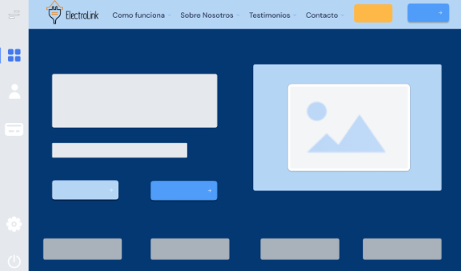

### 4.2. Information Architecture

La arquitectura de información que se implementará en ElectroLink está diseñada para facilitar una experiencia de navegación clara, eficiente y centrada en conectar usuarios con proveedores de servicios y componentes eléctricos. Desde el menú principal, los visitantes podrán acceder rápidamente a categorías clave como "Proveedores", "Servicios", "Asesoramiento", y "Mantenimientos preventivos", lo que les permitirá encontrar con facilidad las soluciones que se ajusten a sus necesidades técnicas o del hogar.
La plataforma contará con un sistema de filtrado inteligente que permitirá a los usuarios buscar proveedores según ubicación, especialización (instalaciones, mantenimiento, venta de componentes), certificaciones legales y valoraciones de otros clientes. Además, ElectroLink ofrecerá un apartado de asesoría técnica, donde los usuarios podrán consultar artículos, guías rápidas y recomendaciones para la gestión segura de instalaciones eléctricas tanto en hogares como en negocios.
Asimismo, cada proveedor tendrá un perfil verificado con información detallada sobre sus servicios, casos anteriores, contacto directo y una sección de opiniones. También se incluirá un sistema de solicitud rápida de cotización, permitiendo a los clientes establecer una comunicación ágil y efectiva. Con esta arquitectura, ElectroLink busca no solo ordenar y categorizar la información de manera accesible, sino también fomentar la confianza, la transparencia y una red de colaboración técnica eficiente, alineada con estándares de seguridad y legalidad en el rubro eléctrico.

#### 4.2.1. Organization Systems

Para representar la estructura de los usuario se han realizado diagramas para la explicación de la funcionalidades de la aplicación y el recorrido del usuario en la misma.

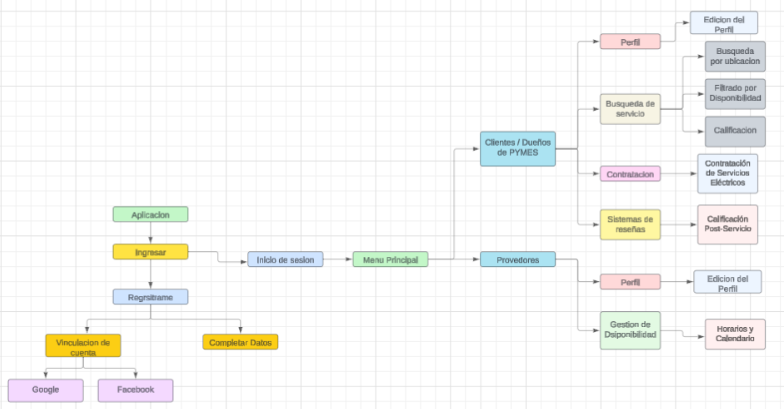

#### 4.2.2. Labeling Systems

| Sección                                     | Etiqueta                        | Descripción                                                                 |
|--------------------------------------------|----------------------------------|-----------------------------------------------------------------------------|
| **Menú de inicio**                          | Inicio                           | Página principal con visión general de la plataforma y acceso rápido a secciones. |
|                                             | Cómo funciona                    | Explicación clara y visual del funcionamiento del sistema paso a paso.     |
|                                             | Testimonios                      | Opiniones y experiencias reales de usuarios satisfechos.                   |
|                                             | Contacto                         | Formulario y canales disponibles para consultas, soporte o sugerencias.    |
|                                             |                                  |                                                                            |
| **Botones de ingreso y salida               | Iniciar Sesión                   | Botón donde los usuarios podrán iniciar sesión con su cuenta.              |
|   de la plataforma**                        | Iniciar Sesión con Google        | Botón que permite a los usuarios iniciar sesión con su cuenta de Google.   |
|                                             | Iniciar Sesión con Facebook      | Botón que permite a los usuarios iniciar sesión con su cuenta de Facebook. |
|                                             | Registrarse                      | Botón donde los usuarios podrán crearse una cuenta en la plataforma.       |
|                                             | Dashboard                        | Botón que dirige a la interfaz del usuario seleccionado.                   |
|                                             | Cerrar Sesión                    | Botón que permite al usuario empezar una conversación con el asistente virtual. |
|                                             |                                  |                                                                            |
| **Sección menú del propietario**            | Historial de servicios           | Visualiza el registro de mantenimientos y reparaciones realizadas.         |
|                                             | Inventario de electrodomésticos  | Consulta la lista de equipos registrados y su consumo energético.          |
|                                             | Buscar proveedores               | Encuentra técnicos y proveedores certificados.                             |
|                                             | Detectar problema                | Analiza factores para identificar fallas o excesos de consumo.             |
|                                             | Monitorear energía               | Seguimiento del consumo eléctrico mensual y estado de componentes.         |
|                                             | Inventario de electrodomésticos (Subir) | Añade nuevos dispositivos con sus características de consumo.       |
|                                             | Suscripción                      | Gestión del plan actual y beneficios exclusivos.                           |
|                                             | Mi perfil                        | Edición de información personal, preferencias y datos de contacto.         |
|                                             |                                  |                                                                            |
| **Menú de proveedores y técnicos**          | Gestión y Agenda de Citas        | Organiza, programa y visualiza citas con clientes.                         |
|                                             | Gestión de Servicios Ofrecidos   | Administra los servicios disponibles y sus detalles.                       |
|                                             | Historial de Servicios           | Registro completo de todos los servicios realizados.                       |
|                                             | Panel de Métricas y Rendimiento  | Estadísticas clave sobre actividad y eficiencia del proveedor.             |
|                                             | Inventario y Catálogo de Productos (En caso aplique) | Gestiona stock y presenta productos disponibles.       |
|                                             | Subscripción                     | Visualiza y gestiona el plan de suscripción y beneficios.                  |
|                                             | Mi Perfil                        | Edita y actualiza la información personal y profesional.                   |

#### 4.2.3. SEO Tags and Meta Tags

**Landing Page Title:** ElectroLink - Tu conexión segura a la electricidad

**Description:** ElectroLink es una plataforma enfocada en conectar a proveedores de componentes o servicios eléctricos con clientes que necesitan asesoramiento o asistencia para realizar mantenimientos preventivos en sus hogares u oficinas.

**Meta Keywords:** seguridad, ahorro eléctrico, mantenimiento, asesoramiento.

**ElectroLink Meta Author:** ElectroLink

**Meta Description:** facilitar la conexión entre clientes que necesitan servicios eléctricos confiables y proveedores calificados.

**Title:** ElectroLink

**Description:** Buscar conectar a dueños de hogares urbanos con proveedores técnicos eléctricos certificados, garantizando servicios seguros y eficientes dentro de los parámetros legales mediante una plataforma intuitiva y fácil de usar.

**Meta Keywords:** seguridad, ahorro eléctrico, mantenimiento, asesoramiento.

**Meta Author:** ElectroLink

#### 4.2.4. Searching Systems

ElectroLink cuenta con un sistema de búsqueda avanzada que permite a los usuarios encontrar servicios y productos eléctricos de forma eficiente, a través de múltiples filtros:

| **Filtro**                         | **Descripción**                                                                                                                                          |
|-----------------------------------|----------------------------------------------------------------------------------------------------------------------------------------------------------|
| **Tipo de Servicio**              | Permite al usuario buscar proveedores en función del tipo de servicio requerido (instalación, mantenimiento preventivo, reparación, auditoría eléctrica, etc.). |
| **Ubicación / Zona**              | Filtro geográfico que ayuda a encontrar proveedores o técnicos disponibles en una zona específica o cercana al domicilio/oficina del usuario.              |
| **Disponibilidad de Agenda**      | Permite filtrar proveedores según fechas y horarios disponibles para programar una cita.                                                                 |
| **Certificación del Proveedor**   | Muestra solo técnicos o empresas que cuentan con certificaciones válidas y actualizadas en el área eléctrica.                                             |
| **Rango de Precio**               | Filtra servicios o productos según el presupuesto disponible del usuario, desde opciones económicas hasta servicios premium.                             |
| **Proveedores con Mejores Reseñas** | Filtro para mostrar técnicos con mayores calificaciones o comentarios positivos según otros usuarios.                                                   |
| **Categoría de Producto Eléctrico** | Ayuda a encontrar productos específicos en el inventario (bombillas, disyuntores, medidores, enchufes, etc.).                                           |
| **Historial de Consumo Energético** | Permite visualizar patrones de consumo eléctrico mensual o anual filtrando por fecha o dispositivos.                                                   |
| **Planes de Suscripción**         | Filtra y compara distintos planes de suscripción según los beneficios ofrecidos (monitoreo, asesoría, prioridad en atención, etc.).                       |

#### 4.2.5. Navigation Systems

Los sistemas de navegación de ElectroLink han sido diseñados para guiar de forma intuitiva a los usuarios a través del Landing Page y la aplicación, facilitando la exploración del contenido y el acceso a las funcionalidades clave. La estructura sigue una lógica clara que permite a cada tipo de usuario (hogar, oficina, proveedor) encontrar rápidamente lo que necesita mediante menús jerárquicos, enlaces destacados y botones de acción visibles.

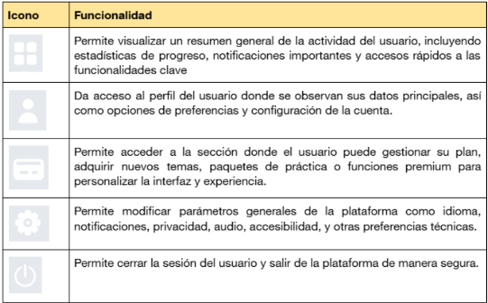

### 4.3. Landing Page UI Design
En esta sección, el equipo de Hampcoders presenta el Diseño de Interfaz de Usuario del sitio web de negocio
### 4.3.1. Landing Page Wireframe.

### Sección "Cómo Funcion?" y "Resolvemos Problemas Reales" 

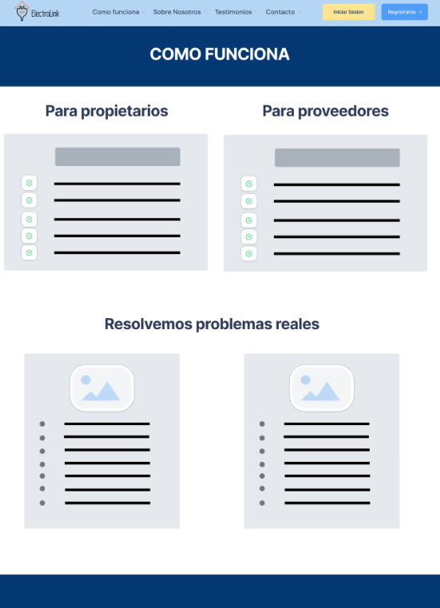

### Sección de "Testimonios" y "Por qué usar Electrolink?" 

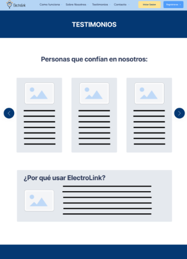

### Sección de "Sobre Nosotros" 

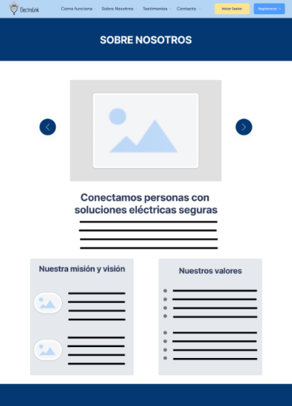

### Sección de "Contacto" 

#### 4.3.2. Landing Page Mock-up

**Sección "Cómo Funcion?" y "Resolvemos Problemas Reales" **

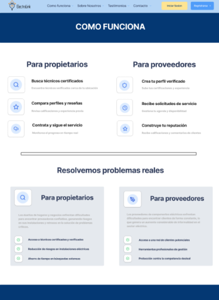

**Sección de "Testimonios" y "Por qué usar Electrolink?" **

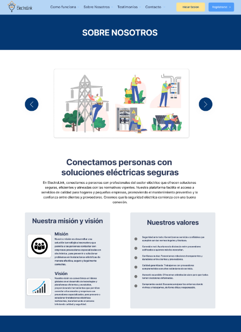

### 4.4. Web Applications UX/UI Design
En esta sección, el equipo de Hampcoders presenta el Diseño de Interfaz de Usuario de la aplicación Front-End

#### 4.4.1. Web Applications Wireframes
En esta sección se presentan los **wireframes de la aplicación web de ElectroLink**, los cuales permiten visualizar cómo será la estructura y disposición de los elementos en la interfaz. Estos bocetos funcionales aseguran una experiencia fluida, clara e inclusiva para los diferentes segmentos de usuarios, como propietarios de hogares, pequeños empresarios y proveedores técnicos, incluyendo además personas con ansiedad social, TEA, o discapacidades físicas.

El propósito de los wireframes es establecer la **estructura base de la aplicación**, mostrando la organización de la información, la navegación y la ubicación de los elementos interactivos sin enfocarse aún en los aspectos visuales finales. Esta etapa es crucial para garantizar una **experiencia de usuario intuitiva y accesible desde el inicio del diseño**.

---

### Elementos clave del diseño

#### Arquitectura de la información

- El contenido y las funciones están organizadas para facilitar el acceso a herramientas como el historial de servicios, monitoreo de consumo energético, o gestión de citas.
- Los wireframes incluyen pantallas clave como:
  - Panel de control del propietario.
  - Dashboard del proveedor técnico.
  - Formulario para solicitar mantenimientos preventivos.
  - Historial de dispositivos y consumo energético.
- Se ha priorizado una **navegación simple y accesible**, permitiendo que usuarios con diversas habilidades puedan moverse con facilidad por la plataforma.

#### Estructura de la interfaz

- Los elementos interactivos (botones, menús, tarjetas de información) están ubicados estratégicamente para que el usuario pueda realizar tareas con pocos clics.
- Las pantallas permiten acceso directo a secciones importantes como:
  - Subir o editar dispositivos eléctricos.
  - Contactar proveedores certificados.
  - Visualizar métricas de rendimiento o consumo.
- Se incluye también una sección de perfil adaptable y configurable, especialmente útil para personas que requieren adaptaciones visuales, físicas o cognitivas.

---

### Principios de diseño aplicados

- **Simplicidad**: Cada interfaz está diseñada para minimizar la carga cognitiva, con estructuras limpias que priorizan las acciones más importantes para el usuario.
- **Consistencia**: Todos los botones, iconos y menús siguen un mismo estilo visual y funcional, lo que reduce el tiempo de aprendizaje para los usuarios.
- **Accesibilidad**: Se aplican principios de diseño inclusivo, incluyendo opciones como:
  - Ajuste del tamaño de texto y botones.
  - Contraste de colores adecuado.
  - Navegación compatible con teclado y lectores de pantalla.
  - Diseño responsive para su uso en laptops, tablets y móviles.

---
Los wireframes son una guía esencial para la implementación efectiva de la plataforma ElectroLink, alineando las necesidades de los usuarios con un diseño funcional, ordenado y accesible para todos.

Vista de Iniciar Sesion

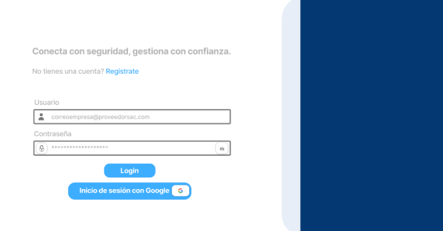

Vista de Crear Cuenta

Vista de la pagina principal

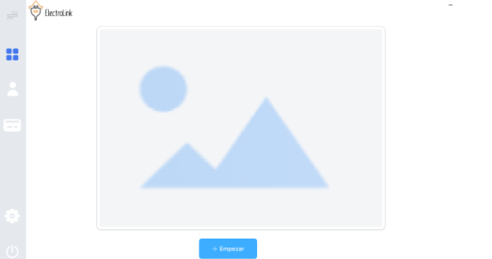

Vista de un dashboard principal para los propietarios de hogar

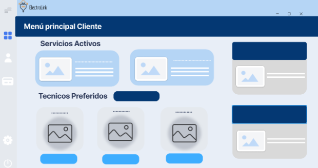

Vista del dashboard principal para los Tecnicos

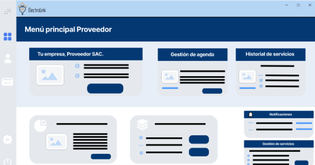

Vista para editar perfil

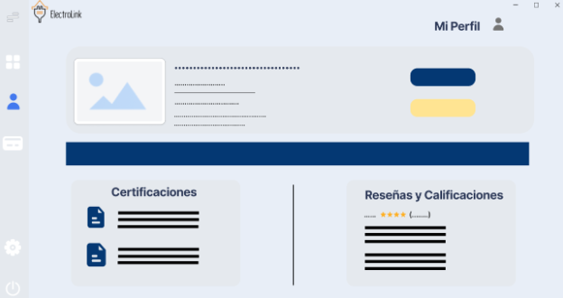

Vista la sección de propiedades
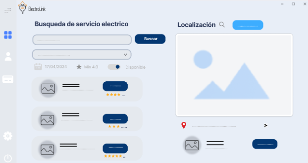

#### 4.4.2. Web Applications Wireflow Diagrams
En esta sección, el equipo de Hampcoders define los wireflows diagrams para la aplicación Web

Wireflow para el Tecnico

Wireflow para el Usuario se registre dentro de la plataforma

Wireflow para el usuario busque tecnicos

[https://lucid.app/lucidchart/9bc93c27-6140-47f1-9cfc-e7c0c5a15134/edit?invitationId=inv_f9a0cb75-977e-4669-a09e-21a42409c64d&page=0_0](https://lucid.app/lucidchart/9bc93c27-6140-47f1-9cfc-e7c0c5a15134/edit?invitationId=inv_f9a0cb75-977e-4669-a09e-21a42409c64d&page=0_0)

#### 4.4.3. Web Applications Mock-ups

Vista de Iniciar Sesion

Vista de Crear Cuenta
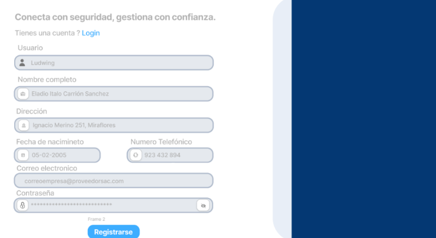

Vista de la pagina principal

Vista de un dashboard del Tecnico
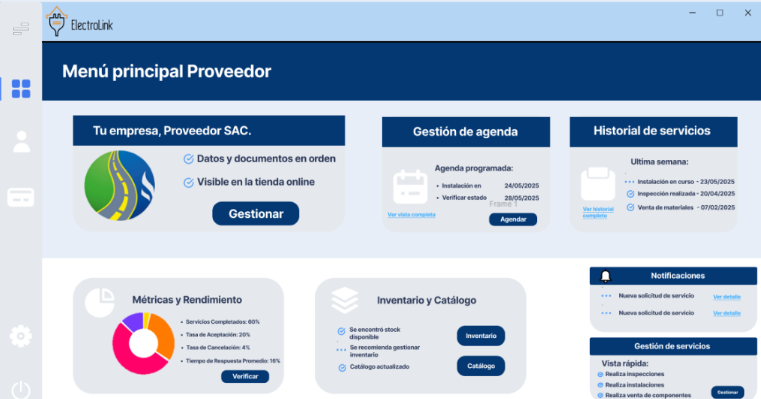

Vista de un dashboard del Dueño de Hogar
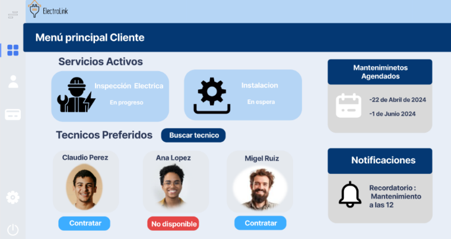

Vista de un dashboard principal para visualizar el perfil de usuario
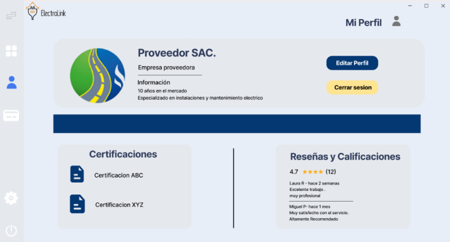

Vista de un dashboard principal para gestionar propiedades
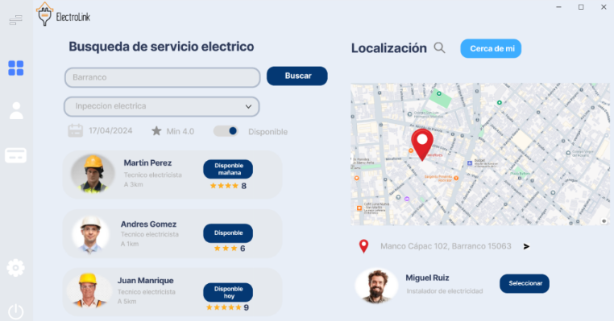

#### 4.4.4. Web Applications User Flow Diagrams

En esta sección se presenta la propuesta de User Flows del sistema ElectroLink, diseñados para representar las rutas de interacción que los usuarios siguen dentro de la plataforma. Cada flujo corresponde a un User Goal específico, basado en los perfiles de User Persona definidos en el alcance del proyecto.

User Flow diagrams para el Usuario se registre dentro de la plataforma

User Flow diagrams para el Usuario acceda desde la pagina principal a la vista de Perfiles 

User flow para que el Usuario acceda a la sección para buscar Tecnicos y registrar propiedades.

[https://lucid.app/lucidchart/b3c387d9-c549-47ed-9031-2a57d09de81d/edit?view_items=AH5fHhdki0z6%2C1N5fesA322AP%2C-J5fOw.O-Rpx%2CSL5fpewO7xdg%2CqN5f9exTX67x%2CoG5f0jAqPIwc%2CMG5fxnk7bkkC%2C7O5f6NsDuFUm%2ChN5fUSXqc-z-%2CVO5fPwNEKRmt%2COO5fvVw-l5A_%2C2O5fZ6zVbKap&invitationId=inv_b529f77f-4538-4351-9514-1d6f0a23a9b3](https://lucid.app/lucidchart/b3c387d9-c549-47ed-9031-2a57d09de81d/edit?view_items=AH5fHhdki0z6%2C1N5fesA322AP%2C-J5fOw.O-Rpx%2CSL5fpewO7xdg%2CqN5f9exTX67x%2CoG5f0jAqPIwc%2CMG5fxnk7bkkC%2C7O5f6NsDuFUm%2ChN5fUSXqc-z-%2CVO5fPwNEKRmt%2COO5fvVw-l5A_%2C2O5fZ6zVbKap&invitationId=inv_b529f77f-4538-4351-9514-1d6f0a23a9b3)  

### 4.5. Web Applications Prototyping

Esta sección presenta los prototipos de interfaz de usuario , los cuales incluyen simulaciones de interacción y navegación. Las decisiones de
interacción se fundamentan en criterios clave, como la facilidad de uso, la accesibilidad y la optimización para distintos dispositivos.

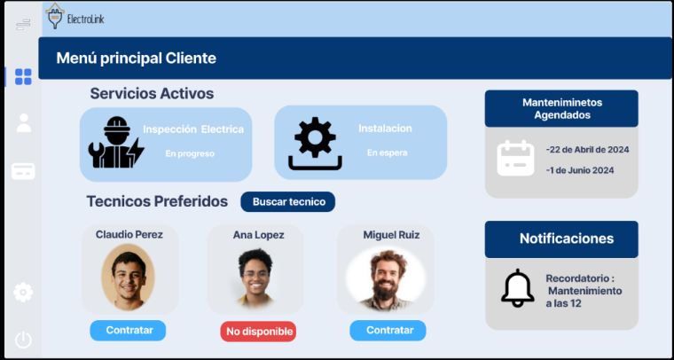

[https://www.figma.com/proto/sU4hpNItE2lZ88WrlTUKwy/Untitled?node-id=31-1288&t=i41XCGeFwgsrPY2X-1](https://www.figma.com/proto/sU4hpNItE2lZ88WrlTUKwy/Untitled?node-id=31-1288&t=i41XCGeFwgsrPY2X-1)

## 4.6. Domain-Driven Software Architecture

### 4.6.1. Software Architecture Context Diagrams
En esta imagen, el equipo define el contexto de Electrolink
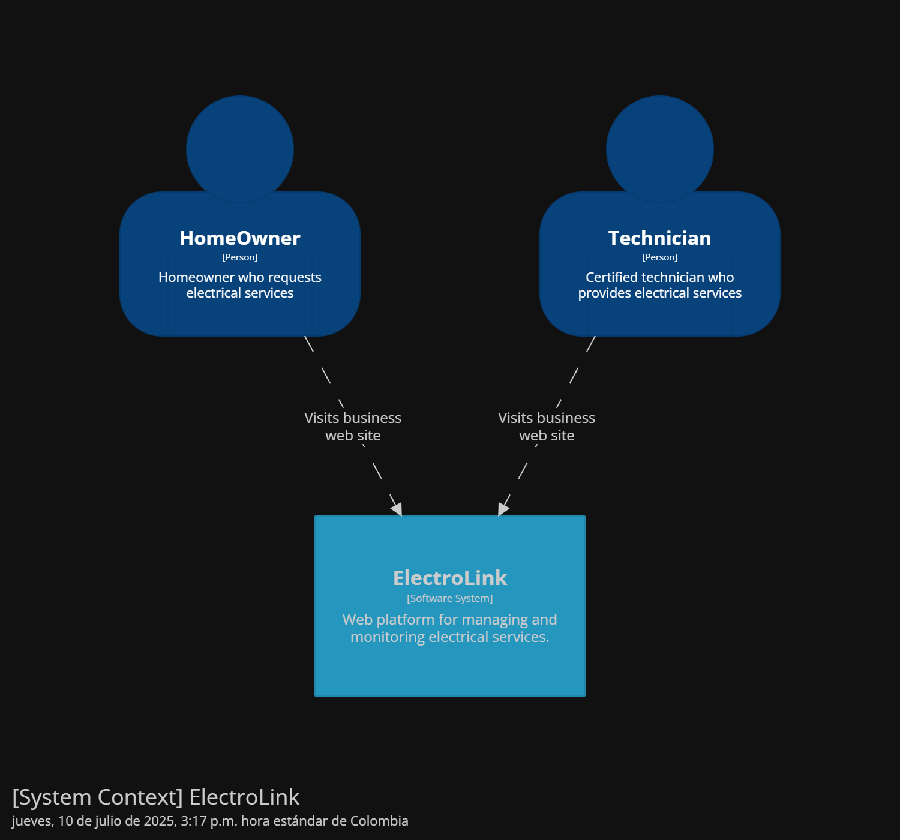

### 4.6.2. Software Architecture Container Diagrams
En esta imagen, el equipo presenta a los contenedores de la solución entera, delimitando las capas de Front-end, Back-end y Base de datos y a la vez incluye el sitio web de negocio y el Single Page Applicacion
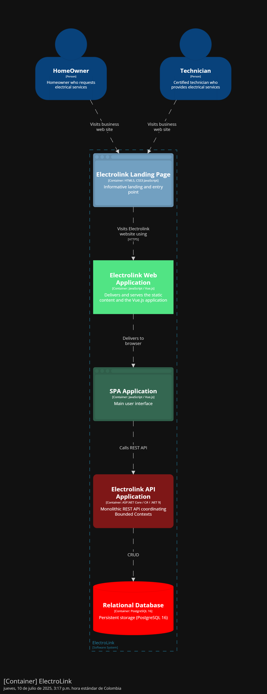

### 4.6.3. Software Architecture Components Diagrams

En esta imagen, el equipo presenta los diferentes Bounded Contexts que interactuan en la aplicación Backend.

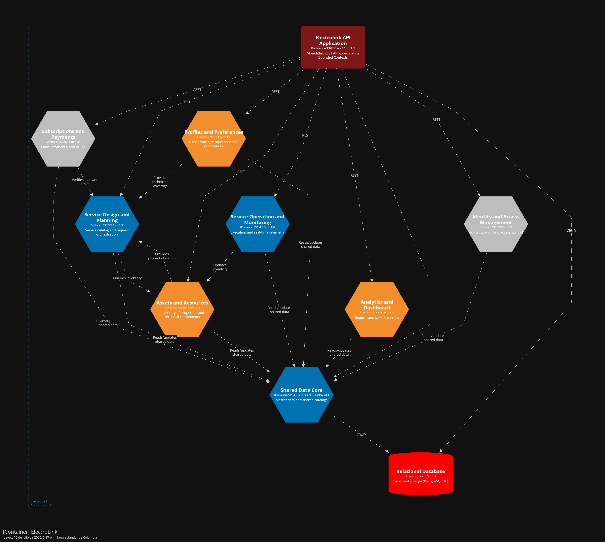

### 4.7. Software Object-Oriented Design

#### 4.7.1. Class Diagrams

#### 4.7.2. Class Dictionary
| Clase | Atributo | Descripción | Tipo de dato |
| :---- | :---- | :---- | :---- |
| User | \-userID | id del usuario |  int |
| User | \-email | email del usuario | String |
| User | \-password | contraseña del usuario | String |
| User | \-phoneNumber | teléfono del usuario | String |
| User | \-firstName | nombre del usuario | String |
| User | \-lastName | apellido del usuario | String |
| User | \-registrationDate | fecha del registro del usuario | DateTime |
| User | \-isVerified | verificación de registro | Boolean |
| User | \-type | tipo de usuario | UserType |
| Provider | \-companyName | nombre de la compañia del proveedor | String |
| Provider | \-taxID | número de identificación fiscal | String |
| Provider | \-businessLicense | licencia de trabajo del proveedor | String |
| Provider | \-certifications | certificaciones del proveedor | List\<Certification\> |
| Provider | \-servicesOffered | servicios ofrecidos | List\<Service\>  |
| Provider | \-availabilitySchedule | horario de disponibilidad | List\<Availability\>  |
| Provider | \-isVerified | verificación de los datos del proveedor | Boolean |
| Provider | \-averageRating | rating promedio del proveedor | Double |
| HomeOwner | \-address | dirección del dueño de hogar | String |
| HomeOwner | \-properties | propiedades del dueño de hogar | List\<Property\> |
| BusinessOwner | \-companyName | nombre de la compañía del dueño PYME | String |
| BusinessOwner |  \-taxID | número de identificación fiscal | String |
| BusinessOwner | \-companyAddress | dirección de la compañía | String |
| BusinessOwner | \-BusinessProperties | propiedades de la compañía | List\<Property\> |
| Administrator | \-adminLevel | nivel de administrador | String |
| Report | \-reportID | id del reporte | int |
| Report | \-reporterID | id del reportante | int |
| Report | \-reportedID | id del reportado | int |
| Report | \-description | descripción del reporte | String |
| Report | \-reportDate | fecha del reporte | DateTime |
| Report | \-evidenceAttachments | evidencias del reporte | List\<String\> |
| Report | \-status | estado del reporte | ReportStatus |
| Report | \-ReportType | tipo del reporte |  ReportType |
| Property | \-propertyID | id de la propiedad | int |
| Property | \-address | dirección de la propiedad | String |
| Property | \-type | tipo de la propiedad | PropertyType  |
| Property | \-squareFootage | el área de la propiedad | int |
| Property | \-components | componentes electricos de la propiedad | List\<ElectricalComponent\> |
| ServiceRequest | \-requestID | id de la solicitud del servicio | int |
| ServiceRequest | \-userID | id del usuario | int |
| ServiceRequest | \-propertyID | id de la propiedad | int |
| ServiceRequest | \-serviceID | id del servicio | int |
| ServiceRequest | \-description | descripción de la solicitud del servicio | String |
| ServiceRequest | \-requestDate | fecha de la solicitud | DateTime |
| ServiceRequest | \-priority | nivel de prioridad de la solicitud | ServicePriority |
| ServiceRequest |  \-status | estado de la solicitud | ServiceRequestStatus |
| Invoice | \-invoiceID | id de la factura | int |
| Invoice | \-bookingID | id de la reserva | int |
| Invoice | \-invoiceNumber | número de la factura | String |
| Invoice | \-issueDate | fecha de emisión | DateTime |
| Invoice |  \-dueDate | fecha de vencimiento | DateTime |
| Invoice |  \-subtotal | subtotal de la factura | double |
| Invoice | \-tax | impuestos cobrados | double |
| Invoice | \-total | total de la factura | double |
| Invoice | \-status | estado de la factura | InvoiceStatus |
| ElectricalComponent | \-componentID | id del componente | int |
| ElectricalComponent | \-name | nombre del componente | String |
| ElectricalComponent | \-model | model del componente | String |
| ElectricalComponent | \-manufacturer | fabricante del componente | String |
| ElectricalComponent |  \-installationDate | fecha de la instalación del componente | DateTime |
| ElectricalComponent | \-lastMaintenanceDate | ultima fecha de mantenimiento del componente | DateTime |
| ElectricalComponent | \-status | estado del componente | ComponentStatus |
| ServiceBooking | \-bookingID | id de la reserva | int |
| ServiceBooking | \-requestID | id de la solicitud | int |
| ServiceBooking |  \-providerID | id del proveedor | int |
| ServiceBooking | \-scheduledDate | fecha establecida para el servicio | DateTime |
| ServiceBooking | \-startTime | hora de inicio del servicio | Time |
| ServiceBooking | endTime | hora de finalización del servicio | Time |
| ServiceBooking | \-finalPrice | precio final del servicio | double |
| ServiceBooking | \-status | estado del servicio | BookingStatus |
| ServiceRecord | \-recordID | id del registro del servicio | int |
| ServiceRecord |  \-bookingID | id de la reserva | int |
| ServiceRecord | \-workDone | trabajo realizado | String |
| ServiceRecord |  \-partsReplaced | partes reemplazadas durante el servicio | List\<String\> |
| ServiceRecord | \-technicalNotes | notas técnicas del servicio  | String |
| ServiceRecord | \-recommendations | recomendaciones del proveedor | List\<String\> |
| ServiceRecord | \-completionDate | fecha de finalización del servicio | DateTime |
| ServiceRecord | \-finalCost | costo final del servicio | double |
| Review | \-reviewID | id de la reseña | int |
| Review |  \-userID | id del usuario | int |
| Review |  \-providerID | id del proveedor | int |
| Review |  \-bookingID | id de la reserva | int |
| Review | \-rating | calificación del servicio | int |
| Review | \-comment | comentarios realizados post-servicio | String |
| Review |  \-reviewDate | flecha del resumen | DateTime |
| Review |  \-photos | fotos realizadas durante el servicio | List\<String\> |
| Payment | \-paymentID | id del pago | int |
| Payment | \-bookingID | id de la reserva | int |
| Payment |  \-amount | monto del pago | double |
| Payment | \-paymentDate | fecha del pago | DateTime |
| Payment | \-method | método del pago | PaymentMethod |
| Payment | \-status | estado del pago | PaymentStatus |
| Payment | \-transactionReference | referencia de la transacción | String |
| Notification | \-notificationID | id de la notificación | int |
| Notification | \-userID | id del usuario | int |
| Notification | \-title | título de la notificación |  String  |
| Notification | \-message | mensaje de la notificación |  String  |
| Notification |  \-sentDate | fecha de envío de la notificación | DateTime |
| Notification | \-isRead | validación de lectura de la notificación | boolean |
| Notification | \-type | tipo de notificación | NotificationType |
| Certification | \-certificationID | id del certificado | int |
| Certification | \-name | nombre del certificado | String |
| Certification | \-issuingOrganization | organización emitora de la certificación | String |
| Certification | \-issueDate | fecha de emisión de la certificación | DateTime |
| Certification | \-expiryDate | fecha de vencimiento de la certificación | DateTime |
| Certification | \-verificationCode | código de verificación de la certificación | String |
| Availability | \-availabilityID | id de la disponibilidad | int |
| Availability | \-day | fecha de la disponibilidad | DayOfWeek |
| Availability |  \-startTime | hora de inicio | Time |
| Availability | \-endTime | hora de finalización | Time |
| Availability | \-isAvailable | verificación de disponibilidad | Boolean |
| Suscription | \-subscriptionID | id de la suscripción | int |
| Suscription |  \-providerID | id del proveedor | int |
|  Suscription |  \-plan | plan de suscripción | SubscriptionPlan  |
| Suscription | \-startDate | fecha de inicio de la suscripción | DateTime |
| Suscription |  \-endDate | fecha de fin de la suscripción | DateTime |
| Suscription | \-billingCycle | ciclo de facturación de la suscripción | PaymentFrequency |
| Suscription | \-autoRenew | verificación de auto recarga del pago | boolean |
| Service | \-serviceID | id del servicio | int |
| Service | \-name | nombre del servicio |  String |
| Service | \-description | descripción del servicio | String |
| Service |  \-basePrice | precio base del servicio | double |
| Service | \-estimatedDuration | duración estimada del servicio | int |
| Service | \-inclusions | lo que incluye el servicio |  List\<String\>  |
| Service | \-category | categoría del servicio | ServiceCategory |
| Widget | \-widgetID | id del widget | int |
| Widget | \-title | título del widget | String |
| Widget | \-type | tipo del widget | WidgetType |
| Widget | \-positionX | posición en x del widget | int |
| Widget | \-positionY | posición en y del widget | int |
| Widget | \-width | anchura del widget | int |
| Widget | \-height | altura del widget | int |
| Widget | \-configuration | configuración del widget | Map\<String, Object\> |
| Dashboard | \-userID | id del usuario | int |
| Dashboard | \-widgets | widgets del dashboard | List\<Widget\> |
| Dashboard |  \-type | tipo de dashboard | DashboardType |
| Favorite | \-favoriteID | id de favoritos | int |
| Favorite | \-userID | id del usuario | int |
| Favorite | \-providerID | id del proveedor | int |
| Favorite | \-addedDate | fecha de inclusión a favoritos | DateTime |
| SupportTicket | \-ticketID | id del ticket | int |
| SupportTicket | \-userID | id del usuario | int |
| SupportTicket |  \-subject | asunto del ticket | String |
| SupportTicket | \-description | descripción del ticket | String |
| SupportTicket | \-submissionDate | fecha de envío del ticket | DateTime |
| SupportTicket | \-priority | prioridad del ticket | TicketPriority |
| SupportTicket |  \-status | estado del ticket | TicketStatus |
| SupportTicket | \-conversation | conversación del soporte | List\<Message\> |
| Message | \-messageID | id del mensaje | int |
| Message |  \-senderID | id del mensajero | int |
| Message | \-receiverID | id del receptor | int |
| Message | \-content | contenido del mensaje | String |
| Message | \-sentDate | fecha de envío del mensaje | DateTime |
| Message | \-isRead | verificación de que ha sido leído | boolean |
| Message |  \-attachments | adjuntos del mensaje |  List\<String\> |

### 4.8. Database Design

#### 4.8.1. Database Diagram

## 5.1. Software Configuration Management

### 5.1.1. Software Development Environment Configuration

**Project Management**

| Plataforma    | Descripción                                                                                                                                                                                                                                                                                           | Enlace                       |
|---------------|------------------------------------------------------------------------------------------------------------------------------------------------------------------------------------------------------------------------------------------------------------------------------------------------------|------------------------------|
| Trello        | Esta plataforma de gestión de proyectos ofrece funcionalidades para el seguimiento detallado del progreso de cada tarea a lo largo de su ciclo de vida, además de permitir la designación clara de responsables para cada actividad dentro del equipo de trabajo.                                      | https://trello.com           |
| Uxpressia     | Herramienta en línea que ayuda en el proceso de mapeo.                                                                                                                                                                                                                                              | https://uxpressia.com/      |
| Canva         | Es una aplicación web de diseño y comunicación visual donde los usuarios pueden diseñar lo que deseen y publicarlo. Cuenta con diversos formatos y estilos de creación para todo tipo de trabajo.                                                                                                    | https://www.canva.com      |
| Vertabelo     | Fundamental para el diseño, la documentación y la gestión de bases de datos relacionales, ya que simplifica el proceso de modelado, fomenta la colaboración y ayuda a garantizar la calidad y la coherencia de la estructura de los datos.                                                        | https://vertabelo.com   |
| Lucidchart    | Sirve como un lienzo visual versátil para representar cualquier tipo de información estructurada o proceso, facilitando la comprensión, la comunicación y la colaboración entre equipos.                                                                                                                | https://www.lucidchart.com/ |
| C4 Model      | Sistema de notación visual para arquitectos de software y equipos de desarrollo que ayuda a describir la arquitectura de un sistema de software en diferentes niveles de abstracción.                                                                                                                    | https://c4model.com            |

**Product UX/UI Desing**

| Plataforma | Descripción                                                                                                                                                                                                                            | Link                                                    |
|------------|----------------------------------------------------------------------------------------------------------------------------------------------------------------------------------------------------------------------------------------|---------------------------------------------------------|
| Figma      | Herramienta para el diseño de productos digitales que fomenta la colaboración, agiliza el flujo de trabajo y permite crear experiencias de usuario efectivas y visualmente atractivas.                                                 | https://www.figma.com |

**Software Development**

| Plataforma           | Descripción                                                                                                                                                                                                                            | Link                                                |
|---------------------|----------------------------------------------------------------------------------------------------------------------------------------------------------------------------------------------------------------------------------------|-----------------------------------------------------|
| HTML                | Sirve para definir la estructura y el contenido de una página web.                                                                                                                                                                      | https://www.w3schools.com/html/default.asp                                      |
| CSS                 | Se encarga de la presentación visual y el estilo de la página web.                                                                                                                                                                       | https://www.w3schools.com/css/default.asp                                       |
| JS                  | Añade interactividad y dinamismo a la página web.                                                                                                                                                                                        | https://www.w3schools.com/js/default.asp                               |
| Visual Studio Code  | Entorno de desarrollo que facilita la escritura, edición, depuración y gestión de código para una amplia gama de lenguajes y proyectos.                                                                                                    | https://code.visualstudio.com          |

**Software Documentation**

| Plataforma | Descripción                                             | Link                                                              |
|------------|---------------------------------------------------------|-------------------------------------------------------------------|
| GitHub     | Gestión de la documentación en función a repositorios y organizaciones | https://github.com          |
| Markdown   | Formato base para la presentación y documentación del proyecto | https://markdown.es/                     |

### 5.1.2. Source Code Management

GitFlow es un modelo de gestión de ramas en Git que facilita el manejo de proyectos grandes mediante la separación en ramas principales y de características. En nuestro proyecto, utilizamos las siguientes ramas:

* **Rama `main`:** Esta rama contiene el código en producción, incluyendo archivos CSS, imágenes, JavaScript y la página principal en HTML. Aseguramos que todo el contenido aquí esté en un estado estable y listo para ser desplegado.

* **Rama `gh-pages`:** Esta rama se utiliza para desplegar y mostrar una versión visualizable del proyecto en GitHub Pages, permitiendo que cualquier persona acceda a la página `index.html` en tiempo real.

Además, contamos con un repositorio separado que organiza nuestras tareas en epics, utilizando archivos `.feature` que describen los criterios de aceptación para cada funcionalidad. Esto nos ayuda a mantener un seguimiento claro del progreso del desarrollo.

Elegimos GitHub como nuestra plataforma de colaboración para facilitar el seguimiento del progreso, la gestión de cambios y la visualización de actualizaciones. Las actualizaciones al código se reflejan automáticamente en `gh-pages`, permitiendo que los interesados vean los avances en tiempo real.

Repositorio: [Ver Repositorio](https://github.com/HampCoders/ElectroLink)

#### 5.1.3. Source Code Style Guide & Conventions

#### 5.1.4. Software Deployment Configuration

### 5.2. Landing Page, Services & Applications Implementation
### 5.2.1. Sprint 1

### 5.2.1.1. Sprint Planning 1

| Sprint # | Sprint 1 |
|----------|----------|
| Date | 2025-22-04 |
| Time | 3:00 PM |
| Location | Virtual - Meet |
| Prepared By | Matias Aliaga |
| Attendees (to planning meeting) | Matias Aliaga , Ivo Machado , Leandro Conteras, Italo Sanchez, Ricardo del Aguila  |
| Sprint n - 1 Review Summary | Este es el primer Sprint, por lo que el presente campo no aplica. |
| Sprint n - 1 Retrospective Summary | Este es el primer Sprint, por lo que el presente campo no aplica. |
| Sprint 1 Goal | Diseñar e implementar la Landing Page oficial de ElectroLink, incluyendo su contenido visual, propuesta de valor, y medios de contacto. El cumplimiento se validará cuando el número de visitas únicas supere las 30 visitas dentro de los primeros 7 días posteriores al despliegue. |
| Sprint 1 Velocity | Nuestro equipo puede aceptar hasta 25 story points |
| Sum of Story Points | La suma de Story Points atendidos es de 25 story points |

#### 5.2.1.2. Sprint Backlog 1

| Sprint # | Sprint 1 |  |  |  |  |  |  |
|---------|---------|---------|---------|---------|---------|---------|---------|
| **User Story** | | **Work-Item/task** | | | | | |
| **ID** | **Title** | **Id** | **Title** | **Description** | **Estimation(Hrs)** | **Assigned To** | **Status** |
| US-41 | Visualziación de una Seccion Principal | T01 | Crear una sección Principal o Hero | Crear una sección donde se muestren un breve resumen de nuestra idea. | 0.5 | Matias Aliaga | Done |
| US-38 | Visualización de Testimonios | T01 | Crear una sección de Testimonios | Crear una sección donde se muestren los testimonios de nuestros clientes. | 0.5 | Ricardo Del Aguila | Done |
| US-40 | Adaptabilidad a Diferentes Dispositivos | T01 | Desarrollar una landing page responsiva| Crear una landing page que se adapte a las pantallas de diversos dispositivos. | 0.5 | Ricardo Del Aguila | Done |
| US-42 | Visualización de Características y Beneficios | T01 | Crear una sección de Caracteristicas y Beneficios | Crear una sección donde se muestren las caracterisitcas y beneficios de nuestra plataforma. | 1 | Eric Olivera | Done |
| US-43 | Navegación sin errores | T01 | Desarrollar Pagina web | Crear una pagina web que permita a posibles usuarios navegar sin problemas de manera intuitiva | 0.5 | Matias Aliaga | Done |
| US-44 | Navegación mediante Encabezado | T01 | Agregar Header | Crear un menu encabezado que permita navegar de manera intuitiva | 0.5 | Matias Aliaga | Done | 0.5 | Ivo Machado | Done |
| US-45 | Visualización del Pie de pagina | T01 | Agregar Footer | Crear un pie de pagina footer que contenga acceso directo a las diferentes secciones | 1 | Ivo Machado | Done |
| US-46 | Ver Información del Startup | T01 | Ver Información del Startup | Agregar una sección para ver información del equipo desarollador | 0.5 | Eric Olivera | Done |
| US-47 | Conocer la Misión de la Startup | T01 | Agregar Mision |  Agregar una sección para conocer la mision de la start up | 1 | Italo Sanchez | Done |
| US-48 | Conocer la Vision de la Startup | T01 | Agregar Vision | Agregar una sección para conocer la vision de la start up | 1 | Italo Sanchez | Done |

#### 5.2.1.3. Development Evidence for Sprint Review
En esta sección presentamos el flujo de trabajo para la creación y actuallización de la landing page

| Repository                       | Branch | Commit ID | Commit Message | Commit Message Body | Committed on (Date) |
|----------------------------------|--------|------------|-----------------|----------------------|----------------------|
| ElectroLink - Open Source - 4341 | main   | 01         | Landing Page    |                      | 22/04/2025           |

#### 5.2.1.4. Testing Suite Evidence for Sprint Review
| Epic / Story ID | Título | Criterios de Aceptación |
|----------------|--------|--------------------------|
| US-41 | Visualización de una Sección Principal | **Escenario:** Visualizar sección Hero al cargar la página **Dado que** soy un visitante de la landing page **Cuando** cargo la página por primera vez **Entonces** debo ver una sección principal (Hero) con un título destacado **Y** un subtítulo que explique brevemente el propósito del servicio **Y** al menos una imagen representativa del producto **Y** un botón de llamada a la acción visible  **Escenario:** Interactuar con el botón de llamada a la acción **Dado que** estoy en la sección principal **Cuando** hago clic en el botón de llamada a la acción **Entonces** debo ser dirigido a la sección de registro o contacto |
| US-38 | Visualización de Testimonios | **Escenario:** Visualizar testimonios de clientes **Dado que** soy un visitante de la landing page **Cuando** navego hasta la sección de testimonios **Entonces** debo ver al menos 3 testimonios de clientes diferentes **Y** cada testimonio debe mostrar el nombre del cliente **Y** cada testimonio debe incluir una foto o avatar del cliente **Y** cada testimonio debe incluir un comentario positivo sobre el servicio  **Escenario:** Navegar entre testimonios **Dado que** estoy en la sección de testimonios **Cuando** hay más de 3 testimonios disponibles **Entonces** debo poder navegar entre ellos usando botones o indicadores |
| US-40 | Adaptabilidad a Diferentes Dispositivos | **Escenario:** Visualizar en dispositivo móvil **Dado que** soy un usuario con un smartphone **Cuando** accedo a la landing page **Entonces** todos los elementos deben reorganizarse para ajustarse a mi pantalla **Y** debo poder ver todo el contenido sin desplazamiento horizontal **Y** todos los botones deben ser lo suficientemente grandes para interactuar con ellos  **Escenario:** Visualizar en tablet **Dado que** soy un usuario con una tablet **Cuando** accedo a la landing page **Entonces** el contenido debe adaptarse al tamaño de mi pantalla **Y** la experiencia de navegación debe ser intuitiva  **Escenario:** Visualizar en ordenador de escritorio **Dado que** soy un usuario con un ordenador **Cuando** accedo a la landing page **Entonces** debo ver una versión optimizada para pantallas grandes **Y** el contenido debe estar organizado de manera que aproveche el espacio disponible |
| US-42 | Visualización de Características y Beneficios | **Escenario:** Ver sección de características **Dado que** soy un visitante interesado en el servicio **Cuando** navego hasta la sección de características y beneficios **Entonces** debo ver al menos 3 características principales del producto **Y** cada característica debe tener un título descriptivo **Y** cada característica debe tener una descripción breve **Y** cada característica debe tener un icono o imagen representativa  **Escenario:** Ver sección de beneficios **Dado que** estoy en la sección de características y beneficios **Cuando** observo la información sobre beneficios **Entonces** debo entender claramente el valor que aporta el servicio **Y** los beneficios deben estar diferenciados visualmente de las características |
| US-43 | Navegación sin errores | **Escenario:** Navegar entre secciones **Dado que** soy un visitante de la landing page **Cuando** hago clic en cualquier enlace de navegación **Entonces** debo ser dirigido a la sección correspondiente sin errores **Y** la transición debe ser suave  **Escenario:** Cargar la página completa **Dado que** soy un nuevo visitante **Cuando** accedo a la URL de la landing page **Entonces** la página debe cargarse completamente en menos de 3 segundos **Y** no debe mostrar mensajes de error **Y** todos los elementos visuales deben cargarse correctamente |
| US-44 | Navegación mediante Encabezado | **Escenario:** Visualizar encabezado en todas las secciones **Dado que** soy un visitante navegando por la landing page **Cuando** me desplazo por las diferentes secciones **Entonces** el encabezado debe permanecer visible (fijo o flotante) **Y** debe contener el logo de la empresa  **Escenario:** Usar menú de navegación **Dado que** estoy en cualquier sección de la landing page **Cuando** hago clic en una opción del menú de navegación en el encabezado **Entonces** debo ser dirigido a la sección correspondiente **Y** debe haber alguna indicación visual de la sección activa en el menú |
| US-45 | Visualización del Pie de página | **Escenario:** Ver información de contacto **Dado que** soy un visitante de la landing page **Cuando** navego hasta el pie de página **Entonces** debo ver información de contacto que incluya email y/o teléfono **Y** debe haber enlaces a redes sociales con iconos reconocibles  **Escenario:** Acceder a secciones desde el pie de página **Dado que** estoy en el pie de página **Cuando** hago clic en un enlace a una sección de la página **Entonces** debo ser dirigido a esa sección correctamente  **Escenario:** Ver información legal **Dado que** estoy en el pie de página **Cuando** busco información legal **Entonces** debo ver al menos un aviso de copyright **Y** enlaces a políticas de privacidad y términos de servicio |
| US-46 | Ver Información del Startup | **Escenario:** Acceder a la sección "Sobre nosotros" **Dado que** soy un visitante interesado en conocer más sobre la empresa **Cuando** navego hasta la sección de información del startup **Entonces** debo ver una descripción breve de la historia o propósito de la empresa **Y** debo ver información sobre el equipo fundador o principales miembros  **Escenario:** Ver detalles del equipo **Dado que** estoy en la sección de información del startup **Cuando** reviso la información del equipo **Entonces** debo ver los nombres y roles de los miembros clave **Y** posiblemente fotos o avatares de los miembros |
| US-47 | Conocer la Misión de la Startup | **Escenario:** Visualizar la misión **Dado que** soy un visitante interesado en los valores de la empresa **Cuando** accedo a la sección de misión **Entonces** debo ver una declaración clara y concisa de la misión de la startup **Y** la misión debe comunicar el propósito fundamental de la empresa **Y** debe ser fácilmente identificable visualmente  **Escenario:** Entender el impacto de la misión **Dado que** estoy leyendo la misión de la startup **Cuando** termino de leerla **Entonces** debo comprender claramente qué problema busca resolver la empresa **Y** cómo busca hacerlo |
| US-48 | Conocer la Visión de la Startup | **Escenario:** Visualizar la visión **Dado que** soy un visitante interesado en el futuro de la empresa **Cuando** accedo a la sección de visión **Entonces** debo ver una declaración clara y concisa de la visión a largo plazo **Y** la visión debe comunicar las aspiraciones futuras de la empresa **Y** debe estar cerca o relacionada visualmente con la sección de misión  **Escenario:** Entender los objetivos a largo plazo **Dado que** estoy leyendo la visión de la startup **Cuando** termino de leerla **Entonces** debo comprender hacia dónde se dirige la empresa en el futuro **Y** qué impacto busca tener en su industria o en la sociedad |

#### 5.2.1.5. Execution Evidence for Sprint Review

En esta entrega, nuestro equipo ha desplegado con éxito la Landing Page de ElectroLink, la cual representa nuestro MVP inicial. Esta página tiene como objetivo presentar de forma clara el valor diferencial de la plataforma, facilitando la conexión entre propietarios de hogares y técnicos eléctricos certificados. Se buscó transmitir confianza, facilidad de uso y una propuesta de valor sólida tanto para clientes como para proveedores.

[https://electrolinklp.netlify.app/](https://electrolinklp.netlify.app/)

### Vistas Implementadas

A continuación, se presentan capturas de las principales secciones desarrolladas en la landing page:

### Sección Principal – Hero & CTA

### Sección "Comu funciona"

### Sección "Resolviendo Problemas Reales"

### Sección "Nuestro Equipo"

### Misión, Visión y Valores

### Testimonios de usuarios

Con esta entrega, hemos cumplido con el objetivo del Sprint, presentando una interfaz funcional, estética y alineada a los valores del proyecto ElectroLink.

#### 5.2.1.6. Services Documentation Evidence for Sprint Review

Para esta entrega no se han empleado APIS, por lo cuál no se he requerido hacer una documentación sobre servicios implementados durante el Sprint.

##### 5.2.1.7. Software Deployment Evidence for Sprint Review

Para este primer Sprint , como equipo logramos implementar satisfactoriamente la primera versión de la landing page.

## Design

Para realizar el diseño de los wireframes y mockups de la **Landing Page** para este Sprint, se hizo uso de la plataforma **Figma**.
Para utilizar la plataforma:

1. Se accede a través de la página oficial de Figma: https://www.figma.com/login
    
2. Luego, se crea un **Draft** que nos servirá como base para el proyecto colaborativo.
   
---

## Deployment

Para la landing page, se utilizará Netlify para el despliegue de la página.

Tras definir el repositorio , conectamos este mismo con el servicio de netlify para realizar el despliegue.

Para nuestro proyecto se crearon **2 repositorios**, los cuáles fue:

- **ElectroLink**: Este repositorio se usa para realizar el informe del proyecto de manera continua. [Repositorio](https://github.com/HampCoders)
- **Landing-Page**: Este reositorio se usa para realizar el despliegue de la Landing Page. [Repositorio](https://github.com/HampCoders/Electrolonk-FE)

#### 5.2.1.8. Team Collaboration Insights during Sprint
A continuación, se muestran las capturas de los insights del repositorio.

En el caso de la landing page y su Sprint, el equipo encargado su diseño y despliegue. Pudiendo evidenciar en estas capturas, su partipación activa durante el desarrollo.

#### 5.2.2. Sprint 2 
En esta sección se registra el avance del producto y las acciones colaborativas realizadas por el equipo durante el desarrollo del Sprint 2.

##### 5.2.2.1. Sprint Planning 2.
Durante la reunión de planificación del Sprint 2, el equipo identificó los objetivos prioritarios en función del alcance general del proyecto. Se establecieron entregables enfocados en mejorar la funcionalidad del sistema y avanzar con la implementación de módulos esenciales. A continuación, se resumen los acuerdos principales:

| **Sprint #** | Sprint 2 |
|--------------|----------|
| **Sprint Planning Background** |  |
| **Date** | 2025-05-12 |
| **Time** | 5:00 PM |
| **Location** | Virtual - Discord |
| **Prepared By** | Ivo Marcelo Machado Bracamonte |
| **Attendees (to planning meeting)** | Ludwing Sanchez Manrique / Ethan Matias Aliaga Aguirre / Leandro Saúl Contreras Lopez / Ivo Marcelo Machado Bracamonte / Ricardo Del Aguila Ayala |
| **Sprint n – 1 Review Summary** | Durante el Sprint anterior, se realizaron correcciones sugeridas por el profesor en el informe del proyecto, y se logró desarrollar la primera versión de la aplicación Front End. Este avance permitió establecer la base del sistema, con un diseño visual inicial y funcionalidades básicas. Aunque algunas pantallas no fueron completadas, el producto resultante fue funcional y bien recibido. |
| **Sprint n – 1 Retrospective Summary** | El equipo expresó satisfacción con el trabajo colaborativo, destacando la mejora en la comunicación interna y la distribución de tareas. Se identificaron oportunidades de mejora en la organización del tiempo y planificación de actividades. Se acordó priorizar la definición clara de objetivos semanales para mejorar la eficiencia del equipo. |
| **Sprint Goal & User Stories** |  |
| **Sprint n Goal** | Validar la estructura visual y la navegación básica del sistema a través de la implementación de al menos tres pantallas funcionales del Front End. Este objetivo se considerará cumplido si los usuarios pueden recorrer el flujo principal sin interrupciones y se recopila retroalimentación positiva sobre la usabilidad. |
| **Sprint n Velocity** | 100% |
| **Sum of Story Points** | 67 Story Points |

##### 5.2.2.2. Aspect Leaders and Collaborators. 

Durante el Sprint 2, se abordaron aspectos clave distribuidos en cuatro Bounded Contexts: Authentication, Profile Management, Service Management y Service Contracting. A fin de garantizar una gestión clara y colaborativa del trabajo, se elaboró la siguiente matriz LACX. En ella se identifica quién asume el rol de líder (L) y quiénes colaboran (C) en cada uno de estos aspectos, asegurando una comunicación efectiva y responsabilidades bien definidas dentro del equipo.

| **Team Member (Last Name, First Name)** | **GitHub Username** | **Authentication** | **Profile Management** | **Service Management** | **Service Contracting** |
|-----------------------------------------|----------------------|---------------------|-------------------------|-------------------------|--------------------------|
| Sánchez Manrique, Ludwing               | ItaloSanche          | L                   | C                       | C                       |                          |
| Aliaga Aguirre, Ethan Matías            | MatFragg             | C                   | L                       |                         | C                        |
| Olivera Barzola , Eric Marlon           | EricMarlon           | C                   | C                       | L                       | C                        |
| Machado Bracamonte, Ivo Marcelo         | ivommb11             | C                   |                         | C                       | L                        |
| Del Aguila Ayala, Ricardo               | Rexest01             |                     | C                       | C                       | C                        |

### 5.2.2.3. Sprint Backlog 2.

Durante este Sprint, el equipo centró sus esfuerzos en el desarrollo de la capa Frontend de la aplicación, estableciendo las bases visuales y funcionales que interactúan directamente con los usuarios. Se priorizó la implementación de componentes clave asociados a cada uno de los bounded contexts asignados individualmente a los integrantes, lo cual permitió una distribución clara de responsabilidades y un avance paralelo de las funcionalidades. Cada miembro del equipo asumió el liderazgo en el desarrollo de un conjunto específico de componentes, asegurando coherencia y continuidad en cada dominio funcional.

Además, como parte del compromiso con la experiencia del usuario, se implementó una nueva versión de la Landing Page, con un enfoque visual renovado. Esta incluye imágenes representativas de los servicios ofrecidos, buscando captar la atención desde el primer contacto y comunicar de manera más efectiva la propuesta de valor de la plataforma. Esta mejora visual no solo fortalece la identidad de marca, sino que también establece una conexión más directa con las necesidades de los usuarios.

Este es nuestro link de invitación a nuestro Trello : [Ver Board del Sprint en Trello](https://trello.com/b/iKXzrJ60/electrolink-aplicaciones-web)

#### Sprint Backlog 2

| User Story ID | User Story                              | Work-Item / Task ID | Work-Item / Task Title                       | Description                                                                 | Estimation (Hours) | Assigned To | Status |
|---------------|------------------------------------------|----------------------|----------------------------------------------|-----------------------------------------------------------------------------|---------------------|--------------|--------|
| US11          | Conocer más a fondo los servicios que ofrecen | T11-1         | Agregar imagenes acerca de los servicios que ofrecemos | 1 | Matias Aliaga | done |
| US31          | Crear Registro de Consumo Eléctrico | T31-1         | Diseñar formulario de ingreso | Diseñar formulario de ingreso de nuevo registro de consumo | 1 | Ricardo Del Aguila | done |
| US31          | Crear Registro de Consumo Eléctrico | T31-2         | Implementar validaciones | Implementar validaciones de campos del formulario (valores numéricos, fechas, etc.) | 1 | Ricardo Del Aguila | done |
| US31          | Crear Registro de Consumo Eléctrico | T31-3             | Crear endpoint backend | Crear endpoint en backend para almacenar nuevos registros | 1.5 |  Ricardo Del Aguila   | done |
| US31          | Crear Registro de Consumo Eléctrico | T31-5             | Implementar confirmación | Implementar mensaje de confirmación tras registro exitoso | 0.5 | Ricardo Del Aguila   | done |
| US32          | Editar Registro de Consumo Eléctrico | T32-1             | Diseñar interfaz de selección | Diseñar interfaz para seleccionar registros existentes | 0.5 | Ricardo Del Aguila  | done |
| US32          | Editar Registro de Consumo Eléctrico | T32-2             | Implementar formulario de edición | Implementar formulario de edición con datos precargados | 1 | Ricardo Del Aguila  | done |
| US32          | Editar Registro de Consumo Eléctrico | T32-3             | Crear endpoint de actualización | Crear endpoint en backend para actualizar registros | 1 | Ricardo Del Aguila  | done |
| US32          | Editar Registro de Consumo Eléctrico | T32-4             | Añadir validaciones | Añadir validaciones para cambios en los datos | 0.5 | Ricardo Del Aguila  | done |
| US32          | Editar Registro de Consumo Eléctrico | T32-5                   | Implementar confirmación | Implementar confirmación de modificaciones | 0.5 | Ricardo Del Aguila  | done |
| US33          | Eliminar Registro de Consumo Eléctrico | T33-1                 | Diseñar interfaz de selección | Diseñar interfaz para visualizar y seleccionar registros a eliminar | 0.5 | Ricardo Del Aguila  | done |
| US33          | Eliminar Registro de Consumo Eléctrico | T33-2                 | Implementar diálogo de confirmación | Implementar diálogo de confirmación antes de eliminar | 0.5 | Ricardo Del Aguila  | done |
| US33          | Eliminar Registro de Consumo Eléctrico | T33-3                 | Crear endpoint de eliminación | Crear endpoint en backend para eliminación de registros | 1 |Ricardo Del Aguila | done |
| US37          | Búsqueda por Ubicación y Tipo de Servicio | TS0371               | Desarrollo del formulario de búsqueda         | Implementación de campos para ingresar ubicación y tipo de servicio         | 1                   | Italo Sanchez     | done   |
| US37          | Búsqueda por Ubicación y Tipo de Servicio | TS0372               | Lógica de filtrado por parámetros             | Programación de lógica para mostrar resultados según filtros definidos      | 1                   | Italo Sanchez       | done   |
| US37          | Búsqueda por Ubicación y Tipo de Servicio | TS0373               | Estructura de vista de resultados             | Creación de componente visual para mostrar lista de técnicos                | 0.5                 | Italo  Sanchez      | done   |
| US38          | Búsqueda Geolocalizada                   | TS0381               | Captura de ubicación a partir de IP pública   | Consumo de API externa para obtener datos geográficos de la IP              | 1                   | Italo   Sanchez     | done   |
| US38          | Búsqueda Geolocalizada                   | TS0382               | Visualización de ubicación en mapa            | Integración del mapa con coordenadas detectadas mediante Leaflet            | 1                   | Italo   Sanchez     | done   |
| US38          | Búsqueda Geolocalizada                   | TS0383               | Renderizado de datos geográficos              | Despliegue en pantalla de país, región y ciudad obtenidos desde la IP       | 0.5                 | Italo   Sanchez     | done   |
| US39          | Filtrado por Disponibilidad y Calificación | TS0391               | Lógica de filtro por disponibilidad horaria   | Programación de condiciones para disponibilidad en la vista de resultados   | 0.5                 | Italo  Sanchez      | done   |
| US39          | Filtrado por Disponibilidad y Calificación | TS0392               | Renderizado de calificación promedio          | Mostrar visualmente la calificación de cada técnico                         | 0.5                 | Italo Sanchez       | done   |
| US53          | Gestión de Agenda y Citas                | TS0531               | Visualización de agenda                      | Mostrar lista de tareas agendadas con detalles del cliente y servicio      | 1.5                 | Ivo Machado      | done   |
| US53          | Gestión de Agenda y Citas                | TS0532               | Crear tarea                                  | Formulario para agendar nueva cita con fecha, cliente y servicio           | 1.5                 | Ivo Machado          | done   |
| US53          | Gestión de Agenda y Citas                | TS0533               | Editar tarea                                 | Lógica y formulario para actualizar una cita existente                     | 1.5                 | Ivo Machado        | done   |
| US53          | Gestión de Agenda y Citas                | TS0534               | Eliminar tarea                               | Botón y lógica para eliminar cita de la agenda                             | 0.5                 | Ivo  Machado        | done   |
| US54          | Gestión de Servicios Ofrecidos           | TS0541               | Visualización del catálogo de servicios      | Mostrar lista de servicios y componentes eléctricos asociados              | 1.5                 | Martias Aliaga        | done   |
| US55          | Crear Servicios Ofrecidos           | TS04551               | Crear servicio                               | Formulario con inclusiones y componentes eléctricos                        | 1.5                 | Martias Aliaga          | done   |
| US56          | Editar Servicios Ofrecidos           | TS04561               | Editar servicio                              | Actualizar servicio y sus componentes                                       | 1.5                 | Martias Aliaga          | done   |
| US57          | Eliminar Servicios Ofrecidos           | TS0571               | Eliminar servicio                            | Lógica para borrar servicio del inventario                                 | 0.5                 | Martias Aliaga         | done   |
| US43          | Historial de Clientes Atendidos          | TS0431               | Card de historial en dashboard               | Mostrar historial de clientes atendidos como resumen en el dashboard       | 0.5                 | Martias Aliaga          | done   |
| US44          | Sistema de Calificación Post-Servicio    | TS0441               | Desarrollo del formulario de calificación     | Implementación de formulario para ingresar calificación y comentario        | 1.5                 | Eric Olivera       | done   |
| US44          | Sistema de Calificación Post-Servicio    | TS0442               | Lógica de envío de calificación y reseña      | Programación de lógica para registrar y almacenar la reseña en la base de datos | 2               | Eric Olivera       | done   |
| US44          | Sistema de Calificación Post-Servicio    | TS0443               | Asociación de reseña con usuario y servicio   | Establecer relaciones entre usuarios, servicios y sus respectivas calificaciones | 1.5             | Eric  Olivera     | done   |
| US45          | Visualización de Calificaciones y Reseñas | TS0451               | Renderizado de calificaciones y comentarios   | Mostrar lista de reseñas y calificaciones en la vista del técnico o servicio | 1.5               | Eric  Olivera      | done   |
| US45          | Visualización de Calificaciones y Reseñas | TS0452               | Cálculo de promedio de calificaciones         | Lógica para calcular y mostrar promedio de puntuación por técnico o servicio | 1.5               | Eric  Olivera      | done   |

#### 5.2.2.4. Development Evidence for Sprint Review.

## Development Evidence for Sprint Review

Durante el Sprint se avanzó en la implementación de los siguientes productos: Landing Page, Aplicaciones Web y Servicios Web. A continuación se presenta la evidencia de desarrollo mediante commits registrados en los repositorios utilizados durante este periodo. La tabla incluye el nombre del repositorio, rama de trabajo, identificador del commit, mensaje del commit, descripción detallada del cambio y la fecha en que se realizó.

| Repository                                | Branch | Commit ID | Commit Message                                 | Commit Message Body                                         | Committed on  |
|-------------------------------------------|--------|-----------|-----------------------------------------------|-------------------------------------------------------------|---------------|
| HampCoders/ElectroLink-FE                 | feature/inventory-service-component | 501de14   | All Bounded Contexts Implemented | All Bounded Contexts Implemented     | 2025-05-15    |
| HampCoders/ElectroLink-FE                 | feature/register-technician | 381b443 | Technician registration component |Service Contracting Bounded Context  | 2025-05-15    |
| HampCoders/ElectroLink-FE                 | feature/reviews |  a56c1fa|    Review management component |  Add Bounded Context Hiring Reviews                  | 2025-05-15    |
| HampCoders/ElectroLink-FE                 | feature/invoices | fbeaf70 | Updated Invoices Management Component| Agregar reviews del Contracting Bounded Context             | 2025-05-15   |
| HampCoders/ElectroLink-FE                 | feature/schedule-management | u67287gdf | Components service management|    All Bounded Contexts Implemented    | 2025-05-15   |

#### 5.2.2.5. Execution Evidence for Sprint Review. 

Durante este Sprint, el equipo logró implementar exitosamente las principales vistas del frontend de la aplicación ElectroLink, priorizando una experiencia de usuario fluida, intuitiva y visualmente coherente con el diseño propuesto. Se completó la estructura de navegación entre módulos clave, así como la visualización de datos simulados y el despliegue de componentes funcionales para cada uno de los bounded contexts asignados.

El enfoque colaborativo permitió que cada integrante trabajara de forma autónoma y coordinada en su respectivo contexto funcional, asegurando así una integración efectiva de los distintos componentes en la interfaz final. Como evidencia del progreso, a continuación se presentan capturas de pantalla de las vistas más representativas desarrolladas durante este Sprint, 

Se observa la seccion donde un usario puede agregar nuevos servicios y poner reseñas segun si ya tuvo el servicio como eliminar y actualizar la reseña 

Esta vista representa la interfaz del módulo de revisión de servicios, con despliegue de tarjetas, botones funcionales y lógica de navegación implementada.

Se presenta la interfaz donde los usuarios pueden registrar o visualizar la ubicación del servicio eléctrico requerido, con componentes de mapa o inputs geográficos integrados.

Captura del formulario donde un proveedor eléctrico puede registrar su información, incluyendo campos validados y flujo funcional desde el frontend.

Demostración de nuevos componentes visuales y dinámicos incorporados al sistema durante este Sprint, con diseño coherente y adaptado a la lógica de negocio.

Esta vista permite al usuario revisar los detalles de una factura asociada a un mantenimiento eléctrico, mostrando información clave como monto, servicio asociado y fecha.

Evidencia del consumo exitoso del endpoint /request-invoices, validando la funcionalidad de listado de facturas en la API.

Visualización del endpoint correspondiente al módulo de técnicos/proveedores eléctricos. Se comprueba el despliegue de datos simulados de forma correcta.

Captura del endpoint de servicios eléctricos disponibles, mostrando respuesta esperada con campos como nombre, descripción, precio y creador del servicio.

#### 5.2.2.6. Services Documentation Evidence for Sprint Review. 

En el segundo sprint identificamos 20 endpoints provenientes de 5 controladores diferentes. Utilizamos swagger para la presente documentacion

### Technicians Controller

| Verbo HTTP | Endpoint                         | Summary                        | Request Body | Parámetros   |
|------------|----------------------------------|--------------------------------|--------------|--------------|
| GET        | /api/v1/technicians              | Obtener todos los técnicos     | No           | -            |
| GET        | /api/v1/technicians/{id}         | Obtener técnico por ID         | No           | id           |
| POST       | /api/v1/technicians              | Crear nuevo técnico            | Sí           | -            |
| PUT        | /api/v1/technicians/{id}         | Actualizar datos de técnico    | Sí           | id           |
| DELETE     | /api/v1/technicians/{id}         | Eliminar técnico               | No           | id           |

### Clients Controller

| Verbo HTTP | Endpoint                         | Summary                        | Request Body | Parámetros   |
|------------|----------------------------------|--------------------------------|--------------|--------------|
| GET        | /api/v1/clients                  | Obtener todos los clientes     | No           | -            |
| GET        | /api/v1/clients/{id}             | Obtener cliente por ID         | No           | id           |
| POST       | /api/v1/clients                  | Registrar nuevo cliente        | Sí           | -            |
| PUT        | /api/v1/clients/{id}             | Actualizar cliente             | Sí           | id           |
| DELETE     | /api/v1/clients/{id}             | Eliminar cliente               | No           | id           |

### Services Controller

| Verbo HTTP | Endpoint                         | Summary                             | Request Body | Parámetros   |
|------------|----------------------------------|-------------------------------------|--------------|--------------|
| GET        | /api/v1/services                 | Listar todos los servicios          | No           | -            |
| GET        | /api/v1/services/{id}            | Obtener servicio por ID             | No           | id           |
| POST       | /api/v1/services                 | Crear nuevo servicio                | Sí           | -            |
| PUT        | /api/v1/services/{id}            | Actualizar datos del servicio       | Sí           | id           |
| DELETE     | /api/v1/services/{id}            | Eliminar servicio                   | No           | id           |

### Reviews Controller

| Verbo HTTP | Endpoint                                 | Summary                             | Request Body | Parámetros   |
|------------|------------------------------------------|-------------------------------------|--------------|--------------|
| GET        | /api/v1/technicians/{id}/reviews         | Obtener reseñas del técnico         | No           | id           |
| POST       | /api/v1/technicians/{id}/reviews         | Crear nueva reseña                  | Sí           | id           |
| DELETE     | /api/v1/reviews/{reviewId}               | Eliminar reseña                     | No           | reviewId     |

### Electrical Invoice Controller

| Verbo HTTP | Endpoint                                      | Summary                                           | Request Body | Parámetros   |
|------------|-----------------------------------------------|---------------------------------------------------|--------------|--------------|
| GET        | /api/v1/invoice/electrical-invoice/           | Obtener últimos registros creados                 | No           | -            |
| GET        | /api/v1/invoice/electrical-invoice/:id        | Obtener una factura por ID                        | No           | id           |
| POST       | /api/v1/invoice/electrical-invoice/           | Crear una nueva factura eléctrica                 | Sí           | -            |
| PUT        | /api/v1/invoice/electrical-invoice/:id        | Reemplazar completamente la factura existente     | Sí           | id           |
| PATCH      | /api/v1/invoice/electrical-invoice/:id        | Modificar parcialmente una factura existente      | Sí           | id           |
| DELETE     | /api/v1/invoice/electrical-invoice/:id        | Eliminar una factura por ID                       | No           | id           |

#### 5.2.2.7. Software Deployment Evidence for Sprint Review. 

### Despliegue de la Aplicación con Firebase y Beceptor

Durante el Sprint, se llevó a cabo el despliegue exitoso del frontend de la aplicación **ElectroLink** utilizando **Firebase Hosting**. Asimismo, se integró la herramienta **Beceptor** para simular endpoints de prueba y monitorear peticiones HTTP en el entorno de desarrollo, facilitando la validación del comportamiento del sistema sin necesidad de un backend completamente funcional.

A continuación, se presentan las evidencias visuales del proceso:

#### 1. Configuración de Webhook con Beceptor

Se muestra la consola de Beceptor donde se han configurado los endpoints para interceptar las peticiones del frontend, permitiendo pruebas controladas y revisión de payloads.

#### 2. Despliegue en Firebase Hosting

Evidencia del despliegue de la aplicación web en Firebase, con confirmación del build exitoso y acceso en línea al entorno productivo de pruebas.

#### 3. Visualización del endpoint interceptado

Aquí se visualiza la respuesta capturada por Beceptor, demostrando que el sistema frontend está enviando correctamente los datos al endpoint configurado.

### Enlace de la aplicación desplegada

[https://electrolink-front.web.app/home](https://electrolink-front.web.app/home)

Este enlace permite acceder a la versión desplegada de ElectroLink, donde se puede explorar la interfaz y la navegación funcional implementada hasta el momento.

##### 5.2.2.8. Team Collaboration Insights during Sprint. 

En esta sección se presenta el desarrollo colaborativo del equipo en la implementación del Sprint, mostrando analíticos de participación y commits.

#### 1. Contribuciones por usuario y actividad semanal
La imagen muestra que todos los integrantes del equipo realizaron al menos un commit durante el periodo del 3 al 10 de mayo de 2025. Se evidencia una distribución equitativa de aportes por parte de todos los miembros. Esto refleja un trabajo coordinado y activo durante esta semana clave de desarrollo.

#### 2. Evolución diaria de commits
En esta visualización se observa el ritmo de trabajo diario del equipo. El mayor pico de actividad se registró el viernes, con 3 commits, seguido de un avance inicial el jueves. Esta distribución muestra una intensificación del trabajo hacia el cierre de la semana, lo que concuerda con la cercanía a la fecha límite del Sprint.

#### 3. Pull Requests y autores involucrados
Durante la semana del 8 al 15 de mayo de 2025, se realizaron 3 Pull Requests que fueron aceptados e integrados exitosamente. Participaron 4 autores, con un total de 13 commits. La colaboración se dio sin conflictos y se destaca el enfoque en funcionalidades como: carga de archivos, actualización de secciones de factura y el componente de registro de técnicos.

### 5.2.3. Sprint 3
En esta sección se registra el avance del producto y las acciones colaborativas realizadas por el equipo durante el desarrollo del Sprint 2.

#### 5.2.3.1.Spring Planning 3.
Durante la reunión de planificación del Sprint 3, el equipo identificó los objetivos prioritarios en función del alcance general del proyecto. Se establecieron entregables enfocados en mejorar la funcionalidad de la plataforma y avanzar con la implementación de módulos esenciales. A continuación, se resumen los acuerdos principales:

| **Sprint #** | Sprint 3 |
|--------------|----------|
| **Sprint Planning Background** |  |
| **Date** | 2025-06-05 |
| **Time** | 4:00 PM |
| **Location** | Virtual - Discord |
| **Prepared By** | Ethan Matias Aliaga Aguirre |
| **Attendees (to planning meeting)** | Ludwing Sanchez Manrique / Ethan Matias Aliaga Aguirre / Eric Olivera Barzola / Ivo Marcelo Machado Bracamonte / Ricardo Del Aguila Ayala |
| **Sprint n–3 Review Summary** | Durante el Sprint anterior, se realizaron ajustes estructurales sugeridos por el profesor en la arquitectura del backend. Se implementaron con éxito múltiples endpoints RESTful, cubriendo los módulos principales como solicitudes, servicios, reportes y calificaciones. Esto permitió establecer una base sólida para la lógica del negocio y la persistencia de datos. Aunque algunos endpoints avanzados y validaciones específicas quedaron pendientes, el backend resultante fue estable, funcional y bien recibido en la revisión. |
| **Sprint n–3 Retrospective Summary** | El equipo manifestó satisfacción con el trabajo backend logrado, destacando la mejora en la integración de servicios y la claridad en la división de responsabilidades. Se identificaron áreas de mejora en la gestión del tiempo al implementar controladores complejos. Se acordó priorizar la documentación de endpoints y pruebas de integración, así como reforzar la planificación técnica por capas (servicios, entidades, controladores) para optimizar el desarrollo en los siguientes sprints. |
| **Sprint Goal & User Stories** |  |
| **Sprint n Goal** | Nuestro enfoque es en implementar un conjunto de funcionalidades clave como la Administración de Propiedades y Componentes, el Control de Inventario del Técnico,  el Flujo de Solicitud de Servicios, la Configuración de Agenda y Cobertura, con sus interfaces de calendario y mapa junto a los endpoints que guardan la información, la Administración del Catálogo de Servicios, el Manejo de Suscripciones Premium y finalmente el Seguimiento y Calificación de Servicios, con las interfaces de visualización y los endpoints que proveen el estado del servicio y registran las calificaciones, implementando las interfaces de usuario para nuestra aplicación Frontend como sus servicios y lógica de negocio a través del API. Creemos que esto entrega a los propietarios de PyMEs la capacidad de solicitar servicios eléctricos de manera eficiente, y a los técnicos las herramientas para ofrecer sus servicios de forma estructurada, gestionando su inventario, horarios y zona de cobertura. Esto se confirmará cuando un ciclo de servicio completo pueda ser demostrado de principio a fin. Específicamente, cuando los propietarios puedan registrar sus propiedades, completar el flujo de contratación de un servicio a través del wizard, suscribirse a un plan premium, recibir la notificación de asignación de un técnico, y finalmente calificar el servicio una vez completado. Del mismo modo, se confirmará cuando los técnicos puedan configurar su catálogo de servicios y precios, establecer sus horarios y zonas de cobertura, gestionar el inventario de sus componentes, y visualizar en su agenda los servicios que les han sido asignados.|
| **Sprint n Velocity** | 100% |
| **Sum of Story Points** | 233 Story Points |

#### 5.2.3.2. Aspect Leaders and Collaborators.

Durante este sprint, la asignación de responsabilidades técnicas se mantuvo por bounded contexts. Cada miembro asumió un rol activo en la implementación de endpoints REST y lógica de dominio. Se fortaleció la colaboración entre integrantes para asegurar la integración fluida entre componentes y la consistencia en las reglas de negocio.

| **Team Member (Last Name, First Name)** | **GitHub Username** | **Assets and Resource Management Bounded Context** | **Services Desing and Planning Management Bounded Context** | **Service Contracting Bounded Context** | **Analytics Bounded Context** |
|-----------------------------------------|---------------------|-------------------------------------------|---------------------------------------------------|-------------------------|--------------------------|
| Sánchez Manrique, Ludwing               | ItaloSanche         |                                           | C                                                 |                         |                          |
| Aliaga Aguirre, Ethan Matías            | MatFragg            | L                                         |                                                   |                         | C                        |
| Olivera Barzola , Eric Marlon           | EricMarlon          | C                                         |                                                   |                         | L                        |
| Machado Bracamonte, Ivo Marcelo         | ivommb11            |                                           | L                                                 |                         |                          |
| Del Aguila Ayala, Ricardo               | Rexest01            |                                           |                                                   | L                       | C                        |

#### 5.2.3.3.Sprint Backlog 3.

Durante este Sprint, el equipo enfocó sus esfuerzos en el desarrollo de la capa Backend de la aplicación, implementando la lógica de negocio y los servicios necesarios para dar soporte funcional a cada uno de los bounded contexts. Se priorizó la creación de entidades, controladores, servicios y repositorios en base a una arquitectura por capas y principios de diseño orientado a dominios. Cada integrante asumió la implementación del backend correspondiente a su bounded context asignado, permitiendo un desarrollo distribuido y coherente. Esta fase ha sido clave para establecer la base de comunicación entre el frontend y la lógica del sistema, asegurando la persistencia de datos y el correcto flujo de la información.

Este es nuestro link de invitación a nuestro Trello : [Ver Board del Sprint en Trello](https://trello.com/b/pPESu5NU/sprint-backlog-3)

| Sprint # | Sprint 3 | | | | | | |
|----------|----------|---|---|---|---|---|---|
| **User Story** | | **Work-Item/task** | | | | | |
| **ID** | **Title** | **Id** | **Title** | **Description** | **Estimation(Hrs)** | **Assigned To** | **Status** |
| **TS-13** | Conectar a Base de Datos | T001 | Configurar conexión PostgreSQL | Configurar pool de conexiones, variables de entorno y migración inicial | 4 | Ricardo  | Done |
| | | T002 | Implementar modelos de datos principales | Crear entidades: User, Property, Component, Service, Technician | 6 |Ricardo |Done |
| | | T003 | Configurar repositorios y DAOs | Implementar patrones de acceso a datos con transacciones | 4 |Ricardo |Done |
| | | T004 | Setup de testing con BD | Configurar base de datos de testing y fixtures | 2 |Ricardo | Done|
| **US-31** | Crear Componente Eléctrico | T001 | Backend: API crear componente | Endpoint POST /components con validaciones y persistencia | 3 | Ethan | Done|
| | | T002 | Frontend: Formulario componente | Componente React con validación de formularios | 4 |Ethan | Done |
| | | T003 | Frontend: Integración API | Conectar formulario con endpoint, manejo de errores | 2 | Ethan| Done|
| **US-32** | Editar Componente Eléctrico | T001 | Backend: API editar componente | Endpoint PUT /components/:id con validaciones | 2 | Ethan| Done |
| | | T002 | Frontend: Modal de edición | Componente modal con formulario prellenado | 3 |Ethan | Done |
| | | T003 | Frontend: Actualización en tiempo real | Actualizar lista tras edición exitosa | 2 |Ethan| Done|
| **US-33** | Eliminar Componente Eléctrico | T001 | Backend: API eliminar componente | Endpoint DELETE /components/:id con validaciones de dependencias | 2 | Ethan|Done |
| | | T002 | Frontend: Confirmación de eliminación | Modal de confirmación con advertencias | 2 |Ethan | Done|
| | | T003 | Frontend: Actualización de UI | Remover elemento de lista tras eliminación | 1 |Ethan | Done|
| **US-34** | Registro de Propiedad (Propietario) | T001 | Backend: API crear propiedad | Endpoint POST /properties con validación de dirección | 4 |Ethan|Done |
| | | T002 | Frontend: Formulario registro propiedad | Componente con campos de dirección y validación | 5 | Ethan| Done|
| | | T003 | Frontend: Integración geolocalización | Integrar Google Maps API para validar dirección | 3 |Ethan |Done |
| **US-35** | Edición de Información de Propiedad | T001 | Backend: API actualizar propiedad | Endpoint PUT /properties/:id con validaciones | 3 |Ethan |Done |
| | | T002 | Frontend: Formulario de edición | Componente de edición con datos prellenados | 4 |Ethan |Done |
| | | T003 | Frontend: Validación de cambios | Detectar cambios y confirmar actualización | 2 |Ethan | Done|
| **US-36** | Eliminación de Propiedad | T001 | Backend: API eliminar propiedad | Endpoint DELETE /properties/:id con validación de servicios activos | 3 | Ethan| Done|
| | | T002 | Frontend: Confirmación múltiple | Modal con advertencias sobre servicios asociados | 3 |Ethan |Done |
| | | T003 | Frontend: Actualización de estado | Actualizar dashboard tras eliminación | 1 |Ethan |Done |
| **US-37** | Registro de Inventario de Componentes | T001 | Backend: API inventario técnico | Endpoint POST /technicians/:id/inventory | 3 | Ethan| Done|
| | | T002 | Frontend: Gestión de inventario | Interfaz para agregar componentes al inventario | 4 | Ethan| Done|
| | | T003 | Frontend: Búsqueda de componentes | Funcionalidad de búsqueda y filtrado | 3 | Ethan| Done|
| **US-38** | Actualización de Stock de Componentes | T001 | Backend: API actualizar stock | Endpoint PUT /inventory/:id/stock con validaciones | 2 |Ethan |Done |
| | | T002 | Frontend: Interfaz actualización stock | Componente para modificar cantidades | 3 | Ethan| Done|
| | | T003 | Frontend: Notificaciones de cambio | Mostrar confirmaciones y errores | 2 |Ethan |Done |
| **US-39** | Configuración de Alertas de Stock Mínimo | T001 | Backend: Sistema de alertas | Lógica para detectar stock bajo y enviar notificaciones | 3 |Ethan | Done|
| | | T002 | Frontend: Configuración de umbrales | Interfaz para establecer límites mínimos | 3 |Ethan | Done |
| | | T003 | Frontend: Panel de alertas | Dashboard con alertas de stock activas | 2 |Ethan | Done |
| **US-40** | Contratación de Servicios Eléctricos mediante Wizard | T001 | Backend: API wizard servicio | Endpoint para manejar flujo paso a paso | 4 | Ivo | Done |
| | | T002 | Frontend: Componente wizard | Wizard multi-paso con navegación | 5 | Ivo | Done |
| | | T003 | Frontend: Validación por pasos | Validar datos en cada paso del wizard | 3 | Ivo |Done |
| **US-41** | Selección de Propiedad | T001 | Backend: API propiedades usuario | Endpoint GET /users/:id/properties | 2 |Ivo |Done |
| | | T002 | Frontend: Selector de propiedades | Componente dropdown con propiedades del usuario | 3 |Ivo |Done |
| | | T003 | Frontend: Vista previa propiedad | Mostrar detalles de propiedad seleccionada | 2 | Ivo| Done|
| **US-42** | Carga Manual de Datos de Recibos Eléctricos (3-6 recibos) | T001 | Backend: Recibir los recibos electricos  | Implementar la logica de negocio para recibir los recibos electriclos | 2 | Ivo | Done|
| | | T002 | FrontEnd: Input Field para ingregar data de recibos electricos | Desarrollar el campo para ingresar la data de los recibos electricos | 1 |Ivo | Done|
| **US-43** | Descripción Detallada del Problema | T001 | Frontend: Editor de descripción | Componente de texto enriquecido con validación | 3 | Ivo| Done |
| | | T002 | Backend: Sanitizar información | Sanitizar la información que es enviada en este campo | 2 |Ivo | Done|
| **US-44** | Selección de Servicio del Catálogo | T001 | Backend: API catálogo servicios | Endpoint GET /services con filtros por zona | 3 |Ivo |Done |
| | | T002 | Frontend: Catálogo de servicios | Interfaz de selección con precios y descripciones | 4 | Ivo|Done |
| | | T003 | Frontend: Filtros de búsqueda | Filtros por categoría, precio y disponibilidad | 3 | Ivo| Done|
| **US-45** | Cancelación de Servicios Programados | T001 | Backend: API cancelar servicio | Endpoint PUT /services/:id/cancel con lógica de reembolso | 3 |Ivo | Done|
| | | T002 | Frontend: Botón de cancelación | Funcionalidad de cancelación con confirmación | 2 |Ivo | Done|
| **US-46** | Notificación de Asignación de Técnico | T001 | Backend: Sistema de notificaciones | Servicio para enviar notificaciones push/email | 4 | Ivo|Done |
| | | T00.2 | Frontend: Panel de notificaciones | Componente para mostrar notificaciones en tiempo real | 3 |Ivo |Done|
| | | T003 | Frontend: Detalles de asignación | Vista con información del técnico asignado | 2 |Ivo | Done|
| **US-47** | Historial de servicios contratados | T001 | Backend: API historial servicios | Endpoint GET /users/:id/services con paginación | 2 |Ivo |Done |
| | | T002 | Frontend: Lista de servicios | Componente con historial paginado y filtros | 3 |Ivo | Done|
| | | T003 | Frontend: Detalles de servicio | Modal con información completa del servicio | 2 | Ivo|Done |
| **US-48** | Configurar Horarios de Trabajo Semanales | T001 | Backend: API horarios técnico | Endpoint POST /technicians/:id/schedule | 3 |Ivo |Done |
| | | T002 | Frontend: Calendario de configuración | Interfaz de calendario para establecer horarios | 4 |Ivo | Done|
| | | T003 | Frontend: Validación de horarios | Validar solapamientos y horarios válidos | 2 | Ivo|Done |
| **US-49** | Modificar Horarios de Trabajo | T001 | Backend: API actualizar horarios | Endpoint PUT /technicians/:id/schedule | 2 |Ivo | Done|
| | | T002 | Frontend: Edición de horarios | Interfaz para modificar horarios existentes | 3 |Ivo |Done |
| | | T003 | Frontend: Confirmación de cambios | Validar impacto en servicios programados | 2 |Ivo |Done |
| **US-50** | Bloquear Fechas y Horarios | T001 | Backend: API bloquear fechas | Endpoint POST /technicians/:id/blocked-dates | 2 | Ivo|Done |
| | | T002 | Frontend: Selector de fechas bloqueadas | Componente calendario para seleccionar fechas | 3 |Ivo | Done|
| | | T003 | Frontend: Gestión de bloqueos | Lista de fechas bloqueadas con opción de desbloquear | 2 | Ivo|Done |
| **US-51** | Visualizar Agenda Asignada | T001 | Backend: API agenda técnico | Endpoint GET /technicians/:id/agenda | 3 |Ivo |Done |
| | | T002 | Frontend: Vista de calendario | Componente calendario con servicios asignados | 4 | Ivo|Done |
| | | T003 | Frontend: Detalles de citas | Modal con información completa de cada servicio | 2 |Ivo |Done |
| **US-52** | Configurar Tiempo de Traslado | T001 | Backend: API tiempo traslado | Endpoint PUT /technicians/:id/travel-time | 2 |Ivo | Done|
| | | T002 | Frontend: Configuración traslado | Interfaz para establecer tiempos de traslado por zona | 3 |Ivo | Done|
| | | T003 | Frontend: Cálculo automático | Mostrar impacto en disponibilidad de horarios | 2 |Ivo |Done |
| **US-53** | Crear Servicios con Recetas | T001 | Backend: API crear servicio | Endpoint POST /services con recetas de componentes | 5 |Ivo |Done |
| | | T002 | Frontend: Constructor de recetas | Interfaz para definir componentes necesarios | 5 | Ivo|Done |
| | | T003 | Frontend: Calculadora de costos | Calcular precio basado en componentes y tiempo | 3 |Ivo |Done|
| **US-54** | Modificar Servicios / Recetas | T001 | Backend: API actualizar servicio | Endpoint PUT /services/:id con validación de cambios | 3 | Ivo|Done |
| | | T002 | Frontend: Editor de servicios | Interfaz para modificar servicios existentes | 4 | Ivo| Done|
| | | T003 | Frontend: Impacto de cambios | Mostrar servicios afectados por modificaciones | 2 | Ivo| Done|
| **US-55** | Eliminar Servicios del Catálogo | T001 | Backend: API eliminar servicio | Endpoint DELETE /services/:id con validaciones | 2 |Ivo | Done|
| | | T002 | Frontend: Confirmación eliminación | Modal con advertencia sobre servicios activos | 2 |Ivo | |
| **US-56** | Establecer Precios por Servicio y Zona | T001 | Backend: API precios zonales | Endpoint POST /services/:id/zone-pricing | 3 | Ivo| Done|
| | | T002 | Frontend: Configurador de precios | Interfaz para establecer precios por zona | 4 |Ivo |Done |
| | | T003 | Frontend: Vista previa de precios | Mostrar matriz de precios por zona | 2 |Ivo |Done |
| **US-29** | Configuración de Zona de Cobertura Geográfica | T001 | Backend: API zonas de cobertura | Endpoint POST /technicians/:id/coverage-zones | 3 |Ivo | Done|
| | | T002 | Frontend: Mapa de cobertura | Integración con mapas para definir zonas | 4 |Ivo |Done |
| | | T003 | Frontend: Gestión de zonas | Lista y edición de zonas de cobertura | 2 |Ivo | Done|
| **US-57** | Beneficio de Solicitud Prioritaria | T001 | Backend: Lógica de priorización | Sistema para priorizar solicitudes premium | 3 | Ivo| Done|
| | | T002 | Frontend: Indicador de prioridad | Mostrar beneficios de solicitud prioritaria | 2 | Ivo|Done |
| | | T003 | Frontend: Cola de solicitudes | Vista diferenciada para solicitudes prioritarias | 2 | Ivo|Done |
| **US-58** | Notificación de Límite de Solicitudes Alcanzado | T001 | Backend: Contador de solicitudes | Lógica para rastrear límite de solicitudes mensuales | 3 |Ivo |Done |
| | | T002 | Frontend: Notificación de límite | Mostrar advertencia cuando se acerque al límite | 2 |Ivo |Done |
| | | T003 | Frontend: Opción de upgrade | Botón para actualizar a plan premium | 2 |Ivo |Done |
| **US-59** | Seguimiento de Estados en Tiempo Real | T001 | Backend: Endpoint GET /services/{id}/status | Desarrollar un endpoint simple que devuelva el estado actual de un servicio. Será utilizado por el frontend para consultas periódicas (polling). | 4 | Ricardo | Done|
| | | T002 | Frontend: Componente de seguimiento | Interfaz con estados actualizados en tiempo real | 3 | Ricardo| Done|
| | | T003 | Frontend: Notificaciones push | Sistema de notificaciones push para cambios | 2 |Ricardo |Done |
| **US-60** | Registro Fotográfico Antes/Después | T001 | Backend: API subida de imágenes | Endpoint para subir y gestionar imágenes del servicio | 3 |Ricardo | Done|
| | | T002 | Frontend: Cámara/galería | Componente para tomar fotos o seleccionar de galería | 4 | Ricardo| Done|
| | | T003 | Frontend: Comparador de imágenes | Interfaz para mostrar antes/después lado a lado | 2 |Ricardo |Done |
| **US-61** | Generación de Reportes Técnicos | T001 | Backend: Generador de reportes | Servicio para generar reportes PDF del servicio | 4 |Ricardo |Done |
| | | T002 | Frontend: Formulario de reporte | Interfaz para completar información técnica | 3 |Ricardo | Done|
| | | T003 | Frontend: Vista previa PDF | Mostrar preview del reporte antes de enviar | 2 | Ricardo|Done |
| **US-62** | Actualización Automática de Inventario | T001 | Backend: Lógica de descuento automático | Sistema para descontar componentes tras servicio | 4 |Ricardo |Done |
| | | T002 | Frontend: Notificación de cambios | Mostrar cambios en inventario tras servicio | 2 |Ricardo | Done|
| | | T003 | Frontend: Log de movimientos | Historial de movimientos de inventario | 2 |Ricardo | Done|
| **US-64** | Sistema de Calificación Post-Servicio | T001 | Backend: API de evaluaciones | Endpoint POST /services/:id/rating | 3 | Ricardo|Done |
| | | T002 | Frontend: Formulario de calificación | Interfaz de rating con estrellas y comentarios | 3 | Ricardo|Done |
| | | T003 | Frontend: Recordatorio de evaluación | Notificación para evaluar servicio completado | 2 |Ricardo |Done |
| **US-65** | Visualizar Calificaciones y Reseñas | T001 | Backend: API obtener calificaciones | Endpoint GET /technicians/:id/ratings | 2 |Ricardo | Done|
| | | T002 | Frontend: Perfil del técnico | Mostrar promedio y reseñas en perfil | 3 |Ricardo |Done |
| | | T003 | Frontend: Filtros de reseñas | Filtrar reseñas por puntuación y fecha | 2 | Ricardo|Done|
| **US-66** | Retroalimentación directa de servicios | T001 | Backend: API de feedback | Endpoint POST /services/:id/feedback | 2 | Ricardo| Done|
| | | T002 | Frontend: Formulario de feedback | Interfaz para enviar comentarios adicionales | 3 | Ricardo|Done |
| **TS-01** | Registrar Propiedad (Endpoint) | T001 | Implementar endpoint POST /properties | Crear endpoint con validaciones de negocio | 4 |Italo | Done|
| **TS-02** | Obtener Propiedades por Propietario | T001 | Implementar endpoint GET /users/:id/properties | Endpoint con filtros y paginación | 3 |Italo | Done|
| **TS-03** | Crear Componente (Endpoint) | T001 | Implementar endpoint POST /components | Crear componente con validaciones | 4 |Italo |Done |
| | | T002 | Validaciones de negocio componentes | Validar unicidad, formato y reglas de negocio | 2 |Italo |Done |
| **TS-04** | Actualizar Stock de Componente | T001 | Implementar endpoint PUT /inventory/:id/stock | Actualizar stock con control de concurrencia | 3 |Italo |Done |
| **TS-05** | Crear Servicio de Técnico | T001 | Implementar endpoint POST /services | Crear servicio con recetas de componentes | 4 |Italo | Done|
| | | T002 | Validación de recetas | Validar componentes disponibles y precios | 2 | Italo|Done |
| **TS-06** | Obtener Servicios por Zona | T001 | Implementar endpoint GET /services | Filtrar servicios por zona geográfica | 4 |Italo |Done |
| | | T002 | Optimización de consultas geográficas | Índices y optimizaciones para búsqueda por zona | 2 |Italo |Done|
| **TS-07** | Iniciar Flujo de Solicitud | T001 | Implementar endpoint POST /service-requests | Crear solicitud con validaciones | 5 |Italo | Done|
| | | T002 | Lógica de validación de disponibilidad | Verificar disponibilidad de técnicos y componentes | 4 |Italo |Done |
| **TS-08** | Enviar Solicitud de Servicio | T001 | Implementar endpoint PUT /service-requests/:id/submit | Confirmar y enviar solicitud | 3 |Italo | Done|
| | | T002 | Integración con sistema de notificaciones | Notificar a técnicos disponibles | 3 |Italo | Done|
| **TS-09** | Asignar Técnico Automáticamente | T001 | Algoritmo de asignación automática | Lógica para asignar técnico óptimo | 6 | Italo| Done|
| | | T002 | Factores de asignación | Considerar distancia, disponibilidad, rating | 3 |Italo|Done|
| **TS-10** | Actualización Automática de Stock | T001 | Servicio de actualización automática | Descontar stock tras completar servicio | 4 |Italo Done|
| | | T002 | Manejo de stock insuficiente | Lógica para manejar falta de componentes | 2 |Italo |Done |
| **TS-11** | Enviar Evaluación de Servicio | T001 | Implementar endpoint POST /evaluations | Guardar evaluación con validaciones | 3 |Italo | Done|
| | | T002 | Actualización de rating del técnico | Recalcular promedio de calificaciones | 3 |Italo |Done |
| **TS-12** | Obtener Evaluaciones por Técnico | T001 | Implementar endpoint GET /technicians/:id/evaluations | Obtener evaluaciones con paginación | 3 |Italo | Done|
| **TS-14** | Listener Webhook de Stripe | T001 | Implementar webhook handler | Procesar eventos de Stripe de forma segura | 5 | Italo|Done |
| | | T002 | Manejo de eventos de suscripción | Procesar creación, actualización y cancelación | 4 |Italo |Done |
| **TS-15** | Reinicio Mensual de Contador | T001 | Job de reinicio mensual | Cron job para resetear contadores de solicitudes | 3 |Italo |Done |
| **TS-16** | Sesión de Portal de Stripe | T001 | Implementar endpoint portal Stripe | Crear sesión para gestionar suscripción | 4 |Italo |Done |
| | | T002 | Configuración de portal | Configurar opciones disponibles en portal | 2 | Italo|Done |

#### 5.2.3.4.Development Evidence for Sprint Review.

| Repository                                | Branch | Commit ID | Commit Message                                 | Commit Message Body                                         | Committed on  |
|-------------------------------------------|--------|-----------|-----------------------------------------------|-------------------------------------------------------------|---------------|
| HampCoders/Electrolink-Backend | HEAD -> main, origin/main, origin/HEAD | ff88fe7 | Merge pull request #6 from HampCoders/feature/ServiceDesignAndPlanning-bc | Implementing ServiceDesignAndPlanning Bounded Context | Sat Jun 21 17:37:59 2025 -0500 |
| HampCoders/Electrolink-Backend | origin/feature/ServiceDesignAndPlanning-bc | ef68b22 | Implementing ServiceDesignAndPlanning Bounded Context |  | Sat Jun 21 17:37:07 2025 -0500 |
| HampCoders/Electrolink-Backend |  | 0defeab | Merge pull request #4 from HampCoders/feature/ServiceOperations-BC | SOM Backend Implementation | Sat Jun 21 17:02:13 2025 -0500 |
| HampCoders/Electrolink-Backend | origin/feature/ServiceOperations-BC | 4b88ae2 | Implementación inicial de ServiceOperations bounded context |  | Sat Jun 21 17:01:27 2025 -0500 |
| HampCoders/Electrolink-Backend | origin/feature/Analytics-bounded-context | 3400e28 | feature: Add Analitics Bounded Context |  | Sat Jun 21 03:05:22 2025 -0500 |
| HampCoders/Electrolink-Backend |  | 450356b | Merge pull request #3 from HampCoders/feature/Analytics-bounded-context | Merge pull request #2 from HampCoders/main | Sat Jun 21 02:07:40 2025 -0500 |
| HampCoders/Electrolink-Backend |  | 6ba24ae | Merge pull request #2 from HampCoders/main | Merge main to feature Analitycs | Sat Jun 21 02:06:01 2025 -0500 |
| HampCoders/Electrolink-Backend |  | 2a7ae64 | Merge branch 'develop' |  | Thu Jun 19 13:12:44 2025 -0500 |
:
| HampCoders/Electrolink-Backend | HEAD -> main, origin/main, origin/HEAD | ff88fe7 | Merge pull request #6 from HampCoders/feature/ServiceDesignAndPlanning-bc | Implementing ServiceDesignAndPlanning Bounded Context | Sat Jun 21 17:37:59 2025 -0500 |
| HampCoders/Electrolink-Backend | origin/feature/ServiceDesignAndPlanning-bc | ef68b22 | Implementing ServiceDesignAndPlanning Bounded Context |  | Sat Jun 21 17:37:07 2025 -0500 |
| HampCoders/Electrolink-Backend |  | 0defeab | Merge pull request #4 from HampCoders/feature/ServiceOperations-BC | SOM Backend Implementation | Sat Jun 21 17:02:13 2025 -0500 |
| HampCoders/Electrolink-Backend | origin/feature/ServiceOperations-BC | 4b88ae2 | Implementación inicial de ServiceOperations bounded context |  | Sat Jun 21 17:01:27 2025 -0500 |
| HampCoders/Electrolink-Backend | origin/feature/Analytics-bounded-context | 3400e28 | feature: Add Analitics Bounded Context |  | Sat Jun 21 03:05:22 2025 -0500 |
| HampCoders/Electrolink-Backend |  | 450356b | Merge pull request #3 from HampCoders/feature/Analytics-bounded-context | Merge pull request #2 from HampCoders/main | Sat Jun 21 02:07:40 2025 -0500 |
| HampCoders/Electrolink-Backend |  | 6ba24ae | Merge pull request #2 from HampCoders/main | Merge main to feature Analitycs | Sat Jun 21 02:06:01 2025 -0500 |
| HampCoders/Electrolink-Backend |  | 2a7ae64 | Merge branch 'develop' |  | Thu Jun 19 13:12:44 2025 -0500 |

#### 5.2.3.5.Execution Evidence for Sprint Review.

#### Imagen 1 – Swagger Ratings y Reports
Muestra el conjunto de endpoints RESTful de los módulos Ratings y Reports, documentados automáticamente mediante Swagger. Incluye operaciones para agregar, obtener, actualizar y eliminar valoraciones o reportes, así como la posibilidad de asociar fotos a los reportes.

#### Imagen 2 – Swagger Reports y ServiceOperations

Continúa la documentación Swagger enfocada en Reports y ServiceOperations. En este último módulo se evidencia la creación de operaciones de servicio, la actualización de su estado y la recuperación del historial técnico por technicianId.

#### Imagen 3 – Swagger Requests, Schedules y Services
Se observa el conjunto de endpoints para los módulos Requests, Schedules y Services, que permite manipular solicitudes de servicios, programaciones de técnicos y el catálogo de servicios registrados.

#### Imagen 4 – Swagger Profiles, Authentication y Users

Ilustra la API para la gestión de perfiles (Profiles), autenticación (Authentication) y usuarios (Users). Destaca la posibilidad de registrar perfiles sin autenticación previa y recuperar perfiles por ID, rol o correo.

#### Imagen 5– Swagger Components y ComponentTypes
Incluye los endpoints relacionados a los componentes técnicos (Components) y sus tipos (ComponentTypes), fundamentales para la gestión de inventarios. Permite operaciones CRUD completas sobre ambos recursos.

#### Imagen 6 –  Swagger Properties, TechnicianInventories y Plan
Finalmente, se presenta la documentación de Properties (propiedades de los clientes), TechnicianInventories (inventario técnico) y Plan (planes de suscripción), evidenciando la integración de múltiples bounded contexts del sistema.

#### Imagen 7 – Swagger Subscriptions

#Se realizó el despliegue del BackEnd en Render

[Despliegue en Rendert](https://electrolink-backend.onrender.com/)

### 5.2.3.6.Services Documentation Evidence for Sprint Review.

#### 5.2.3.6. Services Documentation Evidence for Sprint Review

| Método | Endpoint | Descripción |
|--------|----------|-------------|
| **POST** | `/api/v1/catalog/types` | Crear tipo de componente |
| **GET** | `/api/v1/catalog/types` | Obtener todos los tipos de componentes |
| **GET** | `/api/v1/catalog/types/{typeId}` | Obtener tipo de componente por ID |
| **PUT** | `/api/v1/catalog/types/{typeId}` | Actualizar tipo de componente por ID |
| **DELETE** | `/api/v1/catalog/types/{typeId}` | Eliminar tipo de componente por ID |
| **POST** | `/api/v1/catalog/components` | Crear componente |
| **GET** | `/api/v1/catalog/components` | Obtener todos los componentes |
| **PUT** | `/api/v1/catalog/components/{componentId}` | Actualizar componente por ID |
| **DELETE** | `/api/v1/catalog/components/{componentId}` | Eliminar componente por ID |

---

### Technician Inventory

| Método | Endpoint | Descripción |
|--------|----------|-------------|
| **POST** | `/api/v1/technicians/{technicianId}/inventory` | Crear inventario de técnico |
| **GET** | `/api/v1/technicians/{technicianId}/inventory` | Obtener inventario de técnico |
| **POST** | `/api/v1/technicians/{technicianId}/inventory/stock-items` | Agregar ítem al stock |
| **PUT** | `/api/v1/technicians/{technicianId}/inventory/{componentId}` | Actualizar componente del inventario |
| **DELETE** | `/api/v1/technicians/{technicianId}/inventory/{componentId}` | Eliminar componente del inventario |

---

### Properties

| Método | Endpoint | Descripción |
|--------|----------|-------------|
| **GET** | `/api/v1/owners/{ownerId}/properties` | Obtener propiedades de un propietario |
| **POST** | `/api/v1/owners/{ownerId}/properties` | Crear propiedad |
| **GET** | `/api/v1/owners/{ownerId}/properties/{propertyId}` | Obtener propiedad por ID |
| **PUT** | `/api/v1/owners/{ownerId}/properties/{propertyId}` | Actualizar propiedad |
| **PUT** | `/api/v1/owners/{ownerId}/properties/{propertyId}/photo` | Actualizar foto |
| **PUT** | `/api/v1/owners/{ownerId}/properties/{propertyId}/address` | Actualizar dirección |
| **DELETE** | `/api/v1/owners/{ownerId}/properties/{propertyId}` | Eliminar propiedad |

---

### Technicians

| Método | Endpoint | Descripción |
|--------|----------|-------------|
| **GET** | `/api/v1/technicians/{technicianId}` | Obtener técnico por ID |
| **POST** | `/api/v1/technicians` | Crear técnico |
| **GET** | `/api/v1/technicians` | Obtener todas las categorías |
| **GET** | `/api/v1/technicians/{technicianId}/works` | Obtener trabajos por técnico |

---

### Works

| Método | Endpoint | Descripción |
|--------|----------|-------------|
| **GET** | `/api/v1/works/{workId}` | Obtener trabajo por ID |
| **POST** | `/api/v1/works` | Crear nuevo trabajo |
| **GET** | `/api/v1/works` | Obtener todos los trabajos |
| **POST** | `/api/v1/works/{workId}/image` | Agregar imagen a un trabajo |

---

### Ratings

| Método | Endpoint | Descripción |
|--------|----------|-------------|
| **POST** | `/api/v1/ratings/{id}/rating` | Crear calificación |
| **GET** | `/api/v1/ratings/{id}/rating` | Obtener calificación por ID |
| **GET** | `/api/v1/ratings/technician/{technicianId}/ratings` | Obtener calificaciones por técnico |
| **DELETE** | `/api/v1/ratings/{id}` | Eliminar calificación |
| **PUT** | `/api/v1/ratings/{id}` | Actualizar calificación |
| **GET** | `/api/v1/ratings` | Obtener todas las calificaciones |

---

### Reports

| Método | Endpoint | Descripción |
|--------|----------|-------------|
| **POST** | `/api/v1/reports/{id}/report` | Crear reporte |
| **GET** | `/api/v1/reports/{id}` | Obtener reporte por ID |
| **DELETE** | `/api/v1/reports/{id}` | Eliminar reporte |
| **POST** | `/api/v1/reports/{id}/photo` | Agregar foto al reporte |
| **GET** | `/api/v1/reports` | Obtener todos los reportes |

---

### Service Operations

| Método | Endpoint | Descripción |
|--------|----------|-------------|
| **POST** | `/api/v1/service-operations` | Crear operación de servicio |
| **GET** | `/api/v1/service-operations` | Obtener todas las operaciones |
| **PUT** | `/api/v1/service-operations/{id}/status` | Actualizar estado de la operación |
| **GET** | `/api/v1/service-operations/{id}/status` | Obtener estado de la operación |
| **GET** | `/api/v1/service-operations/technician/{technicianId}/history` | Obtener historial del técnico |

---

### Requests

| Método | Endpoint | Descripción |
|--------|----------|-------------|
| **GET** | `/api/v1/requests/{requestId}` | Obtener solicitud por ID |
| **PUT** | `/api/v1/requests/{requestId}` | Actualizar una solicitud |
| **DELETE** | `/api/v1/requests/{requestId}` | Eliminar una solicitud |
| **GET** | `/api/v1/requests/client/{clientId}` | Obtener solicitudes por cliente |
| **POST** | `/api/v1/requests` | Crear nueva solicitud |

---

### Schedules

| Método | Endpoint | Descripción |
|--------|----------|-------------|
| **GET** | `/api/v1/schedules/technician/{technicianId}` | Obtener agenda por técnico |
| **POST** | `/api/v1/schedules` | Crear nueva agenda |
| **PUT** | `/api/v1/schedules/{scheduleId}` | Actualizar agenda |
| **DELETE** | `/api/v1/schedules/{scheduleId}` | Eliminar agenda |

---

### Services

| Método | Endpoint | Descripción |
|--------|----------|-------------|
| **GET** | `/api/v1/services/{serviceId}` | Obtener servicio por ID |
| **PUT** | `/api/v1/services/{serviceId}` | Actualizar servicio |
| **DELETE** | `/api/v1/services/{serviceId}` | Eliminar servicio |
| **POST** | `/api/v1/services` | Crear nuevo servicio |

---

#### 5.2.3.7.Software Deployment Evidence for Sprint Review

#### 5.2.3.8.Team Collaboration Insights during Sprint

Durante este sprint, se observaron los siguientes indicadores clave de colaboración en el equipo, tomados desde el repositorio del proyecto:

- Se visualizaron **contribuciones por semana** (commits) con un pico significativo en la semana del 20 de abril, donde se alcanzaron **45 commits**.
- Los miembros más activos fueron:
  - **ItaloSandhe** con 36 commits, 1,324 líneas añadidas y 377 eliminadas.
  - **Rexset01** con 30 commits, 1,124 líneas añadidas y 200 eliminadas.
  - **IvormIb11** con 26 commits y 485 líneas nuevas.
- Otros contribuyentes incluyen a **MatFragg** con 11 commits y **EricMOB-afk** con 6 commits.
- Las semanas más activas fueron el **21 de abril**, el **12 de mayo** y el **16 de junio**.

Esto demuestra una colaboración distribuida en el tiempo, con concentración en tareas clave durante fases críticas del sprint.

**Resumen visual de las contribuciones del equipo:**

---

Además, en el periodo del **14 al 21 de junio de 2025** se logró:

- **9 commits al branch main** y **12 commits totales** en todas las ramas.
- Un total de **3,271 líneas añadidas** y solo **30 eliminadas**, lo cual evidencia un enfoque en nuevas funcionalidades.
- Se cerraron **4 Pull Requests**, 1 se encuentra abierto, y no se reportaron issues abiertos o nuevos.

Los Pull Requests destacados fueron:
- `SOM Backend Implementation`
- `Feature/Analytics bounded context`
- `ServiceDesignAndPlanning Bounded Context`

**Panel resumen del rendimiento colaborativo:**

### 5.2.4. Sprint 4
En esta sección , el equipo definio la planificación y presentó evidencias del desarrollo del sprint 4

#### 5.2.4.1. Sprint Planning 4
En esta sección, el equipo planificó el Sprint 4

| **Sprint #** | Sprint 4 |
|--------------|----------|
| **Sprint Planning Background** |  |
| **Date** | 2025-07-05 |
| **Time** | 4:00 PM |
| **Location** | Virtual - Discord |
| **Prepared By** | Ethan Matias Aliaga Aguirre |
| **Attendees (to planning meeting)** | Ludwing Sanchez Manrique / Ethan Matias Aliaga Aguirre / Eric Olivera Barzola / Ivo Marcelo Machado Bracamonte / Ricardo Del Aguila Ayala |
| **Sprint n–4 Review Summary** | Durante el Sprint anterior, se realizaron ajustes estructurales sugeridos por el profesor en la arquitectura del backend. Se implementaron con éxito múltiples endpoints RESTful, cubriendo los módulos principales como solicitudes, servicios, reportes y calificaciones. Esto permitió establecer una base sólida para la lógica del negocio y la persistencia de datos. Aunque algunos endpoints avanzados y validaciones específicas quedaron pendientes, el backend resultante fue estable, funcional y bien recibido en la revisión. |
| **Sprint n–4 Retrospective Summary** | El equipo manifestó satisfacción con el trabajo backend logrado hasta el momento, destacando adaptabilidad de cada uno de los integrantes frente a situaciones complejas. Se identificaron áreas de mejora en la gestión del tiempo al implementar controladores complejos. Se acordó levantar las observaciones con respecto al Sprint 3. |
| **Sprint Goal & User Stories** |  |
| **Sprint n-4 Goal** | Nuestro enfoque es en implementar un conjunto de funcionalidades clave como la Administración de Identidad y Acceso y Perfil y Preferencias. Creemos que esto entrega a los usuarios la capacidad de gestionar su acceso y preferencias  para garantizar una experiencia personalizada. Esto se confirmará cuando los usuarios, sean técnicos o propietarios, puedan registrarse como usuarios , personalizar su perfil en Electrolink.|
| **Sprint n-4 Velocity** | 100% |
| **Sum of Story Points** | 174 Story Points |

 

#### 5.2.4.2. Aspect Leaders and Collaborators.
Durante este sprint, la asignación de responsabilidades técnicas se mantuvo por bounded contexts. Cada miembro asumió un rol activo en la implementación de endpoints REST y lógica de dominio. Se fortaleció la colaboración entre integrantes para asegurar la integración fluida entre componentes y la consistencia en las reglas de negocio.

| **Team Member (Last Name, First Name)** | **GitHub Username** | **Identity and Access Management Bounded Context** | **Profile and Preferences Bounded Context** | **Subscription and Payments Bounded Context** | **Analytics Bounded Context** |
|-----------------------------------------|---------------------|-------------------------------------------|---------------------------------------------------|-------------------------|--------------------------|
| Sánchez Manrique, Ludwing               | ItaloSanche         | L                                         | C                                                 |                         |                          |
| Aliaga Aguirre, Ethan Matías            | MatFragg            |                                           |                                                   | C                       | C                        |
| Olivera Barzola , Eric Marlon           | EricMOB-afk         |                                           |                                                   | C                       | L                        |
| Machado Bracamonte, Ivo Marcelo         | ivommb11            |                                           | L                                                 |                         |                          |
| Del Aguila Ayala, Ricardo               | Rexest01            |                                           |                                                   | L                       | C                        |

 

#### 5.2.4.3. Sprint Backlog 4
En esta sección, se presenta el sprint backlog 4

| Sprint # | Sprint 4 | | | | | | |
|----------|----------|---|---|---|---|---|---|
| **User Story** | | **Work-Item/task** | | | | | |
| **ID** | **Title** | **Id** | **Title** | **Description** | **Estimation(Hrs)** | **Assigned To** | **Status** |
| **US-13** | Registro de cuentas como Dueño de Hogar | T001 | Backend: API de registro para Dueño de Hogar | Crear endpoint POST /register/home-owner con validaciones de datos. | 5 | | |
| | | T002 | Frontend: Formulario de registro | Desarrollar el componente React para el formulario de registro de Dueño de Hogar. | 5 | | |
| **US-14** | Registro de cuentas como Dueño de Empresa | T001 | Backend: API de registro para Dueño de Empresa | Crear endpoint POST /register/business-owner con campos específicos para empresas. | 5 | | |
| | | T002 | Frontend: Formulario de registro de Empresa | Desarrollar el componente React para el formulario de registro de Dueño de Empresa. | 5 | | |
| **US-15** | Registro de cuentas para Técnicos | T001 | Backend: API de registro para Técnicos | Crear endpoint POST /register/technician con validaciones para perfil de técnico. | 5 | | |
| | | T002 | Frontend: Formulario de registro de Técnico | Desarrollar el componente React para el formulario de registro de Técnico. | 5 | | |
| **US-16** | Verificación de cuenta por correo | T001 | Backend: Lógica de envío de correo de verificación | Implementar servicio para generar un token único y enviarlo por correo tras el registro. | 5 | | |
| | | T002 | Backend: Endpoint de confirmación | Crear endpoint GET /verify-email/:token que valide el token y active la cuenta del usuario. | 5 | | |
| **US-17** | Inicio de sesión de usuarios | T001 | Backend: API de autenticación (Login) | Crear endpoint POST /login que valide credenciales y retorne un JWT. | 5 | | |
| | | T002 | Frontend: Lógica de inicio de sesión | Implementar formulario de login, llamada a la API y almacenamiento seguro del token. | 5 | | |
| **US-18** | Validación de datos de registro | T001 | Backend: Validación de datos en APIs | Reforzar validaciones en todos los endpoints de registro (formato, unicidad de email). | 3 | | |
| | | T002 | Frontend: Validación en tiempo real | Implementar validaciones en los formularios de registro para dar feedback inmediato al usuario. | 3 | | |
| **US-21** | Recuperación de Contraseña | T001 | Backend: Flujo de recuperación | Crear endpoints para solicitar un enlace de reseteo y para actualizar la contraseña con un token válido. | 5 | | |
| | | T002 | Frontend: Interfaz de recuperación | Desarrollar las vistas para solicitar el reseteo y para ingresar la nueva contraseña. | 5 | | |
| **US-22** | Cierre de Sesión | T001 | Backend: Lógica de Cierre de Sesión | Implementar endpoint para invalidar el token si se usa una lista de revocación (opcional). | 2 | | |
| | | T002 | Frontend: Funcionalidad de Logout | Implementar botón de cierre de sesión que elimine el token del almacenamiento local y redirija al login. | 2 | | |
| **US-23** | Visualización de Perfil de Propietario | T001 | Backend: API para obtener perfil de propietario | Crear endpoint GET /profile/owner para devolver la información del usuario autenticado. | 3 | | |
| | | T002 | Frontend: Componente de visualización | Desarrollar una vista que muestre la información del perfil del propietario. | 3 | | |
| **US-24** | Edición de Perfil de Propietario | T001 | Backend: API para actualizar perfil de propietario | Crear endpoint PUT /profile/owner para modificar los datos del usuario. | 5 | | |
| | | T002 | Frontend: Formulario de edición de perfil | Desarrollar un formulario pre-poblado para que el propietario edite su información. | 5 | | |
| **US-25** | Visualización de Perfil de Técnico | T001 | Backend: API para obtener perfil de técnico | Crear endpoint GET /profile/technician para devolver el perfil profesional del técnico. | 4 | | |
| | | T002 | Frontend: Vista de perfil público de técnico | Desarrollar la vista que muestra el perfil del técnico, incluyendo portafolio y calificaciones. | 6 | | |
| **US-26** | Edición de Perfil de Técnico | T001 | Backend: API para actualizar perfil de técnico | Crear endpoint PUT /profile/technician para modificar datos, certificaciones y especialidades. | 8 | | |
| | | T002 | Frontend: Formulario de edición de perfil técnico | Desarrollar una interfaz completa para que el técnico gestione toda su información profesional. | 8 | | |
| **US-27** | Dashboard Personalizado | T001 | Backend: API de datos para Dashboard | Crear un endpoint que agregue y devuelva los datos relevantes para el dashboard según el rol del usuario. | 5 | | |
| | | T002 | Frontend: Componente de Dashboard | Desarrollar el componente principal del dashboard que visualice la información de la API. | 5 | | |
| **US-28** | Crear Portafolio Digital | T001 | Backend: API CRUD para Portafolio | Crear endpoints para que el técnico pueda agregar, editar y eliminar trabajos de su portafolio. | 5 | | |
| | | T002 | Frontend: Interfaz de gestión de portafolio | Desarrollar la interfaz que permita al técnico subir imágenes y descripciones de sus trabajos. | 5 | | |
| **US-30** | Configuración de Notificaciones | T001 | Backend: API para preferencias de notificación | Crear endpoint PUT /settings/notifications para guardar las preferencias del usuario. | 3 | | |
| | | T002 | Frontend: Formulario de configuración | Desarrollar la interfaz para que el usuario pueda activar/desactivar notificaciones. | 3 | | |
| **US-63** | Historial de Clientes Atendidos | T001 | Backend: API de historial de clientes | Crear endpoint GET /technician/clients para listar los clientes atendidos por el técnico. | 3 | | |
| | | T002 | Frontend: Vista de historial de clientes | Desarrollar la interfaz que muestre la lista de clientes atendidos. | 3 | | |
| **US-67** | Visualización de Historial de Consumo | T001 | Backend: API de historial de consumo | Crear endpoint GET /consumption/history para devolver los datos de consumo del propietario. | 5 | | |
| | | T002 | Frontend: Gráficos de consumo | Desarrollar componentes de gráficos (ej. Chart.js) para visualizar el historial de consumo. | 5 | | |
| **US-68** | Exportación de Datos de Consumo | T001 | Backend: Lógica de exportación a CSV | Implementar la funcionalidad para convertir los datos de consumo a formato CSV. | 4 | | |
| | | T002 | Frontend: Botón de exportación | Implementar la funcionalidad en el frontend para solicitar y descargar el archivo CSV. | 2 | | |
| **US-69** | Repositorio de Facturas | T001 | Backend: API para gestión de facturas | Crear endpoints para subir y listar archivos de facturas (PDF/Imagen). | 5 | | |
| | | T002 | Frontend: Interfaz del repositorio | Desarrollar la interfaz para que el usuario suba y visualice sus facturas. | 5 | | |
| **US-70** | Verificación de Facturas | T001 | Backend: Lógica de verificación de cálculo | Implementar un servicio que, dados los datos de una factura, verifique el cálculo contra las tarifas conocidas. | 6 | | |
| | | T002 | Frontend: Interfaz de verificación | Crear un formulario para ingresar datos de la factura y mostrar el resultado de la verificación. | 4 | | |
| **US-71** | Configuración de Alertas de Consumo | T001 | Backend: API para gestión de alertas | Crear endpoints para que los usuarios puedan establecer y modificar umbrales de consumo. | 5 | | |
| | | T002 | Frontend: Interfaz de configuración de alertas | Desarrollar el formulario para que el usuario defina sus umbrales de alerta. | 5 | | |
| **US-72** | Sistema de Recomendaciones Personalizadas | T001 | Backend: Motor de recomendaciones | Desarrollar un algoritmo básico que analice el historial de servicios para sugerir otros nuevos. | 10 | | |
| | | T002 | Frontend: Componente de recomendaciones | Mostrar las recomendaciones generadas por el backend en el dashboard del usuario. | 6 | | |
| **US-73** | Visualización de Calificaciones Recibidas | T001 | Backend: API para obtener calificaciones | Crear endpoint GET /technician/ratings para devolver las calificaciones y reseñas recibidas. | 4 | | |
| | | T002 | Frontend: Dashboard de calificaciones | Desarrollar una vista para el técnico donde pueda ver su rating promedio y leer las reseñas. | 6 | | |
| **US-74** | Análisis de Demanda por Zona | T001 | Backend: API de análisis de demanda | Crear endpoint que procese y agregue datos históricos de servicios por zona geográfica. | 6 | | |
| | | T002 | Frontend: Visualización de mapa de calor | Implementar un mapa (ej. Google Maps) que muestre la demanda de servicios por zona. | 4 | | |
| **TS-17** | Endpoint de Autenticación JWT | T001 | Implementar endpoint de login | Desarrollar la lógica del endpoint POST /login que genera y firma un token JWT. | 5 | | |
| | | T002 | Crear middleware de validación de token | Desarrollar un middleware para proteger rutas que verifique la validez del token JWT. | 5 | | |
| **TS-18** | Endpoint de Registro de Usuarios | T001 | Endpoint de registro de Propietario | Implementar endpoint POST /register/owner con la lógica de negocio correspondiente. | 5 | | |
| | | T002 | Endpoint de registro de Técnico | Implementar endpoint POST /register/technician con la lógica de negocio correspondiente. | 5 | | |
| **TS-19** | Verificación de Email | T001 | Endpoint para generar y enviar token | Implementar la lógica para crear un token de verificación y enviarlo por correo electrónico. | 3 | | |
| | | T002 | Endpoint para validar token | Crear el endpoint que recibe el token desde el enlace del correo y activa la cuenta. | 3 | | |
| **TS-20** | Middleware de Autorización | T001 | Implementar middleware de roles | Crear un middleware que extraiga el rol del usuario desde el token JWT. | 5 | | |
| | | T002 | Aplicar middleware a rutas protegidas | Integrar el middleware de autorización en los endpoints que requieren roles específicos (ej. técnico). | 5 | | |
| **TS-21** | Recuperación de Contraseña | T001 | Endpoint de solicitud de reseteo | Crear endpoint que reciba un email, genere un token de reseteo y lo envíe por correo. | 3 | | |
| | | T002 | Endpoint de confirmación de nueva contraseña | Crear endpoint que valide el token y actualice la contraseña en la base de datos. | 3 | | |
| **TS-22** | Endpoints de Gestión de Perfiles | T001 | Endpoints GET y PUT para perfiles | Implementar los endpoints para leer y actualizar la información de los perfiles de usuario. | 4 | | |
| | | T002 | Endpoint DELETE para perfiles | Implementar el endpoint para la eliminación de cuentas de usuario, incluyendo limpieza de datos asociados. | 4 | | |
| **TS-23** | Sistema de Notificaciones Básico | T001 | Integración de servicio de email | Configurar un servicio como SendGrid o Nodemailer dentro de la aplicación. | 4 | | |
| | | T002 | Creación de servicio de notificación | Crear una clase o función de servicio para abstraer el envío de correos electrónicos. | 4 | | |
| **TS-24** | Endpoints de Datos de Consumo | T001 | Endpoints CRUD para datos de consumo | Implementar los endpoints POST, GET, PUT y DELETE para gestionar los registros de consumo del propietario. | 8 | | |
| | | T002 | Lógica de validación de datos de consumo | Asegurar que los datos de consumo enviados al backend sean válidos y consistentes. | 8 | | |
| **TS-25** | Exportación de Datos | T001 | Lógica de conversión a CSV | Implementar un servicio que tome datos en formato JSON y los convierta a una cadena en formato CSV. | 4 | | |
| | | T002 | Implementar endpoint de exportación | Crear el endpoint GET /consumption/export que utilice el servicio de conversión y devuelva el archivo. | 2 | | |
| **TS-26** | Dashboard de Métricas para Técnicos | T001 | Lógica de agregación de métricas | Desarrollar consultas a la base de datos para calcular estadísticas (servicios completados, ingresos). | 5 | | |
| | | T002 | Implementar endpoint de métricas | Crear el endpoint GET /technicians/metrics para exponer las estadísticas calculadas. | 3 | | |
| **TS-27** | Verificador de Facturas Básico | T001 | Lógica de cálculo de tarifas | Implementar la lógica para calcular el costo esperado basado en el consumo y las tarifas vigentes. | 6 | | |
| | | T002 | Endpoint de verificación de facturas | Crear el endpoint POST /invoices/verify que reciba los datos y devuelva el resultado de la validación. | 4 | | |
| **TS-28** | Sistema de Alertas de Consumo | T001 | Endpoints CRUD para umbrales de alerta | Implementar los endpoints que permitan al usuario crear, leer y actualizar sus umbrales de alerta. | 6 | | |
| | | T002 | Job programado para verificar alertas | Crear un cron job que se ejecute periódicamente para comprobar si algún usuario ha superado su umbral. | 8 | | |
| **TS-29** | Análisis de Demanda por Zona | T001 | Consulta optimizada de agregación | Diseñar e implementar una consulta eficiente para agregar el número de servicios por zona geográfica. | 6 | | |
| | | T002 | Implementar endpoint de análisis de demanda | Crear el endpoint GET /analytics/demand-by-zone que devuelva los datos agregados. | 4 | | |
| **TS-30** | Sistema de Recomendaciones Básico | T001 | Implementar algoritmo de recomendación | Desarrollar la lógica para analizar el historial de un usuario y generar una lista de servicios recomendados. | 8 | | |
| | | T002 | Implementar endpoint de recomendaciones | Crear el endpoint GET /users/recommendations que devuelva la lista de servicios sugeridos. | 6 | | |
| **US-57** | Beneficio de Solicitud Prioritaria | T001 | Backend: Lógica de priorización de solicitudes | Implementar la lógica en el sistema para que las solicitudes marcadas como prioritarias (de usuarios Premium) se procesen primero. | 5 | | |
| | | T002 | Frontend: Opción de solicitud prioritaria | Mostrar y habilitar la opción para marcar una solicitud como prioritaria en la interfaz del propietario con plan Premium. | 5 | | |
| **US-58** | Notificación de Límite de Solicitudes Alcanzado | T001 | Backend: Lógica de conteo y límite de solicitudes | Implementar un contador mensual de solicitudes por usuario y la lógica para restringir la creación de nuevas solicitudes al alcanzar el límite del plan Básico. | 5 | | |
| | | T002 | Frontend: Notificación y opción de mejora | Mostrar una notificación clara al usuario cuando alcance su límite de solicitudes y presentar una opción para actualizar a Premium. | 5 | | |
| **US-75** | Recibir Confirmación de Suscripción | T001 | Backend: Integración con Webhooks de Stripe | Configurar un endpoint para recibir y procesar webhooks de Stripe para confirmaciones de pago exitosas. | 5 | | |
| | | T002 | Frontend: Página de confirmación de suscripción | Crear una página que confirme al usuario que su suscripción se ha activado correctamente. | 5 | | |
| **US-76** | Gestionar Suscripción Activa | T001 | Backend: Integración con el Portal de Cliente de Stripe | Crear un endpoint que genere una sesión segura para que el usuario pueda gestionar su suscripción en el portal de Stripe. | 8 | | |
| | | T002 | Frontend: Acceso al portal de gestión | Implementar un botón o enlace en el perfil del usuario para que pueda acceder al portal de cliente y gestionar su plan. | 8 | | |
| **US-77** | Suscribirse al Plan Premium de Propietario | T001 | Backend: API para crear suscripción de Propietario | Integrar el SDK de Stripe para crear una nueva suscripción para un propietario. | 5 | | |
| | | T002 | Frontend: Flujo de pago para Propietario | Desarrollar la interfaz de pago para que un propietario pueda seleccionar el plan Premium e ingresar sus datos de pago. | 5 | | |
| **US-78** | Suscribirse al Plan Premium de Técnico | T001 | Backend: API para crear suscripción de Técnico | Integrar el SDK de Stripe para crear una nueva suscripción para un técnico, con los beneficios correspondientes. | 8 | | |
| | | T002 | Frontend: Flujo de pago para Técnico | Desarrollar la interfaz de pago para que un técnico pueda suscribirse al plan Premium. | 8 | | |
| **US-79** | Cancelar mi suscripción | T001 | Backend: API para cancelar suscripción | Implementar un endpoint que permita cancelar una suscripción activa a través de la API de Stripe. | 3 | | |
| | | T002 | Frontend: Interfaz de cancelación | Desarrollar la interfaz en el portal de cliente que permita al usuario cancelar su suscripción. | 3 | | |
| **US-80** | Manejo de Fallos en la Renovación | T001 | Backend: Lógica para manejar webhooks de fallo de pago | Configurar el endpoint de webhooks para procesar eventos de fallo en la renovación de la suscripción y notificar al usuario. | 5 | | |
| | | T002 | Frontend: Notificación de fallo de pago | Mostrar una notificación en la interfaz del usuario informándole que ha ocurrido un problema con su pago y que debe actualizarlo. | 5 | | |

 

#### 5.2.4.4. Development Evidence for Sprint Review 
En esta sección, se muestran evidencias del desarrollo del sprint 4

#### 5.2.4.5. Execution Evidence for Sprint Review

#### Imagen 1 – Swagger Ratings y Reports
Muestra el conjunto de endpoints RESTful de los módulos Ratings y Reports, documentados automáticamente mediante Swagger. Incluye operaciones para agregar, obtener, actualizar y eliminar valoraciones o reportes, así como la posibilidad de asociar fotos a los reportes.

#### Imagen 2 – Swagger Reports y ServiceOperations

Continúa la documentación Swagger enfocada en Reports y ServiceOperations. En este último módulo se evidencia la creación de operaciones de servicio, la actualización de su estado y la recuperación del historial técnico por technicianId.

#### Imagen 3 – Swagger Requests, Schedules y Services
Se observa el conjunto de endpoints para los módulos Requests, Schedules y Services, que permite manipular solicitudes de servicios, programaciones de técnicos y el catálogo de servicios registrados.

#### Imagen 4 – Swagger Profiles, Authentication y Users

Ilustra la API para la gestión de perfiles (Profiles), autenticación (Authentication) y usuarios (Users). Destaca la posibilidad de registrar perfiles sin autenticación previa y recuperar perfiles por ID, rol o correo.

#### Imagen 5– Swagger Components y ComponentTypes
Incluye los endpoints relacionados a los componentes técnicos (Components) y sus tipos (ComponentTypes), fundamentales para la gestión de inventarios. Permite operaciones CRUD completas sobre ambos recursos.

#### Imagen 6 –  Swagger Properties, TechnicianInventories y Plan
Finalmente, se presenta la documentación de Properties (propiedades de los clientes), TechnicianInventories (inventario técnico) y Plan (planes de suscripción), evidenciando la integración de múltiples bounded contexts del sistema.

#### Imagen 7 – Swagger Subscriptions

--
#### Login – Página de Inicio de Sesión  

Pantalla de inicio de sesión donde el usuario introduce su username y password. El diseño es centrado, con colores institucionales azul y negro, y botones accesibles en la esquina superior.

#### Sign Up – Registro de Usuario

Formulario de registro completo que solicita nombre, correo, dirección y credenciales para crear una nueva cuenta. Se adapta para luego crear el perfil en función del rol.

#### Dashboard del Contratista

Pantalla de bienvenida para contratistas. Muestra accesos directos a: creación de peticiones, registro de propiedades y gestión de recursos eléctricos.

#### Gestión de Propiedades

Vista con mapa interactivo y panel lateral. Permite al usuario registrar y visualizar propiedades georreferenciadas, con detalles individuales.

#### Inventario del Técnico

Módulo donde los técnicos pueden registrar, visualizar y modificar su inventario personal de componentes eléctricos. Se muestra un error controlado cuando el inventario está vacío.

#### Gestión de Componentes

Interfaz para crear nuevos componentes. Se incluyen campos como nombre, descripción, tipo, y estado (activo/inactivo), y una tabla para listar los existentes.

#### Gestión de Horarios de Servicio

Pantalla para técnicos donde pueden registrar su disponibilidad horaria. Incluye campos de fecha, hora y validaciones por ID de técnico.

#### Gestión de Servicios

Formulario completo para crear un servicio, detallando nombre, categoría, duración, visibilidad, restricciones y asociación de componentes

#### Gestión de Peticiones de Servicio

Módulo para crear nuevas solicitudes de servicio. Permite asociar cliente, propiedad, técnico y servicio; además de registrar el consumo eléctrico, pagos, y evidencias fotográficas

#### Enlace al Video de Demostración: 

#### 5.2.4.6. Services Documentation Evidence for Sprint Review

Detalle del POST /authentication/sign-up, con ejemplo de JSON de registro y respuesta de usuario creado.

Detalle del POST /authentication/sign-in, mostrando el JSON de login y la respuesta con token JWT.

Detalle del POST /properties para crear una propiedad, con payload de dirección completo y respuesta 201.

Detalle del POST /components, ilustrando la creación de un componente con su tipo y estado activo.

Detalle del POST /technician-inventories, devolviendo el inventario creado con stocks y umbrales.

Detalle del POST /requests, con estructura completa de solicitud de servicio (factura, fotos, fechas).

Detalle del POST /services, mostrando la creación de un servicio con política, restricciones, etiquetas y componentes asociados.

#### 5.2.4.7. Software Deployment Evidence for Sprint Review

En esta sección, explicamos el despliegue de la aplicación Front-end en firebase

## Landing Page Deployment
Ingresamos a github
 

 
 

Nos dirijimos a la asección de pages en configuración

  

 
 

Configuramos la rama a desplegar y guardamos en save

 

 
 

Con eso ya estariá deplegados los pasos de nuestra landing page.

## Front End Application Deployment
Ingresamos al portal de Firebase
 

 
 

Dentro del portal, reutilizamos la aplicación front end previamente desplegada "electrolink-frontend-v2".
 

 
 

Ahora, desde la consola del IDE, realizamos los siguientes comandos
 

 
 

Tras haber compilado subido el directorio dist, desplegamos con el siguiente comando y obtendremós el enlace de la aplicación front-end
 

 
 

#### 5.2.4.8. Team Collaboration Insights during Sprint
En esta sección, el equipo presenta evidencia de la colaboración activa en github.

### 5.3. Validation Interviews.
En esta sección, el equipo presenta la entrevistas de validación

#### 5.3.1. Diseño de Entrevistas.

# Entrevistas por Segmento - Plataforma ElectroLink
## Segmento: Clientes

1. ¿Qué tan fácil te resultó registrarte y entender para qué servía ElectroLink como cliente?
2. ¿Cómo fue tu experiencia al navegar desde el Home hasta encontrar un técnico?
3. Al ver las cards de técnicos, ¿qué información fue clave para tomar una decisión (reseñas, distancia, disponibilidad)?
4. ¿La sección de “Servicios activos” en el dashboard te ayudó a hacer seguimiento de lo que contrataste?
5. ¿Pudiste identificar sin problemas en qué estado estaba tu solicitud o mantenimiento?
6. ¿Sentiste que el diseño de la app era confiable y profesional desde el primer momento?
7. ¿Qué tan útil te pareció el botón “Buscar técnico”? ¿Qué filtro usaste más?
8. ¿La función de geolocalización y mapa te ayudó a elegir al mejor técnico cercano?
9. ¿Te sentiste cómodo contratando a alguien por internet directamente desde la plataforma?
10. ¿Te sirvió el módulo de notificaciones para saber cuándo ocurriría el mantenimiento?
11. ¿Después de recibir el servicio, pudiste calificar al técnico fácilmente?
12. ¿Qué cambiarías en la experiencia visual o funcional para que ElectroLink sea aún más clara o rápida de usar?

---

## Segmento: PYMEs
1. ¿Tu empresa ya tenía una forma de gestionar proveedores eléctricos? ¿Qué cambió con ElectroLink?
2. ¿El dashboard de “Gestión de agenda” te pareció fácil de entender para programar mantenimientos?
3. ¿La opción de ver “Métricas y Rendimiento” fue útil para tomar decisiones de mejora?
4. ¿Consideras valioso poder ver el “Historial de servicios” directamente en la plataforma?
5. ¿ElectroLink te permite tener control sobre los días y horas en que recibes mantenimiento?
6. ¿Qué tan clara te parece la visualización de técnicos preferidos? ¿Los volverías a contratar?
7. ¿La interfaz de búsqueda por tipo de servicio eléctrico y ubicación te pareció ágil?
8. ¿Usaste el sistema de reseñas para elegir a quién contratar? ¿Confiaste en él?
9. ¿Crees que el diseño transmite formalidad y profesionalismo suficiente para una pyme?
10. ¿Qué tan útil sería para ti recibir un reporte automático del mantenimiento realizado?
11. ¿Te sirvió ver alertas de “Notificaciones” como recordatorio de mantenimientos?
12. ¿Qué funcionalidades crees que le hacen falta a ElectroLink para facilitarte la gestión como empresa?

---

## Segmento: Proveedores
1. ¿Fue fácil registrarte como proveedor y configurar tu perfil dentro de ElectroLink?
2. ¿El dashboard de proveedor refleja claramente tu estado (disponible/no disponible, servicios en curso)?
3. ¿Te sentiste representado profesionalmente con el diseño y datos de tu perfil?
4. ¿Qué tan útil te parece tener un módulo específico para gestionar tus servicios activos?
5. ¿La sección de “Inventario y Catálogo” fue fácil de actualizar con tus propios servicios?
6. ¿Consideras útil tener tus “Métricas y Rendimiento” disponibles en tiempo real?
7. ¿Las reseñas de los clientes te han servido para mejorar tu trabajo o conseguir más solicitudes?
8. ¿Qué tan fácil fue para ti agregar un horario a la agenda y gestionar tu disponibilidad?
9. ¿La función de ver tu perfil como los clientes lo ven te parece clara y justa?
10. ¿Pudiste cargar bien tus certificaciones y ver cómo aparecen en la app?
11. ¿Sentiste que la app te dio mayor visibilidad profesional que buscar clientes por tu cuenta?
12. ¿Qué cosas le agregarías al panel de proveedor para sentirte más apoyado como técnico?

##### 5.3.2. Registro de Entrevistas.

1. Leonardo Prieto 

   
    _Entrevista del Frontend Application a Leonardo Prieto_

   Duración: 6:28 min 
   Empieza: 00:00
   
*Resumen de la opinión del entrevistado sobre la aplicación Electrolink*

1. **Comprensión general de la plataforma**:

   * Leonardo comprendió rápidamente que **la aplicación conecta clientes con proveedores de servicios eléctricos**, lo cual indica que el objetivo principal está bien comunicado.

2. **Experiencia de usuario (UX)**:

   * Destaca que **la interfaz le transmite confianza**, lo cual es clave para cualquier plataforma online. Aunque no profundiza en detalles visuales, su respuesta sugiere que la estructura y navegación iniciales son adecuadas.

3. **Información clave para el usuario**:

   * Menciona que **la disponibilidad del técnico** es un factor determinante para tomar decisiones como cliente, lo que sugiere que este dato debería estar muy visible y actualizado en la interfaz.

4. **Funcionalidad destacada**:

   * Encuentra **muy útil la opción de búsqueda por localización**, ya que permite identificar técnicos cercanos, algo esencial en servicios presenciales.

5. **Sugerencias de mejora**:

   * Sugiere **implementar un sistema de chat en tiempo real** entre técnico y cliente. Esto permitiría una comunicación más fluida, resolver dudas previas al servicio y facilitar la coordinación.
   * Propone **añadir imágenes y más información visual** para hacer el apartado visual más atractivo y mejorar el diseño en general.

---

**Análisis general**

Leonardo refleja el perfil de un **usuario potencialmente interesado** en usar la aplicación. Su retroalimentación valida que:

* El **objetivo principal se comunica con claridad**.
* Hay un **mínimo viable funcional** con buen potencial.
* **La confianza en la plataforma es positiva**, aunque aún hay espacio para mejorar la presentación visual.

Además, sus comentarios demuestran que valora:

* La **usabilidad práctica (disponibilidad, localización)**.
* La **comunicación directa (chat)**.
* Una **presentación atractiva (imágenes e información enriquecida)**.

---

2. Piero Tenorio Medina  
   
   _Entrevista del Frontend Application a Piero Tenorio_

   Enlace: https://youtu.be/Epc6R8F4hjE  
   Duración: 7:53 min 
   Empieza: 00:00 
   
*Resumen de la opinión del entrevistado sobre la aplicación Electrolink*

1. **Comprensión general de la plataforma**:

   * Piero comprendió rápidamente el proposito de la aplicación, lo cual es el punto deseado..

2. **Experiencia de usuario (UX)**:

   * Destaca que la interfaz le transmite confianza, lo cual es clave para cualquier plataforma online. Aunque si reforzaria en lo que la organización visual de algunos elementos.

3. **Información clave para el usuario**:

   * Menciona que las secciones para manejar sus componentes electricos son bastante buenas pero considera mejorar la paleta de colores.

4. **Funcionalidad destacada**:

   * Encuentra muy útil la sección para agregar componetes a su inventario..

5. **Sugerencias de mejora**:

   * Sugiere mejorar la organización visual para poder evitar la fatiga al momento de buscar entre secciones.Asimismo, piensa que es muy importante utilizar mostrar la vista de componentes mediante tablas.

---

**Análisis general**

Leonardo refleja el perfil de un **usuario potencialmente interesado** en usar la aplicación. Su retroalimentación valida que:

* El **objetivo principal se comunica con claridad**.
* Hay un **mínimo viable funcional** con buen potencial.
* **La confianza en la plataforma es positiva**, aunque aún hay espacio para mejorar la presentación visual.

Además, sus comentarios demuestran que valora:

* La **usabilidad práctica (disponibilidad, localización)**.
* La **comunicación directa (chat)**.
* Una **presentación atractiva (imágenes e información enriquecida)**.

---

##### 5.3.3. Evaluaciones según heurísticas

Evaluación Heurística de ElectroLink

**Carrera:** Ingeniería de Software  
**Curso:** Aplicaciones Web  
**Auditor:** ElectroLink  
**Plataforma evaluada:** ElectroLink – Plataforma Web  

---

## Tareas evaluadas

- Comprender el propósito del sitio al ingresar  
- Navegar y entender la propuesta de valor tanto para propietarios como para proveedores  
- Visualizar e interactuar con el catálogo de servicios  
- Acceder a testimonios, valores, misión y visión de la empresa  
- Evaluar la visual jerárquica de acciones clave (registrarse, buscar técnicos, mostrar perfil)  
- Interacción de proveedores con sus servicios e inventario  
- Mostrar el trabajo realizado (visibilidad a clientes)  
- Comparar perfiles técnicos y ver reseñas  
- Reportar un servicio finalizado (cliente y proveedor)  
- Evaluar accesibilidad visual e inclusividad  

---

## Tabla resumen de problemas detectados

| #  | Problema detectado                                                                 | Severidad | Heurística/Principio violado                                       |
|----|-------------------------------------------------------------------------------------|-----------|-------------------------------------------------------------------|
| 1  | Falta un botón de regreso rápido al inicio en páginas extensas                     | 2         | Control del usuario                                               |
| 2  | Íconos e imágenes no tienen descripciones accesibles (sin `alt`)                   | 3         | Inclusive Design – Experiencias comparables                      |
| 3  | Jerarquía visual poco clara en botones de acción principal                         | 2         | Visibilidad y jerarquía visual                                    |
| 4  | No hay diferenciación visual clara entre botones de cliente y proveedor            | 2         | Consistencia y estándares                                         |
| 5  | No se explicita claramente el beneficio tangible de publicar un servicio           | 2         | Reconocer en lugar de recordar                                   |
| 6  | En vistas de gestión, no se resalta lo más urgente (como “nuevas solicitudes”)     | 3         | Visibilidad del estado del sistema                               |
| 7  | No hay retroalimentación visual luego de acciones (ej. guardar inventario)         | 3         | Visibilidad del estado del sistema                               |
| 8  | No hay ayudas contextuales (tooltips o descripciones) en íconos de servicios       | 2         | Ayuda y documentación                                             |
| 9  | No se destacan los beneficios diferenciales para PYMEs respecto a clientes comunes | 2         | Reconocer en lugar de recordar / Personalización del contenido    |
| 10 | No se ofrecen opciones de configuración accesibles (contraste, tamaños)            | 3         | Diseño inclusivo                                                  |
| 11 | La opción “Mostrar tu trabajo” no guía claramente cómo se verá al cliente          | 2         | Correspondencia entre sistema y el mundo real                     |
| 12 | El flujo de registro y rol no se valida con confirmación clara al usuario          | 3         | Prevención de errores / Control del usuario                       |

---

## Descripción de problemas clave

### Problema #2: Falta de etiquetas accesibles en íconos e imágenes  
**Severidad:** 3  
**Heurística violada:** Inclusive Design  
**Descripción:** Los íconos que representan funcionalidades como “servicio garantizado”, “componentes”, “perfiles”, etc., no tienen `alt` ni descripciones para lectores de pantalla.  
**Recomendación:** Añadir `alt`, `aria-label` o tooltips en cada ícono o imagen decorativa relevante.

---

### Problema #6: No se resalta lo más urgente para el proveedor  
**Severidad:** 3  
**Heurística violada:** Visibilidad del estado del sistema  
**Descripción:** En el panel del proveedor, las nuevas solicitudes o acciones pendientes no están resaltadas con prioridad visual.  
**Recomendación:** Usar badges, resaltado en rojo o secciones tipo “acciones recientes”.

---

### Problema #7: No hay retroalimentación visual tras acciones clave  
**Severidad:** 3  
**Heurística violada:** Visibilidad del estado del sistema  
**Descripción:** Al guardar componentes, aceptar solicitudes o subir fotos, el usuario no recibe un mensaje inmediato o animación de confirmación.  
**Recomendación:** Mostrar mensajes toast, iconos animados de éxito o loaders donde aplique.

---

#### 5.4. Video About-the-Product.

**Screenshot del video About the Product**

**Video publicado en Microsoft Stream:**  
[Ver video del producto](https://upcedupe-my.sharepoint.com/:v:/g/personal/u202318323_upc_edu_pe/EaX2Zgimos9BtP8A_A6NVnAB6Q4or5MhvSJrmp8EnSKkEg?e=poBWky&nav=eyJyZWZlcnJhbEluZm8iOnsicmVmZXJyYWxBcHAiOiJTdHJlYW1XZWJBcHAiLCJyZWZlcnJhbFZpZXciOiJTaGFyZURpYWxvZy1MaW5rIiwicmVmZXJyYWxBcHBQbGF0Zm9ybSI6IldlYiIsInJlZmVycmFsTW9kZSI6InZpZXcifX0%3D)

**Video en YouTube (incrustado en el Landing Page):**  
[https://www.youtube.com/watch?v=vajqovVXk3o](https://www.youtube.com/watch?v=vajqovVXk3o)

**Duración del video:** 2 minutos y 35 segundos

---

### Descripción del Video:

Este video presenta una introducción al producto desarrollado por el equipo, pensado tanto para los visitantes del Landing Page como para los usuarios que interactuarán directamente con la aplicación. Se explican los fundamentos del modelo de negocio, las principales funcionalidades del sistema y cómo la solución busca facilitar procesos claves del entorno real.

Además de destacar su propuesta de valor, el video comunica el enfoque centrado en el usuario aplicado durante su diseño y desarrollo, así como una breve demostración funcional.

### Conclusiones

Aplicación integral de Domain-Driven Design (DDD) como base estructural del sistema
A lo largo de los cuatro sprints, implementamos con rigor el enfoque Domain-Driven Design, lo que nos permitió modelar el sistema en torno a las reglas del negocio y segmentarlo en bounded contexts claramente definidos. Esta estrategia favoreció una solución escalable, mantenible y con bajo acoplamiento, reflejada en la implementación exitosa de los módulos Profiles, IAM, Subscriptions, Monitoring y Service Design and Planning.

Desarrollo completo de la solución con visión modular y centrada en el usuario
El sistema final integra perfiles personalizables, control de acceso y autenticación, gestión de suscripciones con beneficios concretos, monitoreo de operaciones y planificación de servicios eléctricos. Cada módulo respondió directamente a una necesidad prioritaria detectada en la investigación inicial, asegurando que la solución tuviera impacto real tanto en usuarios residenciales como en proveedores eléctricos.

Evolución progresiva y consistente en los 4 sprints
A lo largo del ciclo de desarrollo, cada sprint abordó objetivos técnicos y funcionales de manera incremental: desde la validación de hipótesis con usuarios hasta el despliegue y prueba de funcionalidades clave. Esta metodología ágil nos permitió iterar rápidamente sobre feedback, ajustar componentes críticos del dominio y entregar una plataforma robusta al finalizar el proyecto.

Trabajo colaborativo y madurez del equipo en entornos reales de ingeniería de software
El equipo demostró madurez técnica y organizacional al distribuir responsabilidades de forma eficiente, resolver conflictos de integración y tomar decisiones fundamentadas en el dominio. A medida que el proyecto avanzaba, se fortaleció la sinergia entre los roles de análisis, desarrollo, diseño y pruebas, consolidando un flujo de trabajo productivo y alineado a los objetivos del cliente.

Alineamiento entre descubrimiento de usuario y diseño técnico
Las metodologías aplicadas —como entrevistas en profundidad, Lean UX, y Customer Journey Mapping— fueron claves para construir una solución centrada en el usuario. Estas herramientas no solo enriquecieron la comprensión del problema, sino que permitieron traducir insights reales en decisiones técnicas concretas a nivel de entidades, agregados, servicios y eventos de dominio.

Base sólida para la evolución futura del producto en nuevos mercados
La arquitectura actual permite escalar la plataforma a nuevas regiones y segmentos con mínima fricción técnica. Además, la implementación por contextos desacoplados favorece la incorporación futura de integraciones externas (pagos, logística, verificación digital) y mecanismos de gobernanza para comunidades de técnicos certificados.

Cumplimiento de los objetivos estratégicos del proyecto
ElectroLink finaliza su desarrollo como una solución madura que conecta de forma confiable a usuarios con técnicos certificados y proveedores de componentes, reduciendo significativamente los riesgos de informalidad e ineficiencia en el sector eléctrico. La plataforma logra resolver los principales pain points del mercado inicial, y está lista para ser validada en condiciones reales de uso con métricas claras de éxito.

### Recomendaciones

- Fomentar una distribución más equitativa de tareas técnicas y documentales para asegurar un esfuerzo balanceado entre todos los miembros.
- Continuar con la validación frecuente de los avances con usuarios reales, especialmente antes de cada iteración, para mantener la alineación entre desarrollo y necesidades reales.
- Aprovechar las fortalezas individuales del equipo para asignar responsabilidades específicas que optimicen los tiempos de desarrollo.
- Documentar de manera más sistemática los aprendizajes y desafíos encontrados en cada sprint, para mejorar continuamente el proceso.

### Bibliografía
- Del Aguila-Obra, A. R., Al-dweeri, R. M., & Padilla-Meléndez, A. (2012). *Factores determinantes de la calidad de los servicios electrónicos en el contexto de los operadores postales*. *Universia Business Review*, (35), 114-123. [https://www.redalyc.org/pdf/433/43323842006.pdf](https://www.redalyc.org/pdf/433/43323842006.pdf)

- Mohammad-Al-dweeri, R. (2011). *La calidad en los servicios electrónicos como estrategia competitiva: Modelo de análisis de sus componentes y efectos sobre la satisfacción y la lealtad*. [https://libros.metabiblioteca.org/handle/001/291](https://libros.metabiblioteca.org/handle/001/291)
  
- Ramos, Á. F. V., & Sánchez-Franco, M. J. (2004). *La calidad de servicio electrónico: un análisis de los efectos moderadores del comportamiento de uso de la web*. *Cuadernos de Economía y Dirección de la Empresa*, (21), 121-125. [https://dialnet.unirioja.es/descarga/articulo/1143462.pdf](https://dialnet.unirioja.es/descarga/articulo/1143462.pdf)

### Anexos
- Enlace de Landing Page : 
[https://hampcoders.github.io/Landing-Page//](https://hampcoders.github.io/Landing-Page/)
[https://landing-page-3d9d4.web.app/]

