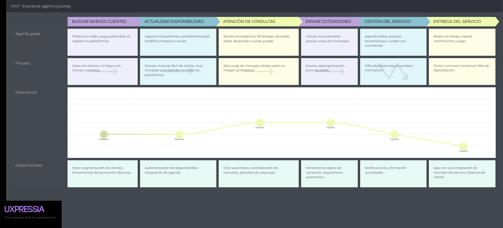
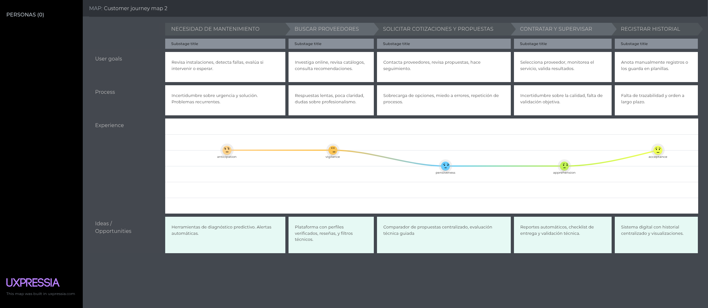
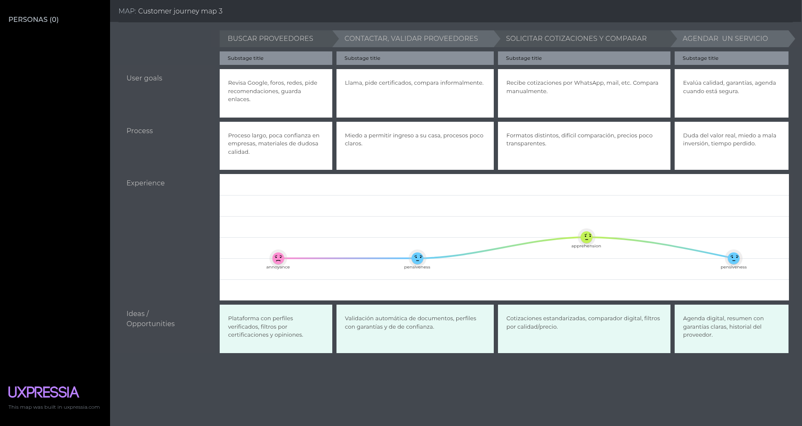

 

    

<h1 align="center">
    Universidad Peruana de Ciencias Aplicadas
</h1>

<h3 align="center">
    Carrera: Ingeniería de Software
       
    Curso: SI730 - Aplicaciones Web
       
    Sección: 4378
       
    Profesor: Angel Augusto Velasquez Nuñez
       
    Ciclo: 2025-01 
       
    Informe de Trabajo Final
       
    Startup: HampCoders
       
    Producto: ElectroLink  
</h3>

| 
Alumno
 | 
Código
 |
|:-------------------------------------------:|:-------------------------------------------:|
|       Italo Ludwing Sanchez Manrique                     |    U202316967
|         Ethan Matias Aliaga Aguirre         |              U202318323                     |
|       Eric Marlon Olivera Barzola           |              U202315032                     |
|       Ivo Marcelo Machado Bracamonte        |              U20231C368       |              U202316967                     |
|       Ricardo Del Aguila Ayala              |              U202318323                     |

 Abril 2025 

## Registro de Versiones del Informe

| Versión | Fecha | Autores | Descripción  |
| :---- | :---- | :---- | :---- |
| TB1 | 22/04/2025 | \-Del Aguila Ayala, Ricardo Alejandro \-Machado Bracamonte Ivo Marcelo \-Sanchez Manrique Italo Ludwing \-Aliaga Aguirre Ethan Matias \-Olivera Barzola Eric Marlon    | Capítulo I: Introducción Capítulo II: Requirements Elicitation & Analysis. Capítulo III: Requirements Specification. Capítulo IV: Product Design.  Capítulo V: Product Implementation, Validation & Deployment. 5.1.	Software Configuration Management. 5.1.1.	Software Development Environment Configuration. 5.1.2.	Source Code Management. 5.1.3.	Source Code Style Guide & Conventions. 5.1.4.	Software Deployment Configuration. 5.2.	Landing Page, Services & Applications Implementation. 5.2.1.	Sprint 1 5.2.1.1.	Sprint Planning 1\. 5.2.1.2.   Aspect Leaders and Collaborators. 5.2.1.3.	Sprint Backlog 1\. 5.2.1.4.	Development Evidence for Sprint Review. 5.2.1.5.	Execution Evidence for Sprint Review. 5.2.1.6.	Services Documentation Evidence for Sprint Review. 5.2.1.7.	Software Deployment Evidence for Sprint Review. 5.2.1.8.	Team Collaboration Insights during Sprint.  |

# 

## Project Report Collaboration Insights  

## Tabla de Contenidos

    
Capítulo I: Introducción 
    
        <ul>
            <li><a href="#11-Startup-Profile">1.1. Startup Profile</a></li>
            <li><a href="#111-Descripción-de-la-Startup">1.1.1. Descripción de la Startup</a></li>
            <li><a href="#112-Perfiles-de-Integrantes-del-Equipo">1.1.2. Perfiles de Integrantes del Equipo</a></li>
            <li><a href="#12-Solution-Profile">1.2. Solution Profile</a></li>
            <li><a href="#121-Antecedentes-y-Problemática">1.2.1. Antecedentes y Problemática</a></li>
            <li><a href="#122-Lean-UX-Process">1.2.2. Lean UX Process</a></li>
            <li><a href="#1221-Lean-UX-Problem-Statements">1.2.2.1. Lean UX Problem Statements</a></li>
            <li><a href="#1222-Lean-UX-Assumptions">1.2.2.2. Lean UX Assumptions</a></li>
            <li><a href="#1223-Lean-UX-Hypothesis-Statements">1.2.2.3. Lean UX Hypothesis Statements</a></li>
            <li><a href="#1224-Lean-UX-Canvas">1.2.2.4. Lean UX Canvas</a></li>
            <li><a href="#13-Segmentos-Objetivos">1.3. Segmentos Objetivos</a></li>
        </ul>    

    
Capítulo II: Requirements Elicitation & Analysis

        <ul>
            <li><a href="#21-competidores">2.1. Competidores</a></li>
            <li><a href="#211-Análisis-competitivo">2.1.1. Análisis competitivo</a></li>
            <li><a href="#212-Estrategias-y-tácticas-frente-a-competidores">2.1.2. Estrategias y tácticas frente a competidores</a></li>
            <li><a href="#22-Entrevistas">2.2. Entrevistas</a></li>
            <li><a href="#221-Diseño-de-entrevistas">2.2.1. Diseño de entrevistas</a></li>
            <li><a href="#222-Registro-de-entrevistas">2.2.2. Registro de entrevistas</a></li>
            <li><a href="#223-Análisis-de-entrevistas">2.2.3. Análisis de entrevistas</a></li>
            <li><a href="#23-Needfinding">2.3. Needfinding</a></li>
            <li><a href="#231-User-Personas">2.3.1. User Personas</a></li>
            <li><a href="#232-User-Task-Matrix">2.3.2. User Task Matrix</a></li>
            <li><a href="#233-User-Journey-Mapping">2.3.3. User Journey Mapping</a></li>
            <li><a href="#234-Empathy-Mapping">2.3.4. Empathy Mapping</a></li>
            <li><a href="#235-As-is-Scenario-Mapping">2.3.5. As-is Scenario Mapping</a></li>
            <li><a href="#24-Ubiquitous-Language">2.4. Ubiquitous Language</a></li>
        </ul>   

    
Capítulo III: Requirements Specification 

        <ul>
            <li><a href="#31-To-Be-Scenario-Mapping">3.1. To-Be Scenario Mapping</a></li>
            <li><a href="#32-User-Stories">3.2. User Stories</a></li>
            <li><a href="#33-Impact-Mapping">3.3. Impact Mapping</a></li>
            <li><a href="#34-Product-Backlog">3.4. Product Backlog</a></li>
        </ul>    

    
Capítulo IV: Product Design 

        <ul>
            <li><a href="#41-Style-Guidelines">4.1. Style Guidelines</a></li>
            <li><a href="#411-General-Style-Guidelines">4.1.1. General Style Guidelines</a></li>
            <li><a href="#412-Web-Style-Guidelines">4.1.2. Web Style Guidelines</a></li>
            <li><a href="#42-Information-Architecture">4.2. Information Architecture</a></li>
            <li><a href="#421-Organization-Systems">4.2.1. Organization Systems</a></li>
            <li><a href="#422-Labeling-Systems">4.2.2. Labeling Systems</a></li>
            <li><a href="#423-SEO-Tags-and-Meta-Tags">4.2.3. SEO Tags and Meta Tags</a></li>
            <li><a href="#424-Searching-Systems">4.2.4. Searching Systems</a></li>
            <li><a href="#425-Navigation-Systems">4.2.5. Navigation Systems</a></li>
            <li><a href="#43-Landing-Page-UI-Design">4.3. Landing Page UI Design</a></li>
            <li><a href="#431-Landing-Page-Wireframe">4.3.1. Landing Page Wireframe</a></li>
            <li><a href="#432-Landing-Page-Mock-up">4.3.2. Landing Page Mock-up</a></li>
            <li><a href="#44-Web-Applications-UXUI-Design">4.4. Web Applications UX/UI Design</a></li>
            <li><a href="#441-Web-Applications-Wireframes">4.4.1. Web Applications Wireframes</a></li>
            <li><a href="#442-Web-Applications-Wireflow-Diagrams">4.4.2. Web Applications Wireflow Diagrams</a></li>
            <li><a href="#443-Web-Applications-Mock-ups">4.4.3. Web Applications Mock-ups</a></li>
            <li><a href="#444-Web-Applications-User-Flow-Diagrams">4.4.4. Web Applications User Flow Diagrams</a></li>
            <li><a href="#45-Web-Applications-Prototyping">4.5. Web Applications Prototyping</a></li>
            <li><a href="#46-Domain-Driven-Software-Architecture">4.6. Domain-Driven Software Architecture</a></li>
            <li><a href="#461-Software-Architecture-Context-Diagrams">4.6.1. Software Architecture Context Diagrams</a></li>
            <li><a href="#462-Software-Architecture-Container-Diagrams">4.6.2. Software Architecture Container Diagrams</a></li>
            <li><a href="#463-Software-Architecture-Components-Diagrams">4.6.3. Software Architecture Components Diagrams</a></li>
            <li><a href="#47-Software-Object-Oriented-Design">4.7. Software Object-Oriented Design</a></li>
            <li><a href="#471-Class-Diagrams">4.7.1. Class Diagrams</a></li>
            <li><a href="#472-Class-Dictionary">4.7.2. Class Dictionary</a></li>
            <li><a href="#48-Database-Design">4.8. Database Design</a></li>
            <li><a href="#481-Database-Diagram">4.8.1. Database Dagram</a></li>
        </ul>    

    
Capítulo V: Product Implementation, Validation & Deployment 

        <ul>
            <li><a href="#51-software-configuration-management">5.1. Software Configuration Management</a></li>
            <li><a href="#511-software-development-environment-configuration">5.1.1. Software Development Environment Configuration</a></li>
            <li><a href="#512-source-code-management">5.1.2. Source Code Management</a></li>
            <li><a href="#513-source-code-style-guide-conventions">5.1.3. Source Code Style Guide & Conventions</a></li>
            <li><a href="#514-software-deployment-configuration">5.1.4. Software Deployment Configuration</a></li>
            <li><a href="#52-landing-page-services-applications-implementation">5.2. Landing Page, Services & Applications Implementation</a></li>
            <li><a href="#521-sprint-1">5.2.1. Sprint 1</a></li>
            <li><a href="#5211-sprint-planning-1">5.2.1.1. Sprint Planning 1</a></li>
            <li><a href="#5212-aspect-leaders-and-collaborators">5.2.1.2. Aspect Leaders and Collaborators</a></li>
            <li><a href="#5213-sprint-backlog-1">5.2.1.3. Sprint Backlog 1</a></li>
            <li><a href="#5214-development-evidence-for-sprint-review">5.2.1.4. Development Evidence for Sprint Review</a></li>
            <li><a href="#5215-execution-evidence-for-sprint-review">5.2.1.5. Execution Evidence for Sprint Review</a></li>
            <li><a href="#5216-services-documentation-evidence-for-sprint-review">5.2.1.6. Services Documentation Evidence for Sprint Review</a></li>
            <li><a href="#5217-software-deployment-evidence-for-sprint-review">5.2.1.7. Software Deployment Evidence for Sprint Review</a></li>
            <li><a href="#5218-team-collaboration-insights-during-sprint">5.2.1.8. Team Collaboration Insights during Sprint</a></li>
        </ul>        

## Student Outcome

| **Criterio específico** | **Acciones realizadas** | **Conclusiones** |
|-------------------------|--------------------------|------------------|
| Comunica oralmente con efectividad a diferentes rangos de audiencia. | **Del Aguila Ayala, Ricardo Alejandro - TB1:** Durante el desarrollo del proyecto, trabajé en la arquitectura del software aplicando el enfoque Domain-Driven Design. Redacté historias de usuario para orientar al equipo hacia los objetivos del producto, y lideré la implementación de la landing page detallada en el Capítulo V. Me aseguré de que cada componente del desarrollo técnico estuviera correctamente documentado y alineado con los requerimientos del proyecto. | **TB1:** Mostró una capacidad sólida para comunicar temas técnicos complejos al equipo y documentar de manera clara los procesos técnicos. Facilitó una mejor integración entre diseño y desarrollo, y su liderazgo técnico fue clave para la entrega efectiva de la landing page. |
| Comunica oralmente con efectividad a diferentes rangos de audiencia. | **Sánchez Manrique, Italo Ludwing - TB1:** Participé en la elaboración de los User Persona y el análisis de entrevistas a los usuarios. Desarrollé diagramas de flujo para las aplicaciones web y colaboré en la elaboración de la guía de estilos. También trabajé en los prototipos web, asegurando consistencia visual y facilidad de uso. Mi enfoque siempre fue traducir las necesidades del usuario en soluciones visuales efectivas. | **TB1:** Destacó por su habilidad para representar la voz del usuario mediante elementos visuales y conceptuales. Su comunicación efectiva fue clave para asegurar que el diseño reflejara correctamente las necesidades reales del público objetivo. |
| Comunica oralmente con efectividad a diferentes rangos de audiencia. | **Machado Bracamonte, Ivo Marcelo - TB1:** Me encargué del sistema de etiquetado y del diseño visual de la landing page. Realicé mock-ups y prototipos de las aplicaciones web, buscando siempre representar una interfaz clara, coherente y funcional. A través de mis entregables visuales, ayudé al equipo a comprender mejor cómo se debía ver e interactuar con el sistema. | **TB1:** Comunicó de forma visual ideas complejas del diseño de interfaz, lo que permitió una mejor comprensión del producto por parte del equipo. Su trabajo fortaleció la presentación del proyecto y el vínculo entre diseño e implementación. |
| Comunica oralmente con efectividad a diferentes rangos de audiencia. | **Aliaga Aguirre, Ethan Matías - TB1:** Contribuí al diseño orientado a objetos del software, asegurando una estructura sólida y reutilizable. También trabajé en la implementación técnica de la landing page descrita en el Capítulo V, coordinándome con los demás para asegurar la calidad del desarrollo. | **TB1:** Mantuvo una comunicación fluida con el equipo durante la implementación técnica, facilitando el desarrollo estructurado del producto. Su aporte fue esencial para llevar la lógica técnica al producto final de forma eficiente. |
| Comunica oralmente con efectividad a diferentes rangos de audiencia. | **Olivera Barzola, Eric Marlon - TB1:** Configuré el entorno de desarrollo, asegurándome de que todo el equipo pudiera trabajar bajo las mismas condiciones técnicas. Elaboré el Product Backlog y gestioné las etiquetas SEO y metaetiquetas para mejorar la visibilidad del producto. Me concentré en establecer una base técnica sólida desde el inicio del proyecto. | **TB1:** Facilitó el trabajo colaborativo al establecer un entorno de desarrollo común y bien documentado. Su comunicación técnica contribuyó a la planificación efectiva y a la implementación de elementos que favorecen la proyección externa del producto. |

## Capítulo I: Introducción 

### 1.1. Startup Profile

#### 1.1.1. Descripción de la Startup
HampCoders es una startup innovadora que se enfoca en el desarrollo de soluciones empleando una arquitectura orientada a servicios, haciendo uso de tecnologías open-source. Mediante esta startup, buscamos lograr conectar a los proveedores de componentes eléctricos con posibles clientes. Es por ello que presentamos el proyecto ElectroLink.

**Misión:**
Nuestra misión es desarrollar una solución tecnológica innovadora que permita a las personas contactar con empresas proveedoras especializadas en electrónica, para prevenir o solucionar problemas en instalaciones eléctricas de manera efectiva, segura y legalmente correctas.

**Visión:**
Nuestra visión es convertirnos en líderes globales en el desarrollo de tecnologías y plataformas eficientes y escalables, proporcionando herramientas que permitan conectar a los usuarios y empresas con proveedores especializados, para prevenir o solucionar instalaciones eléctricas ineficientes, transformando el entorno brindando calidad y seguridad.

#### 1.1.2. Perfiles de Integrantes del Equipo

| Miembros del equipo                             | Codigo Estudiante | Descripcion            |
| ----------------------------------------------- | ----------------- | ---------------------- |
| Italo Ludwing Sanchez Manrique	   | U202316967            | Mi nombre es Italo Ludwing Sanchez Manrique, soy estudiante de Ingeniería de Software en la UPC, tengo 19 años y actualmente curso el tercer ciclo académico. Destaco por mi perseverancia, tolerancia y compromiso con mis metas. En este proyecto, mi objetivo es buscar soluciones que beneficien al grupo, ya que tengo experiencia en trabajar de forma proactiva y colaborativa. Además, poseo sólidos conocimientos en lenguajes de programación como Java y C++. | 
| Ethan Matias Aliaga Aguirre	   | U202318323            | Soy Ethan Matias Aliaga Aguirre, estudiante de 5to ciclo de Ingeniería de Software en la UPC, sede San Miguel. Me caracterizo por mi compromiso, responsabilidad, habilidad para trabajar en equipo y comunicación. Mis conocimientos Incluyen arquitectura de Software , desarrollo de APIs y Experiencias Web Full Stack. Además, tengo experiencia en el uso de herramientas como Photoshop, Filmadora y Vegas Studio, lo que me permite aportar con soluciones creativas y técnicas en mis proyectos. Estoy comprometido con mi crecimiento personal y profesional, siempre buscando aprender y mejorar en cada oportunidad que se presente. | 
| Eric Marlon Olivera Barzola	   | U202315032            | Soy Eric Marlon Olivera Barzola, actualmente estoy cursando el quinto ciclo académico correspondiente. Mi experiencia me ha dotado de la capacidad para abordar tareas relacionadas con el diseño, programación y resolución de problemáticas en el ámbito del lenguaje de programación C++. Asimismo, estoy en proceso de adquirir conocimientos en C# y JavaScript. | 
| Ivo Marcelo Machado Bracamonte	   | U20231C368            | Mi nombre es Ivo Machado, tengo 19 años, soy estudiante y actualmente estudio en el quinto ciclo de ingeniería de software en la UPC. Mis fuertes son la mentalidad, no me rindo con facilidad y no le tengo miedo al error, tengo empatía con los demás, me gusta resolver problemas y siempre intento mejorar en lo que hago y seguir aprendiendo. Tengo conocimientos del lenguaje de programación C++, Java y un poco de Python, HTML, CSS y JavaScript, también domino el Inglés y sé Portugués. | 
| Ricardo Alejandro del Agula Ayala	   | U202318323            | Mi nombre es Ricardo Alejandro Del Aguila Ayala, tengo 19 años y, actualmente, estoy cursando el cuarto ciclo de la carrera de Ingeniería de Software en la UPC. Al culminar, me gustaría especializarme en la ciberseguridad. Me considero una persona proactiva en todos los ámbitos. Asimismo, alguien que siempre está dispuesta a entregar lo mejor de sí para lograr un buen trabajo en equipo. Tengo experiencia en el lenguaje de programación C + +, Python, así como en Excel. Asisto a la iglesia, en donde formó parte de varias comunidades. Por ello, tengo una vasta experiencia en el trabajo en equipo, que puede permitir que asuma el liderazgo de este proyecto. | 

### 1.2. Perfil de la Solución

**ElectroLink** es una solución que busca conectar proveedores de componentes o servicios electrónicos con potenciales clientes que necesiten asesoramiento para realizar mantenimientos preventivos en sus hogares u oficinas.

Nuestra plataforma busca exhibir a los proveedores con el fin de resolver la desconexión entre proveedores de componentes eléctricos y el mercado real, y garantizar servicios seguros y eficientes dentro de los parámetros legales para los clientes dueños de hogares y PYMES.

#### 1.2.1. Antecedentes y Problemática (usando The 5W'S y 2 'H's)
Con el propósito de obtener una comprensión más profunda de las necesidades de nuestros usuarios, hemos investigado sus antecedentes históricos y los desafíos que enfrentan mediante la metodología de las 5W`S y 2H`S. Este enfoque nos asegura que la información recopilada sea pertinente y nos permita desarrollar soluciones precisas y eficaces que satisfagan sus necesidades.

**What (Qué)**
- ¿Cuál es el problema?
  El problema radica en la dificultad que afrontan los usuarios al momento de encontrar proveedores técnicos eléctricos eficientes, seguros y certificados en base a las especificaciones que requieren según su situación. Esta situación puede agravarse por la falta de formación formal y de plataformas que garanticen la calidad del servicio, dentro de los parámetros establecidos por el gobierno.

- ¿Cuál es la relación con la persona en cuestión?
  Este proyecto está directamente relacionado con los usuarios objetivo, puesto que actúa como intermediario entre estos y el proveedor del servicio de una manera rápida y efectiva. De la misma manera, se optimiza el tiempo de respuesta, garantizando que los problemas se resuelvan de forma eficiente, sin comprometer la calidad del servicio.

**When (Cuando)**
- ¿Cuándo sucede el problema?
  Los problemas relacionados con la dificultad de contactar con proveedores de garantía se manifiestan en situaciones como cortes de electricidad, costos de luz, instalaciones defectuosas o fuera de los parámetros legales, problemas con tomacorrientes, o incluso antes de una remodelación donde se necesita prevenir sobrecargas.

- ¿Cuándo utiliza el cliente el producto?
  Lo usa en momentos críticos, cuando el fallo ya ocurrió, o de forma preventiva antes de hacer una instalación eléctrica o compra de componentes, de forma específica según  la situación a la que se enfrentan.

**Where (Dónde)**
- ¿Dónde está el cliente cuando usa el producto?
  La solución puede ser usada por los usuarios en cualquier momento y lugares con alta demanda eléctrica, incluyendo así a usuarios independientes o empresas.

- ¿A dónde se dirige?
  La solución está dirigida a aquellos usuarios que deseen prevenir problemas eléctricos asegurándose de obtener una instalación correcta y dentro de los parámetros permitidos, así como los que buscan solucionar algún problema eléctrico que se presente.

- ¿Dónde surge el problema?
  Este problema ocurre en lugares con alta demanda eléctrica, como por ejemplo: hogares, centros educativos, oficinas, centros comerciales, entre otros, donde la sobrecarga o fallos eléctricos pueden generar inconvenientes significativos.

**Who (Quién)**
- ¿Quiénes están involucrados?
  Equipo: Aquellos encargados del desarrollo y soporte técnico de la solución, responsables de mantener y mejorar el sistema, asegurando un funcionamiento óptimo y la calidad del servicio.
  Usuarios: Aquellos que buscan soluciones ante problemas eléctricos o realizar instalaciones de manera segura.
  Proveedores: Aquellos que ofrecen servicios eléctricos, como componentes y/o instalaciones.

- ¿A quiénes le sucede el problema?
  Propietarios de viviendas: Aquellos que enfrentan fallos inesperados por problemas eléctricos o necesitan instalaciones de forma segura y eficiente en sus hogares.
  Propietarios de negocios y empresas: Los encargados de gestionar y renovar lugares con alta demanda eléctrica, que requieren soluciones fiables para sus instalaciones y/o operaciones diarias.
  Centros educativos: Instituciones que requieren mantener sus instalaciones eléctricas en óptimas condiciones, para garantizar la seguridad del alumnado y personal.

- ¿Quién lo utilizará?
  El producto se dirige a una amplia gama de personas, entre las cuales destacan el cliente final y el proveedor del servicio.El cliente final busca una solución rápida y confiable para sus problemas eléctricos, mientras que el proveedor del servicio se beneficia al obtener nuevos clientes y mejorar su visibilidad.

**Why (Por qué)**
- ¿Cuál es la causa del problema?
  La falta de plataformas que conecten de manera eficiente a proveedores eléctricos con usuarios, sumado a la poca formalización del rubro. Los usuarios a menudo no saben cómo identificar técnicos confiables, lo que incrementa el riesgo de contratar profesionales no calificados. Además, el mal manejo de instalaciones eléctricas es una preocupación constante, generando riesgos frecuentes para la seguridad.

**How (Cómo)**
- ¿En qué condiciones los clientes usan nuestro producto?
  Se usa en situaciones donde requieren una solución eficiente y confiable para problemas eléctricos, ya sea durante una emergencia o de manera preventiva antes de una instalación. La solución se emplea en entornos domésticos o laborales.

- ¿Cómo nos conocieron los compradores?
  Nos conocieron a través de campañas de marketing digital, recomendaciones de amigos, búsquedas en internet sobre soluciones rápidas para problemas eléctricos y publicidad en redes sociales.

- ¿Cómo prefieren los lectores acceder a nuestro contenido?
  Los usuarios prefieren acceder a nuestra solución a través de una plataforma web o aplicación móvil, de fácil navegación y diseño intuitivo, que les permita conectarse con proveedores de servicio eléctrico en cualquier momento y lugar.

- ¿Qué llevó a la persona a llegar a esta situación?
  Cuando enfrenta un problema eléctrico, ya sea por una falla inesperada o por la necesidad de realizar una instalación, se encuentra en la búsqueda de soluciones rápidas, confiables y certificadas para evitar riesgos y asegurar el correcto funcionamiento de las instalaciones eléctricas.

**How much (Cuánto)**
- En 2021, el 45,3% de los hogares con acceso a la red pública de energía eléctrica experimentaron cortes o interrupciones.
- En 2021, el 45,3% de los hogares con acceso a la red pública de energía eléctrica experimentaron cortes o interrupciones.
- Estudios indican que departamentos como Áncash, Arequipa, Cusco, Huánuco, Madre de Dios, Pasco y Puno presentan altos porcentajes de hogares con experiencias negativas en la calidad del servicio eléctrico.
- En 2022, la frecuencia promedio de interrupciones fue de 9,8 veces, con mayor incidencia en el segmento de distribución eléctrica.

#### 1.2.2.4. Lean UX Canvas

### Segmentos Objetivo:
Nuestros usuarios principales son propietarios de hogares urbanos, dueños PYMES u oficinas y proveedores de componentes o servicios eléctricos certificados

**Segmento objetivo #1: Propietarios de hogares urbanos**

Aspectos demográficos:

- Sexo: Masculino y femenino
- Edades: Entre 25 y 60 años
- Nivel socioeconómico: Medio a Medio-alto
  
Aspectos geográficos:

- Zona geográfica en la que viven: Urbana, en ciudades de tamaño medio a grande
- Residen principalmente en: Zonas residenciales o condominios dentro de áreas urbanizadas
  
Aspectos psicográficos:

- Valoran el confort, la eficiencia y la seguridad en el hogar.
- Buscan soluciones tecnológicas que optimicen el uso de recursos eléctricos.
- Tienen interés en el mantenimiento preventivo y la mejora continua de sus viviendas.

**Segmento objetivo #2: Dueños PYMES u oficinas**

Aspectos demográficos:

- Sexo: Masculino y femenino
- Edades: Entre 28 y 55 años
- Nivel socioeconómico: Medio-alto
  
Aspectos geográficos:

- Zona geográfica en la que viven: Urbana
- Residen principalmente en: Zonas residenciales o condominios dentro de áreas urbanizadas
  
Aspectos psicográficos:

- Buscan optimizar los costos operativos y mejorar la eficiencia de sus instalaciones.
- Valoran soluciones tecnológicas que automaticen procesos de búsqueda y compra de componentes eléctricos para reducir y optimizar el consumo de recursos.
- Tienen mentalidad emprendedora y están abiertos a innovaciones que les den ventaja competitiva.

**Segmento objetivo #3: Proveedores de componentes o servicios eléctricos certificados**

Aspectos demográficos:

- Sexo: Masculino y femenino
- Edades: Entre 25 y 55 años
- Nivel socioeconómico: Medio a medio-alto
  
Aspectos geográficos:

- Zona geográfica en la que trabajan: Urbana, semi urbana e industrial
- Residen principalmente en: Regiones con alta demanda de servicios eléctricos (ciudades en expansión, polos industriales, etc.)
  
Aspectos psicográficos:

- Buscan aumentar su visibilidad y captar más clientes de forma digital.
- Están interesados en plataformas que les faciliten la gestión de pedidos o contactos comerciales.
- Valoran pertenecer a una red confiable de profesionales del rubro eléctrico.
- Están enfocados en el crecimiento profesional y la fidelización de clientes.
  
## Capítulo II: Requirements Elicitation & Analysis
### 2.1. Competidores
# Análisis del Mercado Digital de Servicios

Hoy en día, en el competitivo mercado digital para la contratación de servicios, existen diversas empresas importantes que ofrecen soluciones en áreas como reparaciones, mantenimiento y tareas domésticas. Entre los competidores más destacados se encuentran **Thumbtack**, **Handy** y **TaskRabbit**.

---

## Thumbtack

Plataforma en línea que conecta a personas que necesitan servicios locales con profesionales que los ofrecen. Funciona como un **marketplace** donde puedes buscar desde plomeros, electricistas, entre muchos otros.

### ¿Cómo funciona?

1. El cliente publica un proyecto explicando qué necesita.
2. Los profesionales registrados en esa categoría y área geográfica reciben una notificación.
3. Los interesados envían cotizaciones o propuestas al cliente.
4. El cliente elige al profesional que mejor se adapte a su presupuesto y necesidades.

**Popularidad:** Muy usada en Estados Unidos.  
**Usuarios frecuentes:** Freelancers y pequeñas empresas.

---

## Handy

A diferencia de Thumbtack, **Handy no muestra varios profesionales**, sino que asigna uno automáticamente basado en disponibilidad y ubicación.

### Especialidad
Servicios para el hogar:
- Limpieza
- Montaje de muebles
- Plomería
- Electricidad
- Mudanzas, etc.

### ¿Cómo funciona?

1. El cliente reserva directamente desde la app o sitio web.
2. Elige fecha, hora y tipo de servicio.
3. Handy asigna automáticamente a un profesional disponible.
 **Ubicación:** EE. UU., Canadá y Reino Unido.

---

## TaskRabbit

Plataforma donde puedes contratar **taskers** (personas que realizan tareas). Opera como un mercado en línea conectado con la demanda local.

### Servicios populares:
- Montaje de muebles (especialmente de IKEA, gracias a una alianza).
- Mudanzas y cargado de objetos pesados.
- Limpieza.
- Reparaciones menores en el hogar.
- Hacer compras o entregas.
- Colgar cuadros, instalar estanterías, etc.

### ¿Cómo funciona TaskRabbit?

1. Buscas el tipo de tarea que necesitas.
2. Eliges a un tasker según su perfil, tarifas por hora y reseñas.
3. Agendas el servicio directamente con esa persona (fecha y hora).
4. Pagas a través de la plataforma una vez que el trabajo esté completo.

---

#### 2.1.1. Análisis competitivo

# Competitive Analysis Landscape

## ¿Por qué llevar a cabo este análisis?

Porque necesitamos identificar fortalezas, debilidades y diferenciadores clave frente a plataformas similares para definir la estrategia competitiva de **ElectroLink**.

**Necesitamos adaptarnos a las tendencias del mercado**

| Categoría                        | ElectroLink                                                                                                                                     | Thumbtack                                                                                   | Handy                                                                                  | TaskRabbit                                                                                      |
|----------------------------------|-------------------------------------------------------------------------------------------------------------------------------------------------|---------------------------------------------------------------------------------------------|----------------------------------------------------------------------------------------|--------------------------------------------------------------------------------------------------|
| **Perfil**                       |                                                                                                                                                 |                                                                                             |                                                                                        |                                                                                                  |
| Overview                         | Plataforma especializada en instalaciones y mantenimiento eléctrico legal y seguro. Conecta a clientes con proveedores certificados, ofreciendo asesoría técnica, prevención de riesgos y seguimiento en tiempo real. | Marketplace general de servicios donde los usuarios pueden encontrar profesionales para tareas como reparaciones | Plataforma centrada en tareas del hogar como limpieza, montaje de muebles y algunas reparaciones menores | Conecta personas con taskers para tareas del hogar como mudanzas, reparaciones menores, compras y más. |
| Ventaja competitiva ¿Qué valor ofrece a los clientes? | Instalaciones y mantenimiento eléctrico general con proveedores certificados. Servicio legal, seguro y con asesoría técnica. | Ofrece una amplia variedad de servicios, pero sin enfoque especializado.                     | Servicios de hogar bajo demanda. Asignación automática.                              | Contratación rápida para tareas específicas, con perfiles seleccionables.                         |
| **Perfil de Marketing**          |                                                                                                                                                 |                                                                                             |                                                                                        |                                                                                                  |
| Mercado objetivo                 | Hogares, oficinas, escuelas y PYMES urbanas que requieren instalaciones o mantenimiento eléctrico confiable.                                   | Clientes generales que necesitan servicios variados (hogar, eventos, clases, etc.).         | Personas que requieren limpieza, montaje o reparaciones domésticas.                  | Hogares que requieren tareas prácticas como mudanza, limpieza, montaje, etc.                     |
| Estrategias de marketing         | Alianzas con proveedores certificados, educación sobre mantenimiento eléctrico.                                                                 | Publicidad digital, visibilidad en buscadores, reviews de usuarios.                         | Integración con IKEA, marketing por conveniencia y rapidez.                          | Visibilidad en buscadores con una app amigable y con integración con IKEA                        |
| **Perfil de productos**          |                                                                                                                                                 |                                                                                             |                                                                                        |                                                                                                  |
| Productos & Servicios            | Instalación de componentes, mantenimiento general, diagnósticos técnicos y asesoría normativa.                                                  | Servicios generales (fotografía, plomería, eventos, clases, etc.).                          | Limpieza, fontanería, montaje, electricidad básica, mudanza.                        | Montaje de muebles, limpieza, ayuda con tareas, mudanza.                                        |
| Precios y Costos                 | Costos por servicio y suscripción mensual para monitoreo/prevención.                                                                            | Los profesionales establecen precios. Thumbtack cobra parte de la comisión.                | Precio fijo por servicio. Handy toma parte de la comisión.                          | Costo por hora según la tarea deseada. TaskRabbit cobra una comisión al profesional.             |
| Canales de distribución (Web y/o Móvil) | Plataforma web + app móvil (foco en experiencia técnica y educativa)                                                                           | Web + app móvil.                                                                            | Web + app móvil.                                                                     | Web + app móvil.                                                                                 |
| **Análisis SWOT**                |                                                                                                                                                 |                                                                                             |                                                                                        |                                                                                                  |
| Fortalezas                       | Especialización en electricidad, asesoría legal, prevención de riesgos y red de técnicos certificados.                                         | Variedad de servicios, alta visibilidad, gran base de usuarios.                            | Rapidez de reserva por sus procesos automatizados.                                  | Facilidad para elegir trabajadores, buena reputación por las tareas simples.                     |
| Debilidades                      | Somos nuevos en el mercado y tenemos una dependencia de proveedores certificados.                                                              | No tiene enfoque especializado, experiencia muy generalista.                                | Puede ser complicado encontrar personal especializado.                              | Algunos trabajadores no están certificados. Esto puede variar la calidad de los servicios.       |
| Oportunidades                    | Alianzas con aseguradoras, certificaciones oficiales, posible expansión a smart energy, estos servicios están poco atendidos.                  | Ampliar a servicios técnicos más especializados.                                            | Mejorar procesos de selección de profesionales a través de una expansión hacia servicios técnicos especializados. | TaskRabbit podría asociarse con marcas de smart home (como Google Nest, Philips Hue, etc.) para ofrecer instalación y soporte técnico |
| Amenazas                         | Falta de confianza inicial. Si no se mantiene un buen control o evaluación a los proveedores eléctricos puede afectar la experiencia del cliente. | Tiene una gran saturación del mercado y competencia entre profesionales.                    | Problemas con calidad inconsistente del servicio dado que los usuarios no eligen al profesional | Cada vez más personas contratan técnicos y ayudantes directamente por redes como Facebook Marketplace. Lo que hace más difícil estar en el mercado. |

#### 2.1.2. Estrategias y tácticas frente a competidores
Para lograr enfrentar a nuestros competidores como Thumbtack, Handy y TaskRabbit. Nuestro proyecto ElectroLink tendrá una serie de estrategias y tácticas sobre la calidad del servicio, confianza, y especialización en el sector de servicios electrónicos y de mantenimiento.
1. Estrategia de diferenciación especializandonos en sistemas eléctricos
Plataformas como Thumbtack y TaskRabbit, que abarcan una amplia gama de servicios, ElectroLink se enfocará en servicios de mantenimiento preventivo y reparación de sistemas eléctricos para hogares y empresas. Esta especialización nos permitirá destacar como una solución confiable en el mercado..

2. Garantía de seguridad y legalidad en todos los servicios
ElectroLink implementará un sistema de certificación en el cual los proveedores que estén en la plataforma sean realizados por profesionales certificados y con licencias. Además, se garantizará que todos los servicios cumplan con los estándares legales y normativos del sector eléctrico.

3. Precios transparentes y competitivos
A diferencia de Thumbtack, el cual utiliza un modelo de pago basado en leads, ElectroLink ofrecerá un modelo de precios transparente y competitivo donde los usuarios y proveedores tengan conocimiento sobre los costos. También se implementará un sistema de suscripción o tarifas planas para trabajos de mantenimiento preventivo, lo que brinda seguridad a los clientes.

### 2.2. Entrevistas

De acuerdo con Easwaramoorthy y Zarinpoush (2006), las entrevistas son un método de investigación, en el que se lleva a cabo “una conversación para recolectar información”. En esta, se realizan una serie de preguntas sobre el agente que queremos llegar a conocer mejor y profundizar en su sentir y punto de vista. Para HampCoders, la información recogida a través de las entrevistas es esencial para identificar cómo ElectroLink aportaría a solucionar el problema relacionado a la instalación y mantenimiento preventivo sobre el consumo de energía, en qué medida y en qué aspectos específicos. Por ello, realizamos un total de 3 entrevistas por segmento. Todas las entrevistas se realizaron a larga distancia (Google Meet, Zoom y Discord), y de manera presencial, en un espacio cómodo y silencioso y dentro del ámbito informal. 

#### 2.2.1. Diseño de entrevistas

**Segmento #1: Propietarios de hogares urbanos:**

**Preguntas principales:**
-   ¿Cómo te sientes normalmente cuando surge un problema eléctrico en tu casa, como un corte de luz o un tomacorriente que no funciona?
-   ¿Qué haces normalmente cuando necesitas encontrar a alguien que repare o revise una instalación eléctrica en tu hogar?
-   ¿Qué tan fácil o difícil te resulta encontrar técnicos eléctricos en quienes puedas confiar?
-   ¿Cuando has contratado un servicio eléctrico antes, ¿qué fue lo que más te preocupó?
-   ¿Qué cosas valoras más cuando contratas a alguien para que trabaje en tu casa (puntualidad, certificación, costo, rapidez)?
-   ¿Con qué frecuencia tomas medidas preventivas para evitar problemas eléctricos en tu hogar?
-   ¿Te ha pasado que una instalación mal hecha haya causado problemas luego? ¿Cómo lo resolviste?
-   ¿Qué importancia le das a que un servicio eléctrico esté dentro de los parámetros legales o normativos?
-   ¿Te interesaría usar una plataforma que conecte con proveedores verificados para servicios eléctricos en tu zona? ¿Por qué?
-   ¿Qué funcionalidades crees que harían esa plataforma útil para ti en el día a día?

**Preguntas complementarias:**
-   ¿Qué sueles buscar en internet cuando tienes dudas sobre una falla eléctrica?
-   ¿Cuánto confías en las recomendaciones de redes sociales o conocidos para encontrar técnicos?
-   ¿En qué momentos específicos crees que te sería más útil tener acceso rápido a un proveedor certificado?
-   ¿Te sentirías cómodo usando una plataforma para agendar mantenimientos eléctricos preventivos?

**Segmento #2: Dueños de PYMES u oficinas:**

**Preguntas principales:**
-   ¿Qué tipo de instalaciones eléctricas utilizas actualmente en tu negocio u oficina?
-   ¿Qué tan seguido te has enfrentado a fallas eléctricas en tus operaciones diarias?
-   ¿Cómo manejas actualmente el mantenimiento eléctrico de tu empresa? ¿Lo haces tú o lo delegas?
-   ¿Qué impacto tiene una falla eléctrica en tu productividad o en la atención al cliente?
-   ¿Qué criterios tomas en cuenta al contratar a un proveedor eléctrico para tu negocio?
-   ¿Has tenido malas experiencias con servicios técnicos eléctricos? ¿Qué aprendiste de esas situaciones?
-   ¿Qué tan importante es para ti que los proveedores cumplan con normativas legales y ofrezcan garantía?
-   ¿Te sentirías cómodo usando una plataforma que te conecte directamente con proveedores certificados?
-   ¿Qué funcionalidades esperarías de esa plataforma para que realmente te ayude a ahorrar tiempo y dinero?
-   ¿Crees que una herramienta así te daría una ventaja competitiva frente a otros negocios?

**Preguntas complementarias:**
-   ¿Qué sueles hacer cuando necesitas encontrar un componente eléctrico específico para tu empresa?
-   ¿Qué herramientas digitales usas actualmente para gestionar el mantenimiento o las instalaciones eléctricas de tu negocio?
-   ¿Dónde buscarías una solución que reduzca riesgos y mejore la eficiencia energética en tu negocio?
-   ¿Te sentirías más confiado si pudieras ver opiniones, calificaciones y certificaciones de los proveedores antes de contratarlos?

**Segmento #3: Proveedores de componentes o servicios eléctricos certificados:**

**Preguntas principales:**
-   ¿Cómo te sientes actualmente con la forma en que consigues clientes para tus servicios eléctricos?
-   ¿Qué estrategias usas para dar a conocer tu trabajo y atraer nuevos clientes?
-   ¿Qué dificultades enfrentas al competir con proveedores no certificados o informales?
-   ¿Qué tan fácil es para ti comunicar la calidad y legalidad de tu trabajo a los potenciales clientes?
-   ¿Cómo manejas la gestión de pedidos o solicitudes de trabajo actualmente?
-   ¿Qué importancia tiene para ti pertenecer a una red de profesionales avalados o certificados?
-   ¿Qué tanto te ayudaría una plataforma que te permita mostrar tu experiencia, certificaciones y opiniones de clientes?
-   ¿Estarías dispuesto a pagar una suscripción mensual si eso te garantiza mayor visibilidad y más clientes? ¿Por qué?
-   ¿Qué funcionalidades crees que te facilitarán la gestión comercial desde una app o plataforma?
-   ¿Cómo crees que cambiaría tu negocio si pudieras digitalizar la forma en que conectas con clientes?

**Preguntas complementarias:**
-   ¿Dónde públicas actualmente tus servicios (Facebook, grupos, WhatsApp, boca a boca)?
-   ¿Has probado plataformas para ofrecer tus servicios? ¿Cómo fue la experiencia?
-   ¿Qué herramientas digitales usas (si usas alguna) para organizar tus trabajos y pedidos?
-   ¿Qué tan dispuesto estarías a formar parte de una comunidad de proveedores certificados con estándares comunes?

#### 2.2.2. Registro de entrevistas
### Segmento #1: Propietarios de hogares urbanos

**Entrevista: Mari Vallejos**  
- **Sexo:** Femenino  
- **Edad:** 30  
- **Link:** [Ver entrevista](https://www.youtube.com/watch?v=nTeFYzyawYk)  
- **Inicia en:** 0:06  
- **Duración:** 6:35
  

**Resumen:**  
Mari es ama de casa y pasa la mayor parte del tiempo en su hogar, lo que la hace responsable de todos los asuntos domésticos. Cuando surge un problema eléctrico, como un corte de luz o un enchufe dañado, experimenta ansiedad por no saber cómo resolverlo. Su reacción suele ser buscar ayuda en redes sociales, especialmente en Instagram o grupos vecinales, basándose en recomendaciones y comentarios.

Le preocupa que el servicio sea de calidad, que el proveedor sea puntual, rápido y comprometido, ya que valora que el problema se resuelva de manera eficaz. Sin embargo, no realiza mantenimientos preventivos por falta de conocimiento. Aunque sabe que las normativas legales son importantes, su prioridad es que el trabajo funcione bien.

Mari muestra interés en una plataforma como **ElectroLink**, siempre que incluya proveedores verificados y reseñas reales. Sugiere que la plataforma tenga filtros por experiencia, horario, costo y calificaciones para facilitar su uso.

---

**Entrevista Nª2: Eric Jusfral**
- **Sexo:** Másculino
- **Edad:** 21
- **Link:** [Ver entrevista](https://youtu.be/d6RtwsTqsgQ)
- **Inicia en:** 0:02
- **Duración:** 6:43

**Resumen:**
Eric Jusfral es un propietario de hogar urbano que experimenta frustración y preocupación cuando surge un problema eléctrico en casa, especialmente por no tener a quién acudir de forma segura y rápida. Suele buscar soluciones en internet o pedir recomendaciones, aunque desconfía de técnicos sin certificación. Ha tenido malas experiencias con instalaciones mal hechas, lo que lo hace más cuidadoso y exigente. No realiza mantenimientos preventivos con frecuencia, pero reconoce que debería hacerlo para evitar fallos futuros.
Está interesado en usar una plataforma como ElectroLink, siempre que garantice técnicos certificados, calificaciones visibles y procesos transparentes. Le gustaría acceder fácilmente a soporte, comparar proveedores y registrar su consumo mensual para detectar excesos o posibles fallos. Para él, la seguridad, legalidad y facilidad de uso son claves al momento de contratar servicios eléctricos.

### Segmento #2: Dueños de PYMES u oficinas

**Entrevista : Piero Tenorio**  
- **Sexo:** Masculino  
- **Edad:** 26  
- **Link:** [Ver entrevista](https://www.youtube.com/watch?v=_z8UNTi_cmA)  
- **Inicia en:** 0:01  
- **Duración:** 9:54

**Resumen:**  
Piero es dueño de una pequeña empresa de autopartes con varias sucursales. Su negocio depende de equipos eléctricos como computadoras, escáneres, cámaras de seguridad y luces. Las fallas eléctricas, aunque poco frecuentes, afectan la productividad al interrumpir los sistemas de inventario, lo cual puede hacer que los clientes se vayan.

Aunque intentó manejar el mantenimiento por sí mismo, ahora lo delega pero sin un plan definido. No realiza mantenimiento preventivo y reconoce que esto es un riesgo. También conoce casos de técnicos no confiables, por lo que valora servicios con garantía y cumplimiento normativo.

Está dispuesto a usar **ElectroLink** si ofrece proveedores certificados, reseñas, calificaciones y funcionalidades como el registro de consumo eléctrico, alertas de fallas y recomendaciones de mejora.

**Entrevista : Brian Cerna**  
- **Sexo:** Masculino  
- **Edad:** 25  
- **Link:** [Ver entrevista](https://www.youtube.com/watch?v=m8Q_n7i_xEk)  
- **Inicia en:** 0:01  
- **Duración:** 6:16

En esta entrevista se conversó con Brian Cerna, representante del sector de dueños de pymes u oficinas, con el objetivo de conocer su experiencia y necesidades respecto a las instalaciones eléctricas en su negocio. Brian indicó que en su oficina utilizan instalaciones eléctricas trifásicas, ya que requieren soportar la carga de equipos industriales como calderas, aire acondicionado, un sistema de lavandería, además del sistema de iluminación, el cual funciona con luces LED. También cuentan con un grupo electrógeno como respaldo para asegurar el funcionamiento continuo.

Respecto a las fallas eléctricas, señaló que no son frecuentes, pero sí preocupantes, ya que pueden afectar gravemente la operación diaria. Las más comunes incluyen cortes imprevistos, fallos en el tablero de distribución y problemas con los sistemas de climatización. En cuanto al mantenimiento eléctrico, comentó que suelen delegarlo a técnicos externos de confianza. Sin embargo, a veces enfrentan demoras o falta de disponibilidad inmediata, lo que genera complicaciones operativas.

Sobre el impacto de estas fallas en la productividad, Brian fue claro al decir que puede ser muy alto, ya que una interrupción puede dejar habitaciones sin energía y afectar la atención al cliente. A la hora de contratar un proveedor eléctrico, considera esencial revisar la experiencia comprobada, las certificaciones, la capacidad de respuesta las 24 horas, el cumplimiento de normas y un historial confiable con otros clientes. Aunque también buscan precios competitivos, nunca sacrifican la calidad del servicio.

Relató una mala experiencia pasada con un técnico no certificado que ofrecía rapidez, pero cuyo trabajo resultó poco duradero. Esta situación le enseñó que es mejor invertir en profesionales calificados, incluso si son más costosos, para evitar riesgos innecesarios. También destacó que para él es fundamental que los proveedores cumplan con normativas legales y ofrezcan garantía, ya que esto no solo asegura un trabajo bien hecho, sino que también protege legalmente al negocio y cumple con estándares de seguridad ante el público.

Brian expresó su interés en una plataforma que conecte directamente con proveedores certificados, ya que esto le ahorraría tiempo y facilitaría encontrar opciones confiables sin recurrir a métodos tradicionales. En cuanto a las funcionalidades deseadas en dicha plataforma, mencionó la posibilidad de filtrar por tipo de servicio, nivel de urgencia y ubicación del negocio.

Considera que una herramienta de este tipo podría ofrecerle una ventaja competitiva, ya que permitiría resolver problemas eléctricos con rapidez, mejorar la experiencia del cliente y reducir costos operativos. Cuando necesita encontrar componentes eléctricos específicos, suele comunicarse con proveedores conocidos, buscar en Google o WhatsApp, e incluso acudir a ferreterías especializadas, aunque este proceso suele tomar mucho tiempo.

---

### Segmento #3: Proveedores de componentes o servicios eléctricos certificados

**Entrevista: Jorge Espinoza**  
- **Sexo:** Masculino  
- **Edad:** 24  
- **Link:** [Ver entrevista](https://www.youtube.com/watch?v=I_ISRdC6mHI&t=3s)  
- **Inicia en:** 0:01  
- **Duración:** 4:51  

**Resumen:**  
El entrevistado expresó que actualmente se siente frustrado con la forma en que consigue clientes para sus servicios eléctricos, ya que muchas personas no valoran su certificación y prefieren proveedores informales más económicos, lo que le quita oportunidades. Aunque algunos clientes lo contactan por recomendación, considera que atraer nuevos clientes sigue siendo un reto constante.

Para promocionar su trabajo, utiliza principalmente Facebook, WhatsApp y el boca a boca. Comparte fotos de sus trabajos y pide a sus clientes que lo recomienden, aunque reconoce que no cuenta con una estrategia profesional establecida. Una de las principales dificultades que enfrenta es competir con proveedores no certificados que ofrecen precios más bajos, lo que resulta atractivo para muchos clientes, a pesar de los riesgos y posibles fallas que eso implica. También enfrenta el problema de que los clientes, en general, no distinguen entre un profesional calificado y uno improvisado.

Le resulta complicado comunicar la calidad y legalidad de su trabajo, ya que muchos clientes no solicitan ver certificados. En cuanto a la gestión de pedidos, todo lo realiza de forma manual, anotando solicitudes en una libreta o en su celular, y coordinando todo vía llamadas o WhatsApp, sin utilizar herramientas especializadas o automatizadas.

Considera muy importante pertenecer a una red de profesionales certificados, ya que eso le da respaldo y lo diferencia de los informales. Estaría dispuesto a pagar una suscripción mensual si eso le garantiza mayor visibilidad y más clientes, siempre que el costo sea razonable y los resultados se vean reflejados en más trabajo.

Respecto a una posible plataforma digital, considera útil que incluya un perfil profesional con portafolio de trabajos, agendamiento de citas, gestión de pedidos, opiniones de clientes, posibilidad de cobrar por la misma app, notificaciones y búsqueda de servicios por zona. Cree que digitalizar su forma de conectar con clientes cambiaría totalmente su negocio, dándole más visibilidad, alcance y una imagen profesional.

**Entrevista : Marcos Contreras**  
- **Sexo:** Masculino  
- **Edad:** 24 
- **Link:** [Ver entrevista](https://www.youtube.com/watch?v=K8hkUh16Gew)  
- **Inicia en:** 0:02  
- **Duración:** 7:59

**Resumen:**  
Marco Contreras es un ingeniero eléctrico egresado que se dedica a proveer componentes y servicios eléctricos para casas y oficinas. En la entrevista, Marco comenta que su actividad actual depende en gran parte del "boca a boca" y publicaciones en redes sociales como Facebook y grupos de WhatsApp, lo cual hace que la captación de clientes sea inestable. Además, enfrenta dificultades para competir contra proveedores informales que ofrecen precios más bajos sin cumplir con normas ni certificaciones.

Marco utiliza tarjetas personales, un pequeño portafolio de fotos, y ocasionalmente herramientas digitales como el calendario del celular y Google Keep para organizarse. Sin embargo, reconoce la necesidad de un respaldo más formal que certifique su trabajo ante los clientes.

Ve con buenos ojos la idea de una plataforma que permita mostrar su experiencia, certificaciones y opiniones de clientes, y considera que le ayudaría a diferenciarse de los informales y a acceder a trabajos más grandes. Estaría dispuesto a pagar una suscripción mensual si esta le garantizara mayor visibilidad y generación de clientes, siempre que el costo fuera razonable.

Entre las funcionalidades que le interesarían en una plataforma, menciona: agendas de trabajo, cotizaciones automáticas, sistema de calificaciones, espacio para fotos de trabajos, validación de certificados, botón de contacto directo y recordatorios. Finalmente, se muestra muy dispuesto a formar parte de una comunidad de proveedores certificados para elevar los estándares del sector.

#### 2.2.3. Análisis de entrevistas
## 2.2.3. Análisis de entrevistas

### Mari Vallejos  
**Resumen:**  
Mari es ama de casa y pasa la mayor parte del tiempo en el hogar, por lo que le afecta directamente cualquier problema eléctrico. Siente ansiedad ante fallas eléctricas porque no tiene conocimientos técnicos y depende de redes sociales o conocidos para encontrar ayuda. No toma medidas preventivas y prioriza la rapidez, puntualidad y compromiso. Le interesa una plataforma como **ElectroLink** con filtros por experiencia, costos y disponibilidad, y valora la posibilidad de programar mantenimientos.

**Insight clave:**  
Existe una necesidad clara de confianza, rapidez y facilidad en el acceso a servicios eléctricos confiables y certificados.

---

### Piero Tenorio  
**Resumen:**  
Piero dirige una empresa con varias sucursales que dependen de sistemas eléctricos para su funcionamiento diario (computadoras, escáneres, cámaras). Aunque no enfrenta fallas frecuentes, reconoce que cuando suceden afectan directamente las ventas y la productividad. Actualmente no tiene un plan de mantenimiento preventivo estructurado. Ha tenido referencias negativas de técnicos informales y valora mucho que los servicios sean confiables, con respaldo legal y buenas calificaciones. Le interesa usar una plataforma como **ElectroLink** para encontrar proveedores certificados, gestionar consumos por sucursal y prevenir interrupciones.

**Insight clave:**  
En el entorno empresarial, la continuidad operativa depende de la estabilidad eléctrica. Existe una fuerte necesidad de monitoreo, prevención y proveedores confiables, lo que hace que una solución digital como ElectroLink sea muy atractiva.

---
### Brian Cerna 
**Resumen:**  
Brian es dueño de una oficina que opera con instalaciones eléctricas trifásicas debido a la alta demanda energética de sus equipos. Si bien las fallas eléctricas no son frecuentes, reconoce que tienen un gran impacto en la productividad y atención al cliente. Contrata técnicos externos, pero enfrenta demoras en la disponibilidad. Valora profundamente la certificación, el cumplimiento normativo y la capacidad de respuesta rápida de los proveedores. Ha tenido malas experiencias con técnicos informales, lo que reforzó su preferencia por profesionales calificados. Ve con buenos ojos una plataforma que permita encontrar proveedores certificados de forma rápida y filtrada, lo cual le ayudaría a reducir tiempos, mejorar el servicio y operar con mayor seguridad.

**Insight clave:**  
Los propietarios de negocios con alta demanda energética priorizan la confiabilidad y profesionalismo de los servicios eléctricos. Existe una clara necesidad de soluciones digitales que les permitan acceder ágilmente a técnicos certificados, con filtros de disponibilidad y ubicación, lo que representa una oportunidad para mejorar la continuidad operativa y la experiencia del cliente.

---

### Jorge Espinoza  
**Resumen:**  
El entrevistado es un técnico certificado que enfrenta dificultades para atraer clientes debido a la competencia informal y la poca valorización de la certificación por parte del público. Utiliza principalmente redes sociales y el boca a boca como estrategias de promoción, aunque reconoce la falta de una estrategia profesional. Gestiona sus pedidos de forma manual y considera importante pertenecer a una red de profesionales certificados. Está abierto a pagar una suscripción si esta le garantiza mayor visibilidad y clientes, y valora positivamente una plataforma que le permita digitalizar y profesionalizar su negocio.

**Insight clave:**  
Los técnicos certificados buscan respaldo, visibilidad y herramientas para competir en un mercado dominado por la informalidad. Valoran la pertenencia a una red profesional que destaque su legalidad y capacitación, y muestran disposición a adoptar soluciones digitales que les permitan mejorar su gestión comercial y alcanzar más clientes confiables.

---

### Marco Contreras  
**Resumen:**  
El entrevistado es un ingeniero eléctrico certificado que combina la venta de componentes con servicios eléctricos en casas y oficinas. Enfrenta dificultades para captar clientes debido a la alta competencia informal y la falta de valoración de las certificaciones por parte del público. Su captación de clientes se basa principalmente en redes sociales (Facebook y WhatsApp) y el boca a boca, sin una estrategia digital estructurada. Gestiona pedidos de forma manual usando herramientas básicas como el calendario del celular. Está interesado en formar parte de una red de profesionales certificados y en una plataforma que le permita mostrar su experiencia, certificaciones y gestionar su trabajo de manera más profesional. Está dispuesto a pagar una suscripción si ofrece resultados claros en visibilidad y generación de clientes.

**Insight clave:**  
Profesionales certificados como Marco buscan plataformas que les otorguen respaldo formal, visibilidad y herramientas de gestión eficientes para diferenciarse en un mercado saturado por la informalidad. Valoran soluciones digitales que fortalezcan su imagen profesional, mejoren su organización y les permitan crecer de manera sostenible.

---

## Análisis de Hallazgos

Los entrevistados resaltan como uno de los principales puntos de fricción la dificultad para identificar proveedores eléctricos realmente confiables. La presencia de técnicos informales sin certificaciones claras genera desconfianza. Este hallazgo valida la necesidad de que ElectroLink destaque las certificaciones legales de los proveedores como un diferenciador clave dentro de la plataforma.

La posibilidad de llevar un registro digital de los servicios eléctricos realizados (por ejemplo, mantenimientos o reparaciones) es vista como una funcionalidad útil, especialmente para usuarios que hoy lo hacen de forma manual. Esto refuerza la importancia de integrar funciones de gestión documental dentro de ElectroLink, facilitando el seguimiento y la trazabilidad de los trabajos realizados.

 
Consultas relacionadas con la recepción de recordatorios permiten identificar una oportunidad para fomentar el mantenimiento eléctrico preventivo. La mayoría de los usuarios no tiene hábitos estructurados en este aspecto. Una funcionalidad de alertas o notificaciones podría ser clave para ayudar a prevenir fallas eléctricas y extender la vida útil de las instalaciones.

Tanto en el entorno doméstico como empresarial, los entrevistados valoran la transparencia. Acceder a opiniones reales de otros usuarios es considerado un elemento crucial para decidir a qué proveedor contratar. Por ello, se valida la necesidad de incluir una sección de **comentarios y calificaciones** dentro de la app para fomentar la confianza y facilitar la toma de decisiones.

Explorar si los usuarios estarían dispuestos a pagar por servicios premium (como soporte prioritario o asesoría técnica especializada) permite analizar la viabilidad de modelos de negocio basados en **suscripciones** o **comisiones por servicio**. Algunos entrevistados afirmaron estar dispuestos a pagar si los beneficios ofrecidos son claros y valiosos, lo cual abre la puerta a monetización sostenible para ElectroLink.

### 2.3. Needfinding
#### 2.3.1. User Personas

**Alejandro Lopez**

**Eduardo Gonzales**

**Olivia Pérez**

#### 2.3.2. User Task Matrix

En esta sección vamos a detallar las tareas que realizan los diferentes segmentos de usuarios representados por los **User Personas** de **ElectroLink**, con el objetivo de cumplir sus metas relacionadas con el mantenimiento preventivo de sistemas eléctricos en hogares, oficinas o como parte de su actividad profesional. 

---

### Olivia Pérez - Propietaria de hogar

| Actividad                                      | Frecuencia     | Importancia |
|-----------------------------------------------|----------------|-------------|
| Buscar electricistas certificados             | Frecuentemente | Alta        |
| Agendar mantenimientos preventivos para el hogar | Ocasionalmente | Alta     |
| Comparar calificaciones de proveedores        | Frecuentemente | Media       |
| Buscar soluciones que ahorren energía en el hogar | Ocasionalmente | Media    |
| Pedir recomendaciones a vecinos o conocidos   | Rara vez       | Media       |

---

### Eduardo Gonzales - Dueño de oficina/PYME

| Actividad                                       | Frecuencia     | Importancia |
|------------------------------------------------|----------------|-------------|
| Buscar formas de reducir costos energéticos    | Frecuentemente | Alta        |
| Contratar servicios de mantenimiento eléctrico | Ocasionalmente | Alta        |
| Llevar registro del historial de mantenimiento | Ocasionalmente | Media       |
| Buscar proveedores o técnicos de confianza     | Ocasionalmente | Alta        |
| Usar herramientas digitales para gestionar instalaciones | A veces  | Media |

---

### Alejandro López - Proveedor de servicios eléctricos

| Actividad                                             | Frecuencia     | Importancia |
|------------------------------------------------------|----------------|-------------|
| Buscar nuevos clientes o trabajos                    | Frecuentemente | Alta        |
| Actualizar su disponibilidad de servicios en plataformas | Ocasionalmente | Media    |
| Gestionar pedidos y comunicación con clientes        | Frecuentemente | Alta        |
| Pedir reseñas o testimonios a sus clientes           | Rara vez       | Media       |
| Mantenerse al día con normativas eléctricas          | Ocasionalmente | Alta        |

#### 2.3.3. User Journey Mapping

**User Persona: Alejandro Lopez**

Alejandro vive un recorrido con muchos puntos de fricción, sobre todo relacionados con:

- Promoción ineficiente.
- Carga operativa excesiva (consultas, cotizaciones).
- Falta de herramientas digitales.
- Inseguridad en cumplimiento normativo.

**User Persona: Eduardo Gonzales**

Eduardo sigue un recorrido rigurosamente técnico pero emocionalmente cargado, especialmente en momentos donde la decisión impacta la operación de su empresa. Sus mayores frustraciones están en:
- Falta de claridad y confianza en los proveedores.
- Procesos manuales y repetitivos que consumen tiempo.
- Desconfianza e incertidumbre en cada paso previo a la contratación.
A pesar de eso, su perfil proactivo y analítico lo convierte en un usuario ideal para una solución como ElectroLink, siempre que ésta le ofrezca:

**User Persona: Olivia Perez**

Olivia tiene una mentalidad muy preventiva, estructurada y enfocada en la calidad. Sin embargo, la informalidad del mercado eléctrico y la falta de herramientas digitales la hacen vivir una experiencia:
- Lenta y sobrecargada
- Emocionalmente estresante
- Con baja confianza en cada etapa
A pesar de eso, está muy abierta a soluciones digitales si estas le ofrecen:
- Proveedores verificados
- Validaciones técnicas y de seguridad claras

#### 2.3.4. Empathy Mapping

**Olivia Rodriguez**

**Eduardo Gonzales**

**Alejandro Lopez**

## 2.3.5. As-is Scenario Mapping

**Alejandro Lopez**

**Áreas Negativas** 

Promoción de productos:
- Frustración por la baja efectividad de la publicidad.
- Sentimiento de que no alcanza a los clientes correctos.
- Alto gasto en publicidad sin retorno claro.
  
Atención de consultas:
- Agobio y ansiedad por la sobrecarga.
- Dudas sobre su profesionalismo.
- Falta de tiempo para responder con calidad.
  
Cotizaciones:
- Estrés por cálculos manuales.
- Ineficiencia y desorganización.
- Percepción de poca escalabilidad y falta de optimización.
  
Entrega de productos:
- Preocupación por los errores.
- Falta de digitalización.
- Sensación de sistema poco confiable y propenso a reclamos.

**Áreas Positivas**

Promoción de productos:
- Esperanza cuando recibe contacto de un nuevo cliente.
  
Atención de consultas:
- No se identifican ups, lo que revela una necesidad urgente de mejora.

Cotizaciones:
- Alivio al concretar una venta sin errores, aunque depende de factores externos.
  
Entrega de productos:
- Satisfacción al cerrar una venta sin errores.
- Tranquilidad una vez que el cliente confirma.
  
**Conclusión**

Alejandro enfrenta varios puntos críticos en su proceso: publicidad poco efectiva, consultas y cotizaciones manuales que lo agobian, y entregas propensas a errores. Aunque hay momentos de esperanza, su experiencia general es frustrante. Esto evidencia la necesidad urgente de herramientas digitales que lo ayuden a automatizar, organizar y profesionalizar su servicio.

**Eduardo Gonzales**

**Áreas negativas**

Identificar una necesidad operativa o de mantenimiento:
- Eduardo parte con incertidumbre al preguntarse si debe resolver el problema de inmediato o si puede esperar, lo que genera estrés.
- Se siente preocupado y frustrado porque los problemas son frecuentes y no siempre encuentra soluciones rápidas, lo que podría acarrear riesgos operativos o pérdidas importantes para la empresa.

Buscar proveedores adecuados:
- Esta etapa está llena de desconfianza. Eduardo duda si los proveedores entienden realmente lo que necesita o si solo quieren cerrar una venta rápida.
- Se siente inseguro e impaciente ante las respuestas lentas y poco claras, lo que afecta su percepción de profesionalismo y genera tensión en un momento clave para la toma de decisiones.
  
Solicitar cotización y evaluar propuestas:
- Eduardo se enfrenta a la ansiedad de cometer errores al seleccionar proveedores, y sufre por tener que repetir procesos que no mejoran con el tiempo.
- La sobrecarga de evaluar múltiples propuestas, sin estar seguro de si le responderán bien tras la compra, lo hace sentirse cansado, inseguro y con miedo a consecuencias graves.
  
Supervisar ejecución y validar resultados:
- Aunque ya en una etapa avanzada, Eduardo aún siente incertidumbre y dudas sobre si tomó la mejor decisión o si dejó pasar una opción superior.
- Esto lo hace sentirse dudoso, y aunque confía en algunos proveedores, no siempre puede validar si son la mejor opción a largo plazo.

**Áreas positivas**

Identificar una necesidad operativa o de mantenimiento:

- Eduardo demuestra proactividad al realizar inspecciones periódicas y tomar nota del estado de los equipos, lo que le da visibilidad y control sobre su entorno operativo.
- Se siente comprometido con su equipo y con la empresa, lo que impulsa su deseo de mejorar continuamente.
  
Buscar proveedores adecuados:
- Aunque tiene dudas, Eduardo explora múltiples canales (web, catálogos, redes, recomendaciones) para encontrar proveedores, lo que muestra una búsqueda activa y estratégica.
- Tiene un enfoque exigente y selectivo, no se conforma con la primera opción, lo que garantiza estándares de calidad más altos.

Solicitar cotización y evaluar propuestas:
- Filtra activamente a proveedores que no cumplen con aspectos técnicos o de confianza, lo que indica una evaluación rigurosa.
- Esta etapa, aunque estresante, muestra que Eduardo sabe qué quiere y no acepta cualquier solución, buscando equilibrio entre precio, calidad y conocimiento técnico.

Supervisar ejecución y validar resultados:
- Finalmente, cuando logra decidir con seguridad, se siente aliviado por haber elegido correctamente pensando en el largo plazo.
- Esta satisfacción final indica que, a pesar del proceso complejo, Eduardo valora las decisiones bien fundamentadas y aspira a establecer relaciones sostenibles con los proveedores.

**Conclusión**

Eduardo es un perfil técnico y exigente, que valora la calidad, la previsión y la confiabilidad en todo el proceso de adquisición y mantenimiento. Aunque su recorrido está lleno de tensiones y dudas, especialmente en la interacción con proveedores, también muestra una actitud proactiva y profesional. Una plataforma que le brinde confianza, claridad, rapidez en respuestas y herramientas para comparar y validar proveedores fácilmente puede ayudarlo a reducir su ansiedad, optimizar decisiones y reforzar la seguridad en sus elecciones.

**Olivia Rodriguez**

**Áreas negativas**

Buscar proveedores confiables:
- Olivia se enfrenta a una búsqueda larga, tediosa y desconfiada, lo que le genera cansancio y frustración.
- No puede confiar en cualquier empresa, y siente que el proceso es muy desgastante, además de que nada le garantiza la calidad de los materiales.
  
Contactar y validar a los proveedores:
- Se siente insegura sobre permitir el ingreso a su casa y teme contactar a proveedores sin garantías, lo que le genera nerviosismo y desconfianza.
- Olivia percibe que hacer un proceso de descarte por su cuenta es ineficiente, lo que la hace sentir molesta cuando los proveedores son informales o poco claros.

Solicitar cotizaciones y comparar:
- Se ve obligada a comparar manualmente propuestas en hojas de cálculo, recibiendo cotizaciones en formatos poco intuitivos, lo que la abruma.
- Siente que los precios no siempre son justos y se cansa de descartar opciones sin apoyo externo.

Tomar la decisión y agendar el servicio:
- Aun en la fase final, Olivia no siempre confía en la calidad de lo que va a recibir, ni en la relación entre el costo y el producto final.
- Se siente inquieta, nerviosa y exhausta, especialmente si no tiene claridad sobre las garantías o si invirtió mucho tiempo en el proceso sin estar completamente segura.

**Áreas positivas**

Buscar proveedores confiables:
- Olivia es proactiva, utiliza Google, páginas web y preguntas a familiares o amigos de confianza.
- Guarda enlaces y captura información útil, y valora la idea de una plataforma donde todo ya esté validado, lo que indica apertura a soluciones digitales confiables.

Contactar y validar a los proveedores:
- Pide certificados, RUC o documentos de formalidad, mostrando una actitud responsable y detallista en su proceso de selección.
- Aunque frustrada, busca garantías y seguridad, lo que refuerza su interés por soluciones formales y transparentes.

Solicitar cotizaciones y comparar:
- A pesar del cansancio, Olivia desea prevenir problemas a futuro, lo que muestra un enfoque de largo plazo.
- Expresa que le gustaría tener una plataforma que la ayude a comparar todo más fácilmente, lo que es una oportunidad clara para digitalizar y simplificar su experiencia.

Tomar la decisión y agendar el servicio:
- Olivia valida documentos y garantías antes de cerrar un acuerdo, lo que muestra que se preocupa por protegerse.
- Quiere asegurarse de que su elección evite problemas futuros, lo que revela una clara orientación hacia la prevención.

**Conclusión**

Olivia es una usuaria cautelosa, exigente y preocupada por la seguridad y la calidad, pero actualmente enfrenta un proceso cargado de incertidumbre, informalidad y desorganización. Su experiencia se ve afectada por la falta de herramientas que la acompañen en todo el recorrido. Una plataforma que le brinde proveedores verificados, cotizaciones estandarizadas, comparaciones automáticas y validaciones de calidad y seguridad tendría un impacto muy positivo, reduciendo su ansiedad, optimizando su tiempo y fortaleciendo su confianza al momento de tomar decisiones.

## 2.4. Ubiquitous Language

 Glosario del Dominio del Negocio - ElectroLink
Este glosario contiene términos clave relacionados al dominio del proyecto ElectroLink. Cada término está en inglés, seguido de su equivalente en español entre paréntesis. Las definiciones están redactadas en español de forma clara y sin ambigüedades, para facilitar la comunicación entre todos los miembros del equipo y stakeholders.

1.  Stakeholders & Roles
- Homeowner (Propietario de vivienda)
   Persona que reside en un hogar y busca soluciones eléctricas confiables y certificadas para prevenir o resolver fallos.

- Business Owner (Dueño de empresa)
   Responsable de una oficina o PYME que necesita mantener el sistema eléctrico eficiente, operativo y dentro del marco legal.

- Service Provider (Proveedor de servicios)
   Técnico profesional con certificación que ofrece servicios de instalación, reparación o mantenimiento eléctrico.

- Component Supplier (Proveedor de componentes)
   Empresa o persona encargada de la venta de dispositivos, piezas o insumos eléctricos certificados.

- Platform Administrator (Administrador de plataforma)
   Miembro del equipo responsable de validar, gestionar y supervisar las actividades y registros dentro de ElectroLink.

2. Servicios y Mantenimiento
- Preventive Maintenance (Mantenimiento preventivo)
  Servicio programado que permite identificar y corregir posibles fallas eléctricas antes de que ocurran.

- Emergency Service (Servicio de emergencia)
   Atención inmediata para resolver fallos eléctricos inesperados que comprometen la seguridad o funcionalidad.

- Electric Assessment (Evaluación eléctrica)
   Diagnóstico que realiza un proveedor para determinar el estado de una instalación eléctrica.

- Installation Service (Servicio de instalación)
   Proceso de conexión o implementación de componentes eléctricos en viviendas o negocios, cumpliendo estándares técnicos.

- Electrical Upgrade (Actualización eléctrica)
   Mejora o sustitución de partes de una instalación para adaptarla a nuevas necesidades o normas de seguridad.

3. Funcionalidades de la Plataforma
- Service Request (Solicitud de servicio)
   Acción del usuario para iniciar una contratación de servicios desde la plataforma.

- Matchmaking (Emparejamiento)
   Proceso automatizado para conectar a un usuario con el proveedor más adecuado según filtros como ubicación, calificación y disponibilidad.

- Real-Time Tracking (Seguimiento en tiempo real)
   Visualización del estado y avance de un servicio solicitado a través de la plataforma.

- Verified Profile (Perfil verificado)
   Estado de un proveedor que ha sido validado por la plataforma mediante documentación y procesos de control.

- Rating and Review (Calificación y reseña)
   Sistema de puntuación y comentarios que permite evaluar la experiencia del usuario con un proveedor.

- Subscription Plan (Plan de suscripción)
   Modalidad de pago por parte del proveedor para acceder a beneficios dentro de la plataforma (visibilidad, herramientas, clientes).

- Booking History (Historial de contrataciones)
   Registro de todos los servicios contratados, realizados y evaluados por un usuario o proveedor.

4. Seguridad y Cumplimiento
- Certified Technician (Técnico certificado)
   Profesional acreditado por una entidad oficial para realizar trabajos eléctricos conforme a la ley.

- Legal Compliance (Cumplimiento legal)
   Condición de operar dentro de los estándares establecidos por entidades regulatorias del sector eléctrico.

- Risk Prevention (Prevención de riesgos)
   Estrategia para evitar accidentes, daños o fallos eléctricos mediante prácticas seguras y mantenimiento adecuado.

- Safety Assurance (Garantía de seguridad)
   Compromiso de que los servicios ofrecidos cumplen con medidas de protección para personas, instalaciones y equipos.

5. Otros conceptos del dominio
- Electric Incident (Incidente eléctrico)
   Evento disruptivo como sobrecarga, cortocircuito o fallo en la instalación que requiere intervención técnica.

- Energy Optimization (Optimización energética)
   Prácticas que buscan mejorar el uso de energía eléctrica, reduciendo costos y desperdicios.

- Informal Market (Mercado informal)
   Entorno de prestación de servicios sin regulación, licencias ni garantías de seguridad.

- Digital Presence (Presencia digital)
   Visibilidad que tiene un proveedor dentro de la plataforma, influyendo en su reputación y oportunidades de negocio.

## Capítulo III: Requirements Specification
### 3.1. To-Be Scenario Mapping
Olivia Perez | To-Be Scenario Mapping

Alejandro Lopez | To-Be Scenario Mapping

Eduardo Gonzales | To-Be Scenario Mapping

### 3.2. User Stories
### 3.3. Impact Mapping

Este impact mapping refleja a un profesional independiente (freelancer) que enfrenta un reto muy típico en servicios profesionales:
necesita construir una reputación sólida para atraer más clientes.

**Situación profesional:**
Alejandro probablemente está en una etapa donde ya tiene cierta experiencia o trabajos previos (porque habla de “recopilar testimonios” y “crear un portafolio”), pero aún no tiene suficiente presencia o reputación consolidada como para que los clientes lleguen solos. Está en la transición de "hacer trabajos" a "convertirse en una marca confiable".

**Estrategia de crecimiento:**
No está apostando a un solo camino, sino a dos estrategias complementarias:

- Validación social: Usar testimonios, portafolios y reseñas para que los nuevos clientes confíen en él rápidamente.

- Búsqueda activa: No esperar a que lleguen los clientes, sino salir a foros y plataformas donde se buscan proveedores.

Este mapa de impacto refleja un escenario empresarial donde las fallas eléctricas afectan operaciones críticas.
Se percibe un entorno donde el tiempo es dinero:

Cada minuto de inactividad impacta en productividad o ventas.

Eduardo (el actor) tiene responsabilidad operativa, por lo que necesita soluciones rápidas, confiables y eficientes.

No están simplemente contratando cualquier servicio eléctrico, sino profesionalizando el proceso:

Buscan automatizar, agilizar y minimizar riesgos.

Quieren sistemas que ahorren tiempo en cotizaciones y selección de proveedores (ej: wizard, recomendaciones, filtros).

Hay un énfasis en confianza y calidad del servicio, no solo en precio.

Este nuevo diagrama es otro Impact Mapping, pero ahora enfocado en hogares o usuarios residenciales, no empresas.
La preocupación aquí no es el tiempo de inactividad, sino el gasto energético y económico.

Problema planteado:

- "Reducir el consumo energético mensual."

Actor involucrado:

- "Olivia Perez", probablemente una usuaria doméstica preocupada por su gasto de luz.

### 3.4. Product Backlog

# 

| Epic/StoryID | Título | Descripción | Story Points (1 /3 /5 /8) |
| :---- | :---- | :---- | ----- |
| US-01 | Registro de cuentas como Dueño de Hogar | Como dueño de hogar, quiero poder registrarme para tener una cuenta en la aplicación, para gestionar los componentes eléctricos de mi vivienda | **5** |
| US-02 | Registro de cuentas como Dueño de Empresa | Como dueño o representante de empresa, quiero poder registrarme para tener una cuenta en la aplicación, para gestionar los componentes eléctricos de mis instalaciones comerciales | **5** |
| US-03 | Registro de cuentas para Proveedores | Como proveedor de componentes eléctricos y/o servicios, quiero poder registrarme para tener una cuenta en la aplicación, para ofrecer mis productos y servicios a los usuarios  | **5** |
| US-04 | Validación de datos de registro | **Como** usuario, **quiero** recibir retroalimentación inmediata sobre la validez de los datos que ingresó durante el registro **para** corregir errores rápidamente. | **3** |
| US-05 | Verificación de cuenta por correo electrónico | **Como** usuario, **quiero** verificar mi cuenta a través de un enlace enviado por correo electrónico **para** confirmar mi identidad. | **3** |
| US-06 | Mensajes de éxito retroalimentación de registro | **Como** usuario, **quiero** recibir mensajes claros y accesibles al completar el registro sobre éxito **para** entender fácilmente el resultado de mis acciones. | **5** |
| US-07 | Mensajes de error retroalimentación de registro | **Como** usuario, **quiero** recibir mensajes claros y accesibles al completar el registro sobre cualquier error a la hora de completar el formulario, **para** entender fácilmente el resultado de mis acciones y saber cómo proceder. | **5** |
| US-08 | Inicio de sesión de usuarios | Como usuario registrado, quiero poder iniciar sesión en la aplicación con mis credenciales para acceder a mi cuenta y utilizar las funcionalidades de la plataforma. | **8** |
| US-09 | Recuperación de Contraseña | Como usuario registrado, quiero poder recuperar mi contraseña en caso de olvidarla, para poder volver a acceder a mi cuenta de manera segura. | **5** |
| US | Cierre de Sesión | **Como** usuario autenticado, **quiero** cerrar mi sesión de forma segura **para** proteger mi cuenta cuando termine de usar la aplicación.  | **5** |
| US-11 | Visualización de Perfil de Propietario | Como propietario registrado , quiero poder visualizar mi perfil , para revisar mi información personal y preferencias almacenadas en el sistema | **8** |
| US-12 | Edición de Perfil de Propietario | Como propietario registrado ,quiero poder editar mi información personal y preferencias , para mantener mi perfil actualizado y tener más control sobre este. | **8** |
| US-13 | Visualización de Perfil de Proveedor | **Como proveedor registrado Quiero poder visualizar mi perfil profesional Para revisar cómo se presenta mi información y servicios a los clientes potenciales** | **8** |
| US-14 | Edición de Perfil de Proveedor | **Como proveedor registrado, quiero poder editar mi información profesional, certificaciones y servicios ofrecidos para mantener mi perfil actualizado y atractivo para los clientes.** | **8** |
| Us-15 | Gestión de Disponibilidad de Proveedor | **Como proveedor Quiero poder gestionar mi disponibilidad horaria y calendario Para que los clientes puedan solicitar mis servicios en horarios en que estoy disponible** | **8** |
| US-16 | Mensajes de éxito de actualización de perfil | **Como usuario, quiero recibir mensajes claros y accesibles al completar la actualización de perfil sobre éxito para entender fácilmente el resultado de mis acciones.** | **1** |
| US-17 | Mensajes de error de actualización de perfil | **Como usuario, quiero recibir mensajes claros y accesibles al completar el registro sobre cualquier error a la hora de completar el formulario, para entender fácilmente el resultado de mis acciones y saber cómo proceder.** | **3** |
| US-18 | Búsqueda por Ubicación y Tipo de Servicio | **Como usuario, quiero poder buscar servicios filtrando por ubicación y tipo de servicio, para encontrar rápidamente los que se ajustan a mis necesidades específicas.** | **5** |
| US-19 | Búsqueda Geolocalizada | **Como usuario, quiero buscar servicios cerca de mi ubicación actual, para encontrar opciones convenientes sin necesidad de introducir manualmente mi ubicación.** | **5** |
| US-20 | Filtrado por Disponibilidad y Calificación | **Como usuario, quiero filtrar servicios por su disponibilidad horaria y calificación promedio, para encontrar servicios bien valorados que se ajusten a mi agenda.** | **5** |
| US-21 | Sistema de Calificación Post-Servicio | **Como usuario, quiero poder calificar y dejar reseñas sobre los servicios que he utilizado, para compartir mi experiencia con otros usuarios y proporcionar retroalimentación a los proveedores.** | **5** |
| US-22 | Visualización de Calificaciones y Reseñas | **Como usuario, quiero poder ver las calificaciones y reseñas dejadas por otros usuarios, para tomar decisiones informadas sobre qué servicios utilizar.** | **5** |
| US-23 | Contratación de Servicios Eléctricos mediante Wizard | **Como propietario de PyME, quiero contar con un proceso guiado paso a paso para contratar servicios eléctricos, para poder solucionar mis problemas de forma rápida y sin complicaciones.** | **8** |
| US-24 | Entrar a un dashboard Personalizado | **Como usuario de la plataforma, quiero acceder a un dashboard personalizado al iniciar sesión, para visualizar de forma inmediata la información relevante según mi rol y actividad reciente.** | **8** |
| US-25 | Centro de Notificaciones | **Como usuario de la plataforma, quiero acceder a un centro centralizado de notificaciones, para estar al tanto de actualizaciones importantes y no perder información relevante.** | **3** |
| US-26 | Sistema de Soporte al Usuario | **Como usuario de la plataforma, quiero acceder a un sistema de soporte integrado, para resolver dudas o problemas técnicos que pueda tener durante mi experiencia.** | **5** |
| US-27 | Gestión de Técnicos Favoritos | **Como cliente, quiero poder marcar y gestionar una lista de técnicos favoritos, para contactarlos fácilmente para futuros servicios y dar preferencia a aquellos con los que he tenido buenas experiencias.** | **5** |
| US-28 | Sistema de Recomendaciones Personalizadas | **Como cliente, quiero recibir recomendaciones personalizadas de servicios y productos basados en mi historial y necesidades, para descubrir soluciones relevantes que puedan mejorar mi experiencia.** | **3** |
| US-29 | Gestión de Pagos y Facturación | **Como cliente, quiero gestionar mis pagos y acceder a mi historial de facturación, para mantener control sobre mis gastos y tener la documentación necesaria para fines contables.** | **8** |
| US-30 | Gestión de Agenda y Citas | **Como técnico/proveedor, quiero poder gestionar mi agenda de servicios y citas, para organizar eficientemente mi trabajo y maximizar mi productividad.** | **5** |
| US-31 | Gestión de Planes y Suscripciones | **Como proveedor, quiero poder gestionar mi plan de suscripción en la plataforma, para acceder a beneficios adicionales que me ayuden a crecer mi negocio.** | **8** |
| US-32 | Gestión de Servicios Ofrecidos | **Como proveedor, quiero poder gestionar mi catálogo de servicios ofrecidos, para mantenerlo actualizado y mostrar claramente a los clientes mi oferta y especialidades** | **8** |
| US-33 | Historial de Clientes Atendidos | **Como proveedor, quiero acceder a un historial detallado de los clientes que he atendido, para dar seguimiento a relaciones profesionales y mejorar mi servicio basado en experiencias previas.** | **5** |
| US-34 | Crear Portafolio Digital con Evidencias de Trabajo | **Como proveedor de servicios eléctricos, quiero crear un portafolio digital dentro de mi perfil que incluya fotos, descripciones y referencias de trabajos anteriores, para mostrar mi experiencia y generar mayor confianza en potenciales clientes.** | **5** |
| US-35 | Publicar Servicios en Foros de Contratación Certificada | **Como proveedor certificado, quiero poder publicar mis servicios en espacios o foros donde se busca contratar profesionales verificados, para aumentar mi visibilidad y conseguir nuevas oportunidades laborales.** | **5** |
| US-36 | Solicitar Inspección General Anual | **Como propietario responsable, quiero poder pedir una inspección general de mis instalaciones eléctricas una vez al año, para prevenir riesgos, fallas y garantizar el buen estado de mi sistema eléctrico.** | **3** |
| US-37 | Registrar Consumo Eléctrico Mensual | **Como usuario interesado en el control energético, quiero poder anotar manualmente mi consumo mensual de electricidad, para llevar un seguimiento y detectar posibles aumentos o ahorros en el tiempo.** | **5** |
| US-38 | Visualización de Testimonios | Descripción HU:Como visitante indeciso sobre la plataforma,Quiero ver testimonios de usuarios reales,Para aumentar mi confianza en el servicio antes de registrarse. | **5** |
| US-40 | Adaptabilidad a Diferentes Dispositivos | Como visitante que accede desde diferentes dispositivos,Quiero que la landing page se adapte correctamente a mi pantalla,Para tener una experiencia óptima independientemente del dispositivo que use. | **8** |
| US-41 | Visualización de una Sección Principal | Como visitante de la página, quiero ver una sección principal atractiva que me presente un breve resumen de la idea del producto, para entender rápidamente de qué se trata el servicio | 3 |
| US-42 | Visualización de Características y Beneficios | Como potencial cliente, quiero conocer las características y beneficios del servicio, para evaluar si satisface mis necesidades específicas | 3 |
| US-43 | Navegación sin errores | Como visitante, quiero poder navegar por la página web sin encontrar errores, para tener una experiencia fluida que me anime a registrarme | 3 |
| US-44 | Navegación mediante Encabezado | Como usuario, quiero un menú de navegación claro en el encabezado, para poder acceder fácilmente a las diferentes secciones de la página | 3 |
| US-45 | Visualización del Pie de página | Como visitante, quiero ver un pie de página organizado con accesos directos e información de contacto, para poder encontrar información adicional rápidamente | 3 |
| US-46 | Ver Información del Startup | Como potencial cliente, quiero conocer información sobre la empresa desarrolladora, para evaluar su credibilidad y confiabilidad | 3 |
| US-47 | Conocer la Misión de la Startup | Como visitante interesado, quiero conocer la misión de la empresa, para entender sus valores y propósito | 3 |
| US-48 | Conocer la Visión de la Startup | Como visitante interesado, quiero conocer la visión de la empresa, para entender sus objetivos a largo plazo y su proyección de futuro | 3 |
| US-49 | Formulario de Registro | Como visitante decidido, quiero contar con un formulario de registro claro y accesible, para poder iniciar el proceso de creación de mi cuenta de manera sencilla | 5 |

## Capítulo IV: Product Design
### 4.1. Style Guidelines
#### 4.1.1. General Style Guidelines

**Branding:**

El logo de ElectroLink representa la esencia de la plataforma como un puente moderno y confiable entre soluciones eléctricas y quienes las necesitan. El enchufe central simboliza el rubro eléctrico y la conexión energética, mientras que el contorno en forma de techo alude a hogares y oficinas, principales escenarios donde se brindan los servicios. Las líneas internas sugieren flujo de energía y conectividad digital, reforzando el enfoque tecnológico. La paleta de colores —azul eléctrico, blanco y naranja— transmite confianza, claridad e innovación. Todo esto, junto con una tipografía limpia y moderna, refuerza la identidad de ElectroLink como una herramienta accesible, profesional y orientada a resolver problemas reales.

**Variantes de Logo:**

*Logo Original*

*Logo sin Letras*

*Colores Invertidos*

**Typography:**

La tipografía de nuestra marca tiene un estilo moderno y ordenado, va de la mano con la imagen de nuestra marca y lo que nosotros, como startup, queremos transmitir. Se usará un lenguaje casual y sencillo, con la finalidad de que el público se sienta cómodo usando nuestra plataforma.
La tipografía debe ser clara y legible, utilizando la fuente "Abel", que se mantendrá consistente en toda la plataforma. Los títulos y subtítulos usarán una fuente ligeramente más grande que el cuerpo del texto para mejorar la jerarquía visual. En general, se debe usar un tamaño que garantice que todo el texto sea fácilmente legible tanto en pantallas pequeñas como grandes.

**Colors:**

La paleta de colores elegida para la web de ElectroLink fue diseñada para complementar visualmente el logo sin competir con él, manteniendo una identidad coherente, moderna y profesional. El azul grisáceo suave establece una base limpia y tecnológica, ideal para fondos que no cansan la vista y dan protagonismo al contenido. Este tono, junto al celeste claro para botones o elementos interactivos, mantiene la sensación de confianza y dinamismo que el logo transmite, pero con una suavidad que hace la interfaz más amigable.
Por otro lado, el gris cálido y el grafito profundo aportan equilibrio visual y legibilidad. Son tonos sobrios que ayudan a jerarquizar la información sin recargarla, perfectos para textos y detalles estructurales. El naranja pastel, inspirado en el logo pero más atenuado, actúa como acento para destacar avisos o llamadas a la acción sin ser intrusivo. Finalmente, el verde menta claro introduce un toque de frescura y vitalidad, ideal para confirmar acciones exitosas o transmitir sensación de progreso. En conjunto, esta paleta respalda los valores de la marca: precisión, accesibilidad, tecnología y conexión humana.

## Paleta de Colores - ElectroLink

| Color                | Uso                                              | Código Hex |
|----------------------|---------------------------------------------------|------------|
| Azul grisáceo suave  | Fondo de secciones, tarjetas, menús laterales     | `#E8EEF7`  |
| Gris cálido          | Texto secundario, bordes suaves, fondos suaves    | `#A9B1BA`  |
| Celeste claro        | Hover, botones secundarios, íconos de ayuda       | `#B5D5F5`  |
| Amarillo pastel      | Elementos destacados suaves, fondos de aviso      | `#FFE492`  |
| Grafito profundo     | Texto principal, íconos oscuros                   | `#2E3A59`  |

#### 4.1.2. Web Style Guidelines
## Uso del Patrón F en el Diseño Web

De manera que el contenido de nuestro sitio web se vea organizado y sea mostrado de manera adecuada, implementamos el patrón F.
El objetivo del patrón F en un sitio web es reflejar la forma natural en la que los usuarios escanean el contenido, empezando por la parte superior izquierda y moviéndose en forma de "F" hacia abajo. Este diseño resalta la información clave en las primeras líneas y en el lateral izquierdo, donde la vista se concentra más. 
Mejora la usabilidad al alinear la estructura con el comportamiento visual del usuario, facilitando la lectura rápida y efectiva. Se utiliza para mejorar la experiencia del usuario y destacar contenido relevante.

### 4.2. Information Architecture

La arquitectura de información que se implementará en ElectroLink está diseñada para facilitar una experiencia de navegación clara, eficiente y centrada en conectar usuarios con proveedores de servicios y componentes eléctricos. Desde el menú principal, los visitantes podrán acceder rápidamente a categorías clave como "Proveedores", "Servicios", "Asesoramiento", y "Mantenimientos preventivos", lo que les permitirá encontrar con facilidad las soluciones que se ajusten a sus necesidades técnicas o del hogar.
La plataforma contará con un sistema de filtrado inteligente que permitirá a los usuarios buscar proveedores según ubicación, especialización (instalaciones, mantenimiento, venta de componentes), certificaciones legales y valoraciones de otros clientes. Además, ElectroLink ofrecerá un apartado de asesoría técnica, donde los usuarios podrán consultar artículos, guías rápidas y recomendaciones para la gestión segura de instalaciones eléctricas tanto en hogares como en negocios.
Asimismo, cada proveedor tendrá un perfil verificado con información detallada sobre sus servicios, casos anteriores, contacto directo y una sección de opiniones. También se incluirá un sistema de solicitud rápida de cotización, permitiendo a los clientes establecer una comunicación ágil y efectiva. Con esta arquitectura, ElectroLink busca no solo ordenar y categorizar la información de manera accesible, sino también fomentar la confianza, la transparencia y una red de colaboración técnica eficiente, alineada con estándares de seguridad y legalidad en el rubro eléctrico.

#### 4.2.1. Organization Systems

Para representar la estructura de los usuario se han realizado diagramas para la explicación de la funcionalidades de la aplicación y el recorrido del usuario en la misma.

#### 4.2.2. Labeling Systems

| Sección                                     | Etiqueta                        | Descripción                                                                 |
|--------------------------------------------|----------------------------------|-----------------------------------------------------------------------------|
| **Menú de inicio**                          | Inicio                           | Página principal con visión general de la plataforma y acceso rápido a secciones. |
|                                             | Cómo funciona                    | Explicación clara y visual del funcionamiento del sistema paso a paso.     |
|                                             | Testimonios                      | Opiniones y experiencias reales de usuarios satisfechos.                   |
|                                             | Contacto                         | Formulario y canales disponibles para consultas, soporte o sugerencias.    |
|                                             |                                  |                                                                            |
| **Botones de ingreso y salida               | Iniciar Sesión                   | Botón donde los usuarios podrán iniciar sesión con su cuenta.              |
|   de la plataforma**                        | Iniciar Sesión con Google        | Botón que permite a los usuarios iniciar sesión con su cuenta de Google.   |
|                                             | Iniciar Sesión con Facebook      | Botón que permite a los usuarios iniciar sesión con su cuenta de Facebook. |
|                                             | Registrarse                      | Botón donde los usuarios podrán crearse una cuenta en la plataforma.       |
|                                             | Dashboard                        | Botón que dirige a la interfaz del usuario seleccionado.                   |
|                                             | Cerrar Sesión                    | Botón que permite al usuario empezar una conversación con el asistente virtual. |
|                                             |                                  |                                                                            |
| **Sección menú del propietario**            | Historial de servicios           | Visualiza el registro de mantenimientos y reparaciones realizadas.         |
|                                             | Inventario de electrodomésticos  | Consulta la lista de equipos registrados y su consumo energético.          |
|                                             | Buscar proveedores               | Encuentra técnicos y proveedores certificados.                             |
|                                             | Detectar problema                | Analiza factores para identificar fallas o excesos de consumo.             |
|                                             | Monitorear energía               | Seguimiento del consumo eléctrico mensual y estado de componentes.         |
|                                             | Inventario de electrodomésticos (Subir) | Añade nuevos dispositivos con sus características de consumo.       |
|                                             | Suscripción                      | Gestión del plan actual y beneficios exclusivos.                           |
|                                             | Mi perfil                        | Edición de información personal, preferencias y datos de contacto.         |
|                                             |                                  |                                                                            |
| **Menú de proveedores y técnicos**          | Gestión y Agenda de Citas        | Organiza, programa y visualiza citas con clientes.                         |
|                                             | Gestión de Servicios Ofrecidos   | Administra los servicios disponibles y sus detalles.                       |
|                                             | Historial de Servicios           | Registro completo de todos los servicios realizados.                       |
|                                             | Panel de Métricas y Rendimiento  | Estadísticas clave sobre actividad y eficiencia del proveedor.             |
|                                             | Inventario y Catálogo de Productos (En caso aplique) | Gestiona stock y presenta productos disponibles.       |
|                                             | Subscripción                     | Visualiza y gestiona el plan de suscripción y beneficios.                  |
|                                             | Mi Perfil                        | Edita y actualiza la información personal y profesional.                   |

#### 4.2.3. SEO Tags and Meta Tags

**Landing Page Title:** ElectroLink - Tu conexión segura a la electricidad

**Description:** ElectroLink es una plataforma enfocada en conectar a proveedores de componentes o servicios eléctricos con clientes que necesitan asesoramiento o asistencia para realizar mantenimientos preventivos en sus hogares u oficinas.

**Meta Keywords:** seguridad, ahorro eléctrico, mantenimiento, asesoramiento.

**ElectroLink Meta Author:** ElectroLink

**Meta Description:** facilitar la conexión entre clientes que necesitan servicios eléctricos confiables y proveedores calificados.

**Title:** ElectroLink

**Description:** Buscar conectar a dueños de hogares urbanos con proveedores técnicos eléctricos certificados, garantizando servicios seguros y eficientes dentro de los parámetros legales mediante una plataforma intuitiva y fácil de usar.

**Meta Keywords:** seguridad, ahorro eléctrico, mantenimiento, asesoramiento.

**Meta Author:** ElectroLink

#### 4.2.4. Searching Systems

ElectroLink cuenta con un sistema de búsqueda avanzada que permite a los usuarios encontrar servicios y productos eléctricos de forma eficiente, a través de múltiples filtros:

| **Filtro**                         | **Descripción**                                                                                                                                          |
|-----------------------------------|----------------------------------------------------------------------------------------------------------------------------------------------------------|
| **Tipo de Servicio**              | Permite al usuario buscar proveedores en función del tipo de servicio requerido (instalación, mantenimiento preventivo, reparación, auditoría eléctrica, etc.). |
| **Ubicación / Zona**              | Filtro geográfico que ayuda a encontrar proveedores o técnicos disponibles en una zona específica o cercana al domicilio/oficina del usuario.              |
| **Disponibilidad de Agenda**      | Permite filtrar proveedores según fechas y horarios disponibles para programar una cita.                                                                 |
| **Certificación del Proveedor**   | Muestra solo técnicos o empresas que cuentan con certificaciones válidas y actualizadas en el área eléctrica.                                             |
| **Rango de Precio**               | Filtra servicios o productos según el presupuesto disponible del usuario, desde opciones económicas hasta servicios premium.                             |
| **Proveedores con Mejores Reseñas** | Filtro para mostrar técnicos con mayores calificaciones o comentarios positivos según otros usuarios.                                                   |
| **Categoría de Producto Eléctrico** | Ayuda a encontrar productos específicos en el inventario (bombillas, disyuntores, medidores, enchufes, etc.).                                           |
| **Historial de Consumo Energético** | Permite visualizar patrones de consumo eléctrico mensual o anual filtrando por fecha o dispositivos.                                                   |
| **Planes de Suscripción**         | Filtra y compara distintos planes de suscripción según los beneficios ofrecidos (monitoreo, asesoría, prioridad en atención, etc.).                       |

#### 4.2.5. Navigation Systems

Los sistemas de navegación de ElectroLink han sido diseñados para guiar de forma intuitiva a los usuarios a través del Landing Page y la aplicación, facilitando la exploración del contenido y el acceso a las funcionalidades clave. La estructura sigue una lógica clara que permite a cada tipo de usuario (hogar, oficina, proveedor) encontrar rápidamente lo que necesita mediante menús jerárquicos, enlaces destacados y botones de acción visibles.

### 4.3. Landing Page UI Design

### 4.3.1. Landing Page Wireframe.

#### 4.3.2. Landing Page Mock-up

### 4.4. Web Applications UX/UI Design

#### 4.4.1. Web Applications Wireframes

En esta sección se presentan los **wireframes de la aplicación web de ElectroLink**, los cuales permiten visualizar cómo será la estructura y disposición de los elementos en la interfaz. Estos bocetos funcionales aseguran una experiencia fluida, clara e inclusiva para los diferentes segmentos de usuarios, como propietarios de hogares, pequeños empresarios y proveedores técnicos, incluyendo además personas con ansiedad social, TEA, o discapacidades físicas.

El propósito de los wireframes es establecer la **estructura base de la aplicación**, mostrando la organización de la información, la navegación y la ubicación de los elementos interactivos sin enfocarse aún en los aspectos visuales finales. Esta etapa es crucial para garantizar una **experiencia de usuario intuitiva y accesible desde el inicio del diseño**.

---

### 🔹 Elementos clave del diseño

#### 🧭 Arquitectura de la información

- El contenido y las funciones están organizadas para facilitar el acceso a herramientas como el historial de servicios, monitoreo de consumo energético, o gestión de citas.
- Los wireframes incluyen pantallas clave como:
  - Panel de control del propietario.
  - Dashboard del proveedor técnico.
  - Formulario para solicitar mantenimientos preventivos.
  - Historial de dispositivos y consumo energético.
- Se ha priorizado una **navegación simple y accesible**, permitiendo que usuarios con diversas habilidades puedan moverse con facilidad por la plataforma.

#### 📐 Estructura de la interfaz

- Los elementos interactivos (botones, menús, tarjetas de información) están ubicados estratégicamente para que el usuario pueda realizar tareas con pocos clics.
- Las pantallas permiten acceso directo a secciones importantes como:
  - Subir o editar dispositivos eléctricos.
  - Contactar proveedores certificados.
  - Visualizar métricas de rendimiento o consumo.
- Se incluye también una sección de perfil adaptable y configurable, especialmente útil para personas que requieren adaptaciones visuales, físicas o cognitivas.

---

### 🎨 Principios de diseño aplicados

- **Simplicidad**: Cada interfaz está diseñada para minimizar la carga cognitiva, con estructuras limpias que priorizan las acciones más importantes para el usuario.
- **Consistencia**: Todos los botones, iconos y menús siguen un mismo estilo visual y funcional, lo que reduce el tiempo de aprendizaje para los usuarios.
- **Accesibilidad**: Se aplican principios de diseño inclusivo, incluyendo opciones como:
  - Ajuste del tamaño de texto y botones.
  - Contraste de colores adecuado.
  - Navegación compatible con teclado y lectores de pantalla.
  - Diseño responsive para su uso en laptops, tablets y móviles.

---
Los wireframes son una guía esencial para la implementación efectiva de la plataforma ElectroLink, alineando las necesidades de los usuarios con un diseño funcional, ordenado y accesible para todos.

#### 4.4.2. Web Applications Wireflow Diagrams

[Ver diagrama en Lucidchart](https://lucid.app/lucidchart/9bc93c27-6140-47f1-9cfc-e7c0c5a15134/edit?invitationId=inv_f9a0cb75-977e-4669-a09e-21a42409c64d&page=0_0)

#### 4.4.3. Web Applications Mock-ups

#### 4.4.4. Web Applications User Flow Diagrams

### 4.5. Web Applications Prototyping

Esta sección presenta los prototipos de interfaz de usuario , los cuales incluyen simulaciones de interacción y navegación. Las decisiones de
interacción se fundamentan en criterios clave, como la facilidad de uso, la accesibilidad y la optimización para distintos dispositivos.

[Ver diagrama en Figma](https://www.figma.com/proto/sU4hpNItE2lZ88WrlTUKwy/Untitled?node-id=31-1288&t=i41XCGeFwgsrPY2X-1)

## 4.6. Domain-Driven Software Architecture

### 4.6.1. Software Architecture Context Diagrams

### 4.6.2. Software Architecture Container Diagrams

### 4.6.3. Software Architecture Components Diagrams
Authentication Bounded Context

Profile Management Bounded Context

Invoice Monitoring Bounded Context

Service Management Bounded Context

Notifiaction Management Bounded Context

Service Contracting Bounded Context

Subscription Billing Bounded Context

### 4.7. Software Object-Oriented Design

#### 4.7.1. Class Diagrams

#### 4.7.2. Class Dictionary
| Clase | Atributo | Descripción | Tipo de dato |
| :---- | :---- | :---- | :---- |
| User | \-userID | id del usuario |  int |
| User | \-email | email del usuario | String |
| User | \-password | contraseña del usuario | String |
| User | \-phoneNumber | teléfono del usuario | String |
| User | \-firstName | nombre del usuario | String |
| User | \-lastName | apellido del usuario | String |
| User | \-registrationDate | fecha del registro del usuario | DateTime |
| User | \-isVerified | verificación de registro | Boolean |
| User | \-type | tipo de usuario | UserType |
| Provider | \-companyName | nombre de la compañia del proveedor | String |
| Provider | \-taxID | número de identificación fiscal | String |
| Provider | \-businessLicense | licencia de trabajo del proveedor | String |
| Provider | \-certifications | certificaciones del proveedor | List\<Certification\> |
| Provider | \-servicesOffered | servicios ofrecidos | List\<Service\>  |
| Provider | \-availabilitySchedule | horario de disponibilidad | List\<Availability\>  |
| Provider | \-isVerified | verificación de los datos del proveedor | Boolean |
| Provider | \-averageRating | rating promedio del proveedor | Double |
| HomeOwner | \-address | dirección del dueño de hogar | String |
| HomeOwner | \-properties | propiedades del dueño de hogar | List\<Property\> |
| BusinessOwner | \-companyName | nombre de la compañía del dueño PYME | String |
| BusinessOwner |  \-taxID | número de identificación fiscal | String |
| BusinessOwner | \-companyAddress | dirección de la compañía | String |
| BusinessOwner | \-BusinessProperties | propiedades de la compañía | List\<Property\> |
| Administrator | \-adminLevel | nivel de administrador | String |
| Report | \-reportID | id del reporte | int |
| Report | \-reporterID | id del reportante | int |
| Report | \-reportedID | id del reportado | int |
| Report | \-description | descripción del reporte | String |
| Report | \-reportDate | fecha del reporte | DateTime |
| Report | \-evidenceAttachments | evidencias del reporte | List\<String\> |
| Report | \-status | estado del reporte | ReportStatus |
| Report | \-ReportType | tipo del reporte |  ReportType |
| Property | \-propertyID | id de la propiedad | int |
| Property | \-address | dirección de la propiedad | String |
| Property | \-type | tipo de la propiedad | PropertyType  |
| Property | \-squareFootage | el área de la propiedad | int |
| Property | \-components | componentes electricos de la propiedad | List\<ElectricalComponent\> |
| ServiceRequest | \-requestID | id de la solicitud del servicio | int |
| ServiceRequest | \-userID | id del usuario | int |
| ServiceRequest | \-propertyID | id de la propiedad | int |
| ServiceRequest | \-serviceID | id del servicio | int |
| ServiceRequest | \-description | descripción de la solicitud del servicio | String |
| ServiceRequest | \-requestDate | fecha de la solicitud | DateTime |
| ServiceRequest | \-priority | nivel de prioridad de la solicitud | ServicePriority |
| ServiceRequest |  \-status | estado de la solicitud | ServiceRequestStatus |
| Invoice | \-invoiceID | id de la factura | int |
| Invoice | \-bookingID | id de la reserva | int |
| Invoice | \-invoiceNumber | número de la factura | String |
| Invoice | \-issueDate | fecha de emisión | DateTime |
| Invoice |  \-dueDate | fecha de vencimiento | DateTime |
| Invoice |  \-subtotal | subtotal de la factura | double |
| Invoice | \-tax | impuestos cobrados | double |
| Invoice | \-total | total de la factura | double |
| Invoice | \-status | estado de la factura | InvoiceStatus |
| ElectricalComponent | \-componentID | id del componente | int |
| ElectricalComponent | \-name | nombre del componente | String |
| ElectricalComponent | \-model | model del componente | String |
| ElectricalComponent | \-manufacturer | fabricante del componente | String |
| ElectricalComponent |  \-installationDate | fecha de la instalación del componente | DateTime |
| ElectricalComponent | \-lastMaintenanceDate | ultima fecha de mantenimiento del componente | DateTime |
| ElectricalComponent | \-status | estado del componente | ComponentStatus |
| ServiceBooking | \-bookingID | id de la reserva | int |
| ServiceBooking | \-requestID | id de la solicitud | int |
| ServiceBooking |  \-providerID | id del proveedor | int |
| ServiceBooking | \-scheduledDate | fecha establecida para el servicio | DateTime |
| ServiceBooking | \-startTime | hora de inicio del servicio | Time |
| ServiceBooking | endTime | hora de finalización del servicio | Time |
| ServiceBooking | \-finalPrice | precio final del servicio | double |
| ServiceBooking | \-status | estado del servicio | BookingStatus |
| ServiceRecord | \-recordID | id del registro del servicio | int |
| ServiceRecord |  \-bookingID | id de la reserva | int |
| ServiceRecord | \-workDone | trabajo realizado | String |
| ServiceRecord |  \-partsReplaced | partes reemplazadas durante el servicio | List\<String\> |
| ServiceRecord | \-technicalNotes | notas técnicas del servicio  | String |
| ServiceRecord | \-recommendations | recomendaciones del proveedor | List\<String\> |
| ServiceRecord | \-completionDate | fecha de finalización del servicio | DateTime |
| ServiceRecord | \-finalCost | costo final del servicio | double |
| Review | \-reviewID | id de la reseña | int |
| Review |  \-userID | id del usuario | int |
| Review |  \-providerID | id del proveedor | int |
| Review |  \-bookingID | id de la reserva | int |
| Review | \-rating | calificación del servicio | int |
| Review | \-comment | comentarios realizados post-servicio | String |
| Review |  \-reviewDate | flecha del resumen | DateTime |
| Review |  \-photos | fotos realizadas durante el servicio | List\<String\> |
| Payment | \-paymentID | id del pago | int |
| Payment | \-bookingID | id de la reserva | int |
| Payment |  \-amount | monto del pago | double |
| Payment | \-paymentDate | fecha del pago | DateTime |
| Payment | \-method | método del pago | PaymentMethod |
| Payment | \-status | estado del pago | PaymentStatus |
| Payment | \-transactionReference | referencia de la transacción | String |
| Notification | \-notificationID | id de la notificación | int |
| Notification | \-userID | id del usuario | int |
| Notification | \-title | título de la notificación |  String  |
| Notification | \-message | mensaje de la notificación |  String  |
| Notification |  \-sentDate | fecha de envío de la notificación | DateTime |
| Notification | \-isRead | validación de lectura de la notificación | boolean |
| Notification | \-type | tipo de notificación | NotificationType |
| Certification | \-certificationID | id del certificado | int |
| Certification | \-name | nombre del certificado | String |
| Certification | \-issuingOrganization | organización emitora de la certificación | String |
| Certification | \-issueDate | fecha de emisión de la certificación | DateTime |
| Certification | \-expiryDate | fecha de vencimiento de la certificación | DateTime |
| Certification | \-verificationCode | código de verificación de la certificación | String |
| Availability | \-availabilityID | id de la disponibilidad | int |
| Availability | \-day | fecha de la disponibilidad | DayOfWeek |
| Availability |  \-startTime | hora de inicio | Time |
| Availability | \-endTime | hora de finalización | Time |
| Availability | \-isAvailable | verificación de disponibilidad | Boolean |
| Suscription | \-subscriptionID | id de la suscripción | int |
| Suscription |  \-providerID | id del proveedor | int |
|  Suscription |  \-plan | plan de suscripción | SubscriptionPlan  |
| Suscription | \-startDate | fecha de inicio de la suscripción | DateTime |
| Suscription |  \-endDate | fecha de fin de la suscripción | DateTime |
| Suscription | \-billingCycle | ciclo de facturación de la suscripción | PaymentFrequency |
| Suscription | \-autoRenew | verificación de auto recarga del pago | boolean |
| Service | \-serviceID | id del servicio | int |
| Service | \-name | nombre del servicio |  String |
| Service | \-description | descripción del servicio | String |
| Service |  \-basePrice | precio base del servicio | double |
| Service | \-estimatedDuration | duración estimada del servicio | int |
| Service | \-inclusions | lo que incluye el servicio |  List\<String\>  |
| Service | \-category | categoría del servicio | ServiceCategory |
| Widget | \-widgetID | id del widget | int |
| Widget | \-title | título del widget | String |
| Widget | \-type | tipo del widget | WidgetType |
| Widget | \-positionX | posición en x del widget | int |
| Widget | \-positionY | posición en y del widget | int |
| Widget | \-width | anchura del widget | int |
| Widget | \-height | altura del widget | int |
| Widget | \-configuration | configuración del widget | Map\<String, Object\> |
| Dashboard | \-userID | id del usuario | int |
| Dashboard | \-widgets | widgets del dashboard | List\<Widget\> |
| Dashboard |  \-type | tipo de dashboard | DashboardType |
| Favorite | \-favoriteID | id de favoritos | int |
| Favorite | \-userID | id del usuario | int |
| Favorite | \-providerID | id del proveedor | int |
| Favorite | \-addedDate | fecha de inclusión a favoritos | DateTime |
| SupportTicket | \-ticketID | id del ticket | int |
| SupportTicket | \-userID | id del usuario | int |
| SupportTicket |  \-subject | asunto del ticket | String |
| SupportTicket | \-description | descripción del ticket | String |
| SupportTicket | \-submissionDate | fecha de envío del ticket | DateTime |
| SupportTicket | \-priority | prioridad del ticket | TicketPriority |
| SupportTicket |  \-status | estado del ticket | TicketStatus |
| SupportTicket | \-conversation | conversación del soporte | List\<Message\> |
| Message | \-messageID | id del mensaje | int |
| Message |  \-senderID | id del mensajero | int |
| Message | \-receiverID | id del receptor | int |
| Message | \-content | contenido del mensaje | String |
| Message | \-sentDate | fecha de envío del mensaje | DateTime |
| Message | \-isRead | verificación de que ha sido leído | boolean |
| Message |  \-attachments | adjuntos del mensaje |  List\<String\> |

### 4.8. Database Design

#### 4.8.1. Database Diagram

## 5.1. Software Configuration Management

### 5.1.1. Software Development Environment Configuration

**Project Management**

| Plataforma    | Descripción                                                                                                                                                                                                                                                                                           | Enlace                       |
|---------------|------------------------------------------------------------------------------------------------------------------------------------------------------------------------------------------------------------------------------------------------------------------------------------------------------|------------------------------|
| Trello        | Esta plataforma de gestión de proyectos ofrece funcionalidades para el seguimiento detallado del progreso de cada tarea a lo largo de su ciclo de vida, además de permitir la designación clara de responsables para cada actividad dentro del equipo de trabajo.                                      | https://trello.com           |
| Uxpressia     | Herramienta en línea que ayuda en el proceso de mapeo.                                                                                                                                                                                                                                              | https://uxpressia.com/      |
| Canva         | Es una aplicación web de diseño y comunicación visual donde los usuarios pueden diseñar lo que deseen y publicarlo. Cuenta con diversos formatos y estilos de creación para todo tipo de trabajo.                                                                                                    | https://www.canva.com      |
| Vertabelo     | Fundamental para el diseño, la documentación y la gestión de bases de datos relacionales, ya que simplifica el proceso de modelado, fomenta la colaboración y ayuda a garantizar la calidad y la coherencia de la estructura de los datos.                                                        | https://vertabelo.com   |
| Lucidchart    | Sirve como un lienzo visual versátil para representar cualquier tipo de información estructurada o proceso, facilitando la comprensión, la comunicación y la colaboración entre equipos.                                                                                                                | https://www.lucidchart.com/ |
| C4 Model      | Sistema de notación visual para arquitectos de software y equipos de desarrollo que ayuda a describir la arquitectura de un sistema de software en diferentes niveles de abstracción.                                                                                                                    | https://c4model.com            |

**Product UX/UI Desing**

| Plataforma | Descripción                                                                                                                                                                                                                            | Link                                                    |
|------------|----------------------------------------------------------------------------------------------------------------------------------------------------------------------------------------------------------------------------------------|---------------------------------------------------------|
| Figma      | Herramienta para el diseño de productos digitales que fomenta la colaboración, agiliza el flujo de trabajo y permite crear experiencias de usuario efectivas y visualmente atractivas.                                                 | https://www.figma.com |

**Software Development**

| Plataforma           | Descripción                                                                                                                                                                                                                            | Link                                                |
|---------------------|----------------------------------------------------------------------------------------------------------------------------------------------------------------------------------------------------------------------------------------|-----------------------------------------------------|
| HTML                | Sirve para definir la estructura y el contenido de una página web.                                                                                                                                                                      | https://www.w3schools.com/html/default.asp                                      |
| CSS                 | Se encarga de la presentación visual y el estilo de la página web.                                                                                                                                                                       | https://www.w3schools.com/css/default.asp                                       |
| JS                  | Añade interactividad y dinamismo a la página web.                                                                                                                                                                                        | https://www.w3schools.com/js/default.asp                               |
| Visual Studio Code  | Entorno de desarrollo que facilita la escritura, edición, depuración y gestión de código para una amplia gama de lenguajes y proyectos.                                                                                                    | https://code.visualstudio.com          |

**Software Documentation**

| Plataforma | Descripción                                             | Link                                                              |
|------------|---------------------------------------------------------|-------------------------------------------------------------------|
| GitHub     | Gestión de la documentación en función a repositorios y organizaciones | https://github.com          |
| Markdown   | Formato base para la presentación y documentación del proyecto | https://markdown.es/                     |

### 5.1.2. Source Code Management

GitFlow es un modelo de gestión de ramas en Git que facilita el manejo de proyectos grandes mediante la separación en ramas principales y de características. En nuestro proyecto, utilizamos las siguientes ramas:

* **Rama `main`:** Esta rama contiene el código en producción, incluyendo archivos CSS, imágenes, JavaScript y la página principal en HTML. Aseguramos que todo el contenido aquí esté en un estado estable y listo para ser desplegado.

* **Rama `gh-pages`:** Esta rama se utiliza para desplegar y mostrar una versión visualizable del proyecto en GitHub Pages, permitiendo que cualquier persona acceda a la página `index.html` en tiempo real.

Además, contamos con un repositorio separado que organiza nuestras tareas en epics, utilizando archivos `.feature` que describen los criterios de aceptación para cada funcionalidad. Esto nos ayuda a mantener un seguimiento claro del progreso del desarrollo.

Elegimos GitHub como nuestra plataforma de colaboración para facilitar el seguimiento del progreso, la gestión de cambios y la visualización de actualizaciones. Las actualizaciones al código se reflejan automáticamente en `gh-pages`, permitiendo que los interesados vean los avances en tiempo real.

Repositorio: [Ver Repositorio](https://github.com/HampCoders/ElectroLink)

#### 5.1.3. Source Code Style Guide & Conventions

#### 5.1.4. Software Deployment Configuration

### 5.2. Landing Page, Services & Applications Implementation
### 5.2.1. Sprint 1

### 5.2.1.1. Sprint Planning 1

| Sprint # | Sprint 1 |
|----------|----------|
| Date | 2025-22-04 |
| Time | 3:00 PM |
| Location | Virtual - Meet |
| Prepared By | Matias Aliaga |
| Attendees (to planning meeting) | Matias Aliaga , Ivo Machado , Leandro Conteras, Italo Sanchez, Ricardo del Aguila  |
| Sprint n - 1 Review Summary | Este es el primer Sprint, por lo que el presente campo no aplica. |
| Sprint n - 1 Retrospective Summary | Este es el primer Sprint, por lo que el presente campo no aplica. |
| Sprint 1 Goal | Nuestra prioridad en este spring fue implementar la landing Page.Creemos que este MVP brindara la exposicipon necesaria a nuestra Idea de Negocio. Esto se confirmará cuando las visitas a nuestra landing page superen un cierto índice de visitas. |
| Sprint 1 Velocity | Nuestro equipo puede aceptar hasta 25 story points |
| Sum of Story Points | La suma de Story Points atendidos es de 25 story points |

#### 5.2.1.2. Sprint Backlog 1

| Sprint # | Sprint 1 |  |  |  |  |  |  |
|---------|---------|---------|---------|---------|---------|---------|---------|
| **User Story** | | **Work-Item/task** | | | | | |
| **ID** | **Title** | **Id** | **Title** | **Description** | **Estimation(Hrs)** | **Assigned To** | **Status** |
| US-41 | Visualziación de una Seccion Principal | T01 | Crear una sección Principal o Hero | Crear una sección donde se muestren un breve resumen de nuestra idea. | 0.5 | Matias Aliaga | Done |
| US-38 | Visualización de Testimonios | T01 | Crear una sección de Testimonios | Crear una sección donde se muestren los testimonios de nuestros clientes. | 0.5 | Ricardo Del Aguila | Done |
| US-40 | Adaptabilidad a Diferentes Dispositivos | T01 | Desarrollar una landing page responsiva| Crear una landing page que se adapte a las pantallas de diversos dispositivos. | 0.5 | Ricardo Del Aguila | Done |
| US-42 | Visualización de Características y Beneficios | T01 | Crear una sección de Caracteristicas y Beneficios | Crear una sección donde se muestren las caracterisitcas y beneficios de nuestra plataforma. | 1 | Eric Olivera | Done |
| US-43 | Navegación sin errores | T01 | Desarrollar Pagina web | Crear una pagina web que permita a posibles usuarios navegar sin problemas de manera intuitiva | 0.5 | Matias Aliaga | Done |
| US-44 | Navegación mediante Encabezado | T01 | Agregar Header | Crear un menu encabezado que permita navegar de manera intuitiva | 0.5 | Matias Aliaga | Done | 0.5 | Ivo Machado | Done |
| US-45 | Visualización del Pie de pagina | T01 | Agregar Footer | Crear un pie de pagina footer que contenga acceso directo a las diferentes secciones | 1 | Ivo Machado | Done |
| US-46 | Ver Información del Startup | T01 | Ver Información del Startup | Agregar una sección para ver información del equipo desarollador | 0.5 | Eric Olivera | Done |
| US-47 | Conocer la Misión de la Startup | T01 | Agregar Mision |  Agregar una sección para conocer la mision de la start up | 1 | Italo Sanchez | Done |
| US-48 | Conocer la Vision de la Startup | T01 | Agregar Vision | Agregar una sección para conocer la vision de la start up | 1 | Italo Sanchez | Done |

#### 5.2.1.3. Development Evidence for Sprint Review
En esta sección presentamos el flujo de trabajo para la creación y actuallización de la landing page

| Repository | Branch | Commit ID | Commit Message | Commit Message Body | Commited on (Date) |
| ElectroLink - Open Source - 4341 | main | 01 | Landing Page | | 22/04/2025 |

#### 5.2.1.4. Testing Suite Evidence for Sprint Review
| Epic / Story ID | Título | Criterios de Aceptación |
|----------------|--------|--------------------------|
| US-41 | Visualización de una Sección Principal | **Escenario:** Visualizar sección Hero al cargar la página **Dado que** soy un visitante de la landing page **Cuando** cargo la página por primera vez **Entonces** debo ver una sección principal (Hero) con un título destacado **Y** un subtítulo que explique brevemente el propósito del servicio **Y** al menos una imagen representativa del producto **Y** un botón de llamada a la acción visible  **Escenario:** Interactuar con el botón de llamada a la acción **Dado que** estoy en la sección principal **Cuando** hago clic en el botón de llamada a la acción **Entonces** debo ser dirigido a la sección de registro o contacto |
| US-38 | Visualización de Testimonios | **Escenario:** Visualizar testimonios de clientes **Dado que** soy un visitante de la landing page **Cuando** navego hasta la sección de testimonios **Entonces** debo ver al menos 3 testimonios de clientes diferentes **Y** cada testimonio debe mostrar el nombre del cliente **Y** cada testimonio debe incluir una foto o avatar del cliente **Y** cada testimonio debe incluir un comentario positivo sobre el servicio  **Escenario:** Navegar entre testimonios **Dado que** estoy en la sección de testimonios **Cuando** hay más de 3 testimonios disponibles **Entonces** debo poder navegar entre ellos usando botones o indicadores |
| US-40 | Adaptabilidad a Diferentes Dispositivos | **Escenario:** Visualizar en dispositivo móvil **Dado que** soy un usuario con un smartphone **Cuando** accedo a la landing page **Entonces** todos los elementos deben reorganizarse para ajustarse a mi pantalla **Y** debo poder ver todo el contenido sin desplazamiento horizontal **Y** todos los botones deben ser lo suficientemente grandes para interactuar con ellos  **Escenario:** Visualizar en tablet **Dado que** soy un usuario con una tablet **Cuando** accedo a la landing page **Entonces** el contenido debe adaptarse al tamaño de mi pantalla **Y** la experiencia de navegación debe ser intuitiva  **Escenario:** Visualizar en ordenador de escritorio **Dado que** soy un usuario con un ordenador **Cuando** accedo a la landing page **Entonces** debo ver una versión optimizada para pantallas grandes **Y** el contenido debe estar organizado de manera que aproveche el espacio disponible |
| US-42 | Visualización de Características y Beneficios | **Escenario:** Ver sección de características **Dado que** soy un visitante interesado en el servicio **Cuando** navego hasta la sección de características y beneficios **Entonces** debo ver al menos 3 características principales del producto **Y** cada característica debe tener un título descriptivo **Y** cada característica debe tener una descripción breve **Y** cada característica debe tener un icono o imagen representativa  **Escenario:** Ver sección de beneficios **Dado que** estoy en la sección de características y beneficios **Cuando** observo la información sobre beneficios **Entonces** debo entender claramente el valor que aporta el servicio **Y** los beneficios deben estar diferenciados visualmente de las características |
| US-43 | Navegación sin errores | **Escenario:** Navegar entre secciones **Dado que** soy un visitante de la landing page **Cuando** hago clic en cualquier enlace de navegación **Entonces** debo ser dirigido a la sección correspondiente sin errores **Y** la transición debe ser suave  **Escenario:** Cargar la página completa **Dado que** soy un nuevo visitante **Cuando** accedo a la URL de la landing page **Entonces** la página debe cargarse completamente en menos de 3 segundos **Y** no debe mostrar mensajes de error **Y** todos los elementos visuales deben cargarse correctamente |
| US-44 | Navegación mediante Encabezado | **Escenario:** Visualizar encabezado en todas las secciones **Dado que** soy un visitante navegando por la landing page **Cuando** me desplazo por las diferentes secciones **Entonces** el encabezado debe permanecer visible (fijo o flotante) **Y** debe contener el logo de la empresa  **Escenario:** Usar menú de navegación **Dado que** estoy en cualquier sección de la landing page **Cuando** hago clic en una opción del menú de navegación en el encabezado **Entonces** debo ser dirigido a la sección correspondiente **Y** debe haber alguna indicación visual de la sección activa en el menú |
| US-45 | Visualización del Pie de página | **Escenario:** Ver información de contacto **Dado que** soy un visitante de la landing page **Cuando** navego hasta el pie de página **Entonces** debo ver información de contacto que incluya email y/o teléfono **Y** debe haber enlaces a redes sociales con iconos reconocibles  **Escenario:** Acceder a secciones desde el pie de página **Dado que** estoy en el pie de página **Cuando** hago clic en un enlace a una sección de la página **Entonces** debo ser dirigido a esa sección correctamente  **Escenario:** Ver información legal **Dado que** estoy en el pie de página **Cuando** busco información legal **Entonces** debo ver al menos un aviso de copyright **Y** enlaces a políticas de privacidad y términos de servicio |
| US-46 | Ver Información del Startup | **Escenario:** Acceder a la sección "Sobre nosotros" **Dado que** soy un visitante interesado en conocer más sobre la empresa **Cuando** navego hasta la sección de información del startup **Entonces** debo ver una descripción breve de la historia o propósito de la empresa **Y** debo ver información sobre el equipo fundador o principales miembros  **Escenario:** Ver detalles del equipo **Dado que** estoy en la sección de información del startup **Cuando** reviso la información del equipo **Entonces** debo ver los nombres y roles de los miembros clave **Y** posiblemente fotos o avatares de los miembros |
| US-47 | Conocer la Misión de la Startup | **Escenario:** Visualizar la misión **Dado que** soy un visitante interesado en los valores de la empresa **Cuando** accedo a la sección de misión **Entonces** debo ver una declaración clara y concisa de la misión de la startup **Y** la misión debe comunicar el propósito fundamental de la empresa **Y** debe ser fácilmente identificable visualmente  **Escenario:** Entender el impacto de la misión **Dado que** estoy leyendo la misión de la startup **Cuando** termino de leerla **Entonces** debo comprender claramente qué problema busca resolver la empresa **Y** cómo busca hacerlo |
| US-48 | Conocer la Visión de la Startup | **Escenario:** Visualizar la visión **Dado que** soy un visitante interesado en el futuro de la empresa **Cuando** accedo a la sección de visión **Entonces** debo ver una declaración clara y concisa de la visión a largo plazo **Y** la visión debe comunicar las aspiraciones futuras de la empresa **Y** debe estar cerca o relacionada visualmente con la sección de misión  **Escenario:** Entender los objetivos a largo plazo **Dado que** estoy leyendo la visión de la startup **Cuando** termino de leerla **Entonces** debo comprender hacia dónde se dirige la empresa en el futuro **Y** qué impacto busca tener en su industria o en la sociedad |

#### 5.2.1.5. Execution Evidence for Sprint Review
En esta entrega, nuestro equipo ha desplegado con éxito la landing page.
Enlace de la Landing Page: https://electrolinklp.netlify.app/

#### 5.2.1.6. Services Documentation Evidence for Sprint Review

Para esta entrega no se han empleado APIS, por lo cuál no se he requerido hacer una documentación sobre servicios implementados durante el Sprint.

##### 5.2.1.7. Software Deployment Evidence for Sprint Review

## Design

Para realizar el diseño de los wireframes y mockups de la **Landing Page** para este Sprint, se hizo uso de la plataforma **Figma**.
Para utilizar la plataforma:

1. Se accede a través de la página oficial de Figma: [Figma Login](https://www.figma.com/login)
    
2. Luego, se crea un **Draft** que nos servirá como base para el proyecto colaborativo.
   
---

## Deployment

Para la landing page, se utilizará Netlify para el despliegue de la página.

Para nuestro proyecto se crearon **1 repositorio**, el cuál fue:

- **ElectroLink**: Este repositorio se usa para realizar el informe del proyecto de manera continua y subir la landing page.

#### 5.2.1.8. Team Collaboration Insights during Sprint
A continuación, se muestran las capturas de los insights del repositorio.

En el caso de la landing page y su Sprint, el equipo encargado su diseño y despliegue. Pudiendo evidenciar en estas capturas, su partipación activa durante el desarrollo.

### Conclusiones

- El equipo logró mantener una estructura de trabajo colaborativa, distribuyendo adecuadamente las responsabilidades según las fortalezas de cada integrante.
- Las metodologías aplicadas (Lean UX, entrevistas, Journey Mapping) permitieron una comprensión más profunda de los usuarios, lo que fortaleció la propuesta de valor de Electrolink.
- Se cumplieron los objetivos del primer sprint, consolidando la base técnica del sistema, el diseño de la interfaz y el despliegue de la landing page.
- A pesar de algunas diferencias en la carga de trabajo entre miembros, se logró avanzar en los entregables de manera efectiva y dentro de los plazos establecidos.

### Recomendaciones

- Fomentar una distribución más equitativa de tareas técnicas y documentales para asegurar un esfuerzo balanceado entre todos los miembros.
- Continuar con la validación frecuente de los avances con usuarios reales, especialmente antes de cada iteración, para mantener la alineación entre desarrollo y necesidades reales.
- Aprovechar las fortalezas individuales del equipo para asignar responsabilidades específicas que optimicen los tiempos de desarrollo.
- Documentar de manera más sistemática los aprendizajes y desafíos encontrados en cada sprint, para mejorar continuamente el proceso.

### Bibliografía

### Anexos
